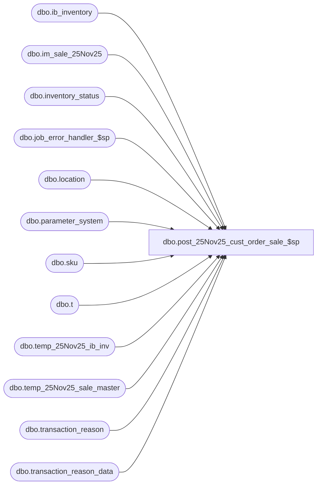

# dbo.post_25Nov25_cust_order_sale_$sp

**Database:** me_01  
**Server:** bedrockdb02  

## Architecture Diagram



## Table Dependencies

| Referenced Table |
|---|
| dbo.ib_inventory |
| dbo.im_sale_25Nov25 |
| dbo.inventory_status |
| dbo.job_error_handler_$sp |
| dbo.location |
| dbo.parameter_system |
| dbo.sku |
| dbo.t |
| dbo.temp_25Nov25_ib_inv |
| dbo.temp_25Nov25_sale_master |
| dbo.transaction_reason |
| dbo.transaction_reason_data |

## Stored Procedure Code

```sql
CREATE PROCEDURE [dbo].[post_25Nov25_cust_order_sale_$sp]

  (
     @job_id INT
    ,@min_im_sale_number DECIMAL (24, 0)
    ,@max_im_sale_number DECIMAL (24, 0)
    ,@min_location_id SMALLINT
    ,@max_location_id SMALLINT
    ,@debug_flag BIT
  )

AS


/*
  Version		: 1.00
  Created		: 2007/04/24
  Created by	: Pierrette Lemay
  Description	: This procedure is part of the Sales Posting process and is called by post_sales_batch.
        It processes Customer Order Sale transactions (605) and the flag im_sale.credit_originating_store determines
        which location will get the sale. This version assumes the two locations involved in a virtual transfer
        belong to the same jurisdiction, so they both have the same currency.
  History	: Version 1.01 Updated January 2010 for Multi-Currency
        Version 1.02 Modified March 2010 because there was a defect related to the calculation of variance and exchange rate difference.
        Version 1.03 Modified July 2010 adding transaction 700, 710 and 710 for back dated customer order transactions.
        Version 1.04 Modified August 2010 Fixed Variance, DiscoVersion 1.05 Add an HAVING clause to transaction 1662.unt and Customer Order Sale transactions to accomodate reversal transactions.
        Version 1.05 Add an HAVING clause to transaction 1662.
        Version 1.06 Fixing Variance calculation when SUM(units) < 0.
        Version 1.07 Defect 120599 (Sept 29,2010)
        Version 2.0  Defect #1-49UYYH Adding POS Customer Order Sale Customer to the existing ES Customer Order Sale, 2 types of 605 transactions
               Also adding support for Markup Discount for these 2 types of Sale transactions:
                transaction 603 is used for markdown discount
                transaction 604 is used for markup discount.
        Version 2.2 Defect #142192 infobase is not updated properly when allow_customer_order flag is set to false for wms location.
        Bug 131080-   when an order is fulfilled on 2 transactions, Infobase is updated with double the sales
        129217 - FT125179 - Allow Sales for Ecom/WMS  location
9/30/2015	Ivan Dimitrov		141970 - Sale-customer order transaction 605 does not pick the cost from the virtual transfer when calculating average cost
11/19.2015	Ivan Dimitrov		148818 - Perfumania: the discrepancy between the virtual transfer and the fixed average cost should be posted to a cost adjustment
11/30/2015	Ivan Dimitrov		148066 - One sided IB transactions with code 710 are being logged for clients web store causing imbalances in cost/retail in IB and OH cost/retail in stock ledger
12/18/2015	Ivan Dimitrov		152315 - Virtual Transfer and ES sale cost calculations when using fixed average cost
11/18/2016  Ivan Dimitrov       DMER-1261 - virtual transfers are getting inserted with transaction_cost<>transaction_cost_local even if they are done within the home jurisdiction
12/6/2016		Ivan Dimitrov		DMER-1840 - Duplicate discounts are posted in Merch upon Return of an ES Order
*/

BEGIN
  DECLARE @c_transfer_discrepancy SMALLINT, @c_transfer_sent_out SMALLINT, @c_transfer_sent_in SMALLINT, @create_virtual_transfer_flag BIT,
      @c_transfer_receive SMALLINT, @c_available TINYINT, @c_in_transit TINYINT, @ent_selling_reason SMALLINT, @c_system_disc_source TINYINT,
      @line_id SMALLINT, @job_type TINYINT, @error_msg NVARCHAR(4000), @c_true BIT, @c_false BIT, @proc_name NVARCHAR(30),
      @sql_err_num DECIMAL(38,0), @table_name NVARCHAR(30), @operation_name NVARCHAR(30), @return_flag BIT, @c_system_disc_receive TINYINT,
      @c_ib_price_disc_pc TINYINT, @c_cust_order_sale_type SMALLINT, @c_cust_order_return_type SMALLINT, @c_cust_order_sale_complete SMALLINT,
      @discrep_inc_location TINYINT, @discrep_decr_location TINYINT, @discrep_inc_pc_type TINYINT, @discrep_decr_pc_type TINYINT,
      @c_unavail_reserved_cust_order TINYINT, @c_cust_order_md_discount SMALLINT, @c_cust_order_mu_discount SMALLINT, @c_cust_order_promo SMALLINT,
      @c_price_status_change SMALLINT, @c_exchange_rate_diff SMALLINT, @multiple_sales_flag BIT, @c_pos_variance TINYINT, @c_eff_price_change SMALLINT,
      @c_price_change_type_MD TINYINT, @c_price_change_type_MDC TINYINT, @c_price_change_type_MU TINYINT, @c_price_change_type_MUC TINYINT,
      @c_cust_order_sale_create SMALLINT;

  IF OBJECT_ID (N'tempdb..#temp_ES_COS', N'U') IS NOT NULL
    DROP TABLE #temp_ES_COS;

  CREATE TABLE #temp_ES_COS

    (
       sku_id DECIMAL (13, 0) NOT NULL
      ,location_id SMALLINT NOT NULL
      ,transaction_date SMALLDATETIME NOT NULL
      ,reference_no NVARCHAR(20) NOT NULL
      ,sale_units INT NOT NULL
      ,cust_order_flag BIT NOT NULL
      ,order_units INT NULL
      ,order_cost DECIMAL (14, 2) NULL
      ,order_cost_local DECIMAL (14, 2) NULL
      ,transaction_no INT NULL
      ,register_no SMALLINT NULL
    );

  IF OBJECT_ID (N'tempdb..#es_im_sale', N'U') IS NOT NULL
    DROP TABLE #es_im_sale;

  CREATE TABLE #es_im_sale

    (
       sku_id DECIMAL (13, 0) NOT NULL
      ,location_id SMALLINT NOT NULL
      ,transaction_date SMALLDATETIME NOT NULL
      ,reference_no NVARCHAR(20) NULL
      ,transaction_no INT NOT NULL
      ,transaction_line SMALLINT NOT NULL
      ,aw_transaction_type SMALLINT NOT NULL
      ,credit_originating_store BIT NOT NULL
      ,originating_location_id SMALLINT NULL
      ,units INT NOT NULL
      ,sold_at_price DECIMAL (16, 4) NOT NULL
      ,pos_discount_type_code SMALLINT NULL
      ,pos_discount_amount DECIMAL (16, 4) NULL
      ,register_no SMALLINT NULL
    )

  IF OBJECT_ID (N'tempdb..#pos_im_sale', N'U') IS NOT NULL
    DROP TABLE #pos_im_sale;

  CREATE TABLE #pos_im_sale

    (
       sku_id DECIMAL(13, 0) NOT NULL
      ,location_id SMALLINT NOT NULL
      ,transaction_date SMALLDATETIME NOT NULL
      ,reference_no NVARCHAR (20) NULL
      ,transaction_no INT NOT NULL
      ,transaction_line SMALLINT NOT NULL
      ,aw_transaction_type SMALLINT NOT NULL
      ,originating_location_id SMALLINT NULL
      ,units INT NOT NULL
      ,sold_at_price DECIMAL(16, 4) NOT NULL
      ,pos_discount_type_code SMALLINT NULL
      ,pos_discount_amount DECIMAL(16, 4) NULL
      ,register_no SMALLINT NULL
    )

  IF OBJECT_ID (N'tempdb..#ib_cos_exchange_rate', N'U') IS NOT NULL
    DROP TABLE #ib_cos_exchange_rate

  -- This temporary table will be used to calculate the exchange rate difference
  -- For return, layaway deposit, layaway_pickup and layaway_cancel
  CREATE TABLE #ib_cos_exchange_rate

    (
       job_id INT NOT NULL
      ,sku_id DECIMAL (13, 0) NOT NULL
      ,location_id SMALLINT NOT NULL
      ,price_status_id SMALLINT NOT NULL
      ,transaction_date SMALLDATETIME NOT NULL
      ,transaction_type_code SMALLINT NOT NULL
      ,inventory_status_id SMALLINT NOT NULL
      ,other_location_id SMALLINT NULL
      ,transaction_reason_id SMALLINT NULL
      ,document_number NVARCHAR (20) NULL
      ,transaction_units INT NOT NULL
      ,transaction_cost DECIMAL (14, 2) NOT NULL
      ,transaction_valuation_retail DECIMAL (14, 2) NOT NULL
      ,transaction_selling_retail DECIMAL (14, 2) NOT NULL
      ,price_change_type SMALLINT NULL
      ,units_affected INT NULL
      ,transaction_no INT NULL
      ,transaction_line SMALLINT NULL
      ,sale_md_audit_flag BIT NOT NULL DEFAULT ((0))
      ,transaction_cost_local DECIMAL (14, 2) NULL
      ,register_no SMALLINT NULL
      ,credit_originating_store BIT NULL DEFAULT(0)
    )

    SELECT @job_type	= 1
      , @proc_name	= N'post_cust_order_sale_$sp'
      , @c_false		= 0
      , @c_true		= 1
      , @line_id = 10
      , @c_transfer_discrepancy = 402
      , @c_transfer_sent_out	= 400
      , @c_transfer_sent_in	= 401
      , @c_transfer_receive = 405
      , @c_cust_order_sale_type = 605
      , @c_exchange_rate_diff = 640
      , @c_cust_order_sale_create = 1660
      , @c_cust_order_sale_complete = 1662
      , @c_cust_order_md_discount = 603
      , @c_cust_order_mu_discount = 604
      , @c_eff_price_change = 700
      , @c_cust_order_promo = 703
      , @c_price_status_change = 710
      , @c_price_change_type_MD	= 0 -- Markdown
      , @c_price_change_type_MDC	= 1 -- Markdown Cancellation
      , @c_price_change_type_MU	= 2 -- Markup
      , @c_price_change_type_MUC	= 3 -- Markup Cancellation
      , @c_available	= 1
      , @c_in_transit	= 2
      , @c_system_disc_source = 1
      , @c_system_disc_receive = 2
      , @discrep_inc_location = s.ib_price_discrep_inc_location
      , @discrep_decr_location = s.ib_price_discrep_decr_location
      , @discrep_inc_pc_type = s.ib_price_discrep_inc_pc_type
      , @discrep_decr_pc_type = s.ib_price_discrep_decr_pc_type
      , @c_unavail_reserved_cust_order = i.inventory_status_id
      , @multiple_sales_flag = multi_sales_jurisdiction_flag
      , @ent_selling_reason = r1.transaction_reason_id
      , @c_pos_variance = r2.transaction_reason_id
  FROM parameter_system s, inventory_status i, transaction_reason_data r1, transaction_reason r2
  WHERE s.parameter_system_id = 1
  AND i.inventory_status_code = N'009'
  AND UPPER(r1.transaction_reason_code) = N'ESTRF'
  AND r2.transaction_reason_id = 1;

  BEGIN TRY

    INSERT INTO #temp_ES_COS

      (
          sku_id
        ,location_id
        ,transaction_date
        ,reference_no
        ,sale_units
        ,cust_order_flag
        ,transaction_no
        ,register_no
      )

      SELECT
          s.sku_id
        ,s.location_id
        ,s.transaction_date
        ,s.reference_no
        ,SUM (s.units)
        ,0 AS cust_order_flag
        ,s.transaction_no
        ,s.register AS register_no
      FROM
          dbo.im_sale_25Nov25 s
          INNER JOIN dbo.location l ON l.location_id = s.originating_location_id
      WHERE
        s.im_sale_number BETWEEN @min_im_sale_number AND @max_im_sale_number
        AND s.location_id BETWEEN @min_location_id AND @max_location_id
        AND s.aw_transaction_type = @c_cust_order_sale_type
        AND s.reference_no IS NOT NULL
      GROUP BY
          s.sku_id
        ,s.location_id
        ,s.transaction_date
        ,s.reference_no
        ,s.transaction_no
        ,s.register
      HAVING
        SUM (s.units) <> 0;

    -- 3 conditions are necessary for a 605 to be considered as Enterprise Selling transactions:
    -- parameter_system.installed_es_flag set to true
    -- location.allow_customer_order_flag set to true
    -- reference_no for Customer Order transaction 1660 already posted to IB
    -- if 1 of these conditions is not met then then the 605 transactions are threated as POS Customer Order Sale transactions.
    UPDATE t
    SET cust_order_flag = 1,
      order_units = i.transaction_units,
      order_cost = sale_units * (i.transaction_cost / i.transaction_units),
      order_cost_local = sale_units * (i.transaction_cost_local / i.transaction_units)
    FROM #temp_ES_COS t
    INNER JOIN parameter_system ps ON ps.installed_es_flag = 1
    INNER JOIN ib_inventory i WITH (NOLOCK)
      ON t.sku_id = i.sku_id
      AND t.location_id = i.location_id
      AND t.reference_no = i.document_number
      AND i.inventory_status_id = @c_unavail_reserved_cust_order
      AND i.transaction_type_code = @c_cust_order_sale_create;

    -- Conditions necessary for a 605 to be considered an EOM transactions:
    -- parameter_system.installed_eom_flag set to true
    -- location.allow_customer_order_flag set to true
    -- Do not update order units, cost and cost local; only update cust_order_flag
    UPDATE t
    SET cust_order_flag = 1
    FROM #temp_ES_COS t
    INNER JOIN parameter_system ps ON ps.installed_eom_flag = 1;

    DELETE #temp_ES_COS WHERE cust_order_flag = 0;

    --Insert the transactions that could be joined to #temp_ES_COS into #es_im_sale, the other will be inserted into #pos_im_sale
    INSERT INTO #es_im_sale
      (sku_id, location_id, transaction_date, reference_no, transaction_no, transaction_line, aw_transaction_type,
      credit_originating_store, originating_location_id, units, sold_at_price, pos_discount_type_code, pos_discount_amount, register_no)
    SELECT s.sku_id, s.location_id, s.transaction_date, s.reference_no, s.transaction_no, s.transaction_line, s.aw_transaction_type,
      s.credit_originating_store, s.originating_location_id, s.units, s.sold_at_price, s.pos_discount_type_code, s.pos_discount_amount, s.register AS register_no
    FROM im_sale_25Nov25 s
    JOIN #temp_ES_COS t ON (s.sku_id = t.sku_id AND s.location_id = t.location_id
                AND s.transaction_date = t.transaction_date AND s.reference_no = t.reference_no
                AND s.transaction_no = t.transaction_no)
    WHERE s.im_sale_number BETWEEN @min_im_sale_number and @max_im_sale_number
    AND s.location_id BETWEEN @min_location_id AND @max_location_id
    AND s.aw_transaction_type IN (@c_cust_order_md_discount, @c_cust_order_mu_discount, @c_cust_order_sale_type);

    SET @line_id = 20

    --Insert the transactions that doesn't joined to #temp_ES_COS into #pos_im_sale
    INSERT INTO #pos_im_sale
      (sku_id, location_id, transaction_date, reference_no, transaction_no, transaction_line,
       aw_transaction_type, originating_location_id, units, sold_at_price, pos_discount_type_code, pos_discount_amount, register_no)
    SELECT s.sku_id, s.location_id, s.transaction_date, s.reference_no, s.transaction_no, s.transaction_line,
         s.aw_transaction_type, s.originating_location_id, s.units, s.sold_at_price, s.pos_discount_type_code, s.pos_discount_amount, s.register AS register_no
    FROM im_sale_25Nov25 s
    LEFT OUTER JOIN #temp_ES_COS t ON (s.sku_id = t.sku_id AND s.location_id = t.location_id
                AND s.transaction_date = t.transaction_date AND s.reference_no = t.reference_no
                AND s.transaction_no = t.transaction_no)
    WHERE s.im_sale_number BETWEEN @min_im_sale_number and @max_im_sale_number
    AND s.location_id BETWEEN @min_location_id AND @max_location_id
    AND s.aw_transaction_type IN (@c_cust_order_md_discount, @c_cust_order_mu_discount, @c_cust_order_sale_type)
    AND t.sku_id IS NULL
    AND EXISTS (SELECT 1 FROM im_sale_25Nov25 s2 WHERE s2.entry_no = s.entry_no
                      AND s2.transaction_no = s.transaction_no
                      AND s2.register = s.register
                      AND s2.transaction_line = s.transaction_line
                      AND s2.sku_id = s.sku_id
                      AND s2.location_id = s.location_id
                      AND s2.transaction_date = s.transaction_date
                      AND s2.aw_transaction_type = @c_cust_order_sale_type);

    SET @line_id = 30;

    -- populate a work table that is keeping track of the virtual transfer we need to create for Cust Order Sale transactions
    SELECT s.transaction_date
           , s.transaction_no
           , s.location_id
           , s.reference_no
           , s.aw_transaction_type
           , s.style_id
           , s.sku_id
           , s.upc_number
           , s.price_override
           , s.aw_reason_code
           , SUM(s.units) units
           , s.sold_at_price
           , s.pos_discount_type_code
           , s.pos_discount_amount
           , s.originating_location_id
    INTO #im_cust_order_sale
    FROM im_sale_25Nov25 s, #temp_ES_COS t, location l
    WHERE s.im_sale_number BETWEEN @min_im_sale_number and @max_im_sale_number
    AND s.location_id BETWEEN @min_location_id AND @max_location_id
    AND s.aw_transaction_type = @c_cust_order_sale_type
    AND s.sku_id = t.sku_id
    AND s.location_id = t.location_id
    AND s.transaction_date = t.transaction_date
    AND s.reference_no = t.reference_no
    AND s.transaction_no = t.transaction_no
    AND s.location_id = l.location_id
    AND (s.credit_originating_store = 1 AND s.location_id <> s.originating_location_id)
    GROUP BY s.transaction_date, s.transaction_no, s.location_id, s.reference_no, s.aw_transaction_type
      , s.style_id, s.sku_id, s.upc_number, s.price_override, s.aw_reason_code, s.sold_at_price, s.pos_discount_type_code
      , s.pos_discount_amount, s.originating_location_id
    HAVING SUM(s.units) <> 0; -- For reversal 605 transactions we have to reverse the transfer that was created initially.

    IF @@ROWCOUNT > 0
      SET @create_virtual_transfer_flag = 1
    ELSE
      SET @create_virtual_transfer_flag = 0


    IF (@create_virtual_transfer_flag = 1)
    BEGIN
      SET @line_id = 40

      -- Create transaction 402 for Cust Order Sale transaction when there is discrepancy between the pernament price of the 2 location involved in the transfer
      -- Sending location is to im_sale.location_id (m1) and Receiving location is im_sale.originating_location_id (m2)
      -- Note that the discrepancy is positive when the retail increases in the receiving location.
      INSERT INTO dbo.temp_25Nov25_ib_inv
        ( job_id
        , sku_id
        , location_id
        , inventory_status_id
        , price_status_id
        , transaction_date
        , transaction_type_code
        , other_location_id
        , transaction_reason_id
        , document_number
        , transaction_units
        , transaction_cost
        , transaction_valuation_retail
        , transaction_selling_retail
        , price_change_type
        , sale_md_audit_flag
        , transaction_cost_local )
      SELECT @job_id,
        m1.sku_id,
        CASE WHEN (@discrep_inc_location = @c_system_disc_source) THEN m1.location_id
           ELSE m2.location_id
        END location_id,
        CASE WHEN (@discrep_inc_location = @c_system_disc_source) THEN @c_available
          ELSE @c_in_transit
        END inventory_status_id,
        CASE WHEN (@discrep_inc_location = @c_system_disc_source) THEN m1.price_status_id
          ELSE m2.price_status_id
        END price_status_id,
        m1.transaction_date,
        @c_transfer_discrepancy,
        CASE WHEN (@discrep_inc_location = @c_system_disc_source) THEN m2.location_id
           ELSE m1.location_id
        END other_location_id,
        @ent_selling_reason,
        s.reference_no,
        0 transaction_units,
        0 transaction_cost,
        (m2.valuation_unit_retail - m1.valuation_unit_retail) * s.units AS transaction_valuation_retail,
        (m2.selling_unit_retail - m1.selling_unit_retail) * s.units AS transaction_selling_retail,
        CASE WHEN (m1.valuation_unit_retail < m2.valuation_unit_retail) THEN @discrep_inc_pc_type
           ELSE @discrep_decr_pc_type
        END price_change_type,
        0 sale_md_audit_flag,
        0 transaction_cost_local
      FROM #im_cust_order_sale s, temp_25Nov25_sale_master m1, temp_25Nov25_sale_master m2
      WHERE m1.job_id = @job_id
      AND s.transaction_date = m1.transaction_date
      AND s.location_id = m1.location_id
      AND s.sku_id = m1.sku_id
      AND s.style_id = m1.style_id
      AND m1.job_id = m2.job_id
      AND s.transaction_date = m2.transaction_date
      AND m1.transaction_date = m2.transaction_date
      AND s.originating_location_id = m2.location_id
      AND s.sku_id = m2.sku_id
      AND m1.sku_id = m2.sku_id
      AND m1.style_id = m2.style_id
      AND m1.valuation_unit_retail <> m2.valuation_unit_retail -- prices are different


      SET @line_id = 50
      -- Create transaction 400 for the Cust Order Sale transaction: out of the available inventory status of the sending location
      -- Sending location is to im_sale.location_id (m1) and Receiving location is im_sale.originating_location_id (m2)
      -- Note that transaction_retail price is moved at the permanent retail of the sending location when parameter_system.ib_price_discrep_decr_location
        -- is set to 1 otherwise it's moved at the permanent retail of the receiving location.
      INSERT INTO dbo.temp_25Nov25_ib_inv
        ( job_id
        , sku_id
        , location_id
        , inventory_status_id
        , price_status_id
        , transaction_date
        , transaction_type_code
        , other_location_id
        , transaction_reason_id
        , document_number
        , transaction_units
        , transaction_cost
        , transaction_valuation_retail
        , transaction_selling_retail
        , price_change_type
        , sale_md_audit_flag
        , transaction_cost_local )
      SELECT @job_id,
        m1.sku_id,
        m1.location_id,
        @c_available,
        m1.price_status_id,
        m1.transaction_date,
        @c_transfer_sent_out,
        m2.location_id other_location_id,
        @ent_selling_reason,
        s.reference_no,
        - s.units transaction_units,
        - round(s.units * m1.average_cost, 2) transaction_cost,
        CASE WHEN ( m1.valuation_unit_retail = m2.valuation_unit_retail) THEN
              - (s.units * m1.valuation_unit_retail)
           WHEN ( m1.valuation_unit_retail < m2.valuation_unit_retail AND -- price increase and discrepancy goes to source store
              @discrep_inc_location = @c_system_disc_source) THEN
              - (s.units * m2.valuation_unit_retail)
           WHEN ( m1.valuation_unit_retail < m2.valuation_unit_retail AND -- price increase and discrepancy goes to receive store
              @discrep_inc_location = @c_system_disc_receive) THEN
              - (s.units * m1.valuation_unit_retail)
           WHEN ( m1.valuation_unit_retail > m2.valuation_unit_retail AND -- price decrease and discrepancy goes to source store
              @discrep_decr_location = @c_system_disc_source) THEN
              - (s.units * m2.valuation_unit_retail)
           WHEN ( m1.valuation_unit_retail > m2.valuation_unit_retail AND -- price decrease and discrepancy goes to receive store
              @discrep_decr_location = @c_system_disc_receive) THEN
              - (s.units * m1.valuation_unit_retail)
        END transaction_valuation_retail,
        CASE WHEN ( m1.selling_unit_retail = m2.selling_unit_retail) THEN
              - (s.units * m1.selling_unit_retail)
           WHEN ( m1.selling_unit_retail < m2.selling_unit_retail AND -- price increase and discrepancy goes to source store
              @discrep_inc_location = @c_system_disc_source) THEN
              - (s.units * m2.selling_unit_retail)
           WHEN ( m1.selling_unit_retail < m2.selling_unit_retail AND -- price increase and discrepancy goes to receive store
              @discrep_inc_location = @c_system_disc_receive) THEN
              - (s.units * m1.selling_unit_retail)
           WHEN ( m1.selling_unit_retail > m2.selling_unit_retail AND -- price decrease and discrepancy goes to source store
              @discrep_decr_location = @c_system_disc_source) THEN
              - (s.units * m2.selling_unit_retail)
           WHEN ( m1.selling_unit_retail > m2.selling_unit_retail AND -- price decrease and discrepancy goes to receive store
              @discrep_decr_location = @c_system_disc_receive) THEN
              - (s.units * m1.selling_unit_retail)
        END transaction_selling_retail,
        NULL,
        0 sale_md_audit_flag,
        CASE WHEN ( m1.jurisdiction_id = m2.jurisdiction_id) THEN
            - round(s.units * m1.average_cost_local, 2)
           WHEN ( m1.jurisdiction_id <> m2.jurisdiction_id) THEN
            - round(s.units * ( (m1.average_cost_local * m1.exchange_rate) / m2.exchange_rate), 2)
        END transaction_cost_local
      FROM #im_cust_order_sale s, temp_25Nov25_sale_master m1, temp_25Nov25_sale_master m2
      WHERE m1.job_id = @job_id
      AND s.transaction_date = m1.transaction_date
      AND s.location_id = m1.location_id
      AND s.sku_id = m1.sku_id
      AND s.style_id = m1.style_id
      AND m1.job_id = m2.job_id
      AND s.transaction_date = m2.transaction_date
      AND m1.transaction_date = m2.transaction_date
      AND s.originating_location_id = m2.location_id
      AND s.sku_id = m2.sku_id
      AND m1.sku_id = m2.sku_id
      AND m1.style_id = m2.style_id

      
      SET @line_id = 60
      -- Create transaction 401: in the In Transit inventory status of the receiving location
      -- Sending location is to im_sale.location_id (m1) and Receiving location is im_sale.originating_location_id (m2)
      -- Note the rules related to price increase/decrease and the relation with the system_parameter
      INSERT INTO dbo.temp_25Nov25_ib_inv
        ( job_id
        , sku_id
        , location_id
        , inventory_status_id
        , price_status_id
        , transaction_date
        , transaction_type_code
        , other_location_id
        , transaction_reason_id
        , document_number
        , transaction_units
        , transaction_cost
        , transaction_valuation_retail
        , transaction_selling_retail
        , price_change_type
        , sale_md_audit_flag
        , transaction_cost_local )
      SELECT @job_id,
        m1.sku_id,
        m2.location_id,
        @c_in_transit,
        m2.price_status_id,
        m2.transaction_date,
        @c_transfer_sent_in,
        m1.location_id other_location_id,
        @ent_selling_reason,
        s.reference_no,
        s.units transaction_units,
        round(s.units * m1.average_cost, 2) transaction_cost,
        CASE WHEN ( m1.valuation_unit_retail = m2.valuation_unit_retail) THEN
              s.units * m2.valuation_unit_retail
           WHEN ( m1.valuation_unit_retail < m2.valuation_unit_retail AND -- price increase and discrepancy goes to source store
              @discrep_inc_location = @c_system_disc_source) THEN
              s.units * m2.valuation_unit_retail
           WHEN ( m1.valuation_unit_retail < m2.valuation_unit_retail AND -- price increase and discrepancy goes to receive store
              @discrep_inc_location = @c_system_disc_receive) THEN
              s.units * m1.valuation_unit_retail
           WHEN ( m1.valuation_unit_retail > m2.valuation_unit_retail AND -- price decrease and discrepancy goes to source store
              @discrep_decr_location = @c_system_disc_source) THEN
              s.units * m2.valuation_unit_retail
           WHEN ( m1.valuation_unit_retail > m2.valuation_unit_retail AND -- price decrease and discrepancy goes to receive store
              @discrep_decr_location = @c_system_disc_receive) THEN
              s.units * m1.valuation_unit_retail
        END transaction_valuation_retail,
        CASE WHEN ( m1.selling_unit_retail = m2.selling_unit_retail) THEN
              s.units * m2.selling_unit_retail
           WHEN ( m1.selling_unit_retail < m2.selling_unit_retail AND -- price increase and discrepancy goes to source store
              @discrep_inc_location = @c_system_disc_source) THEN
              s.units * m2.selling_unit_retail
           WHEN ( m1.selling_unit_retail < m2.selling_unit_retail AND -- price increase and discrepancy goes to receive store
              @discrep_inc_location = @c_system_disc_receive) THEN
              s.units * m1.selling_unit_retail
           WHEN ( m1.selling_unit_retail > m2.selling_unit_retail AND -- price decrease and discrepancy goes to source store
              @discrep_decr_location = @c_system_disc_source) THEN
              s.units * m2.selling_unit_retail
           WHEN ( m1.selling_unit_retail > m2.selling_unit_retail AND -- price decrease and discrepancy goes to receive store
              @discrep_decr_location = @c_system_disc_receive) THEN
              s.units * m1.selling_unit_retail
        END transaction_selling_retail,
        NULL,
        0 sale_md_audit_flag,
        CASE WHEN ( m1.jurisdiction_id = m2.jurisdiction_id) THEN
            round(s.units * m1.average_cost_local, 2)
           WHEN ( m1.jurisdiction_id <> m2.jurisdiction_id) THEN
            round(s.units * ( (m1.average_cost_local * m1.exchange_rate) / m2.exchange_rate), 2)
        END transaction_cost_local
      FROM #im_cust_order_sale s, temp_25Nov25_sale_master m1, temp_25Nov25_sale_master m2
      WHERE m1.job_id = @job_id
      AND s.transaction_date = m1.transaction_date
      AND s.location_id = m1.location_id
      AND s.sku_id = m1.sku_id
      AND s.style_id = m1.style_id
      AND m1.job_id = m2.job_id
      AND s.transaction_date = m2.transaction_date
      AND m1.transaction_date = m2.transaction_date
      AND s.originating_location_id = m2.location_id
      AND s.sku_id = m2.sku_id
      AND m1.sku_id = m2.sku_id
      AND m1.style_id = m2.style_id


      SET @line_id = 70
      -- Create transaction 405:
        -- out of In Transit inventory status of the receiving location at the permanent price of that same location.
        -- In the FRD, it's mentionned that
          -- if the discrepancy goes to source store then take result of 401 * -1.
          -- if the discrepancy goes to receiving store then take result of 401 add result of 402 * -1
        -- This whole rule could be resumed by taking all the time the valuation/selling retail information from the receiving location.

      INSERT INTO dbo.temp_25Nov25_ib_inv
        ( job_id
        , sku_id
        , location_id
        , inventory_status_id
        , price_status_id
        , transaction_date
        , transaction_type_code
        , other_location_id
        , transaction_reason_id
        , document_number
        , transaction_units
        , transaction_cost
        , transaction_valuation_retail
        , transaction_selling_retail
        , price_change_type
        , sale_md_audit_flag
        , transaction_cost_local )
      SELECT @job_id,
        m2.sku_id,
        m2.location_id,
        @c_in_transit,
        m2.price_status_id,
        m2.transaction_date,
        @c_transfer_receive,
        m1.location_id other_location_id,
        @ent_selling_reason,
        s.reference_no,
        - s.units transaction_units,
        - round(s.units * m1.average_cost, 2) transaction_cost,
        - (s.units * m2.valuation_unit_retail) transaction_valuation_retail,
        - (s.units * m2.selling_unit_retail) transaction_selling_retail,
        NULL,
        0 sale_md_audit_flag,
        CASE WHEN ( m1.jurisdiction_id = m2.jurisdiction_id) THEN
            - round(s.units * m1.average_cost_local, 2)
           WHEN ( m1.jurisdiction_id <> m2.jurisdiction_id) THEN
            - round(s.units * ( (m1.average_cost_local * m1.exchange_rate) / m2.exchange_rate), 2)
        END transaction_cost_local
      FROM #im_cust_order_sale s, temp_25Nov25_sale_master m1, temp_25Nov25_sale_master m2
      WHERE m1.job_id = @job_id
      AND s.transaction_date = m1.transaction_date
      AND s.location_id = m1.location_id
      AND s.sku_id = m1.sku_id
      AND s.style_id = m1.style_id
      AND m1.job_id = m2.job_id
      AND s.transaction_date = m2.transaction_date
      AND m1.transaction_date = m2.transaction_date
      AND s.originating_location_id = m2.location_id
      AND s.sku_id = m2.sku_id
      AND m1.sku_id = m2.sku_id
      AND m1.style_id = m2.style_id


      SET @line_id = 80
      -- Create transaction 405:
      -- In the Available inventory status of the receiving location at the permanent price of that same location.
      INSERT INTO dbo.temp_25Nov25_ib_inv
        ( job_id
        , sku_id
        , location_id
        , inventory_status_id
        , price_status_id
        , transaction_date
        , transaction_type_code
        , other_location_id
        , transaction_reason_id
        , document_number
        , transaction_units
        , transaction_cost
        , transaction_valuation_retail
        , transaction_selling_retail
        , price_change_type
        , sale_md_audit_flag
        , transaction_cost_local )
      SELECT @job_id,
        m2.sku_id,
        m2.location_id,
        @c_available,
        m2.price_status_id,
        m2.transaction_date,
        @c_transfer_receive,
        m1.location_id other_location_id,
        @ent_selling_reason,
        s.reference_no,
        s.units transaction_units,
        round(s.units * m1.average_cost, 2) transaction_cost,
        (s.units * m2.valuation_unit_retail) transaction_valuation_retail,
        (s.units * m2.selling_unit_retail) transaction_selling_retail,
        NULL,
        0 sale_md_audit_flag,
        CASE WHEN ( m1.jurisdiction_id = m2.jurisdiction_id) THEN
            round(s.units * m1.average_cost_local, 2)
           WHEN ( m1.jurisdiction_id <> m2.jurisdiction_id) THEN
            round(s.units * ( (m1.average_cost_local * m1.exchange_rate) / m2.exchange_rate), 2)
        END transaction_cost_local
      FROM #im_cust_order_sale s, temp_25Nov25_sale_master m1, temp_25Nov25_sale_master m2
      WHERE m1.job_id = @job_id
      AND s.transaction_date = m1.transaction_date
      AND s.location_id = m1.location_id
      AND s.sku_id = m1.sku_id
      AND s.style_id = m1.style_id
      AND m1.job_id = m2.job_id
      AND s.transaction_date = m2.transaction_date
      AND m1.transaction_date = m2.transaction_date
      AND s.originating_location_id = m2.location_id
      AND s.sku_id = m2.sku_id
      AND m1.sku_id = m2.sku_id
      AND m1.style_id = m2.style_id


    END -- Creation of Virtual tranfers completed


    -- recalculate average costs and update temp_sale_master
    DECLARE @Merch_Level AS TINYINT = NULL
       ,@Location_Level AS TINYINT = NULL
       ,@ib_average_cost_type	AS nchar= NULL
    SELECT @Location_Level = ib_average_cost_location_level, @Merch_Level = ib_average_cost_merch_level,@ib_average_cost_type = ib_average_cost_type  FROM parameter_system

    IF (@ib_average_cost_type = 'D')
    BEGIN
      -- need to update the average costs if they are affectd by the virtual transfers and average cost type is Dynamic
      -- if average cost type is fixed then we take care of this in populate_fixed_average_cost_by_location_$sp

      -----------------------------------------------------------------------------------------------------------------------------
      -- Average cost by SKU/location
      -----------------------------------------------------------------------------------------------------------------------------

      IF (@Merch_Level = 2 AND @Location_Level = 1)
      BEGIN
        -- sum up the cost and units in temp_ib by date
        SELECT sku_id, ti.location_id, transaction_date, sum(transaction_units) as sum_units, sum(transaction_cost) as sum_cost, sum(transaction_cost_local) as sum_cost_local
        INTO #new_costs_sku_loc
        FROM temp_25Nov25_ib_inv ti
        WHERE transaction_type_code = 405
        AND inventory_status_id = 1
        GROUP BY sku_id, ti.location_id, transaction_date
        HAVING sum(transaction_units) > 0

        -- we can have backdated virtual transfers, for each date in #temp_average_cost
        -- sum up all the units and costs from transfers up to that date and use it to calculate the new average
        UPDATE #temp_average_cost
        SET average_cost =  (ISNULL(tac.sum_cost, 0) + nc.sum_cost) / (ISNULL(tac.sum_units, 0) + nc.sum_units),
          average_cost_local =  (ISNULL(tac.sum_cost_local, 0) + nc.sum_cost_local) / (ISNULL(tac.sum_units, 0) + nc.sum_units),
          sum_units = ISNULL(tac.sum_units, 0) + nc.sum_units,
          sum_cost =  (ISNULL(tac.sum_cost, 0) + nc.sum_cost),
          sum_cost_local =  (ISNULL(tac.sum_cost_local, 0) + nc.sum_cost_local)
        FROM #temp_average_cost tac,
        (SELECT tac1.sku_id, tac1.location_id, tac1.transaction_date, sum(nc1.sum_units) as sum_units, sum(nc1.sum_cost) as sum_cost, sum(nc1.sum_cost_local) as sum_cost_local
          FROM #new_costs_sku_loc nc1, #temp_average_cost tac1
          WHERE nc1.sku_id = tac1.sku_id
          AND nc1.location_id = tac1.location_id
          AND nc1.transaction_date <= tac1.transaction_date
          GROUP by tac1.sku_id, tac1.location_id, tac1.transaction_date) nc
        WHERE tac.sku_id = nc.sku_id
        AND tac.location_id = nc.location_id
        AND tac.transaction_date = nc.transaction_date

        UPDATE temp_25Nov25_sale_master
        SET average_cost = tac.average_cost,
        average_cost_local = tac.average_cost_local
        FROM temp_25Nov25_sale_master tsm, #temp_average_cost tac
        WHERE tsm.sku_id = tac.sku_id
        AND tsm.location_id = tac.location_id
        AND tsm.transaction_date = tac.transaction_date

      END

      -----------------------------------------------------------------------------------------------------------------------------
      -- Average cost by style/location
      -----------------------------------------------------------------------------------------------------------------------------
      ELSE IF (@Merch_Level = 1 AND @Location_Level = 1)
      BEGIN
        -- cost level is style/loc
        SELECT style_id, ti.location_id, transaction_date, sum(transaction_units) as sum_units, sum(transaction_cost) as sum_cost, sum(transaction_cost_local) as sum_cost_local
        INTO #new_costs_style_loc
        FROM temp_25Nov25_ib_inv ti,  sku k
        WHERE ti.sku_id = k.sku_id
        AND transaction_type_code = 405
        AND inventory_status_id = 1
        GROUP BY style_id, ti.location_id, transaction_date
        HAVING sum(transaction_units) > 0

        -- we can have backdated virtual transfers, for each date in #temp_average_cost
        -- sum up all the units and costs from transfers up to that date and use it to calculate the new average
        UPDATE #temp_average_cost
        SET average_cost =  (ISNULL(tac.sum_cost, 0) + nc.sum_cost) / (ISNULL(tac.sum_units, 0) + nc.sum_units),
          average_cost_local =  (ISNULL(tac.sum_cost_local, 0) + nc.sum_cost_local) / (ISNULL(tac.sum_units, 0) + nc.sum_units),
          sum_units = ISNULL(tac.sum_units, 0) + nc.sum_units,
          sum_cost =  (ISNULL(tac.sum_cost, 0) + nc.sum_cost),
          sum_cost_local =  (ISNULL(tac.sum_cost_local, 0) + nc.sum_cost_local)
        FROM #temp_average_cost tac,
        (SELECT tac1.style_id, tac1.location_id, tac1.transaction_date, sum(nc1.sum_units) as sum_units, sum(nc1.sum_cost) as sum_cost, sum(nc1.sum_cost_local) as sum_cost_local
          FROM #new_costs_style_loc nc1, #temp_average_cost tac1
          WHERE nc1.style_id = tac1.style_id
          AND nc1.location_id = tac1.location_id
          AND nc1.transaction_date <= tac1.transaction_date
          GROUP by tac1.style_id, tac1.location_id, tac1.transaction_date) nc
        WHERE tac.style_id = nc.style_id
        AND tac.location_id = nc.location_id
        AND tac.transaction_date = nc.transaction_date

        UPDATE temp_25Nov25_sale_master
        SET average_cost = tac.average_cost,
        average_cost_local = tac.average_cost_local
        FROM temp_25Nov25_sale_master tsm, #temp_average_cost tac
        WHERE tsm.sku_id = tac.sku_id
        AND tsm.location_id = tac.location_id
        AND tsm.transaction_date = tac.transaction_date
      END

      -----------------------------------------------------------------------------------------------------------------------------
      -- Average cost by SKU/jurisdiction
      -----------------------------------------------------------------------------------------------------------------------------
      ELSE IF (@Merch_Level = 2 AND @Location_Level = 3)
      BEGIN
        -- cost level is sku/jur
        SELECT sku_id, jurisdiction_id, transaction_date, sum(transaction_units) as sum_units, sum(transaction_cost) as sum_cost, sum(transaction_cost_local) as sum_cost_local
        INTO #new_costs_sku_jur
        FROM temp_25Nov25_ib_inv ti, location l
        WHERE ti.location_id = l.location_id
        AND transaction_type_code = 405
        AND inventory_status_id = 1
        GROUP BY sku_id, jurisdiction_id, transaction_date
        HAVING sum(transaction_units) > 0

        -- we can have backdated virtual transfers, for each date in #temp_average_cost
        -- sum up all the units and costs from transfers up to that date and use it to calculate the new average
        UPDATE #temp_average_cost
        SET average_cost =  (ISNULL(tac.sum_cost, 0) + nc.sum_cost) / (ISNULL(tac.sum_units, 0) + nc.sum_units),
          average_cost_local =  (ISNULL(tac.sum_cost_local, 0) + nc.sum_cost_local) / (ISNULL(tac.sum_units, 0) + nc.sum_units),
          sum_units = ISNULL(tac.sum_units, 0) + nc.sum_units,
          sum_cost =  (ISNULL(tac.sum_cost, 0) + nc.sum_cost),
          sum_cost_local =  (ISNULL(tac.sum_cost_local, 0) + nc.sum_cost_local)
        FROM #temp_average_cost tac,
        (SELECT tac1.sku_id, tac1.location_id, tac1.transaction_date, sum(nc1.sum_units) as sum_units, sum(nc1.sum_cost) as sum_cost, sum(nc1.sum_cost_local) as sum_cost_local
          FROM #new_costs_sku_jur nc1, #temp_average_cost tac1, location l
          WHERE nc1.sku_id = tac1.sku_id
          AND l.location_id = tac1.location_id
          AND nc1.jurisdiction_id = l.jurisdiction_id
          AND nc1.transaction_date <= tac1.transaction_date
          GROUP by tac1.sku_id, tac1.location_id, tac1.transaction_date) nc
        WHERE tac.sku_id = nc.sku_id
        AND tac.location_id = nc.location_id
        AND tac.transaction_date = nc.transaction_date

        UPDATE temp_25Nov25_sale_master
        SET average_cost = tac.average_cost,
        average_cost_local = tac.average_cost_local
        FROM temp_25Nov25_sale_master tsm, #temp_average_cost tac
        WHERE tsm.sku_id = tac.sku_id
        AND tsm.location_id = tac.location_id
        AND tsm.transaction_date = tac.transaction_date
      END

      -----------------------------------------------------------------------------------------------------------------------------
      -- Average cost by style/jurisdiction
      -----------------------------------------------------------------------------------------------------------------------------
      ELSE IF (@Merch_Level = 1 AND @Location_Level = 3)
      BEGIN
        -- cost level is style/jur
        SELECT style_id, jurisdiction_id, transaction_date, sum(transaction_units) as sum_units, sum(transaction_cost) as sum_cost, sum(transaction_cost_local) as sum_cost_local
        INTO #new_costs_style_jur
        FROM temp_25Nov25_ib_inv ti, location l, sku k
        WHERE ti.location_id = l.location_id
        AND ti.sku_id = k.sku_id
        AND transaction_type_code = 405
        AND inventory_status_id = 1
        GROUP BY style_id, jurisdiction_id, transaction_date
        HAVING sum(transaction_units) > 0

        -- we can have backdated virtual transfers, for each date in #temp_average_cost
        -- sum up all the units and costs from transfers up to that date and use it to calculate the new average
        UPDATE #temp_average_cost
        SET average_cost =  (ISNULL(tac.sum_cost, 0) + nc.sum_cost) / (ISNULL(tac.sum_units, 0) + nc.sum_units),
          average_cost_local =  (ISNULL(tac.sum_cost_local, 0) + nc.sum_cost_local) / (ISNULL(tac.sum_units, 0) + nc.sum_units),
          sum_units = ISNULL(tac.sum_units, 0) + nc.sum_units,
          sum_cost =  (ISNULL(tac.sum_cost, 0) + nc.sum_cost),
          sum_cost_local =  (ISNULL(tac.sum_cost_local, 0) + nc.sum_cost_local)
        FROM #temp_average_cost tac,
        (SELECT tac1.style_id, tac1.location_id, tac1.transaction_date, sum(nc1.sum_units) as sum_units, sum(nc1.sum_cost) as sum_cost, sum(nc1.sum_cost_local) as sum_cost_local
          FROM #new_costs_style_jur nc1, #temp_average_cost tac1, location l
          WHERE nc1.style_id = tac1.style_id
          AND l.location_id = tac1.location_id
          AND nc1.jurisdiction_id = l.jurisdiction_id
          AND nc1.transaction_date <= tac1.transaction_date
          GROUP by tac1.style_id, tac1.location_id, tac1.transaction_date) nc
        WHERE tac.style_id = nc.style_id
        AND tac.location_id = nc.location_id
        AND tac.transaction_date = nc.transaction_date

        UPDATE temp_25Nov25_sale_master
        SET average_cost = tac.average_cost,
        average_cost_local = tac.average_cost_local
        FROM temp_25Nov25_sale_master tsm, #temp_average_cost tac
        WHERE tsm.sku_id = tac.sku_id
        AND tsm.location_id = tac.location_id
        AND tsm.transaction_date = tac.transaction_date
      END
    END


    -- end update average costs


    IF EXISTS (SELECT * FROM #temp_ES_COS)
    BEGIN
      SET @line_id = 90
      -- If there is row in #temp_ES_COS then it means that we need to post Enterprise Selling transactions
      -- First Create transaction 1662 Customer Order Sale Complete transaction: decrement the OH in the unavailable reserve status.
      INSERT INTO dbo.temp_25Nov25_ib_inv

        (
           job_id
          ,sku_id
          ,location_id
          ,inventory_status_id
          ,price_status_id
          ,transaction_date
          ,transaction_type_code
          ,other_location_id
          ,transaction_reason_id
          ,document_number
          ,transaction_units
          ,transaction_cost
          ,transaction_valuation_retail
          ,transaction_selling_retail
          ,price_change_type
          ,units_affected
          ,sale_md_audit_flag
          ,transaction_cost_local
          ,transaction_no
          ,register_no
        )

      SELECT
         @job_id AS job_id
        ,t.sku_id
        ,t.location_id
        ,@c_unavail_reserved_cust_order AS inventory_status_id
        ,m.price_status_id
        ,t.transaction_date
        ,@c_cust_order_sale_complete AS transaction_type_code
        ,NULL AS other_location_id
        ,NULL AS transaction_reason_id
        ,t.reference_no
        ,- (t.sale_units) AS transaction_units
        ,- t.order_cost AS transaction_cost
        ,- (t.sale_units * m.valuation_unit_retail) AS transaction_valuation_retail
        ,- (t.sale_units * m.selling_unit_retail) AS transaction_selling_retail
        ,NULL AS price_change_type
        ,NULL AS units_affected
        ,0 AS sale_md_audit_flag
        ,- t.order_cost_local AS transaction_cost_local
        ,t.transaction_no
        ,t.register_no
      FROM
        #temp_ES_COS t
        INNER JOIN dbo.temp_25Nov25_sale_master m ON m.sku_id = t.sku_id
          AND m.location_id = t.location_id
          AND m.transaction_date = t.transaction_date
          AND m.job_id = @job_id
          AND t.order_cost IS NOT NULL


      SET @line_id = 95
      -- Create transaction 1662 Customer Order Sale Complete transaction: increment the OH in the available status.
      INSERT INTO dbo.temp_25Nov25_ib_inv

        (
           job_id
          ,sku_id
          ,location_id
          ,inventory_status_id
          ,price_status_id
          ,transaction_date
          ,transaction_type_code
          ,other_location_id
          ,transaction_reason_id
          ,document_number
          ,transaction_units
          ,transaction_cost
          ,transaction_valuation_retail
          ,transaction_selling_retail
          ,price_change_type
          ,units_affected
          ,sale_md_audit_flag
          ,transaction_cost_local
          ,transaction_no
          ,register_no
         )

      SELECT
         @job_id AS job_id
        ,t.sku_id
        ,t.location_id
        ,@c_available AS inventory_status_id
        ,m.price_status_id
        ,t.transaction_date
        ,@c_cust_order_sale_complete AS transaction_type_code
        ,NULL AS other_location_id
        ,NULL AS transaction_reason_id
        ,t.reference_no
        ,t.sale_units AS transaction_units
        ,t.order_cost
        ,t.sale_units * m.valuation_unit_retail AS transaction_valuation_retail
        ,t.sale_units * m.selling_unit_retail AS transaction_selling_retail
        ,NULL AS price_change_type
        ,NULL AS units_affected
        ,0 AS sale_md_audit_flag
        ,t.order_cost_local
        ,t.transaction_no
        ,t.register_no
      FROM
        #temp_ES_COS t
        INNER JOIN dbo.temp_25Nov25_sale_master m ON m.sku_id = t.sku_id
          AND m.location_id = t.location_id
          AND m.transaction_date = t.transaction_date
          AND m.job_id = @job_id
          AND t.order_cost IS NOT NULL


      SET @line_id = 100
      -- need to insert transactions affecting customer order sale transactions into #ib_cos_exchange_rate first
      -- and when the exchange rate difference transaction will be calculated then
      -- we are going to insert these transactions back to temp_ib_inventory.

      -- post the Customer Order Sale transaction (605) for ES Customer Order Sale (Posting the original OR the reversal)
      IF (@ib_average_cost_type = 'D')
        INSERT INTO #ib_cos_exchange_rate
          ( job_id, sku_id, location_id, inventory_status_id, price_status_id, transaction_date, transaction_type_code, other_location_id,
            transaction_reason_id, document_number, transaction_units, transaction_cost, transaction_valuation_retail, transaction_selling_retail,
            price_change_type, units_affected, transaction_no, transaction_line, sale_md_audit_flag, transaction_cost_local, register_no, credit_originating_store)
        SELECT @job_id, s.sku_id ,
            CASE WHEN (s.credit_originating_store = 1) THEN s.originating_location_id
              ELSE s.location_id
            END location_id,
            @c_available inventory_status_id,
            COALESCE(m.prm_price_status_id, m.price_status_id),
            s.transaction_date, @c_cust_order_sale_type transaction_type_code,
            CASE WHEN (s.credit_originating_store = 1) THEN s.location_id
              ELSE s.originating_location_id
            END other_location_id,
            NULL transaction_reason_id, s.reference_no document_number,
           - SUM(s.units) transaction_units,
           - SUM(s.units * m.average_cost) transaction_cost,
           - SUM(s.units * ROUND( (s.sold_at_price * m.exchange_rate), 2) ) transaction_valuation_retail,
           - SUM(s.units * s.sold_at_price) transaction_selling_retail,
           NULL price_change_type, NULL units_affected, s.transaction_no, s.transaction_line, 0 sale_md_audit_flag,
           - SUM(s.units * m.average_cost_local) transaction_cost_local
           ,s.register_no
           ,s.credit_originating_store
        FROM #es_im_sale s, temp_25Nov25_sale_master m, location l
        WHERE s.aw_transaction_type = @c_cust_order_sale_type
        AND s.location_id = l.location_id
        AND m.job_id = @job_id
        AND s.sku_id = m.sku_id
        AND ((s.location_id = m.location_id AND credit_originating_store = 0) OR
           (s.originating_location_id = m.location_id AND (credit_originating_store = 1)))
        AND s.transaction_date = m.transaction_date
        GROUP BY s.sku_id, s.credit_originating_store, l.location_type, s.originating_location_id, s.location_id,
          m.prm_price_status_id, m.price_status_id, s.transaction_date, s.reference_no, m.average_cost, m.exchange_rate,
          s.transaction_no, s.transaction_line, s.register_no;
      ELSE -- fixed average cost, we post the customer order sale at the fulfilment location average cost
         -- m1 is sending location (or location where the sale is happening)
         -- m2 is the originating location when credit_originating_store = 1, otherwise it is the same as m1
        INSERT INTO #ib_cos_exchange_rate
          ( job_id, sku_id, location_id, inventory_status_id, price_status_id, transaction_date, transaction_type_code, other_location_id,
            transaction_reason_id, document_number, transaction_units, transaction_cost, transaction_valuation_retail, transaction_selling_retail,
            price_change_type, units_affected, transaction_no, transaction_line, sale_md_audit_flag, transaction_cost_local, register_no, credit_originating_store)
        SELECT @job_id, s.sku_id ,
            CASE WHEN (s.credit_originating_store = 1) THEN s.originating_location_id
              ELSE s.location_id
            END location_id,
            @c_available inventory_status_id,
            COALESCE(m2.prm_price_status_id, m2.price_status_id),
            s.transaction_date, @c_cust_order_sale_type transaction_type_code,
            CASE WHEN (s.credit_originating_store = 1) THEN s.location_id
              ELSE s.originating_location_id
            END other_location_id,
            NULL transaction_reason_id, s.reference_no document_number,
           - SUM(s.units) transaction_units,
           - SUM(s.units * m1.average_cost) transaction_cost,
           - SUM(s.units * ROUND( (s.sold_at_price * m2.exchange_rate), 2) ) transaction_valuation_retail,
           - SUM(s.units * s.sold_at_price) transaction_selling_retail,
           NULL price_change_type, NULL units_affected, s.transaction_no, s.transaction_line, 0 sale_md_audit_flag,
           - SUM(s.units * m1.average_cost_local) transaction_cost_local
           ,s.register_no
           ,s.credit_originating_store
        FROM #es_im_sale s, temp_25Nov25_sale_master m1, temp_25Nov25_sale_master m2, location l
        WHERE s.aw_transaction_type = @c_cust_order_sale_type
        AND s.location_id = l.location_id
        AND m1.job_id = @job_id
        AND s.transaction_date = m1.transaction_date
        AND s.location_id = m1.location_id
        AND s.sku_id = m1.sku_id
        AND m1.job_id = m2.job_id
        AND s.transaction_date = m2.transaction_date
        AND m1.transaction_date = m2.transaction_date
        AND ((s.location_id = m2.location_id AND credit_originating_store = 0) OR
           (s.originating_location_id = m2.location_id AND (credit_originating_store = 1)))
        AND s.sku_id = m2.sku_id
        AND m1.sku_id = m2.sku_id
        AND m1.style_id = m2.style_id
        GROUP BY s.sku_id, s.credit_originating_store, l.location_type, s.originating_location_id, s.location_id,
          m2.prm_price_status_id, m2.price_status_id, s.transaction_date, s.reference_no, m1.average_cost, m2.exchange_rate,
          s.transaction_no, s.transaction_line, s.register_no;


      SET @line_id = 110
      -- post Variance the ES Customer Order Sale transaction (603)

      INSERT INTO #ib_cos_exchange_rate
        ( job_id, sku_id, location_id, inventory_status_id, price_status_id, transaction_date, transaction_type_code, other_location_id,
          transaction_reason_id, document_number, transaction_units, transaction_cost, transaction_valuation_retail, transaction_selling_retail,
          price_change_type, units_affected, transaction_no, transaction_line, sale_md_audit_flag, transaction_cost_local)
      SELECT @job_id, T.sku_id, T.location_id, 1 inventory_status_id, T.price_status_id, T.transaction_date
        , @c_cust_order_md_discount transaction_type_code, NULL other_location_id, @c_pos_variance transaction_reason_id
        , T.reference_no document_number, 0 transaction_units, 0 transaction_cost
        , -( (T.selling_unit_retail - SUM_SALE) * T.exchange_rate) transaction_valuation_retail
        , -(T.selling_unit_retail - SUM_SALE) transaction_selling_retail
        , NULL price_change_type, NULL units_affected, T.transaction_no, T.transaction_line, 1 sale_md_audit_flag
        , 0 transaction_cost_local
      FROM
        ( SELECT s.transaction_no, s.transaction_line, s.transaction_date, s.location_id
            , s.sku_id, s.reference_no, m.exchange_rate, COALESCE(m.prm_price_status_id, m.price_status_id) price_status_id
            , SUM(s.units) * (COALESCE(m.prm_selling_unit_retail, m.selling_unit_retail)) selling_unit_retail
            , SUM(s.units * s.sold_at_price) +
                    COALESCE(( SELECT SUM(i.pos_discount_amount)
                         FROM #es_im_sale i
                         WHERE i.aw_transaction_type IN (@c_cust_order_md_discount, @c_cust_order_mu_discount)
                         AND i.transaction_no = s.transaction_no
                         AND i.transaction_line = s.transaction_line
                         AND i.location_id = s.location_id
                         AND i.transaction_date = s.transaction_date
                         AND i.sku_id = s.sku_id), 0) SUM_SALE
          FROM #es_im_sale s, temp_25Nov25_sale_master m, location l
          WHERE s.aw_transaction_type = @c_cust_order_sale_type
          AND s.location_id = l.location_id
          AND s.credit_originating_store = 0
          AND m.job_id = @job_id
          AND s.transaction_date = m.transaction_date
          AND s.location_id = m.location_id
          AND s.sku_id = m.sku_id
          GROUP BY s.transaction_no, s.transaction_line, s.transaction_date, s.location_id, s.sku_id, s.reference_no, m.exchange_rate,
           m.prm_price_status_id, m.price_status_id, m.prm_valuation_unit_retail, m.valuation_unit_retail, m.prm_selling_unit_retail, m.selling_unit_retail) T
        WHERE T.selling_unit_retail - T.SUM_SALE <> 0
      UNION
        SELECT @job_id, U.sku_id, U.location_id, 1 inventory_status_id, U.price_status_id, U.transaction_date,
          @c_cust_order_md_discount transaction_type_code, U.other_location_id , @c_pos_variance transaction_reason_id,
          U.reference_no document_number, 0 transaction_units, 0 transaction_cost,
          -( (U.selling_unit_retail - SUM_DISCOUNT) * U.exchange_rate) transaction_valuation_retail,
          -(U.selling_unit_retail - SUM_DISCOUNT) transaction_selling_retail,
          NULL price_change_type, NULL units_affected, U.transaction_no, U.transaction_line, 1 sale_md_audit_flag,
          0 transaction_cost_local
        FROM
        (SELECT s.transaction_no, s.transaction_line, s.transaction_date, s.originating_location_id location_id,
            s.location_id other_location_id, s.sku_id, s.reference_no, m.exchange_rate,
            COALESCE(m.prm_price_status_id, m.price_status_id) price_status_id,
            SUM(s.units) * (COALESCE(m.prm_selling_unit_retail, m.selling_unit_retail)) selling_unit_retail,
            SUM(s.units * s.sold_at_price) +
                COALESCE(( SELECT SUM(i.pos_discount_amount)
                   FROM #es_im_sale i
                   WHERE i.aw_transaction_type IN (@c_cust_order_md_discount, @c_cust_order_mu_discount)
                   AND i.transaction_no = s.transaction_no
                   AND i.transaction_line = s.transaction_line
                   AND i.originating_location_id = s.originating_location_id
                   AND i.transaction_date = s.transaction_date
                   AND i.sku_id = s.sku_id), 0) SUM_DISCOUNT
        FROM #es_im_sale s, temp_25Nov25_sale_master m, location l
        WHERE s.aw_transaction_type = @c_cust_order_sale_type
        AND s.location_id = l.location_id
        AND s.credit_originating_store = 1
        AND m.job_id = @job_id
        AND s.transaction_date = m.transaction_date
        AND s.originating_location_id = m.location_id
        AND s.sku_id = m.sku_id
        GROUP BY s.transaction_no, s.transaction_line, s.transaction_date, s.originating_location_id, s.location_id, s.sku_id, s.reference_no,
          m.exchange_rate, m.prm_price_status_id, m.price_status_id, m.prm_valuation_unit_retail, m.valuation_unit_retail,
          m.prm_selling_unit_retail, m.selling_unit_retail ) U
      WHERE U.selling_unit_retail - U.SUM_DISCOUNT <> 0;


      SET @line_id = 120
      -- post POS Discounts for the Customer Order Sale transaction (603), there are 2 situations:
        -- if regular Customer Order Sale --> Units is positive and pos_discount_amount is positive
        -- if this is a reversal --> Units is negative and pos_discount_amount is negative
        -- the following SQL takes care of both situation
      INSERT INTO #ib_cos_exchange_rate
        ( job_id, sku_id, location_id, inventory_status_id, price_status_id, transaction_date, transaction_type_code, other_location_id,
          transaction_reason_id, document_number, transaction_units, transaction_cost, transaction_valuation_retail, transaction_selling_retail,
          price_change_type, units_affected, transaction_no, transaction_line, sale_md_audit_flag, transaction_cost_local)
      SELECT @job_id, s.sku_id, s.location_id, @c_available inventory_status_id, COALESCE(m1.prm_price_status_id, m1.price_status_id),
        s.transaction_date, @c_cust_order_md_discount transaction_type_code, s.originating_location_id, r.transaction_reason_id,
        s.reference_no document_number, 0 transaction_units, 0 transaction_cost
        , - SUM(s.pos_discount_amount * m1.exchange_rate)
        , - SUM(s.pos_discount_amount) transaction_selling_retail
        , NULL price_change_type, NULL units_affected, s.transaction_no, s.transaction_line, 0 sale_md_audit_flag
        , 0 transaction_cost_local
      FROM #es_im_sale s, transaction_reason r, temp_25Nov25_sale_master m1, location l
      WHERE s.aw_transaction_type IN (@c_cust_order_md_discount, @c_cust_order_mu_discount)
      AND s.location_id = l.location_id
      AND s.credit_originating_store = 0
      AND m1.job_id = @job_id
      AND s.transaction_date = m1.transaction_date
      AND s.location_id = m1.location_id
      AND s.sku_id = m1.sku_id
      AND CAST(s.pos_discount_type_code AS NVARCHAR(5)) = r.transaction_reason_code
      GROUP BY s.sku_id, s.credit_originating_store, s.location_id, s.originating_location_id, s.reference_no, m1.prm_price_status_id,
          m1.price_status_id, s.transaction_date, r.transaction_reason_id, s.transaction_no, s.transaction_line
      UNION
      SELECT @job_id, s.sku_id, s.originating_location_id, @c_available inventory_status_id, COALESCE(m2.prm_price_status_id, m2.price_status_id),
        s.transaction_date, @c_cust_order_md_discount transaction_type_code, s.location_id, r.transaction_reason_id,
        s.reference_no document_number, 0 transaction_units, 0 transaction_cost,
        - SUM(s.pos_discount_amount * m2.exchange_rate),
        - SUM(s.pos_discount_amount) transaction_selling_retail,
        NULL price_change_type, NULL units_affected, s.transaction_no, s.transaction_line, 0 sale_md_audit_flag,
        0 transaction_cost_local
      FROM #es_im_sale s, transaction_reason r , temp_25Nov25_sale_master m2, location l
      WHERE s.aw_transaction_type IN (@c_cust_order_md_discount, @c_cust_order_mu_discount)
      AND s.location_id = l.location_id
      AND s.credit_originating_store = 1
      AND m2.job_id = @job_id
      AND s.transaction_date = m2.transaction_date
      AND s.originating_location_id = m2.location_id
      AND s.sku_id = m2.sku_id
      AND CAST(s.pos_discount_type_code AS NVARCHAR(5)) = r.transaction_reason_code
      GROUP BY s.sku_id, s.credit_originating_store, s.location_id, s.originating_location_id, s.reference_no, m2.prm_price_status_id,
          m2.price_status_id, s.transaction_date, r.transaction_reason_id, s.transaction_no, s.transaction_line;


      SET @line_id = 130
      -- Now that we have the data related to the transactions in our temp table
      -- we could insert back these transactions into temp_ib_inventory
      INSERT INTO dbo.temp_25Nov25_ib_inv

        (
           job_id
          ,sku_id
          ,location_id
          ,inventory_status_id
          ,price_status_id
          ,transaction_date
          ,transaction_type_code
          ,other_location_id
          ,transaction_reason_id
          ,document_number
          ,transaction_units
          ,transaction_cost
          ,transaction_valuation_retail
          ,transaction_selling_retail
          ,price_change_type
          ,units_affected
          ,transaction_no
          ,transaction_line
          ,sale_md_audit_flag
          ,transaction_cost_local
          ,register_no
          ,credit_originating_store
        )

      SELECT
         job_id
        ,sku_id
        ,location_id
        ,inventory_status_id
        ,price_status_id
        ,transaction_date
        ,transaction_type_code
        ,other_location_id
        ,transaction_reason_id
        ,document_number
        ,transaction_units
        ,transaction_cost
        ,transaction_valuation_retail
        ,transaction_selling_retail
        ,price_change_type
        ,units_affected
        ,transaction_no
        ,transaction_line
        ,sale_md_audit_flag
        ,transaction_cost_local
        ,register_no
        ,credit_originating_store
      FROM
        #ib_cos_exchange_rate;


      -- Post Exchange Rate Difference for Return transactions :
      IF (@multiple_sales_flag = 1)
      BEGIN
        -- Post Exchange Rate Difference for Customer Order Sale transactions : We're going to take what was inserted in #ib_cos_exchange_rate
        -- The fomula used = System_valuation_retail - (valuation_retail_sold + valuation discount at the cash + valuation variance calculated)
        SET @line_id = 140;

        INSERT INTO dbo.temp_25Nov25_ib_inv

          (
             job_id
            ,sku_id
            ,location_id
            ,inventory_status_id
            ,price_status_id
            ,transaction_date
            ,transaction_type_code
            ,other_location_id
            ,transaction_reason_id
            ,document_number
            ,transaction_units
            ,transaction_cost
            ,transaction_valuation_retail
            ,transaction_selling_retail
            ,price_change_type
            ,units_affected
            ,transaction_no
            ,transaction_line
            ,sale_md_audit_flag
            ,transaction_cost_local
            ,register_no
          )

        SELECT
           t.job_id
          ,t.sku_id
          ,t.location_id
          ,t.inventory_status_id
          ,t.price_status_id
          ,t.transaction_date
          ,@c_exchange_rate_diff AS transaction_type_code
          ,NULL AS other_location_id
          ,NULL AS transaction_reason_id
          ,NULL AS document_number
          ,0 AS transaction_units
          ,0 AS transaction_cost
          ,(SUM (t.transaction_units) * (COALESCE (m.prm_valuation_unit_retail, m.valuation_unit_retail))) - SUM (t.transaction_valuation_retail) AS exchange_rate_diff
          ,0 AS transaction_selling_retail
          ,NULL AS price_change_type
          ,NULL AS units_affected
          ,t.transaction_no
          ,t.transaction_line
          ,1 AS sale_md_audit_flag
          ,0 AS transaction_cost_local
          ,t.register_no
        FROM
          #ib_cos_exchange_rate t
          INNER JOIN dbo.temp_25Nov25_sale_master m ON m.job_id = t.job_id
            AND m.sku_id = t.sku_id
            AND m.location_id = t.location_id
            AND m.transaction_date = t.transaction_date
        WHERE
          t.job_id = @job_id
        GROUP BY
           t.job_id
          ,t.sku_id
          ,t.location_id
          ,t.price_status_id
          ,t.transaction_date
          ,t.inventory_status_id
          ,t.transaction_no
          ,t.transaction_line
          ,m.prm_valuation_unit_retail
          ,m.valuation_unit_retail
          ,t.register_no
        HAVING
          (SUM (t.transaction_units) * (COALESCE (m.prm_valuation_unit_retail, m.valuation_unit_retail))) - SUM (t.transaction_valuation_retail) <> 0;


      END

      SET @line_id = 150
      -- post Promotion for the Customer Order Sale transaction (703)
      INSERT INTO dbo.temp_25Nov25_ib_inv
          ( job_id, sku_id, location_id, inventory_status_id, price_status_id, transaction_date, transaction_type_code, other_location_id,
          transaction_reason_id, document_number, transaction_units, transaction_cost, transaction_valuation_retail, transaction_selling_retail,
          price_change_type, units_affected, transaction_no, transaction_line, sale_md_audit_flag, transaction_cost_local )
      SELECT @job_id, s.sku_id, s.location_id, @c_available inventory_status_id, m1.prm_price_status_id, s.transaction_date,
        @c_cust_order_promo transaction_type_code, s.originating_location_id other_location_id, NULL transaction_reason_id,
        s.reference_no document_number, 0 transaction_units, 0 transaction_cost,
        SUM(s.units * (m1.prm_valuation_unit_retail - m1.valuation_unit_retail)) transaction_valuation_retail,
        SUM(s.units * (m1.prm_selling_unit_retail - m1.selling_unit_retail)) transaction_selling_retail,
        NULL price_change_type, SUM(s.units) units_affected, s.transaction_no, s.transaction_line, 1 sale_md_audit_flag, 0 transaction_cost_local
      FROM #es_im_sale s, temp_25Nov25_sale_master m1, location l
      WHERE s.aw_transaction_type = @c_cust_order_sale_type
      AND s.location_id = l.location_id
      AND s.credit_originating_store = 0
      AND m1.job_id = @job_id
      AND s.sku_id = m1.sku_id
      AND s.location_id = m1.location_id
      AND s.transaction_date = m1.transaction_date
      AND ( ( m1.prm_selling_unit_retail <> m1.selling_unit_retail
          AND m1.prm_selling_unit_retail <> m1.start_sel_unit_retail )
          OR ( m1.prm_price_status_id <> m1.price_status_id
             AND m1.prm_price_status_id <> m1.start_price_status_id
             AND m1.transaction_date = GETDATE() ) )
      GROUP BY s.credit_originating_store, s.sku_id, s.location_id, s.originating_location_id, m1.prm_price_status_id,
        s.reference_no , s.transaction_date, s.transaction_no, s.transaction_line
      UNION
      SELECT @job_id, s.sku_id, s.originating_location_id, @c_available inventory_status_id, m2.prm_price_status_id, s.transaction_date,
        @c_cust_order_promo transaction_type_code, s.location_id other_location_id, NULL transaction_reason_id,
        s.reference_no document_number, 0 transaction_units, 0 transaction_cost,
        SUM(s.units * (m2.prm_valuation_unit_retail - m2.valuation_unit_retail)) transaction_valuation_retail,
        SUM(s.units * (m2.prm_selling_unit_retail - m2.selling_unit_retail)) transaction_selling_retail,
        NULL price_change_type, SUM(s.units) units_affected, s.transaction_no, s.transaction_line, 1 sale_md_audit_flag, 0 transaction_cost_local
      FROM #es_im_sale s, temp_25Nov25_sale_master m2, location l
      WHERE s.aw_transaction_type = @c_cust_order_sale_type
      AND s.location_id = l.location_id
      AND s.credit_originating_store = 1
      AND m2.job_id = @job_id
      AND s.sku_id = m2.sku_id
      AND s.originating_location_id = m2.location_id
      AND s.transaction_date = m2.transaction_date
      AND ( ( m2.prm_selling_unit_retail <> m2.selling_unit_retail
          AND m2.prm_selling_unit_retail <> m2.start_sel_unit_retail )
          OR ( m2.prm_price_status_id <> m2.price_status_id
             AND m2.prm_price_status_id <> m2.start_price_status_id
             AND m2.transaction_date = GETDATE() ) )
      GROUP BY s.credit_originating_store, s.sku_id, s.location_id, s.originating_location_id, m2.prm_price_status_id,
        s.reference_no, s.transaction_date, s.transaction_no, s.transaction_line;


      SET @line_id = 160
      -- post Price Status Change for the Customer Order Sale transaction (710) add it to the promotional price status
      INSERT INTO dbo.temp_25Nov25_ib_inv
          ( job_id, sku_id, location_id, inventory_status_id, price_status_id, transaction_date, transaction_type_code, other_location_id,
          transaction_reason_id, document_number, transaction_units, transaction_cost, transaction_valuation_retail, transaction_selling_retail,
          price_change_type, units_affected, transaction_no, transaction_line, sale_md_audit_flag, transaction_cost_local )
      SELECT @job_id, s.sku_id, s.location_id, @c_available inventory_status_id, m1.prm_price_status_id, s.transaction_date,
        @c_price_status_change transaction_type_code, s.originating_location_id, NULL transaction_reason_id, s.reference_no document_number,
        SUM(s.units) transaction_units, SUM(s.units * m1.average_cost) transaction_cost,
        SUM(s.units * m1.valuation_unit_retail) transaction_valuation_retail, SUM(s.units * m1.selling_unit_retail) transaction_selling_retail,
        NULL price_change_type, NULL units_affected, s.transaction_no, s.transaction_line, 0 sale_md_audit_flag,
        SUM(s.units * m1.average_cost_local) transaction_cost_local
      FROM #es_im_sale s, temp_25Nov25_sale_master m1, location l
      WHERE s.aw_transaction_type = @c_cust_order_sale_type
      AND s.location_id = l.location_id
      AND s.credit_originating_store = 0
      AND m1.job_id = @job_id
      AND s.sku_id = m1.sku_id
      AND s.location_id = m1.location_id
      AND s.transaction_date = m1.transaction_date
      AND m1.prm_price_status_id <> m1.price_status_id
      GROUP BY s.sku_id, s.location_id, s.originating_location_id, m1.prm_price_status_id,
         s.transaction_date, s.reference_no, s.transaction_no, s.transaction_line
      UNION
      SELECT @job_id, s.sku_id, s.originating_location_id, @c_available inventory_status_id, m2.prm_price_status_id, s.transaction_date,
        @c_price_status_change transaction_type_code, s.location_id, NULL transaction_reason_id, s.reference_no document_number,
        SUM(s.units) transaction_units, SUM(s.units * m2.average_cost) transaction_cost,
        SUM(s.units * m2.valuation_unit_retail) transaction_valuation_retail, SUM(s.units * m2.selling_unit_retail) transaction_selling_retail,
        NULL price_change_type, NULL units_affected, s.transaction_no, s.transaction_line, 0 sale_md_audit_flag,
        SUM(s.units * m2.average_cost_local) transaction_cost_local
      FROM #es_im_sale s, temp_25Nov25_sale_master m2, location l
      WHERE s.aw_transaction_type = @c_cust_order_sale_type
      AND s.location_id = l.location_id
      AND s.credit_originating_store = 1
      AND m2.job_id = @job_id
      AND s.sku_id = m2.sku_id
      AND s.originating_location_id = m2.location_id
      AND s.transaction_date = m2.transaction_date
      AND m2.prm_price_status_id <> m2.price_status_id
      GROUP BY s.sku_id, s.location_id, s.originating_location_id, m2.prm_price_status_id,
         s.transaction_date, s.reference_no, s.transaction_no, s.transaction_line;


      SET @line_id = 170
      -- post Price Status Change for the Customer Order Sale transaction (710) remove from the permanent price status
      INSERT INTO dbo.temp_25Nov25_ib_inv
          ( job_id, sku_id, location_id, inventory_status_id, price_status_id, transaction_date, transaction_type_code, other_location_id,
          transaction_reason_id, document_number, transaction_units, transaction_cost, transaction_valuation_retail, transaction_selling_retail,
          price_change_type, units_affected, transaction_no, transaction_line, sale_md_audit_flag, transaction_cost_local )
      SELECT @job_id, s.sku_id, s.location_id, @c_available inventory_status_id, m1.price_status_id, s.transaction_date,
        @c_price_status_change transaction_type_code, s.originating_location_id, NULL transaction_reason_id, s.reference_no document_number,
        - SUM(s.units) transaction_units, - SUM(s.units * m1.average_cost) transaction_cost,
        - SUM(s.units * m1.valuation_unit_retail) transaction_valuation_retail, - SUM(s.units * m1.selling_unit_retail) transaction_selling_retail,
        NULL price_change_type, NULL units_affected, s.transaction_no, s.transaction_line, 0 sale_md_audit_flag,
        - SUM(s.units * m1.average_cost_local) transaction_cost_local
      FROM #es_im_sale s, temp_25Nov25_sale_master m1, location l
      WHERE s.aw_transaction_type = @c_cust_order_sale_type
      AND s.location_id = l.location_id
      AND s.credit_originating_store = 0
      AND m1.job_id = @job_id
      AND s.sku_id = m1.sku_id
      AND s.location_id = m1.location_id
      AND s.transaction_date = m1.transaction_date
      AND m1.prm_price_status_id <> m1.price_status_id
      GROUP BY s.sku_id, s.location_id, s.originating_location_id, m1.price_status_id,
        s.transaction_date, s.reference_no, s.transaction_no, s.transaction_line
      UNION
      SELECT @job_id, s.sku_id, s.originating_location_id, @c_available inventory_status_id, m2.price_status_id, s.transaction_date,
        @c_price_status_change transaction_type_code, s.location_id, NULL transaction_reason_id, s.reference_no document_number,
        - SUM(s.units) transaction_units, - SUM(s.units * m2.average_cost) transaction_cost,
        - SUM(s.units * m2.valuation_unit_retail) transaction_valuation_retail, - SUM(s.units * m2.selling_unit_retail) transaction_selling_retail,
        NULL price_change_type, NULL units_affected, s.transaction_no, s.transaction_line, 0 sale_md_audit_flag,
        - SUM(s.units * m2.average_cost_local) transaction_cost_local
      FROM #es_im_sale s, temp_25Nov25_sale_master m2, location l
      WHERE s.aw_transaction_type = @c_cust_order_sale_type
      AND s.location_id = l.location_id
      AND s.credit_originating_store = 1
      AND m2.job_id = @job_id
      AND s.sku_id = m2.sku_id
      AND s.originating_location_id = m2.location_id
      AND s.transaction_date = m2.transaction_date
      AND m2.prm_price_status_id <> m2.price_status_id
      GROUP BY s.sku_id, s.location_id, s.originating_location_id, m2.price_status_id,
        s.transaction_date, s.reference_no, s.transaction_no, s.transaction_line ;


      SET @line_id = 180;

      -- We don't need the content of the work table #ib_cos_exchange_rate for Enterprise Selling Sale transactions any more
      TRUNCATE TABLE #ib_cos_exchange_rate;


    END -- If there is row in #es_im_sale completed

    IF EXISTS (SELECT 1 FROM #pos_im_sale)
    BEGIN
      SET @line_id = 200;

      -- Insert the POS Sale
      INSERT INTO #ib_cos_exchange_rate
        ( job_id, sku_id, location_id, inventory_status_id, price_status_id, transaction_date, transaction_type_code, other_location_id,
          transaction_reason_id, document_number, transaction_units, transaction_cost, transaction_valuation_retail, transaction_selling_retail,
          price_change_type, units_affected, transaction_no, transaction_line, sale_md_audit_flag, transaction_cost_local, register_no)
      SELECT @job_id, s.sku_id , s.location_id, @c_available inventory_status_id, COALESCE(m.prm_price_status_id, m.price_status_id),
          s.transaction_date, @c_cust_order_sale_type transaction_type_code, s.originating_location_id other_location_id,
          NULL transaction_reason_id, s.reference_no document_number,
         - SUM(s.units) transaction_units,
         - SUM(s.units * m.average_cost) transaction_cost,
         - SUM(s.units * ROUND( (s.sold_at_price * m.exchange_rate), 2) ) transaction_valuation_retail,
         - SUM(s.units * s.sold_at_price) transaction_selling_retail,
         NULL price_change_type, NULL units_affected, s.transaction_no, s.transaction_line, 0 sale_md_audit_flag,
         - SUM(s.units * m.average_cost_local) transaction_cost_local
         ,s.register_no
      FROM #pos_im_sale s, temp_25Nov25_sale_master m
      WHERE s.aw_transaction_type = @c_cust_order_sale_type
      AND m.job_id = @job_id
      AND s.sku_id = m.sku_id
      AND s.location_id = m.location_id
      AND s.transaction_date = m.transaction_date
      GROUP BY s.sku_id, s.location_id, m.prm_price_status_id, m.price_status_id, s.transaction_date, s.originating_location_id,
        s.reference_no, m.average_cost, m.exchange_rate, s.transaction_no, s.transaction_line, s.register_no;


      SET @line_id = 210;

      -- INSERT the Variance
      INSERT INTO #ib_cos_exchange_rate
        ( job_id, sku_id, location_id, inventory_status_id, price_status_id, transaction_date, transaction_type_code, other_location_id,
          transaction_reason_id, document_number, transaction_units, transaction_cost, transaction_valuation_retail, transaction_selling_retail,
          price_change_type, units_affected, transaction_no, transaction_line, sale_md_audit_flag, transaction_cost_local, register_no)
      SELECT @job_id, T.sku_id, T.location_id, @c_available inventory_status_id, T.price_status_id, T.transaction_date,
        @c_cust_order_md_discount transaction_type_code, originating_location_id other_location_id,
        @c_pos_variance transaction_reason_id, T.reference_no document_number, 0 transaction_units, 0 transaction_cost,
        -( (T.selling_unit_retail - SUM_SALE) * T.exchange_rate) transaction_valuation_retail,
        -(T.selling_unit_retail - SUM_SALE) transaction_selling_retail,
        NULL price_change_type, NULL units_affected, T.transaction_no, T.transaction_line, 1 sale_md_audit_flag, 0 transaction_cost_local
        ,register_no
      FROM
        ( SELECT s.sku_id, s.location_id, s.transaction_date, s.transaction_no, s.transaction_line, s.originating_location_id, s.reference_no,
          COALESCE(m.prm_price_status_id, m.price_status_id) price_status_id, m.exchange_rate,
          SUM(s.units) * (COALESCE(m.prm_selling_unit_retail, m.selling_unit_retail)) selling_unit_retail,
          SUM(s.units * s.sold_at_price) +
                COALESCE(( SELECT SUM(i.pos_discount_amount)
                     FROM #pos_im_sale i
                     WHERE i.aw_transaction_type IN (@c_cust_order_md_discount, @c_cust_order_mu_discount)
                     AND i.transaction_no = s.transaction_no
                     AND i.transaction_line = s.transaction_line
                     AND i.location_id = s.location_id
                     AND i.transaction_date = s.transaction_date
                     AND i.sku_id = s.sku_id ), 0) SUM_SALE
          ,s.register_no
          FROM #pos_im_sale s, temp_25Nov25_sale_master m
          WHERE s.aw_transaction_type IN (@c_cust_order_sale_type)
          AND m.job_id = @job_id
          AND s.sku_id = m.sku_id
          AND s.location_id = m.location_id
          AND s.transaction_date = m.transaction_date
          GROUP BY s.sku_id, s.location_id, s.transaction_date, s.transaction_no, s.transaction_line, s.originating_location_id, s.reference_no,
          m.exchange_rate, prm_price_status_id, s.originating_location_id, m.price_status_id, m.prm_valuation_unit_retail,
          m.valuation_unit_retail, m.prm_selling_unit_retail, m.selling_unit_retail, s.register_no
          ) T
      WHERE T.selling_unit_retail - T.SUM_SALE <> 0;


      SET @line_id = 220;
      -- Insert the discount
      -- Here we don't need to separe the discount because they are processed separately and are not mixted with the Return transactions.

      INSERT INTO #ib_cos_exchange_rate
        ( job_id, sku_id, location_id, inventory_status_id, price_status_id, transaction_date, transaction_type_code, other_location_id,
          transaction_reason_id, document_number, transaction_units, transaction_cost, transaction_valuation_retail, transaction_selling_retail,
          price_change_type, units_affected, transaction_no, transaction_line, sale_md_audit_flag, transaction_cost_local, register_no)
      SELECT @job_id, i.sku_id, i.location_id, @c_available inventory_status_id, COALESCE(m.prm_price_status_id, m.price_status_id) price_status_id,
        i.transaction_date, @c_cust_order_md_discount transaction_type_code, i.originating_location_id other_location_id, r.transaction_reason_id,
        i.reference_no document_number, 0 transaction_units, 0 transaction_cost,
        -SUM(i.pos_discount_amount * m.exchange_rate) transaction_valuation_retail,
        -SUM(i.pos_discount_amount) transaction_selling_retail, NULL price_change_type, NULL units_affected, i.transaction_no,
        i.transaction_line, 0 sale_md_audit_flag, 0 transaction_cost_local
        ,i.register_no
      FROM #pos_im_sale i, transaction_reason r , temp_25Nov25_sale_master m
      WHERE i.aw_transaction_type IN (@c_cust_order_md_discount, @c_cust_order_mu_discount)
      AND m.job_id = @job_id
      AND i.transaction_date = m.transaction_date
      AND i.location_id = m.location_id
      AND i.sku_id = m.sku_id
        -- join im_sale with transaction_reason
      AND CAST(i.pos_discount_type_code AS NVARCHAR(5)) = r.transaction_reason_code
      GROUP BY i.sku_id, i.location_id, i.transaction_date, m.prm_price_status_id, m.price_status_id, m.transaction_date, i.reference_no,
        i.originating_location_id, r.transaction_reason_id, i.transaction_no, i.transaction_line, i.register_no;


      SET @line_id = 230
      -- Now that we have the data related to the transactions in our temp table
      -- we could insert back these transactions into temp_ib_inventory
      INSERT INTO dbo.temp_25Nov25_ib_inv

        (
           job_id
          ,sku_id
          ,location_id
          ,inventory_status_id
          ,price_status_id
          ,transaction_date
          ,transaction_type_code
          ,other_location_id
          ,transaction_reason_id
          ,document_number
          ,transaction_units
          ,transaction_cost
          ,transaction_valuation_retail
          ,transaction_selling_retail
          ,price_change_type
          ,units_affected
          ,transaction_no
          ,transaction_line
          ,sale_md_audit_flag
          ,transaction_cost_local
          ,register_no
          ,credit_originating_store
        )

      SELECT
         job_id
        ,sku_id
        ,location_id
        ,inventory_status_id
        ,price_status_id
        ,transaction_date
        ,transaction_type_code
        ,other_location_id
        ,transaction_reason_id
        ,document_number
        ,transaction_units
        ,transaction_cost
        ,transaction_valuation_retail
        ,transaction_selling_retail
        ,price_change_type
        ,units_affected
        ,transaction_no
        ,transaction_line
        ,sale_md_audit_flag
        ,transaction_cost_local
        ,register_no
        ,credit_originating_store
      FROM
        #ib_cos_exchange_rate;


      IF (@multiple_sales_flag = 1)
      BEGIN
        SET @line_id = 240;
        -- Post Exchange Rate Difference for Customer Order Sale transactions : We're going to take what was inserted in #ib_cos_exchange_rate
        -- The fomula used = System_valuation_retail - (valuation_retail_sold + valuation discount at the cash + valuation variance calculated)

        INSERT INTO dbo.temp_25Nov25_ib_inv

          (
             job_id
            ,sku_id
            ,location_id
            ,inventory_status_id
            ,price_status_id
            ,transaction_date
            ,transaction_type_code
            ,other_location_id
            ,transaction_reason_id
            ,document_number
            ,transaction_units
            ,transaction_cost
            ,transaction_valuation_retail
            ,transaction_selling_retail
            ,price_change_type
            ,units_affected
            ,transaction_no
            ,transaction_line
            ,sale_md_audit_flag
            ,transaction_cost_local
            ,register_no
          )

        SELECT
           t.job_id
          ,t.sku_id
          ,t.location_id
          ,t.inventory_status_id
          ,t.price_status_id
          ,t.transaction_date
          ,@c_exchange_rate_diff AS transaction_type_code
          ,t.other_location_id
          ,NULL AS transaction_reason_id
          ,t.document_number
          ,0 AS transaction_units
          ,0 AS transaction_cost
          ,(SUM (t.transaction_units) * (COALESCE (m.prm_valuation_unit_retail, m.valuation_unit_retail))) - SUM (t.transaction_valuation_retail) AS exchange_rate_diff
          ,0 AS transaction_selling_retail
          ,NULL AS price_change_type
          ,NULL AS units_affected
          ,t.transaction_no
          ,t.transaction_line
          ,1 AS sale_md_audit_flag
          ,0 AS transaction_cost_local
          ,t.register_no
        FROM
          #ib_cos_exchange_rate t
          INNER JOIN dbo.temp_25Nov25_sale_master m ON m.job_id = t.job_id
            AND m.sku_id = t.sku_id
            AND m.location_id = t.location_id
            AND m.transaction_date = t.transaction_date
        WHERE
          t.job_id = @job_id
        GROUP BY
           t.job_id
          ,t.sku_id
          ,t.location_id
          ,t.price_status_id
          ,t.transaction_date
          ,t.other_location_id
          ,t.document_number
          ,t.inventory_status_id
          ,t.transaction_no
          ,t.transaction_line
          ,m.prm_valuation_unit_retail
          ,m.valuation_unit_retail
          ,t.register_no
        HAVING
          (SUM (t.transaction_units) * (COALESCE (m.prm_valuation_unit_retail, m.valuation_unit_retail))) - SUM (t.transaction_valuation_retail) <> 0;

      END

      SET @line_id = 250;

      -- post Promotion for the Customer Order Sale transaction (703)
      INSERT INTO dbo.temp_25Nov25_ib_inv
          ( job_id, sku_id, location_id, inventory_status_id, price_status_id, transaction_date, transaction_type_code, other_location_id,
          transaction_reason_id, document_number, transaction_units, transaction_cost, transaction_valuation_retail, transaction_selling_retail,
          price_change_type, units_affected, transaction_no, transaction_line, sale_md_audit_flag, transaction_cost_local )
      SELECT @job_id, s.sku_id, s.location_id, @c_available inventory_status_id, m.prm_price_status_id, s.transaction_date,
        @c_cust_order_promo transaction_type_code, s.originating_location_id, NULL transaction_reason_id,
        s.reference_no document_number, 0 transaction_units, 0 transaction_cost,
        SUM(s.units * (m.prm_valuation_unit_retail - m.valuation_unit_retail)) transaction_valuation_retail,
        SUM(s.units * (m.prm_selling_unit_retail - m.selling_unit_retail)) transaction_selling_retail,
        NULL price_change_type, SUM(s.units) units_affected, s.transaction_no, s.transaction_line, 1 sale_md_audit_flag, 0 transaction_cost_local
      FROM #pos_im_sale s, temp_25Nov25_sale_master m
      WHERE s.aw_transaction_type = @c_cust_order_sale_type
      AND m.job_id = @job_id
      AND s.sku_id = m.sku_id
      AND s.location_id = m.location_id
      AND s.transaction_date = m.transaction_date
      AND ( ( m.prm_selling_unit_retail <> m.selling_unit_retail
          AND m.prm_selling_unit_retail <> m.start_sel_unit_retail )
          OR ( m.prm_price_status_id <> m.price_status_id
             AND m.prm_price_status_id <> m.start_price_status_id
             AND m.transaction_date = GETDATE() ) )
      GROUP BY s.sku_id, s.location_id, s.originating_location_id, m.prm_price_status_id, s.originating_location_id,
        s.reference_no , s.transaction_date, s.transaction_no, s.transaction_line;


      SET @line_id = 260;
      -- post Price Status Change for the Customer Order Sale transaction (710) add it to the promotional price status
      INSERT INTO dbo.temp_25Nov25_ib_inv
          ( job_id, sku_id, location_id, inventory_status_id, price_status_id, transaction_date, transaction_type_code, other_location_id,
          transaction_reason_id, document_number, transaction_units, transaction_cost, transaction_valuation_retail, transaction_selling_retail,
          price_change_type, units_affected, transaction_no, transaction_line, sale_md_audit_flag, transaction_cost_local )
      SELECT @job_id, s.sku_id, s.location_id, @c_available inventory_status_id, m.prm_price_status_id, s.transaction_date,
        @c_price_status_change transaction_type_code, s.originating_location_id, NULL transaction_reason_id, s.reference_no document_number,
        SUM(s.units) transaction_units, SUM(s.units * m.average_cost) transaction_cost,
        SUM(s.units * m.valuation_unit_retail) transaction_valuation_retail, SUM(s.units * m.selling_unit_retail) transaction_selling_retail,
        NULL price_change_type, NULL units_affected, s.transaction_no, s.transaction_line, 0 sale_md_audit_flag,
        SUM(s.units * m.average_cost_local) transaction_cost_local
      FROM #pos_im_sale s, temp_25Nov25_sale_master m
      WHERE s.aw_transaction_type = @c_cust_order_sale_type
      AND m.job_id = @job_id
      AND s.sku_id = m.sku_id
      AND s.location_id = m.location_id
      AND s.transaction_date = m.transaction_date
      AND m.prm_price_status_id <> m.price_status_id
      GROUP BY s.sku_id, s.location_id, s.originating_location_id, m.prm_price_status_id,
         s.transaction_date, s.reference_no, s.transaction_no, s.transaction_line;


      SET @line_id = 270;
      -- post Price Status Change for the Customer Order Sale transaction (710) remove from the permanent price status
      INSERT INTO dbo.temp_25Nov25_ib_inv
          ( job_id, sku_id, location_id, inventory_status_id, price_status_id, transaction_date, transaction_type_code, other_location_id,
          transaction_reason_id, document_number, transaction_units, transaction_cost, transaction_valuation_retail, transaction_selling_retail,
          price_change_type, units_affected, transaction_no, transaction_line, sale_md_audit_flag, transaction_cost_local )
      SELECT @job_id, s.sku_id, s.location_id, @c_available inventory_status_id, m.price_status_id, s.transaction_date,
        @c_price_status_change transaction_type_code, s.originating_location_id, NULL transaction_reason_id, s.reference_no document_number,
        - SUM(s.units) transaction_units, - SUM(s.units * m.average_cost) transaction_cost,
        - SUM(s.units * m.valuation_unit_retail) transaction_valuation_retail, - SUM(s.units * m.selling_unit_retail) transaction_selling_retail,
        NULL price_change_type, NULL units_affected, s.transaction_no, s.transaction_line, 0 sale_md_audit_flag,
        - SUM(s.units * m.average_cost_local) transaction_cost_local
      FROM #pos_im_sale s, temp_25Nov25_sale_master m
      WHERE s.aw_transaction_type = @c_cust_order_sale_type
      AND m.job_id = @job_id
      AND s.sku_id = m.sku_id
      AND s.location_id = m.location_id
      AND s.transaction_date = m.transaction_date
      AND m.prm_price_status_id <> m.price_status_id
      GROUP BY s.sku_id, s.location_id, s.originating_location_id, m.price_status_id,
        s.transaction_date, s.reference_no, s.transaction_no, s.transaction_line;


    END -- If there is row in #pos_im_sale completed

    SET @line_id = 300

    INSERT INTO dbo.temp_25Nov25_ib_inv

      (
         job_id
        ,sku_id
        ,location_id
        ,inventory_status_id
        ,price_status_id
        ,transaction_date
        ,transaction_type_code
        ,other_location_id
        ,transaction_reason_id
        ,document_number
        ,transaction_units
        ,transaction_cost
        ,transaction_valuation_retail
        ,transaction_selling_retail
        ,price_change_type
        ,units_affected
        ,transaction_no
        ,transaction_line
        ,sale_md_audit_flag
        ,transaction_cost_local
      )

    SELECT
       @job_id AS job_id
      ,i.sku_id
      ,i.location_id
      ,i.inventory_status_id
      ,m.curr_price_status_id
      ,m.curr_effective_date
      ,@c_eff_price_change AS transaction_type_code
      ,NULL AS other_location_id
      ,NULL AS transaction_reason_id
      ,m.curr_eff_document_number
      ,0 AS transaction_units
      ,0 AS transaction_cost
      ,SUM (i.transaction_units) * (m.curr_prm_val_unit_retail - m.valuation_unit_retail) AS transaction_valuation_retail
      ,SUM (i.transaction_units) * (m.curr_prm_sel_unit_retail - m.selling_unit_retail) AS transaction_selling_retail
      ,m.curr_price_change_type AS price_change_type
      ,ABS (SUM (i.transaction_units)) AS unit_affected
      ,NULL AS transaction_no
      ,NULL AS transaction_line
      ,0 AS sale_md_audit_flag
      ,0 AS transaction_cost_local
    FROM
      (
        SELECT DISTINCT
           sku_id
          ,location_id
          ,transaction_date
          ,curr_price_status_id
          ,price_status_id
          ,curr_price_change_type
          ,curr_eff_document_number
          ,curr_effective_date
          ,curr_prm_val_unit_retail
          ,curr_prm_sel_unit_retail
          ,valuation_unit_retail
          ,selling_unit_retail
        FROM
          dbo.temp_25Nov25_sale_master
        WHERE
          job_id = @job_id
          AND curr_eff_document_number IS NOT NULL
          AND curr_price_change_type IN (@c_price_change_type_MD, @c_price_change_type_MU, @c_price_change_type_MDC, @c_price_change_type_MUC)
        ) m
        ,(
          SELECT
             sku_id
            ,location_id
            ,transaction_date
            ,price_status_id
            ,inventory_status_id
            ,transaction_units
            ,transaction_cost
            ,transaction_selling_retail
          FROM
            dbo.temp_25Nov25_ib_inv
          WHERE
            job_id = @job_id
            AND transaction_type_code IN (@c_cust_order_sale_type)
          ) i
    WHERE
      m.sku_id = i.sku_id
      AND m.location_id = i.location_id
      AND m.transaction_date = i.transaction_date
      AND
      (
        m.curr_prm_sel_unit_retail <> m.selling_unit_retail
      )
    GROUP BY
       i.sku_id
      ,i.location_id
      ,i.inventory_status_id
      ,m.curr_price_status_id
      ,m.curr_effective_date
      ,m.curr_eff_document_number
      ,m.valuation_unit_retail
      ,m.curr_prm_val_unit_retail
      ,m.curr_prm_sel_unit_retail
      ,m.selling_unit_retail
      ,m.curr_price_change_type


    SET @line_id = 310

    -- Generate a 710 for MarkUP & MarkDown Cancellation
    INSERT INTO dbo.temp_25Nov25_ib_inv
      ( job_id
      , sku_id
      , location_id
      , inventory_status_id
      , price_status_id
      , transaction_date
      , transaction_type_code
      , other_location_id
      , transaction_reason_id
      , document_number
      , transaction_units
      , transaction_cost
      , transaction_valuation_retail
      , transaction_selling_retail
      , price_change_type
      , units_affected
      , transaction_no
      , transaction_line
      , sale_md_audit_flag
      , transaction_cost_local )
    SELECT @job_id
      , i.sku_id
      , i.location_id
      , i.inventory_status_id
      , m.price_status_id
      , m.curr_effective_date
      , @c_price_status_change AS transaction_type_code
      , NULL other_location_id
      , NULL transaction_reason_id
      , m.curr_eff_document_number
      , - SUM(i.transaction_units) transaction_units
      , - SUM(i.transaction_cost) transaction_cost
      , (- SUM(i.transaction_units) * m.valuation_unit_retail) transaction_valuation_retail
      , (- SUM(i.transaction_units) * m.selling_unit_retail) transaction_selling_retail
      , NULL price_change_type
      , ABS(SUM(i.transaction_units)) unit_affected
      , NULL transaction_no
      , NULL transaction_line
      , 0 sale_md_audit_flag
      , - SUM(i.transaction_cost_local) transaction_cost_local
    FROM ( SELECT DISTINCT sku_id, location_id, transaction_date, price_status_id, curr_price_change_type, curr_eff_document_number, curr_effective_date,
              curr_price_status_id, curr_prm_sel_unit_retail, valuation_unit_retail, selling_unit_retail
        FROM temp_25Nov25_sale_master
        WHERE job_id = @job_id
        AND curr_eff_document_number IS NOT NULL
        AND curr_price_change_type IN (@c_price_change_type_MD, @c_price_change_type_MU, @c_price_change_type_MDC, @c_price_change_type_MUC) ) m,
        ( SELECT sku_id, location_id, transaction_date, price_status_id, inventory_status_id, transaction_units,
            transaction_cost, transaction_selling_retail, transaction_cost_local
        FROM dbo.temp_25Nov25_ib_inv
        WHERE job_id = @job_id
        AND transaction_type_code IN (@c_cust_order_sale_type) ) i
    WHERE m.sku_id = i.sku_id
    AND m.location_id = i.location_id
    AND m.transaction_date = i.transaction_date
    AND ( m.curr_price_status_id <> m.price_status_id )
    GROUP BY i.sku_id, i.location_id, m.price_status_id, m.curr_effective_date
      , i.inventory_status_id, m.curr_eff_document_number, m.valuation_unit_retail, m.selling_unit_retail;


    SET @line_id = 320

    INSERT INTO dbo.temp_25Nov25_ib_inv
      ( job_id
      , sku_id
      , location_id
      , inventory_status_id
      , price_status_id
      , transaction_date
      , transaction_type_code
      , other_location_id
      , transaction_reason_id
      , document_number
      , transaction_units
      , transaction_cost
      , transaction_valuation_retail
      , transaction_selling_retail
      , price_change_type
      , units_affected
      , transaction_no
      , transaction_line
      , sale_md_audit_flag
      , transaction_cost_local )
    SELECT @job_id
      , i.sku_id
      , i.location_id
      , i.inventory_status_id
      , m.curr_price_status_id
      , m.curr_effective_date
      , @c_price_status_change transaction_type_code
      , NULL other_location_id
      , NULL transaction_reason_id
      , m.curr_eff_document_number
      , SUM(i.transaction_units) transaction_units
      , SUM(i.transaction_cost) transaction_cost
      , (SUM(i.transaction_units) * m.valuation_unit_retail) transaction_valuation_retail
      , (SUM(i.transaction_units) * m.selling_unit_retail) transaction_selling_retail
      , NULL price_change_type
      , ABS(SUM(i.transaction_units)) unit_affected
      , NULL transaction_no
      , NULL transaction_line
      , 0 sale_md_audit_flag
      , SUM(i.transaction_cost_local) transaction_cost_local
    FROM ( SELECT DISTINCT sku_id, location_id, transaction_date, price_status_id, curr_price_change_type, curr_eff_document_number, curr_effective_date,
              curr_price_status_id, curr_prm_sel_unit_retail, valuation_unit_retail, selling_unit_retail
        FROM temp_25Nov25_sale_master
        WHERE job_id = @job_id
        AND curr_eff_document_number IS NOT NULL
        AND curr_price_change_type IN (@c_price_change_type_MD, @c_price_change_type_MU, @c_price_change_type_MDC, @c_price_change_type_MUC) ) m,
        ( SELECT sku_id, location_id, transaction_date, price_status_id, inventory_status_id, transaction_units,
            transaction_cost, transaction_selling_retail, transaction_cost_local
        FROM temp_25Nov25_ib_inv
        WHERE job_id = @job_id
        AND transaction_type_code IN (@c_cust_order_sale_type) ) i
    WHERE m.sku_id = i.sku_id
    AND m.location_id = i.location_id
    AND m.transaction_date = i.transaction_date
    AND ( m.curr_price_status_id <> m.price_status_id )
    GROUP BY i.sku_id, i.location_id, m.curr_price_status_id, m.curr_effective_date
    , i.inventory_status_id, m.curr_eff_document_number, m.valuation_unit_retail, m.selling_unit_retail;


  END TRY
  BEGIN CATCH
    -- Test if the transaction is uncommittable
    IF @line_id = 10
      SELECT  @table_name			= N'#es_im_sale'
          , @operation_name	= N'INSERT'
          , @error_msg		= ERROR_MESSAGE()
          , @sql_err_num		= ERROR_NUMBER()
    ELSE IF @line_id = 20
      SELECT  @table_name			= N'#pos_im_sale'
          , @operation_name	= N'INSERT'
          , @error_msg		= ERROR_MESSAGE()
          , @sql_err_num		= ERROR_NUMBER()
    ELSE IF @line_id = 30
      SELECT  @table_name			= N'#im_cust_order_sale'
          , @operation_name	= N'INSERT'
          , @error_msg		= ERROR_MESSAGE()
          , @sql_err_num		= ERROR_NUMBER()
    ELSE IF @line_id BETWEEN 40 and 99
      SELECT  @table_name			= N'temp_ib_inventory'
          , @operation_name	= N'INSERT'
          , @error_msg		= ERROR_MESSAGE()
          , @sql_err_num		= ERROR_NUMBER()
    ELSE IF @line_id BETWEEN 100 and 120
      SELECT  @table_name			= N'#ib_cos_exchange_rate'
          , @operation_name	= N'INSERT'
          , @error_msg		= ERROR_MESSAGE()
          , @sql_err_num		= ERROR_NUMBER()
    ELSE IF @line_id BETWEEN 130 and 170
      SELECT  @table_name			= N'temp_ib_inventory'
          , @operation_name	= N'INSERT'
          , @error_msg		= ERROR_MESSAGE()
          , @sql_err_num		= ERROR_NUMBER()
    ELSE IF @line_id = 180
      SELECT  @table_name			= N'#ib_cos_exchange_rate'
          , @operation_name	= N'TRUNCATE TABLE'
          , @error_msg		= ERROR_MESSAGE()
          , @sql_err_num		= ERROR_NUMBER()
    ELSE IF @line_id BETWEEN 200 and 220
      SELECT  @table_name			= N'ib_cos_exchange_rate'
          , @operation_name	= N'INSERT'
          , @error_msg		= ERROR_MESSAGE()
          , @sql_err_num		= ERROR_NUMBER()
    ELSE IF @line_id >= 230
      SELECT  @table_name			= N'temp_ib_inventory'
          , @operation_name	= N'INSERT'
          , @error_msg		= ERROR_MESSAGE()
          , @sql_err_num		= ERROR_NUMBER()

    EXEC job_error_handler_$sp
          @job_type
          , @job_id
          , @proc_name
          , @line_id
          , @sql_err_num
          , @table_name
          , @operation_name
          , @error_msg
          , @c_true

  END CATCH

END
```

