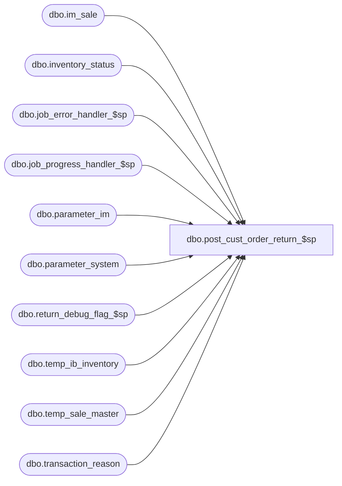

# dbo.post_cust_order_return_$sp

**Database:** me_01  
**Server:** bedrockdb02  

## Architecture Diagram



## Table Dependencies

| Referenced Table |
|---|
| dbo.im_sale |
| dbo.inventory_status |
| dbo.job_error_handler_$sp |
| dbo.job_progress_handler_$sp |
| dbo.parameter_im |
| dbo.parameter_system |
| dbo.return_debug_flag_$sp |
| dbo.temp_ib_inventory |
| dbo.temp_sale_master |
| dbo.transaction_reason |

## Stored Procedure Code

```sql
CREATE PROCEDURE dbo.post_cust_order_return_$sp

  (
     @job_id INT
    ,@min_im_sale_number DECIMAL (24, 0)
    ,@max_im_sale_number DECIMAL (24, 0)
    ,@min_location_id SMALLINT
    ,@max_location_id SMALLINT
    ,@debug_flag BIT
  )

AS


/*
  Description	: This procedure is part of the Sales Posting process and is called by post_sales_batch_$sp.
        It processes Customer Order Return transactions (615) and the flag im_sale.credit_originating_store determines
        which location will get the return. This version assumes the two locations involved in a virtual transfer
        belong to the same jurisdiction, so they both have the same currency.
*/

BEGIN
  DECLARE @c_transfer_discrepancy smallint
       ,@c_transfer_sent_out smallint
       ,@c_transfer_sent_in smallint
       ,@c_transfer_receive smallint
       ,@c_in_transit tinyint
       ,@ent_selling_reason smallint
       ,@c_system_disc_source tinyint
       ,@line_id smallint
       ,@job_type tinyint
       ,@error_msg nvarchar(4000)
       ,@c_true bit
       ,@c_false bit
       ,@proc_name nvarchar(30)
       ,@sql_err_num decimal(38,0)
       ,@table_name nvarchar(30)
       ,@operation_name nvarchar(30)
       ,@return_flag bit
       ,@c_system_disc_receive tinyint
       ,@c_ib_price_disc_pc tinyint
       ,@c_cust_order_return_type smallint
       ,@c_pos_variance tinyint
       ,@discrep_inc_location tinyint
       ,@discrep_decr_location tinyint
       ,@discrep_inc_pc_type tinyint
       ,@discrep_decr_pc_type tinyint
       ,@c_unavail_reserved_cust_order tinyint
       ,@c_cust_order_discount smallint
       ,@c_cust_order_promo smallint
       ,@c_price_status_change smallint
       ,@c_cust_order_create smallint
       ,@c_exchange_rate_diff smallint
       ,@multiple_sales_flag bit
       ,@c_eff_price_change smallint
       ,@c_price_change_type_MD tinyint
       ,@c_price_change_type_MDC tinyint
       ,@c_price_change_type_MU tinyint
       ,@c_price_change_type_MUC tinyint
       ,@ib_average_cost_type nchar
       ,@installed_es_flag bit
       ,@installed_eom_flag bit
       ,@ReturnedInventoryStatusId smallint

  SELECT   @job_type		= 1
      ,@proc_name	= N'post_cust_order_return_$sp'
      ,@c_false		= 0
      ,@c_true		= 1
      ,@c_transfer_discrepancy = 402
      ,@c_transfer_sent_out	= 400
      ,@c_transfer_sent_in	= 401
      ,@c_transfer_receive = 405
      ,@c_cust_order_return_type = 615
      ,@c_exchange_rate_diff = 640
      ,@c_cust_order_discount = 603
      ,@c_eff_price_change = 700
      ,@c_cust_order_promo = 703
      ,@c_price_status_change = 710
      ,@c_cust_order_create = 1660
      ,@c_price_change_type_MD	= 0 -- Markdown
      ,@c_price_change_type_MDC	= 1 -- Markdown Cancellation
      ,@c_price_change_type_MU	= 2 -- Markup
      ,@c_price_change_type_MUC	= 3 -- Markup Cancellation
      ,@c_in_transit	= 2
      ,@c_system_disc_source = 1
      ,@c_system_disc_receive = 2
      ,@discrep_inc_location = s.ib_price_discrep_inc_location
      ,@discrep_decr_location = s.ib_price_discrep_decr_location
      ,@discrep_inc_pc_type = s.ib_price_discrep_inc_pc_type
      ,@discrep_decr_pc_type = s.ib_price_discrep_decr_pc_type
      ,@c_unavail_reserved_cust_order = i.inventory_status_id
      ,@multiple_sales_flag = multi_sales_jurisdiction_flag
      ,@ent_selling_reason = r1.transaction_reason_id
      ,@c_pos_variance = r2.transaction_reason_id
      ,@ib_average_cost_type = ib_average_cost_type
      ,@installed_es_flag = s.installed_es_flag
      ,@installed_eom_flag = s.installed_eom_flag
  FROM parameter_system s, inventory_status i, transaction_reason r1, transaction_reason r2
  WHERE s.parameter_system_id = 1
  AND i.inventory_status_code = N'009'
  AND UPPER(r1.transaction_reason_code) = N'ESTRF'
  AND UPPER(r2.transaction_reason_code) = N'VAR'

  SELECT
    @ReturnedInventoryStatusId = p.returned_inv_status_id
  FROM
     dbo.parameter_im p
  WHERE
    p.parameter_im_id = 1

  IF OBJECT_ID (N'tempdb..#ib_cor_exchange_rate', N'U') IS NOT NULL
    DROP TABLE #ib_cor_exchange_rate

  -- This temporary table will be used to calculate the exchange rate difference
  -- For return, layaway deposit, layaway_pickup and layaway_cancel
  CREATE TABLE #ib_cor_exchange_rate

    (
       job_id INT NOT NULL
      ,sku_id DECIMAL (13, 0) NOT NULL
      ,location_id SMALLINT NOT NULL
      ,price_status_id SMALLINT NOT NULL
      ,transaction_date SMALLDATETIME NOT NULL
      ,transaction_type_code SMALLINT NOT NULL
      ,inventory_status_id SMALLINT NOT NULL
      ,other_location_id SMALLINT NULL
      ,transaction_reason_id SMALLINT NULL
      ,document_number NVARCHAR (20) NULL
      ,transaction_units INT NOT NULL
      ,transaction_cost DECIMAL (14, 2) NOT NULL
      ,transaction_valuation_retail DECIMAL (14, 2) NOT NULL
      ,transaction_selling_retail DECIMAL (14, 2) NOT NULL
      ,price_change_type SMALLINT NULL
      ,units_affected INT NULL
      ,transaction_no INT NULL
      ,transaction_line SMALLINT NULL
      ,sale_md_audit_flag BIT NOT NULL DEFAULT ((0))
      ,transaction_cost_local DECIMAL (14, 2) NULL
      ,register_no SMALLINT NULL
      ,credit_originating_store BIT NULL DEFAULT(0)
    )


  BEGIN TRY
    SET @line_id = 10
    -- need to insert transactions affecting customer order return transactions into #ib_cor_exchange_rate first
    -- and when the exchange rate difference will be calculated then
    -- we are going to insert these transactions back to temp_ib_inventory.

    -- post the Customer Order Return transaction (615)
    INSERT INTO #ib_cor_exchange_rate

      (
         job_id
        ,sku_id
        ,location_id
        ,inventory_status_id
        ,price_status_id
        ,transaction_date
        ,transaction_type_code
        ,other_location_id
        ,transaction_reason_id
        ,document_number
        ,transaction_units
        ,transaction_cost
        ,transaction_valuation_retail
        ,transaction_selling_retail
        ,price_change_type
        ,units_affected
        ,transaction_no
        ,transaction_line
        ,sale_md_audit_flag
        ,transaction_cost_local
        ,register_no
        ,credit_originating_store
      )

    SELECT
       @job_id AS job_id
      ,s.sku_id
      ,(CASE
        WHEN (s.credit_originating_store = 0) THEN s.location_id
        ELSE s.originating_location_id
        END) AS location_id
      ,@ReturnedInventoryStatusId AS inventory_status_id
      ,COALESCE (m.prm_price_status_id, m.price_status_id) AS price_status_id
      ,s.transaction_date
      ,@c_cust_order_return_type AS transaction_type_code
      ,(CASE
        WHEN (s.credit_originating_store = 0) THEN s.originating_location_id
        ELSE s.location_id
        END) AS other_location_id
      ,tr.transaction_reason_id
      ,s.reference_no AS document_number
      ,SUM (s.units) AS transaction_units
      ,SUM (s.units * m.average_cost) AS transaction_cost
      ,SUM (s.units * ROUND ((ABS (s.sold_at_price) * m.exchange_rate), 2)) AS transaction_valuation_retail
      ,SUM (s.units * ABS(s.sold_at_price)) AS transaction_selling_retail
      ,NULL AS price_change_type
      ,NULL AS units_affected
      ,s.transaction_no
      ,s.transaction_line
      ,0 AS sale_md_audit_flag
      ,SUM (s.units * m.average_cost_local) AS transaction_cost_local
      ,s.register AS register_no
      ,s.credit_originating_store
    FROM
      dbo.im_sale s
      INNER JOIN dbo.temp_sale_master m ON m.transaction_date = s.transaction_date
        AND m.location_id = s.location_id
        AND m.sku_id = s.sku_id
        AND m.style_id = s.style_id
        AND m.job_id = @job_id
      LEFT JOIN dbo.transaction_reason tr ON tr.transaction_reason_code = CONVERT(NVARCHAR(5), s.aw_reason_code)
    WHERE
      s.im_sale_number BETWEEN @min_im_sale_number AND @max_im_sale_number
      AND s.location_id BETWEEN @min_location_id AND @max_location_id
      AND s.aw_transaction_type = @c_cust_order_return_type
    GROUP BY
       s.sku_id
      ,s.reference_no
      ,s.credit_originating_store
      ,s.originating_location_id
      ,s.location_id
      ,tr.transaction_reason_id
      ,s.reference_no
      ,m.prm_price_status_id
      ,m.price_status_id
      ,m.exchange_rate
      ,s.transaction_date
      ,s.transaction_no
      ,s.transaction_line
      ,s.register
      ,s.credit_originating_store


    -- Log progress if job_params.debug_flag is true OR job_header.debug_flag is true
    EXEC return_debug_flag_$sp @job_type, @return_flag OUT
    IF (@return_flag = @c_true OR @debug_flag = @c_true)
      EXEC job_progress_handler_$sp @job_type, @job_id, @proc_name, @line_id

    SET @line_id = 20
    -- post Variance the Customer Order Return transaction (603): 2 cases: regular COReturn and reversal of COReturn
      -- Here we only post variance for regular COReturn transaction : this case has Units > 0 and pos_discount_amount < 0
    INSERT INTO #ib_cor_exchange_rate
      ( job_id
      , sku_id
      , location_id
      , inventory_status_id
      , price_status_id
      , transaction_date
      , transaction_type_code
      , other_location_id
      , transaction_reason_id
      , document_number
      , transaction_units
      , transaction_cost
      , transaction_valuation_retail
      , transaction_selling_retail
      , price_change_type
      , units_affected
      , transaction_no
      , transaction_line
      , sale_md_audit_flag
      , transaction_cost_local
      , register_no
      )
    SELECT
       @job_id AS job_id
      ,T.sku_id
      ,T.location_id
      ,@ReturnedInventoryStatusId AS inventory_status_id
      ,T.price_status_id
      ,T.transaction_date
      ,@c_cust_order_discount AS transaction_type_code
      ,NULL AS other_location_id
      ,@c_pos_variance AS transaction_reason_id
      ,T.reference_no AS document_number
      ,0 AS transaction_units
      ,0 AS transaction_cost
      ,(T.selling_unit_retail - SUM_SALE) * T.exchange_rate AS transaction_valuation_retail
      ,T.selling_unit_retail - SUM_SALE AS transaction_selling_retail
      ,NULL AS price_change_type
      ,NULL AS units_affected
      ,T.transaction_no
      ,T.transaction_line
      ,1 AS sale_md_audit_flag
      ,0 AS transaction_cost_local
      ,T.register_no
    FROM
      ( SELECT s.transaction_no
        , s.transaction_line
        , s.transaction_date
        , s.location_id
        , s.sku_id
        , s.reference_no
        , m.exchange_rate
        , COALESCE(m.prm_price_status_id, m.price_status_id) price_status_id
        , SUM(s.units) * (COALESCE(m.prm_selling_unit_retail, m.selling_unit_retail)) selling_unit_retail
        , SUM(s.units * s.sold_at_price) + COALESCE(( SELECT SUM(ABS(i.pos_discount_amount))
                   FROM im_sale i
                   WHERE i.im_sale_number BETWEEN @min_im_sale_number and @max_im_sale_number
                   AND i.location_id BETWEEN @min_location_id AND @max_location_id
                   AND i.aw_transaction_type = @c_cust_order_discount
                   AND i.transaction_no = s.transaction_no
                   AND i.transaction_line = s.transaction_line
                   AND i.location_id = s.location_id
                   AND i.transaction_date = s.transaction_date
                   AND i.reference_no = s.reference_no
                   AND i.credit_originating_store = 0
                   AND i.sku_id = s.sku_id
                   AND i.units > 0
                   AND i.pos_discount_amount < 0), 0) SUM_SALE
        , s.register AS register_no
        FROM im_sale s, temp_sale_master m
        WHERE s.im_sale_number BETWEEN @min_im_sale_number and @max_im_sale_number
        AND s.location_id BETWEEN @min_location_id AND @max_location_id
        AND s.aw_transaction_type = @c_cust_order_return_type
        AND s.credit_originating_store = 0
        AND m.job_id = @job_id
        AND s.transaction_date = m.transaction_date
        AND s.location_id = m.location_id
        AND s.sku_id = m.sku_id
        AND s.style_id = m.style_id
        GROUP BY s.transaction_no, s.transaction_line, s.transaction_date, s.location_id, s.sku_id, s.reference_no
        , m.exchange_rate, m.prm_price_status_id, m.price_status_id, m.prm_valuation_unit_retail, m.valuation_unit_retail
        , m.prm_selling_unit_retail, m.selling_unit_retail, s.register
        HAVING SUM(s.units) > 0 ) T
    WHERE T.selling_unit_retail - T.SUM_SALE <> 0

    UNION

    SELECT
       @job_id AS job_id
      ,U.sku_id
      ,U.location_id
      ,@ReturnedInventoryStatusId AS inventory_status_id
      ,U.price_status_id
      ,U.transaction_date
      ,@c_cust_order_discount AS transaction_type_code
      ,U.other_location_id
      ,@c_pos_variance AS transaction_reason_id
      ,U.reference_no AS document_number
      ,0 AS transaction_units
      ,0 AS transaction_cost
      ,(U.selling_unit_retail - SUM_DISCOUNT) * U.exchange_rate AS transaction_valuation_retail
      ,U.selling_unit_retail - SUM_DISCOUNT AS transaction_selling_retail
      ,NULL AS price_change_type
      ,NULL AS units_affected
      ,U.transaction_no
      ,U.transaction_line
      ,1 AS sale_md_audit_flag
      ,0 AS transaction_cost_local
      ,U.register_no
    FROM
      ( SELECT s.transaction_no
        , s.transaction_line
        , s.transaction_date
        , s.originating_location_id location_id
        , s.location_id other_location_id
        , s.sku_id
        , s.reference_no
        , m.exchange_rate
        , COALESCE(m.prm_price_status_id, m.price_status_id) price_status_id
        , SUM(s.units) * (COALESCE(m.prm_selling_unit_retail, m.selling_unit_retail)) selling_unit_retail
        , SUM(s.units * s.sold_at_price) + COALESCE(( SELECT SUM(ABS(i.pos_discount_amount))
                   FROM im_sale i
                   WHERE i.im_sale_number BETWEEN @min_im_sale_number and @max_im_sale_number
                   AND i.location_id BETWEEN @min_location_id AND @max_location_id
                   AND i.aw_transaction_type = @c_cust_order_discount
                   AND i.transaction_no = s.transaction_no
                   AND i.transaction_line = s.transaction_line
                   AND i.location_id = s.location_id
                   AND i.transaction_date = s.transaction_date
                   AND i.reference_no = s.reference_no
                   AND i.credit_originating_store = 1
                   AND i.sku_id = s.sku_id
                   AND i.units > 0
                   AND i.pos_discount_amount < 0), 0) SUM_DISCOUNT
        ,s.register AS register_no
        FROM im_sale s, temp_sale_master m
        WHERE s.im_sale_number BETWEEN @min_im_sale_number and @max_im_sale_number
        AND s.location_id BETWEEN @min_location_id AND @max_location_id
        AND s.aw_transaction_type = @c_cust_order_return_type
        AND s.credit_originating_store = 1
        AND m.job_id = @job_id
        AND s.transaction_date = m.transaction_date
        AND s.originating_location_id = m.location_id
        AND s.sku_id = m.sku_id
        AND s.style_id = m.style_id
        GROUP BY s.transaction_no, s.transaction_line, s.transaction_date, s.originating_location_id, s.location_id, s.sku_id, s.reference_no,
        m.exchange_rate, m.prm_price_status_id, m.price_status_id, m.prm_valuation_unit_retail, m.valuation_unit_retail, m.prm_selling_unit_retail
        , m.selling_unit_retail, s.register
        HAVING SUM(s.units) > 0 ) U
    WHERE U.selling_unit_retail - U.SUM_DISCOUNT <> 0

    -- Log progress if job_params.debug_flag is true OR job_header.debug_flag is true
    EXEC return_debug_flag_$sp @job_type, @return_flag OUT
    IF (@return_flag = @c_true OR @debug_flag = @c_true)
      EXEC job_progress_handler_$sp @job_type, @job_id, @proc_name, @line_id

    SET @line_id = 25
    -- Here we only post variance for reversal COReturn transaction : this case has Units < 0 and pos_discount_amount > 0
    INSERT INTO #ib_cor_exchange_rate
      ( job_id
      , sku_id
      , location_id
      , inventory_status_id
      , price_status_id
      , transaction_date
      , transaction_type_code
      , other_location_id
      , transaction_reason_id
      , document_number
      , transaction_units
      , transaction_cost
      , transaction_valuation_retail
      , transaction_selling_retail
      , price_change_type
      , units_affected
      , transaction_no
      , transaction_line
      , sale_md_audit_flag
      , transaction_cost_local
      , register_no )
    SELECT @job_id
      , T.sku_id
      , T.location_id
      , @ReturnedInventoryStatusId inventory_status_id
      , T.price_status_id
      , T.transaction_date
      , @c_cust_order_discount transaction_type_code
      , NULL other_location_id
      , @c_pos_variance transaction_reason_id
      , T.reference_no document_number
      , 0 transaction_units
      , 0 transaction_cost
      , -1 * ((T.selling_unit_retail - SUM_SALE) * T.exchange_rate) transaction_valuation_retail
      , -1 * (T.selling_unit_retail - SUM_SALE) transaction_selling_retail
      , NULL price_change_type
      , NULL units_affected
      , T.transaction_no
      , T.transaction_line
      , 1 sale_md_audit_flag
      , 0 transaction_cost_local
      , register_no
    FROM
      ( SELECT s.transaction_no
        , s.transaction_line
        , s.transaction_date
        , s.location_id
        , s.sku_id
        , s.reference_no
        , m.exchange_rate
        , COALESCE(m.prm_price_status_id, m.price_status_id) price_status_id
        , SUM(ABS(s.units)) * (COALESCE(m.prm_selling_unit_retail, m.selling_unit_retail)) selling_unit_retail
        , SUM(ABS(s.units) * s.sold_at_price) + COALESCE(( SELECT SUM(ABS(i.pos_discount_amount))
                   FROM im_sale i
                   WHERE i.im_sale_number BETWEEN @min_im_sale_number and @max_im_sale_number
                   AND i.location_id BETWEEN @min_location_id AND @max_location_id
                   AND i.aw_transaction_type = @c_cust_order_discount
                   AND i.transaction_no = s.transaction_no
                   AND i.transaction_line = s.transaction_line
                   AND i.location_id = s.location_id
                   AND i.transaction_date = s.transaction_date
                   AND i.reference_no = s.reference_no
                   AND i.credit_originating_store = 0
                   AND i.sku_id = s.sku_id
                   AND i.units < 0
                   AND i.pos_discount_amount > 0), 0) SUM_SALE
        , s.register AS register_no
        FROM im_sale s, temp_sale_master m
        WHERE s.im_sale_number BETWEEN @min_im_sale_number and @max_im_sale_number
        AND s.location_id BETWEEN @min_location_id AND @max_location_id
        AND s.aw_transaction_type = @c_cust_order_return_type
        AND s.credit_originating_store = 0
        AND m.job_id = @job_id
        AND s.transaction_date = m.transaction_date
        AND s.location_id = m.location_id
        AND s.sku_id = m.sku_id
        AND s.style_id = m.style_id
        GROUP BY s.transaction_no, s.transaction_line, s.transaction_date, s.location_id, s.sku_id, s.reference_no
        , m.exchange_rate, m.prm_price_status_id, m.price_status_id, m.prm_valuation_unit_retail, m.valuation_unit_retail
        , m.prm_selling_unit_retail, m.selling_unit_retail, s.register
        HAVING SUM(s.units) < 0 ) T
    WHERE T.selling_unit_retail - T.SUM_SALE <> 0
    UNION
    SELECT @job_id
      , U.sku_id
      , U.location_id
      , @ReturnedInventoryStatusId inventory_status_id
      , U.price_status_id
      , U.transaction_date
      , @c_cust_order_discount transaction_type_code
      , U.other_location_id
      , @c_pos_variance transaction_reason_id
      , U.reference_no document_number
      , 0 transaction_units
      , 0 transaction_cost
      , -1 * ((U.selling_unit_retail - SUM_DISCOUNT) * U.exchange_rate) transaction_valuation_retail
      , -1 * (U.selling_unit_retail - SUM_DISCOUNT) transaction_selling_retail
      , NULL price_change_type
      , NULL units_affected
      , U.transaction_no
      , U.transaction_line
      , 1 sale_md_audit_flag
      , 0 transaction_cost_local
      , register_no
    FROM
      ( SELECT s.transaction_no
        , s.transaction_line
        , s.transaction_date
        , s.originating_location_id location_id
        , s.location_id other_location_id
        , s.sku_id
        , s.reference_no
        , m.exchange_rate
        , COALESCE(m.prm_price_status_id, m.price_status_id) price_status_id
        , SUM(ABS(s.units)) * (COALESCE(m.prm_selling_unit_retail, m.selling_unit_retail)) selling_unit_retail
        , SUM(ABS(s.units) * s.sold_at_price) +  COALESCE(( SELECT SUM(ABS(i.pos_discount_amount))
                   FROM im_sale i
                   WHERE i.im_sale_number BETWEEN @min_im_sale_number and @max_im_sale_number
                   AND i.location_id BETWEEN @min_location_id AND @max_location_id
                   AND i.aw_transaction_type = @c_cust_order_discount
                   AND i.transaction_no = s.transaction_no
                   AND i.transaction_line = s.transaction_line
                   AND i.location_id = s.location_id
                   AND i.transaction_date = s.transaction_date
                   AND i.reference_no = s.reference_no
                   AND i.credit_originating_store = 1
                   AND i.sku_id = s.sku_id
                   AND i.units < 0
                   AND i.pos_discount_amount > 0), 0) SUM_DISCOUNT
        ,s.register AS register_no
        FROM im_sale s, temp_sale_master m
        WHERE s.im_sale_number BETWEEN @min_im_sale_number and @max_im_sale_number
        AND s.location_id BETWEEN @min_location_id AND @max_location_id
        AND s.aw_transaction_type = @c_cust_order_return_type
        AND s.credit_originating_store = 1
        AND m.job_id = @job_id
        AND s.transaction_date = m.transaction_date
        AND s.originating_location_id = m.location_id
        AND s.sku_id = m.sku_id
        AND s.style_id = m.style_id
        GROUP BY s.transaction_no, s.transaction_line, s.transaction_date, s.originating_location_id, s.location_id, s.sku_id, s.reference_no,
        m.exchange_rate, m.prm_price_status_id, m.price_status_id, m.prm_valuation_unit_retail, m.valuation_unit_retail, m.prm_selling_unit_retail
        , m.selling_unit_retail, s.register
        HAVING SUM(s.units) < 0 ) U
    WHERE U.selling_unit_retail - U.SUM_DISCOUNT <> 0

    -- Log progress if job_params.debug_flag is true OR job_header.debug_flag is true
    EXEC return_debug_flag_$sp @job_type, @return_flag OUT
    IF (@return_flag = @c_true OR @debug_flag = @c_true)
      EXEC job_progress_handler_$sp @job_type, @job_id, @proc_name, @line_id

    SET @line_id = 30
    -- post POS Discounts for the Customer Order Return transaction (603), there are 2 situations:
      -- if regular Customer Order Return --> Units is positive and pos_discount_amount is negative
      -- if this is a reversal --> Units is negative and pos_discount_amount is positive
    INSERT INTO #ib_cor_exchange_rate
      (job_id
      ,sku_id
      ,location_id
      ,inventory_status_id
      ,price_status_id
      ,transaction_date
      ,transaction_type_code
      ,other_location_id
      ,transaction_reason_id
      ,document_number
      ,transaction_units
      ,transaction_cost
      ,transaction_valuation_retail
      ,transaction_selling_retail
      ,price_change_type
      ,units_affected
      ,transaction_no
      ,transaction_line
      ,sale_md_audit_flag
      ,transaction_cost_local
      ,register_no)
    SELECT @job_id
      , s.sku_id
      , s.location_id
      , @ReturnedInventoryStatusId inventory_status_id
      , COALESCE(m1.prm_price_status_id, m1.price_status_id)
      , s.transaction_date
      , @c_cust_order_discount transaction_type_code
      , NULL other_location_id
      , r.transaction_reason_id
      , s.reference_no document_number
      , 0 transaction_units
      , 0 transaction_cost
      , - SUM(s.pos_discount_amount  * m1.exchange_rate)
      , - SUM(s.pos_discount_amount) transaction_selling_retail
      , NULL price_change_type
      , NULL units_affected
      , s.transaction_no
      , s.transaction_line
      , 0 sale_md_audit_flag
      , 0 transaction_cost_local
      , s.register AS register_no
    FROM im_sale s, transaction_reason r , temp_sale_master m1
    WHERE s.im_sale_number BETWEEN @min_im_sale_number and @max_im_sale_number
    AND s.location_id BETWEEN @min_location_id AND @max_location_id
    AND s.aw_transaction_type = @c_cust_order_discount
    AND s.credit_originating_store = 0
    AND s.pos_discount_amount < 0 -- regular COR : units is positive and discounts is negative
    AND s.units > 0
    AND m1.job_id = @job_id
    AND s.transaction_date = m1.transaction_date
    AND s.location_id = m1.location_id
    AND s.sku_id = m1.sku_id
    AND s.style_id = m1.style_id
    AND CAST(s.pos_discount_type_code AS NVARCHAR(5)) = r.transaction_reason_code
    GROUP BY s.sku_id, s.location_id, s.reference_no, m1.prm_price_status_id, m1.price_status_id,
        s.transaction_date, r.transaction_reason_id, s.transaction_no, s.transaction_line, s.register
    UNION
    SELECT @job_id
      , s.sku_id
      , s.originating_location_id
      , @ReturnedInventoryStatusId inventory_status_id
      , COALESCE(m2.prm_price_status_id, m2.price_status_id)
      , s.transaction_date
      , @c_cust_order_discount transaction_type_code
      , s.location_id
      , r.transaction_reason_id
      , s.reference_no document_number
      , 0 transaction_units
      , 0 transaction_cost
      , - SUM(s.pos_discount_amount  * m2.exchange_rate)
      , - SUM(s.pos_discount_amount) transaction_selling_retail
      , NULL price_change_type
      , NULL units_affected
      , s.transaction_no
      , s.transaction_line
      , 0 sale_md_audit_flag
      , 0 transaction_cost_local
      , s.register AS register_no
    FROM im_sale s, transaction_reason r , temp_sale_master m2
    WHERE s.im_sale_number BETWEEN @min_im_sale_number and @max_im_sale_number
    AND s.location_id BETWEEN @min_location_id AND @max_location_id
    AND s.aw_transaction_type = @c_cust_order_discount
    AND s.credit_originating_store = 1
    AND s.pos_discount_amount < 0 -- regular COR : units is positive and discounts is negative
    AND s.units > 0
    AND m2.job_id = @job_id
    AND s.transaction_date = m2.transaction_date
    AND s.originating_location_id= m2.location_id
    AND s.sku_id = m2.sku_id
    AND s.style_id = m2.style_id
    AND CAST(s.pos_discount_type_code AS NVARCHAR(5)) = r.transaction_reason_code
    GROUP BY s.sku_id, s.location_id, s.originating_location_id, s.reference_no, m2.prm_price_status_id, m2.price_status_id,
        s.transaction_date, r.transaction_reason_id, s.transaction_no, s.transaction_line, s.register

    -- Log progress if job_params.debug_flag is true OR job_header.debug_flag is true
    EXEC return_debug_flag_$sp @job_type, @return_flag OUT
    IF (@return_flag = @c_true OR @debug_flag = @c_true)
      EXEC job_progress_handler_$sp @job_type, @job_id, @proc_name, @line_id

    SET @line_id = 33
    -- if this is a reversal --> Units is negative and pos_discount_amount is positive
    INSERT INTO #ib_cor_exchange_rate
      ( job_id
      , sku_id
      , location_id
      , inventory_status_id
      , price_status_id
      , transaction_date
      , transaction_type_code
      , other_location_id
      , transaction_reason_id
      , document_number
      , transaction_units
      , transaction_cost
      , transaction_valuation_retail
      , transaction_selling_retail
      , price_change_type
      , units_affected
      , transaction_no
      , transaction_line
      , sale_md_audit_flag
      , transaction_cost_local
      , register_no )
    SELECT @job_id
      , s.sku_id
      , s.location_id
      , @ReturnedInventoryStatusId inventory_status_id
      , COALESCE(m1.prm_price_status_id, m1.price_status_id)
      , s.transaction_date
      , @c_cust_order_discount transaction_type_code
      , NULL other_location_id
      , r.transaction_reason_id
      , s.reference_no document_number
      , 0 transaction_units
      , 0 transaction_cost
      , - SUM(s.pos_discount_amount  * m1.exchange_rate)
      , - SUM(s.pos_discount_amount) transaction_selling_retail
      , NULL price_change_type
      , NULL units_affected
      , s.transaction_no
      , s.transaction_line
      , 0 sale_md_audit_flag
      , 0 transaction_cost_local
      , s.register AS register_no
    FROM im_sale s, transaction_reason r , temp_sale_master m1
    WHERE s.im_sale_number BETWEEN @min_im_sale_number and @max_im_sale_number
    AND s.location_id BETWEEN @min_location_id AND @max_location_id
    AND s.aw_transaction_type = @c_cust_order_discount
    AND s.credit_originating_store = 0
    AND s.pos_discount_amount > 0 -- this is for reversal: Units is negative and pos_discount_amount is positive
    AND s.units < 0
    AND m1.job_id = @job_id
    AND s.transaction_date = m1.transaction_date
    AND s.location_id = m1.location_id
    AND s.sku_id = m1.sku_id
    AND s.style_id = m1.style_id
    AND CAST(s.pos_discount_type_code AS NVARCHAR(5)) = r.transaction_reason_code
    GROUP BY s.sku_id, s.location_id, s.reference_no, m1.prm_price_status_id, m1.price_status_id,
        s.transaction_date, r.transaction_reason_id, s.transaction_no, s.transaction_line, s.register
    UNION
    SELECT @job_id
      , s.sku_id
      , s.originating_location_id
      , @ReturnedInventoryStatusId inventory_status_id
      , COALESCE(m2.prm_price_status_id, m2.price_status_id)
      , s.transaction_date
      , @c_cust_order_discount transaction_type_code
      , s.location_id
      , r.transaction_reason_id
      , s.reference_no document_number
      , 0 transaction_units
      , 0 transaction_cost
      , - SUM(s.pos_discount_amount  * m2.exchange_rate)
      , - SUM(s.pos_discount_amount) transaction_selling_retail
      , NULL price_change_type
      , NULL units_affected
      , s.transaction_no
      , s.transaction_line
      , 0 sale_md_audit_flag
      , 0 transaction_cost_local
      , s.register AS register_no
    FROM im_sale s, transaction_reason r , temp_sale_master m2
    WHERE s.im_sale_number BETWEEN @min_im_sale_number and @max_im_sale_number
    AND s.location_id BETWEEN @min_location_id AND @max_location_id
    AND s.aw_transaction_type = @c_cust_order_discount
    AND s.credit_originating_store = 1
    AND s.pos_discount_amount > 0 -- this is for reversal: Units is negative and pos_discount_amount is positive
    AND s.units < 0
    AND m2.job_id = @job_id
    AND s.transaction_date = m2.transaction_date
    AND s.originating_location_id= m2.location_id
    AND s.sku_id = m2.sku_id
    AND s.style_id = m2.style_id
    AND CAST(s.pos_discount_type_code AS NVARCHAR(5)) = r.transaction_reason_code
    GROUP BY s.sku_id, s.location_id, s.originating_location_id, s.reference_no, m2.prm_price_status_id, m2.price_status_id,
        s.transaction_date, r.transaction_reason_id, s.transaction_no, s.transaction_line, s.register

    -- Log progress if job_params.debug_flag is true OR job_header.debug_flag is true
    EXEC return_debug_flag_$sp @job_type, @return_flag OUT
    IF (@return_flag = @c_true OR @debug_flag = @c_true)
      EXEC job_progress_handler_$sp @job_type, @job_id, @proc_name, @line_id

    SET @line_id = 35
    -- Now that we have the data related to returns transactions in our temp table
    -- we could insert back these transactions into temp_ib_inventory
    BEGIN TRAN

    INSERT INTO dbo.temp_ib_inventory

      (
         job_id
        ,sku_id
        ,location_id
        ,inventory_status_id
        ,price_status_id
        ,transaction_date
        ,transaction_type_code
        ,other_location_id
        ,transaction_reason_id
        ,document_number
        ,transaction_units
        ,transaction_cost
        ,transaction_valuation_retail
        ,transaction_selling_retail
        ,price_change_type
        ,units_affected
        ,transaction_no
        ,transaction_line
        ,sale_md_audit_flag
        ,transaction_cost_local
        ,register_no
        ,credit_originating_store
      )

    SELECT
       job_id
      ,sku_id
      ,location_id
      ,inventory_status_id
      ,price_status_id
      ,transaction_date
      ,transaction_type_code
      ,other_location_id
      ,transaction_reason_id
      ,document_number
      ,transaction_units
      ,transaction_cost
      ,transaction_valuation_retail
      ,transaction_selling_retail
      ,price_change_type
      ,units_affected
      ,transaction_no
      ,transaction_line
      ,sale_md_audit_flag
      ,transaction_cost_local
      ,register_no
      ,credit_originating_store
    FROM
      #ib_cor_exchange_rate

    COMMIT TRAN

    -- Log progress if job_params.debug_flag is true OR job_header.debug_flag is true
    EXEC return_debug_flag_$sp @job_type, @return_flag OUT
    IF (@return_flag = @c_true OR @debug_flag = @c_true)
      EXEC job_progress_handler_$sp @job_type, @job_id, @proc_name, @line_id

    -- Post Exchange Rate Difference for Return transactions :
    IF (@multiple_sales_flag = 1)
    BEGIN
      -- Post Exchange Rate Difference for Customer Order Return transactions : We're going to take what was inserted in #ib_cor_exchange_rate
      -- The fomula used = System_valuation_retail - (valuation_retail_sold + valuation discount at the cash + valuation variance calculated)
      SET @line_id = 40
      BEGIN TRAN

      INSERT INTO dbo.temp_ib_inventory

        (
           job_id
          ,sku_id
          ,location_id
          ,inventory_status_id
          ,price_status_id
          ,transaction_date
          ,transaction_type_code
          ,other_location_id
          ,transaction_reason_id
          ,document_number
          ,transaction_units
          ,transaction_cost
          ,transaction_valuation_retail
          ,transaction_selling_retail
          ,price_change_type
          ,units_affected
          ,transaction_no
          ,transaction_line
          ,sale_md_audit_flag
          ,transaction_cost_local
          ,register_no
        )

      SELECT
         t.job_id
        ,t.sku_id
        ,t.location_id
        ,t.inventory_status_id
        ,t.price_status_id
        ,t.transaction_date
        ,@c_exchange_rate_diff AS transaction_type_code
        ,NULL AS other_location_id
        ,NULL AS transaction_reason_id
        ,NULL AS document_number
        ,0 AS transaction_units
        ,0 AS transaction_cost
        ,(SUM (t.transaction_units) * (COALESCE (m.prm_valuation_unit_retail, m.valuation_unit_retail))) - SUM (t.transaction_valuation_retail) AS exchange_rate_diff
        ,0 AS transaction_selling_retail
        ,NULL AS price_change_type
        ,NULL AS units_affected
        ,t.transaction_no
        ,t.transaction_line
        ,1 AS sale_md_audit_flag
        ,0 AS transaction_cost_local
        ,t.register_no
      FROM
        #ib_cor_exchange_rate t
        INNER JOIN dbo.temp_sale_master m ON m.job_id = t.job_id
          AND m.sku_id = t.sku_id
          AND m.location_id = t.location_id
          AND m.transaction_date = t.transaction_date
      WHERE
        t.job_id = @job_id
      GROUP BY
         t.job_id
        ,t.sku_id
        ,t.location_id
        ,t.price_status_id
        ,t.transaction_date
        ,t.inventory_status_id
        ,t.transaction_no
        ,t.transaction_line
        ,m.prm_valuation_unit_retail
        ,m.valuation_unit_retail
        ,t.register_no
      HAVING
        (SUM (t.transaction_units) * (COALESCE (m.prm_valuation_unit_retail, m.valuation_unit_retail))) - SUM (t.transaction_valuation_retail) <> 0

      COMMIT TRAN

      -- Log progress if job_params.debug_flag is true OR job_header.debug_flag is true
      EXEC return_debug_flag_$sp @job_type, @return_flag OUT
      IF (@return_flag = @c_true OR @debug_flag = @c_true)
        EXEC job_progress_handler_$sp @job_type, @job_id, @proc_name, @line_id

    END

    SET @line_id = 50
    -- post Promotion for the Customer Order Return transaction (703)
    BEGIN TRAN

    INSERT INTO dbo.temp_ib_inventory
        ( job_id
        , sku_id
        , location_id
        , inventory_status_id
        , price_status_id
        , transaction_date
        , transaction_type_code
        , other_location_id
        , transaction_reason_id
        , document_number
        , transaction_units
        , transaction_cost
        , transaction_valuation_retail
        , transaction_selling_retail
        , price_change_type
        , units_affected
        , transaction_no
        , transaction_line
        , sale_md_audit_flag
        , transaction_cost_local )
    SELECT @job_id
      , s.sku_id
      , s.location_id
      , @ReturnedInventoryStatusId inventory_status_id
      , m1.prm_price_status_id
      , s.transaction_date
      , @c_cust_order_promo transaction_type_code
      , NULL other_location_id
      , NULL transaction_reason_id
      , s.reference_no document_number
      , 0 transaction_units
      , 0 transaction_cost
      , - SUM(s.units * (m1.prm_valuation_unit_retail - m1.valuation_unit_retail)) transaction_valuation_retail
      , - SUM(s.units * (m1.prm_selling_unit_retail - m1.selling_unit_retail)) transaction_selling_retail
      , NULL price_change_type
      , - SUM(s.units) units_affected
      , s.transaction_no
      , s.transaction_line
      , 1 sale_md_audit_flag
      , 0 transaction_cost_local
    FROM im_sale s, temp_sale_master m1
    WHERE s.im_sale_number BETWEEN @min_im_sale_number and @max_im_sale_number
    AND s.location_id BETWEEN @min_location_id AND @max_location_id
    AND s.aw_transaction_type = @c_cust_order_return_type
    AND s.credit_originating_store = 0
    AND m1.job_id = @job_id
    AND s.transaction_date = m1.transaction_date
    AND s.location_id = m1.location_id
    AND s.sku_id = m1.sku_id
    AND s.style_id = m1.style_id
    AND ( ( m1.prm_selling_unit_retail <> m1.selling_unit_retail
        AND m1.prm_selling_unit_retail <> m1.start_sel_unit_retail )
        OR ( m1.prm_price_status_id <> m1.price_status_id
           AND m1.prm_price_status_id <> m1.start_price_status_id
           AND m1.transaction_date = GETDATE() ) )
    GROUP BY s.sku_id, s.location_id, m1.prm_price_status_id,
      s.reference_no , s.transaction_date, s.transaction_no, s.transaction_line
    UNION
    SELECT @job_id
      , s.sku_id
      , s.originating_location_id
      , @ReturnedInventoryStatusId inventory_status_id
      , m2.prm_price_status_id
      , s.transaction_date
      , @c_cust_order_promo transaction_type_code
      , s.location_id other_location_id
      , NULL transaction_reason_id
      , s.reference_no document_number
      , 0 transaction_units
      , 0 transaction_cost
      , - SUM(s.units * (m2.prm_valuation_unit_retail - m2.valuation_unit_retail)) transaction_valuation_retail
      , - SUM(s.units * (m2.prm_selling_unit_retail - m2.selling_unit_retail)) transaction_selling_retail
      , NULL price_change_type
      , - SUM(s.units) units_affected
      , s.transaction_no
      , s.transaction_line
      , 1 sale_md_audit_flag
      , 0 transaction_cost_local
    FROM im_sale s, temp_sale_master m2
    WHERE s.im_sale_number BETWEEN @min_im_sale_number and @max_im_sale_number
    AND s.location_id BETWEEN @min_location_id AND @max_location_id
    AND s.aw_transaction_type = @c_cust_order_return_type
    AND s.credit_originating_store = 1
    AND m2.job_id = @job_id
    AND s.transaction_date = m2.transaction_date
    AND s.originating_location_id = m2.location_id
    AND s.sku_id = m2.sku_id
    AND s.style_id = m2.style_id
    AND ( ( m2.prm_selling_unit_retail <> m2.selling_unit_retail
        AND m2.prm_selling_unit_retail <> m2.start_sel_unit_retail )
        OR ( m2.prm_price_status_id <> m2.price_status_id
           AND m2.prm_price_status_id <> m2.start_price_status_id
           AND m2.transaction_date = GETDATE() ) )
    GROUP BY s.sku_id, s.location_id, s.originating_location_id, m2.prm_price_status_id,
      s.reference_no, s.transaction_date, s.transaction_no, s.transaction_line

    COMMIT TRAN

    -- Log progress if job_params.debug_flag is true OR job_header.debug_flag is true
    EXEC return_debug_flag_$sp @job_type, @return_flag OUT
    IF (@return_flag = @c_true OR @debug_flag = @c_true)
      EXEC job_progress_handler_$sp @job_type, @job_id, @proc_name, @line_id

    SET @line_id = 60
    -- post Price Status Change for the Customer Order Return transaction (710) remove from promotional price status
    BEGIN TRAN

    INSERT INTO dbo.temp_ib_inventory
        ( job_id
        , sku_id
        , location_id
        , inventory_status_id
        , price_status_id
        , transaction_date
        , transaction_type_code
        , other_location_id
        , transaction_reason_id
        , document_number
        , transaction_units
        , transaction_cost
        , transaction_valuation_retail
        , transaction_selling_retail
        , price_change_type
        , units_affected
        , transaction_no
        , transaction_line
        , sale_md_audit_flag
        , transaction_cost_local )
      SELECT @job_id
        , s.sku_id
        , s.location_id
        , @ReturnedInventoryStatusId inventory_status_id
        , m1.prm_price_status_id
        , s.transaction_date
        , @c_price_status_change transaction_type_code
        , NULL other_location_id
        , NULL transaction_reason_id
        , s.reference_no document_number
        , - SUM(s.units) transaction_units
        , - SUM(s.units * m1.average_cost) transaction_cost
        , - SUM(s.units * m1.valuation_unit_retail) transaction_valuation_retail
        , - SUM(s.units * m1.selling_unit_retail) transaction_selling_retail
        , NULL price_change_type
        , NULL units_affected
        , s.transaction_no
        , s.transaction_line
        , 0 sale_md_audit_flag
        , - SUM(s.units * m1.average_cost_local) transaction_cost_local
      FROM im_sale s, temp_sale_master m1
      WHERE s.im_sale_number BETWEEN @min_im_sale_number AND @max_im_sale_number
      AND s.location_id BETWEEN @min_location_id AND @max_location_id
      AND s.aw_transaction_type = @c_cust_order_return_type
      AND s.credit_originating_store = 0
      AND m1.job_id = @job_id
      AND s.transaction_date = m1.transaction_date
      AND s.location_id = m1.location_id
      AND s.sku_id = m1.sku_id
      AND s.style_id = m1.style_id
      AND m1.prm_price_status_id <> m1.price_status_id
      GROUP BY s.sku_id, s.location_id, m1.prm_price_status_id,
         s.transaction_date, s.reference_no, s.transaction_no, s.transaction_line
    UNION
      SELECT @job_id
        , s.sku_id
        , s.originating_location_id
        , @ReturnedInventoryStatusId inventory_status_id
        , m2.prm_price_status_id
        , s.transaction_date
        , @c_price_status_change transaction_type_code
        , s.location_id
        , NULL transaction_reason_id
        , s.reference_no document_number
        , - SUM(s.units) transaction_units
        , - SUM(s.units * m2.average_cost) transaction_cost
        , - SUM(s.units * m2.valuation_unit_retail) transaction_valuation_retail
        , - SUM(s.units * m2.selling_unit_retail) transaction_selling_retail
        , NULL price_change_type
        , NULL units_affected
        , s.transaction_no
        , s.transaction_line
        , 0 sale_md_audit_flag
        , - SUM(s.units * m2.average_cost_local) transaction_cost_local
      FROM im_sale s, temp_sale_master m2
      WHERE s.im_sale_number BETWEEN @min_im_sale_number AND @max_im_sale_number
      AND s.location_id BETWEEN @min_location_id AND @max_location_id
      AND s.aw_transaction_type = @c_cust_order_return_type
      AND s.credit_originating_store = 1
      AND m2.job_id = @job_id
      AND s.transaction_date = m2.transaction_date
      AND s.originating_location_id = m2.location_id
      AND s.sku_id = m2.sku_id
      AND s.style_id = m2.style_id
      AND m2.prm_price_status_id <> m2.price_status_id
      GROUP BY s.sku_id, s.location_id, s.originating_location_id, m2.prm_price_status_id,
         s.transaction_date, s.reference_no, s.transaction_no, s.transaction_line

    COMMIT TRAN

    -- Log progress if job_params.debug_flag is true OR job_header.debug_flag is true
    EXEC return_debug_flag_$sp @job_type, @return_flag OUT
    IF (@return_flag = @c_true OR @debug_flag = @c_true)
      EXEC job_progress_handler_$sp @job_type, @job_id, @proc_name, @line_id

    SET @line_id = 70
    -- post Price Status Change for the Customer Order Return transaction (710) add to permanent price status
    BEGIN TRAN

    INSERT INTO dbo.temp_ib_inventory
        ( job_id
        , sku_id
        , location_id
        , inventory_status_id
        , price_status_id
        , transaction_date
        , transaction_type_code
        , other_location_id
        , transaction_reason_id
        , document_number
        , transaction_units
        , transaction_cost
        , transaction_valuation_retail
        , transaction_selling_retail
        , price_change_type
        , units_affected
        , transaction_no
        , transaction_line
        , sale_md_audit_flag
        , transaction_cost_local )
    SELECT @job_id
        , s.sku_id
        , s.location_id
        , @ReturnedInventoryStatusId inventory_status_id
        , m1.price_status_id
        , s.transaction_date
        , @c_price_status_change transaction_type_code
        , NULL other_location_id
        , NULL transaction_reason_id
        , s.reference_no document_number
        , SUM(s.units) transaction_units
        , SUM(s.units * m1.average_cost) transaction_cost
        , SUM(s.units * m1.valuation_unit_retail)
        , SUM(s.units * m1.selling_unit_retail)
        , NULL price_change_type
        , NULL units_affected
        , s.transaction_no
        , s.transaction_line
        , 0 sale_md_audit_flag
        , SUM(s.units * m1.average_cost_local) transaction_cost_local
      FROM im_sale s, temp_sale_master m1
      WHERE s.im_sale_number BETWEEN @min_im_sale_number AND @max_im_sale_number
      AND s.location_id BETWEEN @min_location_id AND @max_location_id
      AND s.aw_transaction_type = @c_cust_order_return_type
      AND s.credit_originating_store = 0
      AND m1.job_id = @job_id
      AND s.transaction_date = m1.transaction_date
      AND s.location_id = m1.location_id
      AND s.sku_id = m1.sku_id
      AND s.style_id = m1.style_id
      AND m1.prm_price_status_id <> m1.price_status_id
      GROUP BY s.sku_id, s.location_id, m1.price_status_id,
        s.transaction_date, s.reference_no, s.transaction_no, s.transaction_line
      UNION
      SELECT @job_id
        , s.sku_id
        , s.originating_location_id
        , @ReturnedInventoryStatusId inventory_status_id
        , m2.price_status_id
        , s.transaction_date
        , @c_price_status_change transaction_type_code
        , s.location_id
        , NULL transaction_reason_id
        , s.reference_no document_number
        , SUM(s.units) transaction_units
        , SUM(s.units * m2.average_cost)
        , SUM(s.units * m2.valuation_unit_retail)
        , SUM(s.units * m2.selling_unit_retail)
        , NULL price_change_type
        , NULL units_affected
        , s.transaction_no
        , s.transaction_line
        , 0 sale_md_audit_flag
        , SUM(s.units * m2.average_cost_local) transaction_cost_local
      FROM im_sale s, temp_sale_master m2
      WHERE s.im_sale_number BETWEEN @min_im_sale_number AND @max_im_sale_number
      AND s.location_id BETWEEN @min_location_id AND @max_location_id
      AND s.aw_transaction_type = @c_cust_order_return_type
      AND s.credit_originating_store = 1
      AND m2.job_id = @job_id
      AND s.transaction_date = m2.transaction_date
      AND s.originating_location_id = m2.location_id
      AND s.sku_id = m2.sku_id
      AND s.style_id = m2.style_id
      AND m2.prm_price_status_id <> m2.price_status_id
      GROUP BY s.sku_id, s.location_id, s.originating_location_id, m2.price_status_id,
        s.transaction_date, s.reference_no, s.transaction_no, s.transaction_line

    COMMIT TRAN

    -- Log progress if job_params.debug_flag is true OR job_header.debug_flag is true
    EXEC return_debug_flag_$sp @job_type, @return_flag OUT
    IF (@return_flag = @c_true OR @debug_flag = @c_true)
      EXEC job_progress_handler_$sp @job_type, @job_id, @proc_name, @line_id

    -- Start creation of Virtual Transfer for Customer Order Return transaction when required
    IF EXISTS
      (
        SELECT 1
        FROM im_sale s
        WHERE
          s.im_sale_number BETWEEN @min_im_sale_number and @max_im_sale_number
          AND s.location_id BETWEEN @min_location_id AND @max_location_id
          AND s.aw_transaction_type = @c_cust_order_return_type
          AND s.credit_originating_store = 1
          AND s.location_id <> s.originating_location_id
      )
    BEGIN
      SET @line_id = 80

      BEGIN TRAN
      -- Create transaction 402 for Cust Order Return transactions when there is discrepancy between the pernament price of the 2 location involved in the transfer
      -- Sending location is to im_sale.originating_location_id (m1) and Receiving location is im_sale.location_id (m2)
      -- The location that will get these transactions depends on the way parameters from system_parameter are set.
      INSERT INTO dbo.temp_ib_inventory
        ( job_id
        , sku_id
        , location_id
        , inventory_status_id
        , price_status_id
        , transaction_date
        , transaction_type_code
        , other_location_id
        , transaction_reason_id
        , document_number
        , transaction_units
        , transaction_cost
        , transaction_valuation_retail
        , transaction_selling_retail
        , price_change_type
        , sale_md_audit_flag
        , transaction_cost_local )
      SELECT @job_id,
        s.sku_id,
        CASE WHEN (@discrep_inc_location = @c_system_disc_source) THEN m1.location_id
           ELSE m2.location_id
        END location_id,
        CASE WHEN (@discrep_inc_location = @c_system_disc_source) THEN @ReturnedInventoryStatusId
          ELSE @c_in_transit
        END inventory_status_id,
        CASE WHEN (@discrep_inc_location = @c_system_disc_source) THEN m1.price_status_id
          ELSE m2.price_status_id
        END price_status_id,
       s.transaction_date,
        @c_transfer_discrepancy,
        CASE WHEN (@discrep_inc_location = @c_system_disc_source) THEN m2.location_id
           ELSE m1.location_id
        END other_location_id,
        @ent_selling_reason,
        s.reference_no,
        0,
        0 transaction_cost,
        SUM(s.units) * (m2.valuation_unit_retail - m1.valuation_unit_retail) AS transaction_valuation_retail,
        SUM(s.units) * (m2.selling_unit_retail - m1.selling_unit_retail) AS transaction_selling_retail,
        CASE WHEN (m1.valuation_unit_retail < m2.valuation_unit_retail) THEN @discrep_inc_pc_type
           ELSE @discrep_decr_pc_type
        END price_change_type,
        0 sale_md_audit_flag,
        0 transaction_cost_local
      FROM im_sale s, temp_sale_master m1, temp_sale_master m2
      WHERE s.im_sale_number BETWEEN @min_im_sale_number and @max_im_sale_number
      AND s.location_id BETWEEN @min_location_id AND @max_location_id
      AND s.aw_transaction_type IN (@c_cust_order_return_type)
      AND s.credit_originating_store = 1
      AND s.location_id <> s.originating_location_id
      AND m1.job_id = @job_id
      AND s.transaction_date = m1.transaction_date
      AND s.originating_location_id = m1.location_id
      AND s.sku_id = m1.sku_id
      AND s.style_id = m1.style_id
      AND m1.job_id = m2.job_id
      AND s.transaction_date = m2.transaction_date
      AND m1.transaction_date = m2.transaction_date
      AND s.location_id = m2.location_id
      AND s.sku_id = m2.sku_id
      AND m1.sku_id = m2.sku_id
      AND m1.style_id = m2.style_id
      AND m1.valuation_unit_retail <> m2.valuation_unit_retail -- prices are different

      GROUP BY s.sku_id, m1.location_id, m2.location_id, m1.price_status_id, m2.price_status_id, s.transaction_date, s.reference_no,
        m1.valuation_unit_retail, m2.valuation_unit_retail, m1.selling_unit_retail, m2.selling_unit_retail

      COMMIT TRAN
      -- Log progress if job_params.debug_flag is true OR job_header.debug_flag is true
      EXEC return_debug_flag_$sp @job_type, @return_flag OUT
      IF (@return_flag = @c_true OR @debug_flag = @c_true)
        EXEC job_progress_handler_$sp @job_type, @job_id, @proc_name, @line_id

      SET @line_id = 90
      -- Create transaction 400 for the Cust Order Return transaction: out of the available inventory status of the sending location
      -- Sending location is to im_sale.originating_location_id (m1) and Receiving location is im_sale.location_id (m2)
      -- Note that transaction_retail price is moved at the permanent retail of the sending location when parameter_system.ib_price_discrep_decr_location
        -- is set to 1 otherwise it's moved at the permanent retail of the receiving location.
      BEGIN TRAN

      IF (@ib_average_cost_type = 'D')

        INSERT INTO dbo.temp_ib_inventory
          ( job_id
          , sku_id
          , location_id
          , inventory_status_id
          , price_status_id
          , transaction_date
          , transaction_type_code
          , other_location_id
          , transaction_reason_id
          , document_number
          , transaction_units
          , transaction_cost
          , transaction_valuation_retail
          , transaction_selling_retail
          , price_change_type
          , sale_md_audit_flag
          , transaction_cost_local )
        SELECT @job_id,
          s.sku_id,
          m1.location_id,
          @ReturnedInventoryStatusId,
          m1.price_status_id,
          s.transaction_date,
          @c_transfer_sent_out,
          m2.location_id other_location_id,
          @ent_selling_reason,
          s.reference_no,
          - SUM(s.units) transaction_units,
          - SUM(s.units * m1.average_cost) transaction_cost,
          CASE WHEN ( m1.valuation_unit_retail = m2.valuation_unit_retail) THEN
                - SUM(s.units * m1.valuation_unit_retail)
        WHEN ( m1.valuation_unit_retail < m2.valuation_unit_retail AND -- price increase and discrepancy goes to source store
                @discrep_inc_location = @c_system_disc_source) THEN
                - SUM(s.units * m2.valuation_unit_retail)
             WHEN ( m1.valuation_unit_retail < m2.valuation_unit_retail AND -- price increase and discrepancy goes to receive store
                @discrep_inc_location = @c_system_disc_receive) THEN
                - SUM(s.units * m1.valuation_unit_retail)
             WHEN ( m1.valuation_unit_retail > m2.valuation_unit_retail AND -- price decrease and discrepancy goes to source store
                @discrep_decr_location = @c_system_disc_source) THEN
                - SUM(s.units * m2.valuation_unit_retail)
             WHEN ( m1.valuation_unit_retail > m2.valuation_unit_retail AND -- price decrease and discrepancy goes to receive store
                @discrep_decr_location = @c_system_disc_receive) THEN
                - SUM(s.units * m1.valuation_unit_retail)
          END transaction_valuation_retail,
          CASE WHEN ( m1.selling_unit_retail = m2.selling_unit_retail) THEN
                - SUM(s.units * m1.selling_unit_retail)
             WHEN ( m1.selling_unit_retail < m2.selling_unit_retail AND -- price increase and discrepancy goes to source store
                @discrep_inc_location = @c_system_disc_source) THEN
                - SUM(s.units * m2.selling_unit_retail)
             WHEN ( m1.selling_unit_retail < m2.selling_unit_retail AND -- price increase and discrepancy goes to receive store
                @discrep_inc_location = @c_system_disc_receive) THEN
                - SUM(s.units * m1.selling_unit_retail)
             WHEN ( m1.selling_unit_retail > m2.selling_unit_retail AND -- price decrease and discrepancy goes to source store
                @discrep_decr_location = @c_system_disc_source) THEN
                - SUM(s.units * m2.selling_unit_retail)
             WHEN ( m1.selling_unit_retail > m2.selling_unit_retail AND -- price decrease and discrepancy goes to receive store
                @discrep_decr_location = @c_system_disc_receive) THEN
                - SUM(s.units * m1.selling_unit_retail)
          END transaction_selling_retail,
          NULL,
          0 sale_md_audit_flag,
          - SUM(s.units * m1.average_cost_local) transaction_cost_local -- we do not use the cost from another location, use the cost local directly
        FROM im_sale s, temp_sale_master m1, temp_sale_master m2
        WHERE s.im_sale_number BETWEEN @min_im_sale_number and @max_im_sale_number
        AND s.location_id BETWEEN @min_location_id AND @max_location_id
        AND s.aw_transaction_type IN (@c_cust_order_return_type)
        AND s.credit_originating_store = 1
        AND s.location_id <> s.originating_location_id
        AND m1.job_id = @job_id
        AND s.transaction_date = m1.transaction_date
        AND s.originating_location_id = m1.location_id
        AND s.sku_id = m1.sku_id
        AND s.style_id = m1.style_id
        AND m1.job_id = m2.job_id
        AND s.transaction_date = m2.transaction_date
        AND m1.transaction_date = m2.transaction_date
        AND s.location_id = m2.location_id
        AND s.sku_id = m2.sku_id
        AND m1.sku_id = m2.sku_id
        AND m1.style_id = m2.style_id

        GROUP BY s.sku_id, m1.location_id, m2.location_id, m1.price_status_id, s.transaction_date, s.reference_no,
            m1.valuation_unit_retail, m2.valuation_unit_retail, m1.selling_unit_retail, m2.selling_unit_retail,
            m1.jurisdiction_id, m2.jurisdiction_id

      ELSE -- fixed average cost, use fulfilling location cost

        INSERT INTO dbo.temp_ib_inventory
          ( job_id
          , sku_id
          , location_id
          , inventory_status_id
          , price_status_id
          , transaction_date
          , transaction_type_code
          , other_location_id
          , transaction_reason_id
          , document_number
          , transaction_units
          , transaction_cost
          , transaction_valuation_retail
          , transaction_selling_retail
          , price_change_type
          , sale_md_audit_flag
          , transaction_cost_local )
        SELECT @job_id,
          s.sku_id,
          m1.location_id,
          @ReturnedInventoryStatusId,
          m1.price_status_id,
          s.transaction_date,
          @c_transfer_sent_out,
          m2.location_id other_location_id,
          @ent_selling_reason,
          s.reference_no,
          - SUM(s.units) transaction_units,
          - SUM(s.units * m2.average_cost) transaction_cost,
          CASE WHEN ( m1.valuation_unit_retail = m2.valuation_unit_retail) THEN
                - SUM(s.units * m1.valuation_unit_retail)
             WHEN ( m1.valuation_unit_retail < m2.valuation_unit_retail AND -- price increase and discrepancy goes to source store
                @discrep_inc_location = @c_system_disc_source) THEN
                - SUM(s.units * m2.valuation_unit_retail)
             WHEN ( m1.valuation_unit_retail < m2.valuation_unit_retail AND -- price increase and discrepancy goes to receive store
                @discrep_inc_location = @c_system_disc_receive) THEN
                - SUM(s.units * m1.valuation_unit_retail)
             WHEN ( m1.valuation_unit_retail > m2.valuation_unit_retail AND -- price decrease and discrepancy goes to source store
                @discrep_decr_location = @c_system_disc_source) THEN
                - SUM(s.units * m2.valuation_unit_retail)
             WHEN ( m1.valuation_unit_retail > m2.valuation_unit_retail AND -- price decrease and discrepancy goes to receive store
                @discrep_decr_location = @c_system_disc_receive) THEN
                - SUM(s.units * m1.valuation_unit_retail)
          END transaction_valuation_retail,
          CASE WHEN ( m1.selling_unit_retail = m2.selling_unit_retail) THEN
                - SUM(s.units * m1.selling_unit_retail)
             WHEN ( m1.selling_unit_retail < m2.selling_unit_retail AND -- price increase and discrepancy goes to source store
                @discrep_inc_location = @c_system_disc_source) THEN
                - SUM(s.units * m2.selling_unit_retail)
             WHEN ( m1.selling_unit_retail < m2.selling_unit_retail AND -- price increase and discrepancy goes to receive store
                @discrep_inc_location = @c_system_disc_receive) THEN
                - SUM(s.units * m1.selling_unit_retail)
             WHEN ( m1.selling_unit_retail > m2.selling_unit_retail AND -- price decrease and discrepancy goes to source store
                @discrep_decr_location = @c_system_disc_source) THEN
                - SUM(s.units * m2.selling_unit_retail)
             WHEN ( m1.selling_unit_retail > m2.selling_unit_retail AND -- price decrease and discrepancy goes to receive store
                @discrep_decr_location = @c_system_disc_receive) THEN
                - SUM(s.units * m1.selling_unit_retail)
          END transaction_selling_retail,
          NULL,
          0 sale_md_audit_flag,
          CASE WHEN ( m1.jurisdiction_id = m2.jurisdiction_id) THEN
            - SUM(s.units * m2.average_cost_local)
           WHEN ( m1.jurisdiction_id <> m2.jurisdiction_id) THEN
            - SUM(s.units * ( (m2.average_cost_local * m2.exchange_rate) / m1.exchange_rate)) -- take m2 cost local, covert to m1 currency
        END transaction_cost_local
        FROM im_sale s, temp_sale_master m1, temp_sale_master m2
        WHERE s.im_sale_number BETWEEN @min_im_sale_number and @max_im_sale_number
        AND s.location_id BETWEEN @min_location_id AND @max_location_id
        AND s.aw_transaction_type IN (@c_cust_order_return_type)
        AND s.credit_originating_store = 1
        AND s.location_id <> s.originating_location_id
        AND m1.job_id = @job_id
 AND s.transaction_date = m1.transaction_date
        AND s.originating_location_id = m1.location_id
        AND s.sku_id = m1.sku_id
        AND s.style_id = m1.style_id
        AND m1.job_id = m2.job_id
        AND s.transaction_date = m2.transaction_date
        AND m1.transaction_date = m2.transaction_date
        AND s.location_id = m2.location_id
        AND s.sku_id = m2.sku_id
        AND m1.sku_id = m2.sku_id
        AND m1.style_id = m2.style_id

        GROUP BY s.sku_id, m1.location_id, m2.location_id, m1.price_status_id, s.transaction_date, s.reference_no,
            m1.valuation_unit_retail, m2.valuation_unit_retail, m1.selling_unit_retail, m2.selling_unit_retail,
            m1.jurisdiction_id, m2.jurisdiction_id

      COMMIT TRAN

      -- Log progress if job_params.debug_flag is true OR job_header.debug_flag is true
      EXEC return_debug_flag_$sp @job_type, @return_flag OUT
      IF (@return_flag = @c_true OR @debug_flag = @c_true)
        EXEC job_progress_handler_$sp @job_type, @job_id, @proc_name, @line_id

      SET @line_id = 100
      -- Create transaction 401: in the In Transit inventory status of the receiving location
      -- Sending location is to im_sale.location_id (m1) and Receiving location is im_sale.originating_location_id (m2)
      -- Note the rules related to price increase/decrease and the relation with the system_parameter
      BEGIN TRAN

      IF (@ib_average_cost_type = 'D')

        INSERT INTO dbo.temp_ib_inventory
          ( job_id
          , sku_id
          , location_id
          , inventory_status_id
          , price_status_id
          , transaction_date
          , transaction_type_code
          , other_location_id
          , transaction_reason_id
          , document_number
          , transaction_units
          , transaction_cost
          , transaction_valuation_retail
          , transaction_selling_retail
          , price_change_type
          , sale_md_audit_flag
          , transaction_cost_local )
        SELECT @job_id,
          s.sku_id,
          m2.location_id,
          @c_in_transit,
          m2.price_status_id,
          s.transaction_date,
          @c_transfer_sent_in,
          m1.location_id other_location_id,
          @ent_selling_reason,
          s.reference_no,
          SUM(s.units) transaction_units,
          SUM(s.units * m1.average_cost) transaction_cost, -- sending location avg cost is used
          CASE WHEN ( m1.valuation_unit_retail = m2.valuation_unit_retail) THEN
                SUM(s.units * m2.valuation_unit_retail)
             WHEN ( m1.valuation_unit_retail < m2.valuation_unit_retail AND -- price increase and discrepancy goes to source store
                @discrep_inc_location = @c_system_disc_source) THEN
                SUM(s.units * m2.valuation_unit_retail)
             WHEN ( m1.valuation_unit_retail < m2.valuation_unit_retail AND -- price increase and discrepancy goes to receive store
                @discrep_inc_location = @c_system_disc_receive) THEN
                SUM(s.units * m1.valuation_unit_retail)
             WHEN ( m1.valuation_unit_retail > m2.valuation_unit_retail AND -- price decrease and discrepancy goes to source store
                @discrep_decr_location = @c_system_disc_source) THEN
                SUM(s.units * m2.valuation_unit_retail)
             WHEN ( m1.valuation_unit_retail > m2.valuation_unit_retail AND -- price decrease and discrepancy goes to receive store
                @discrep_decr_location = @c_system_disc_receive) THEN
                SUM(s.units * m1.valuation_unit_retail)
          END transaction_valuation_retail,
          CASE WHEN ( m1.selling_unit_retail = m2.selling_unit_retail) THEN
                SUM(s.units * m2.selling_unit_retail)
             WHEN ( m1.selling_unit_retail < m2.selling_unit_retail AND -- price increase and discrepancy goes to source store
                @discrep_inc_location = @c_system_disc_source) THEN
                SUM(s.units * m2.selling_unit_retail)
             WHEN ( m1.selling_unit_retail < m2.selling_unit_retail AND -- price increase and discrepancy goes to receive store
                @discrep_inc_location = @c_system_disc_receive) THEN
                SUM(s.units * m1.selling_unit_retail)
             WHEN ( m1.selling_unit_retail > m2.selling_unit_retail AND -- price decrease and discrepancy goes to source store
                @discrep_decr_location = @c_system_disc_source) THEN
                SUM(s.units * m2.selling_unit_retail)
             WHEN ( m1.selling_unit_retail > m2.selling_unit_retail AND -- price decrease and discrepancy goes to receive store
                @discrep_decr_location = @c_system_disc_receive) THEN
                SUM(s.units * m1.selling_unit_retail)
          END transaction_selling_retail,
          NULL,
          0 sale_md_audit_flag,
          CASE WHEN ( m1.jurisdiction_id = m2.jurisdiction_id) THEN
              SUM(s.units * m1.average_cost_local)
             WHEN ( m1.jurisdiction_id <> m2.jurisdiction_id) THEN
              SUM(s.units * ( (m1.average_cost_local * m1.exchange_rate) / m2.exchange_rate))
          END transaction_cost_local
        FROM im_sale s, temp_sale_master m1, temp_sale_master m2
        WHERE s.im_sale_number BETWEEN @min_im_sale_number and @max_im_sale_number
        AND s.location_id BETWEEN @min_location_id AND @max_location_id
        AND s.aw_transaction_type IN (@c_cust_order_return_type)
        AND s.credit_originating_store = 1
        AND s.location_id <> s.originating_location_id
        AND m1.job_id = @job_id
        AND s.transaction_date = m1.transaction_date
        AND s.originating_location_id = m1.location_id
        AND s.sku_id = m1.sku_id
        AND s.style_id = m1.style_id
        AND m1.job_id = m2.job_id
        AND s.transaction_date = m2.transaction_date
        AND m1.transaction_date = m2.transaction_date
        AND s.location_id = m2.location_id
        AND s.sku_id = m2.sku_id
        AND m1.sku_id = m2.sku_id
        AND m1.style_id = m2.style_id

        GROUP BY s.sku_id, m1.location_id, m2.location_id, m2.price_status_id, s.transaction_date, s.reference_no,
            m1.valuation_unit_retail, m2.valuation_unit_retail, m1.selling_unit_retail, m2.selling_unit_retail,
            m1.jurisdiction_id, m2.jurisdiction_id

      ELSE -- fixed average cost, use fulfilling location cost

        INSERT INTO dbo.temp_ib_inventory
          ( job_id
          , sku_id
          , location_id
          , inventory_status_id
          , price_status_id
          , transaction_date
          , transaction_type_code
          , other_location_id
          , transaction_reason_id
          , document_number
          , transaction_units
          , transaction_cost
          , transaction_valuation_retail
          , transaction_selling_retail
          , price_change_type
          , sale_md_audit_flag
          , transaction_cost_local )
        SELECT @job_id,
          s.sku_id,
          m2.location_id,
          @c_in_transit,
          m2.price_status_id,
          s.transaction_date,
          @c_transfer_sent_in,
          m1.location_id other_location_id,
          @ent_selling_reason,
          s.reference_no,
          SUM(s.units) transaction_units,
          SUM(s.units * m2.average_cost) transaction_cost, -- fulfilling location avg cost is used
          CASE WHEN ( m1.valuation_unit_retail = m2.valuation_unit_retail) THEN
                SUM(s.units * m2.valuation_unit_retail)
             WHEN ( m1.valuation_unit_retail < m2.valuation_unit_retail AND -- price increase and discrepancy goes to source store
                @discrep_inc_location = @c_system_disc_source) THEN
                SUM(s.units * m2.valuation_unit_retail)
             WHEN ( m1.valuation_unit_retail < m2.valuation_unit_retail AND -- price increase and discrepancy goes to receive store
                @discrep_inc_location = @c_system_disc_receive) THEN
                SUM(s.units * m1.valuation_unit_retail)
             WHEN ( m1.valuation_unit_retail > m2.valuation_unit_retail AND -- price decrease and discrepancy goes to source store
                @discrep_decr_location = @c_system_disc_source) THEN
                SUM(s.units * m2.valuation_unit_retail)
             WHEN ( m1.valuation_unit_retail > m2.valuation_unit_retail AND -- price decrease and discrepancy goes to receive store
                @discrep_decr_location = @c_system_disc_receive) THEN
                SUM(s.units * m1.valuation_unit_retail)
          END transaction_valuation_retail,
          CASE WHEN ( m1.selling_unit_retail = m2.selling_unit_retail) THEN
                SUM(s.units * m2.selling_unit_retail)
             WHEN ( m1.selling_unit_retail < m2.selling_unit_retail AND -- price increase and discrepancy goes to source store
                @discrep_inc_location = @c_system_disc_source) THEN
                SUM(s.units * m2.selling_unit_retail)
             WHEN ( m1.selling_unit_retail < m2.selling_unit_retail AND -- price increase and discrepancy goes to receive store
                @discrep_inc_location = @c_system_disc_receive) THEN
                SUM(s.units * m1.selling_unit_retail)
             WHEN ( m1.selling_unit_retail > m2.selling_unit_retail AND -- price decrease and discrepancy goes to source store
                @discrep_decr_location = @c_system_disc_source) THEN
                SUM(s.units * m2.selling_unit_retail)
             WHEN ( m1.selling_unit_retail > m2.selling_unit_retail AND -- price decrease and discrepancy goes to receive store
                @discrep_decr_location = @c_system_disc_receive) THEN
                SUM(s.units * m1.selling_unit_retail)
          END transaction_selling_retail,
          NULL,
          0 sale_md_audit_flag,
          SUM(s.units * m2.average_cost_local) transaction_cost_local -- we do not use the cost from another location, use the cost local directly
        FROM im_sale s, temp_sale_master m1, temp_sale_master m2
        WHERE s.im_sale_number BETWEEN @min_im_sale_number and @max_im_sale_number
        AND s.location_id BETWEEN @min_location_id AND @max_location_id
        AND s.aw_transaction_type IN (@c_cust_order_return_type)
        AND s.credit_originating_store = 1
        AND s.location_id <> s.originating_location_id
        AND m1.job_id = @job_id
        AND s.transaction_date = m1.transaction_date
        AND s.originating_location_id = m1.location_id
        AND s.sku_id = m1.sku_id
        AND s.style_id = m1.style_id
        AND m1.job_id = m2.job_id
        AND s.transaction_date = m2.transaction_date
        AND m1.transaction_date = m2.transaction_date
        AND s.location_id = m2.location_id
        AND s.sku_id = m2.sku_id
        AND m1.sku_id = m2.sku_id
        AND m1.style_id = m2.style_id

        GROUP BY s.sku_id, m1.location_id, m2.location_id, m2.price_status_id, s.transaction_date, s.reference_no,
            m1.valuation_unit_retail, m2.valuation_unit_retail, m1.selling_unit_retail, m2.selling_unit_retail,
            m1.jurisdiction_id, m2.jurisdiction_id

      COMMIT TRAN

      -- Log progress if job_params.debug_flag is true OR job_header.debug_flag is true
      EXEC return_debug_flag_$sp @job_type, @return_flag OUT
      IF (@return_flag = @c_true OR @debug_flag = @c_true)
        EXEC job_progress_handler_$sp @job_type, @job_id, @proc_name, @line_id

      SET @line_id = 110
      -- Create transaction 405:
        -- out of In Transit inventory status of the receiving location at the permanent price of that same location.
        -- In the FRD, it's mentionned that
          -- if the discrepancy goes to source store then take result of 401 * -1.
          -- if the discrepancy goes to receiving store then take result of 401 add result of 402 * -1
        -- This whole rule could be resumed by taking all the time the valuation/selling retail information from the receiving location.

      BEGIN TRAN

      IF (@ib_average_cost_type = 'D')

        INSERT INTO dbo.temp_ib_inventory
          ( job_id
          , sku_id
          , location_id
          , inventory_status_id
          , price_status_id
          , transaction_date
          , transaction_type_code
          , other_location_id
          , transaction_reason_id
          , document_number
          , transaction_units
          , transaction_cost
          , transaction_valuation_retail
          , transaction_selling_retail
          , price_change_type
          , sale_md_audit_flag
          , transaction_cost_local )
        SELECT @job_id,
          s.sku_id,
          m2.location_id,
          @c_in_transit,
          m2.price_status_id,
          s.transaction_date,
          @c_transfer_receive,
          m1.location_id other_location_id,
          @ent_selling_reason,
          s.reference_no,
          - SUM(s.units) transaction_units,
          - SUM(s.units * m1.average_cost) transaction_cost, -- sending location avg cost is used
          - SUM(s.units * m2.valuation_unit_retail) transaction_valuation_retail,
          - SUM(s.units * m2.selling_unit_retail) transaction_selling_retail,
          NULL,
          0 sale_md_audit_flag,
          CASE WHEN ( m1.jurisdiction_id = m2.jurisdiction_id) THEN
              - SUM(s.units * m1.average_cost_local)
             WHEN ( m1.jurisdiction_id <> m2.jurisdiction_id) THEN
              - SUM(s.units * ( (m1.average_cost_local * m1.exchange_rate) / m2.exchange_rate))
          END transaction_cost_local
        FROM im_sale s, temp_sale_master m1, temp_sale_master m2
        WHERE s.im_sale_number BETWEEN @min_im_sale_number and @max_im_sale_number
        AND s.location_id BETWEEN @min_location_id AND @max_location_id
        AND s.aw_transaction_type IN (@c_cust_order_return_type)
        AND s.credit_originating_store = 1
        AND s.location_id <> s.originating_location_id
        AND m1.job_id = @job_id
        AND s.transaction_date = m1.transaction_date
        AND s.originating_location_id = m1.location_id
        AND s.sku_id = m1.sku_id
        AND s.style_id = m1.style_id
        AND m1.job_id = m2.job_id
        AND s.transaction_date = m2.transaction_date
        AND m1.transaction_date = m2.transaction_date
        AND s.location_id = m2.location_id
        AND s.sku_id = m2.sku_id
        AND m1.sku_id = m2.sku_id
        AND m1.style_id = m2.style_id

        GROUP BY s.sku_id, m1.location_id, m2.location_id, m2.price_status_id, s.transaction_date, s.reference_no,
          m1.valuation_unit_retail, m2.valuation_unit_retail, m1.selling_unit_retail, m2.selling_unit_retail,
          m1.jurisdiction_id, m2.jurisdiction_id

      ELSE -- fixed average cost, use fulfilling location cost

        INSERT INTO dbo.temp_ib_inventory
          ( job_id
          , sku_id
          , location_id
          , inventory_status_id
          , price_status_id
          , transaction_date
          , transaction_type_code
          , other_location_id
          , transaction_reason_id
          , document_number
          , transaction_units
          , transaction_cost
          , transaction_valuation_retail
          , transaction_selling_retail
          , price_change_type
          , sale_md_audit_flag
          , transaction_cost_local )
        SELECT @job_id,
          s.sku_id,
          m2.location_id,
          @c_in_transit,
          m2.price_status_id,
          s.transaction_date,
          @c_transfer_receive,
          m1.location_id other_location_id,
          @ent_selling_reason,
          s.reference_no,
          - SUM(s.units) transaction_units,
          - SUM(s.units * m2.average_cost) transaction_cost, -- sending location avg cost is used
          - SUM(s.units * m2.valuation_unit_retail) transaction_valuation_retail,
          - SUM(s.units * m2.selling_unit_retail) transaction_selling_retail,
          NULL,
          0 sale_md_audit_flag,
          - SUM(s.units * m2.average_cost_local) transaction_cost_local -- we do not use the cost from another location, use the cost local directly
        FROM im_sale s, temp_sale_master m1, temp_sale_master m2
        WHERE s.im_sale_number BETWEEN @min_im_sale_number and @max_im_sale_number
        AND s.location_id BETWEEN @min_location_id AND @max_location_id
        AND s.aw_transaction_type IN (@c_cust_order_return_type)
        AND s.credit_originating_store = 1
        AND s.location_id <> s.originating_location_id
        AND m1.job_id = @job_id
        AND s.transaction_date = m1.transaction_date
        AND s.originating_location_id = m1.location_id
        AND s.sku_id = m1.sku_id
        AND s.style_id = m1.style_id
        AND m1.job_id = m2.job_id
        AND s.transaction_date = m2.transaction_date
        AND m1.transaction_date = m2.transaction_date
        AND s.location_id = m2.location_id
        AND s.sku_id = m2.sku_id
        AND m1.sku_id = m2.sku_id
        AND m1.style_id = m2.style_id

        GROUP BY s.sku_id, m1.location_id, m2.location_id, m2.price_status_id, s.transaction_date, s.reference_no,
          m1.valuation_unit_retail, m2.valuation_unit_retail, m1.selling_unit_retail, m2.selling_unit_retail,
          m1.jurisdiction_id, m2.jurisdiction_id

      COMMIT TRAN

      -- Log progress if job_params.debug_flag is true OR job_header.debug_flag is true
      EXEC return_debug_flag_$sp @job_type, @return_flag OUT
      IF (@return_flag = @c_true OR @debug_flag = @c_true)
        EXEC job_progress_handler_$sp @job_type, @job_id, @proc_name, @line_id

      SET @line_id = 120
      -- Create transaction 405:
        -- In the Available inventory status of the receiving location at the permanent price of that same location.
      BEGIN TRAN

      IF (@ib_average_cost_type = 'D')

        INSERT INTO dbo.temp_ib_inventory
          ( job_id
          , sku_id
          , location_id
          , inventory_status_id
          , price_status_id
          , transaction_date
          , transaction_type_code
          , other_location_id
          , transaction_reason_id
          , document_number
          , transaction_units
          , transaction_cost
          , transaction_valuation_retail
          , transaction_selling_retail
          , price_change_type
          , sale_md_audit_flag
          , transaction_cost_local )
        SELECT @job_id,
          s.sku_id,
          m2.location_id,
          @ReturnedInventoryStatusId,
          m2.price_status_id,
          s.transaction_date,
          @c_transfer_receive,
          m1.location_id other_location_id,
          @ent_selling_reason,
          s.reference_no,
          SUM(s.units) transaction_units,
          SUM(s.units * m1.average_cost) transaction_cost, -- sending location avg cost is used
          SUM(s.units * m2.valuation_unit_retail) transaction_valuation_retail,
          SUM(s.units * m2.selling_unit_retail) transaction_selling_retail,
          NULL,
          0 sale_md_audit_flag,
          CASE WHEN ( m1.jurisdiction_id = m2.jurisdiction_id) THEN
              SUM(s.units * m1.average_cost_local)
             WHEN ( m1.jurisdiction_id <> m2.jurisdiction_id) THEN
              SUM(s.units * ( (m1.average_cost_local * m1.exchange_rate) / m2.exchange_rate))
          END transaction_cost_local
        FROM im_sale s, temp_sale_master m1, temp_sale_master m2
        WHERE s.im_sale_number BETWEEN @min_im_sale_number and @max_im_sale_number
        AND s.location_id BETWEEN @min_location_id AND @max_location_id
        AND s.aw_transaction_type IN (@c_cust_order_return_type)
        AND s.credit_originating_store = 1
        AND s.location_id <> s.originating_location_id
        AND m1.job_id = @job_id
        AND s.transaction_date = m1.transaction_date
        AND s.originating_location_id = m1.location_id
        AND s.sku_id = m1.sku_id
        AND s.style_id = m1.style_id
        AND m1.job_id = m2.job_id
        AND s.transaction_date = m2.transaction_date
        AND m1.transaction_date = m2.transaction_date
        AND s.location_id = m2.location_id
        AND s.sku_id = m2.sku_id
        AND m1.sku_id = m2.sku_id
        AND m1.style_id = m2.style_id

        GROUP BY s.sku_id, m1.location_id, m2.location_id, m2.price_status_id, s.transaction_date, s.reference_no,
          m1.valuation_unit_retail, m2.valuation_unit_retail, m1.selling_unit_retail, m2.selling_unit_retail,
          m1.jurisdiction_id, m2.jurisdiction_id

      ELSE -- fixed average cost, use fulfilling location cost

        INSERT INTO dbo.temp_ib_inventory
          ( job_id
          , sku_id
          , location_id
          , inventory_status_id
          , price_status_id
          , transaction_date
          , transaction_type_code
          , other_location_id
          , transaction_reason_id
          , document_number
          , transaction_units
          , transaction_cost
          , transaction_valuation_retail
          , transaction_selling_retail
          , price_change_type
          , sale_md_audit_flag
          , transaction_cost_local )
        SELECT @job_id,
          s.sku_id,
          m2.location_id,
          @ReturnedInventoryStatusId,
          m2.price_status_id,
          s.transaction_date,
          @c_transfer_receive,
          m1.location_id other_location_id,
          @ent_selling_reason,
          s.reference_no,
          SUM(s.units) transaction_units,
          SUM(s.units * m2.average_cost) transaction_cost, -- sending location avg cost is used
          SUM(s.units * m2.valuation_unit_retail) transaction_valuation_retail,
          SUM(s.units * m2.selling_unit_retail) transaction_selling_retail,
          NULL,
          0 sale_md_audit_flag,
          SUM(s.units * m2.average_cost_local) transaction_cost_local -- we do not use the cost from another location, use the cost local directly
        FROM im_sale s, temp_sale_master m1, temp_sale_master m2
        WHERE s.im_sale_number BETWEEN @min_im_sale_number and @max_im_sale_number
        AND s.location_id BETWEEN @min_location_id AND @max_location_id
        AND s.aw_transaction_type IN (@c_cust_order_return_type)
        AND s.credit_originating_store = 1
        AND s.location_id <> s.originating_location_id
        AND m1.job_id = @job_id
        AND s.transaction_date = m1.transaction_date
        AND s.originating_location_id = m1.location_id
        AND s.sku_id = m1.sku_id
        AND s.style_id = m1.style_id
        AND m1.job_id = m2.job_id
        AND s.transaction_date = m2.transaction_date
        AND m1.transaction_date = m2.transaction_date
        AND s.location_id = m2.location_id
        AND s.sku_id = m2.sku_id
        AND m1.sku_id = m2.sku_id
        AND m1.style_id = m2.style_id

        GROUP BY s.sku_id, m1.location_id, m2.location_id, m2.price_status_id, s.transaction_date, s.reference_no,
          m1.valuation_unit_retail, m2.valuation_unit_retail, m1.selling_unit_retail, m2.selling_unit_retail,
          m1.jurisdiction_id, m2.jurisdiction_id

      COMMIT TRAN

      -- Log progress if job_params.debug_flag is true OR job_header.debug_flag is true
      EXEC return_debug_flag_$sp @job_type, @return_flag OUT
      IF (@return_flag = @c_true OR @debug_flag = @c_true)
        EXEC job_progress_handler_$sp @job_type, @job_id, @proc_name, @line_id

    END -- End creation of Virtual Transfer for Customer Order Return transaction

    SET @line_id = 130

    BEGIN TRAN

    -- Effective Price change adjustment for Customer Order Sale transactions
    INSERT INTO dbo.temp_ib_inventory

      (
         job_id
        ,sku_id
        ,location_id
        ,inventory_status_id
        ,price_status_id
        ,transaction_date
        ,transaction_type_code
        ,other_location_id
        ,transaction_reason_id
        ,document_number
        ,transaction_units
        ,transaction_cost
        ,transaction_valuation_retail
        ,transaction_selling_retail
        ,price_change_type
        ,units_affected
        ,transaction_no
        ,transaction_line
        ,sale_md_audit_flag
        ,transaction_cost_local
      )

    SELECT
       @job_id AS job_id
      ,i.sku_id
      ,i.location_id
      ,i.inventory_status_id
      ,m.curr_price_status_id
      ,m.curr_effective_date
      ,@c_eff_price_change AS transaction_type_code
      ,NULL AS other_location_id
      ,NULL AS transaction_reason_id
      ,m.curr_eff_document_number
      ,0 AS transaction_units
      ,0 AS transaction_cost
      ,SUM (i.transaction_units) * (m.curr_prm_val_unit_retail - m.valuation_unit_retail) AS transaction_valuation_retail
      ,SUM (i.transaction_units) * (m.curr_prm_sel_unit_retail - m.selling_unit_retail) AS transaction_selling_retail
      ,m.curr_price_change_type AS price_change_type
      ,ABS (SUM (i.transaction_units)) AS unit_affected
      ,NULL AS transaction_no
      ,NULL AS transaction_line
      ,0 AS sale_md_audit_flag
      ,0 AS transaction_cost_local
    FROM
      (
        SELECT DISTINCT
          sku_id
          ,location_id
          ,transaction_date
          ,curr_price_status_id
          ,price_status_id
          ,curr_price_change_type
          ,curr_eff_document_number
          ,curr_effective_date
          ,curr_prm_val_unit_retail
          ,curr_prm_sel_unit_retail
          ,valuation_unit_retail
          ,selling_unit_retail
        FROM
          dbo.temp_sale_master
        WHERE
          job_id = @job_id
          AND curr_eff_document_number IS NOT NULL
          AND curr_price_change_type IN (@c_price_change_type_MD, @c_price_change_type_MU, @c_price_change_type_MDC, @c_price_change_type_MUC)
      ) m
      ,(
        SELECT
           sku_id
          ,location_id
          ,transaction_date
          ,price_status_id
          ,inventory_status_id
          ,transaction_units
          ,transaction_cost
          ,transaction_selling_retail
        FROM
          dbo.temp_ib_inventory
        WHERE
          job_id = @job_id
          AND transaction_type_code IN (@c_cust_order_return_type)
      ) i
    WHERE
      m.sku_id = i.sku_id
      AND m.location_id = i.location_id
      AND m.transaction_date = i.transaction_date
      AND
      (
        m.curr_prm_sel_unit_retail <> m.selling_unit_retail
      )
    GROUP BY
       i.sku_id
      ,i.location_id
      ,i.inventory_status_id
      ,m.curr_price_status_id
      ,m.curr_effective_date
      ,m.curr_eff_document_number
      ,m.valuation_unit_retail
      ,m.curr_prm_val_unit_retail
      ,m.curr_prm_sel_unit_retail
      ,m.selling_unit_retail
      ,m.curr_price_change_type

    COMMIT TRAN

    -- Log progress if job_params.debug_flag is true OR job_header.debug_flag is true
    EXEC return_debug_flag_$sp @job_type, @return_flag OUT
    IF (@return_flag = @c_true OR @debug_flag = @c_true)
      EXEC job_progress_handler_$sp @job_type, @job_id, @proc_name, @line_id

    SET @line_id = 140

    BEGIN TRAN

    -- Generate a 710 for MarkUP & MarkDown
    INSERT INTO dbo.temp_ib_inventory
      ( job_id
      , sku_id
      , location_id
      , inventory_status_id
      , price_status_id
      , transaction_date
      , transaction_type_code
      , other_location_id
      , transaction_reason_id
      , document_number
      , transaction_units
      , transaction_cost
      , transaction_valuation_retail
      , transaction_selling_retail
      , price_change_type
      , units_affected
      , transaction_no
      , transaction_line
      , sale_md_audit_flag
      , transaction_cost_local )
    SELECT @job_id
      , i.sku_id
      , i.location_id
      , i.inventory_status_id
      , m.price_status_id
      , m.curr_effective_date
      , @c_price_status_change transaction_type_code
      , NULL other_location_id
      , NULL transaction_reason_id
      , m.curr_eff_document_number
      , - SUM(i.transaction_units) transaction_units
      , - SUM(i.transaction_cost) transaction_cost
      , (- SUM(i.transaction_units) * m.valuation_unit_retail) transaction_valuation_retail
      , (- SUM(i.transaction_units) * m.selling_unit_retail) transaction_selling_retail
      , NULL price_change_type
      , ABS(SUM(i.transaction_units)) unit_affected
      , NULL transaction_no
      , NULL transaction_line
      , 0 sale_md_audit_flag
      , - SUM(i.transaction_cost_local) transaction_cost_local
    FROM ( SELECT DISTINCT sku_id, location_id, transaction_date, price_status_id, curr_price_change_type, curr_eff_document_number, curr_effective_date,
              curr_price_status_id, curr_prm_sel_unit_retail, valuation_unit_retail, selling_unit_retail
        FROM temp_sale_master
        WHERE job_id = @job_id
        AND curr_eff_document_number IS NOT NULL
        AND curr_price_change_type IN (@c_price_change_type_MD, @c_price_change_type_MU, @c_price_change_type_MDC, @c_price_change_type_MUC) ) m,
        ( SELECT sku_id, location_id, transaction_date, price_status_id, inventory_status_id, transaction_units,
            transaction_cost, transaction_selling_retail, transaction_cost_local
        FROM temp_ib_inventory
        WHERE job_id = @job_id
        AND transaction_type_code IN (@c_cust_order_return_type) ) i
    WHERE
      m.sku_id = i.sku_id
      AND m.location_id = i.location_id
      AND m.transaction_date = i.transaction_date
      AND
      (
        m.curr_price_status_id <> m.price_status_id
      )
    GROUP BY i.sku_id, i.location_id, m.price_status_id, m.curr_effective_date
      , i.inventory_status_id, m.curr_eff_document_number, m.valuation_unit_retail, m.selling_unit_retail

    COMMIT TRAN

    -- Log progress if job_params.debug_flag is true OR job_header.debug_flag is true
    EXEC return_debug_flag_$sp @job_type, @return_flag OUT
    IF (@return_flag = @c_true OR @debug_flag = @c_true)
      EXEC job_progress_handler_$sp @job_type, @job_id, @proc_name, @line_id

    SET @line_id = 150

    BEGIN TRAN
    -- Generate a 710 for MarkUP & MarkDown
    INSERT INTO dbo.temp_ib_inventory
      ( job_id
      , sku_id
      , location_id
      , inventory_status_id
      , price_status_id
      , transaction_date
      , transaction_type_code
      , other_location_id
      , transaction_reason_id
      , document_number
      , transaction_units
      , transaction_cost
      , transaction_valuation_retail
      , transaction_selling_retail
      , price_change_type
      , units_affected
      , transaction_no
      , transaction_line
      , sale_md_audit_flag
      , transaction_cost_local )
    SELECT @job_id
      , i.sku_id
      , i.location_id
      , i.inventory_status_id
      , m.curr_price_status_id
      , m.curr_effective_date
      , @c_price_status_change transaction_type_code
      , NULL other_location_id
      , NULL transaction_reason_id
      , m.curr_eff_document_number
      , SUM(i.transaction_units) transaction_units
      , SUM(i.transaction_cost) transaction_cost
      , (SUM(i.transaction_units) * m.valuation_unit_retail) transaction_valuation_retail
      , (SUM(i.transaction_units) * m.selling_unit_retail) transaction_selling_retail
      , NULL price_change_type
      , ABS(SUM(i.transaction_units)) unit_affected
      , NULL transaction_no
      , NULL transaction_line
      , 0 sale_md_audit_flag
      , SUM(i.transaction_cost_local) transaction_cost_local
    FROM ( SELECT DISTINCT sku_id, location_id, transaction_date, price_status_id, curr_price_change_type, curr_eff_document_number, curr_effective_date,
              curr_price_status_id, curr_prm_sel_unit_retail, valuation_unit_retail, selling_unit_retail
        FROM temp_sale_master
        WHERE job_id = @job_id
        AND curr_eff_document_number IS NOT NULL
        AND curr_price_change_type IN (@c_price_change_type_MD, @c_price_change_type_MU, @c_price_change_type_MDC, @c_price_change_type_MUC) ) m,
        ( SELECT sku_id, location_id, transaction_date, price_status_id, inventory_status_id, transaction_units,
            transaction_cost, transaction_selling_retail, transaction_cost_local
        FROM temp_ib_inventory
        WHERE job_id = @job_id
        AND transaction_type_code IN (@c_cust_order_return_type) ) i
    WHERE m.sku_id = i.sku_id
    AND m.location_id = i.location_id
    AND m.transaction_date = i.transaction_date
    AND   ( m.curr_price_status_id <> m.price_status_id )
    GROUP BY i.sku_id, i.location_id, m.curr_price_status_id, m.curr_effective_date
    , i.inventory_status_id, m.curr_eff_document_number, m.valuation_unit_retail, m.selling_unit_retail

    COMMIT TRAN

    -- Log progress if job_params.debug_flag is true OR job_header.debug_flag is true
    EXEC return_debug_flag_$sp @job_type, @return_flag OUT
    IF (@return_flag = @c_true OR @debug_flag = @c_true)
      EXEC job_progress_handler_$sp @job_type, @job_id, @proc_name, @line_id

  END TRY

  BEGIN CATCH
    -- Test if the transaction is uncommittable
    IF (XACT_STATE()) = -1
      ROLLBACK TRANSACTION

    -- Test if the transaction is active and valid.
    IF (XACT_STATE()) = 1
      COMMIT TRANSACTION

    SELECT  @table_name			= N'temp_ib_inventory'
        , @operation_name	= N'INSERT'
        , @error_msg		= ERROR_MESSAGE()
        , @sql_err_num		= ERROR_NUMBER()

    EXEC job_error_handler_$sp
          @job_type
          , @job_id
          , @proc_name
          , @line_id
          , @sql_err_num
          , @table_name
          , @operation_name
          , @error_msg
          , @c_true

  END CATCH
END
```

