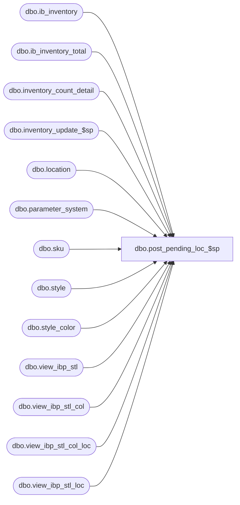

# dbo.post_pending_loc_$sp

**Database:** me_01  
**Server:** bedrockdb02  

## Architecture Diagram



## Table Dependencies

| Referenced Table |
|---|
| dbo.ib_inventory |
| dbo.ib_inventory_total |
| dbo.inventory_count_detail |
| dbo.inventory_update_$sp |
| dbo.location |
| dbo.parameter_system |
| dbo.sku |
| dbo.style |
| dbo.style_color |
| dbo.view_ibp_stl |
| dbo.view_ibp_stl_col |
| dbo.view_ibp_stl_col_loc |
| dbo.view_ibp_stl_loc |

## Stored Procedure Code

```sql
CREATE PROCEDURE [dbo].[post_pending_loc_$sp] 
(
	@DocNo AS NVARCHAR(20), 
	@DocDate AS SMALLDATETIME,  
	@LocId AS SMALLINT, 
	@IclId AS DECIMAL(13,0), 
	@DocId AS DECIMAL(12,0)
)
AS
/* 
Proc name: post_pending_loc_$sp 
Description: 
	For the given document and location:
		1. Posts the pending shrink (501) records into ib_inventory
		2. Posts any retro-active price change transactions (700/710 records) into ib_inventory 
		    for any price changes that took place in between the valuation date and the date the document is actually posted
		
HISTORY: 
Date       	Name         	Def#	Desc
Sept01,04   	Sameer Patel   	21616   Part of performance improvements for physical inventory

Date		Name            Def#    Desc
April 05, 05	James Zhang	70367 

The issue is linked to the following scenario:

1) Rec some units in loc A 
2 Transfer some units from loc A to B (Assume that there is no previous oh hand at loc B)
3) Do a Average Cost Adjustment on loc B 
4) Do Physical Inventory Count. 
5) Receive the units

The cost adjustment (the portion associated with the I/T) posted prior to the PI will be wiped out by the physical inventory count. And we still receive the units at the cost at Send. This leave a  wrong Average Cost in IB.

To fix the problem, we need to make sure that we do not post the average cost adjustment (the portion for intransit) as shrink.
Use 
  (inventory_count_detail.extended_units_counted + inventory_count_detail.total_oh_in_transit_units) * inventory_count_detail.average_cost - (inventory_count_detail.total_oh_book_cost + inventory_count_detail.total_oh_in_transit_cost) transaction_cost 
to replace
  inventory_count_detail.extended_units_counted * inventory_count_detail.average_cost - inventory_count_detail.total_oh_book_cost transaction_cost ,


Use 
  -((inventory_count_detail.extended_units_counted + inventory_count_detail.total_oh_in_transit_units) * inventory_count_detail.average_cost - (inventory_count_detail.total_oh_book_cost + inventory_count_detail.total_oh_in_transit_cost)) transaction_cost 
to replace 
  -(inventory_count_detail.extended_units_counted * inventory_count_detail.average_cost - inventory_count_detail.total_oh_book_cost) transaction_cost , 


Extra notes: 
The Average cost and intransit units are maintained in both IM PI tables and IB tables, and they are supposed to be consistent.
The fix does not affect pseudo style

October 14, 2008	Pierrette Lemay		94572			Part of the trigger removal on ib_inventory.
*/
BEGIN

/*--------------------------------------------------------------------------------------------------------------*/
/*--------------------------------------------------------------------------------------------------------------*/
-- Initialization work

	SET ANSI_WARNINGS ON 
	SET ANSI_PADDING ON
	SET ARITHABORT ON

	CREATE TABLE [#ib_inventory] (
		[ib_inventory_id] [decimal](12, 0) IDENTITY (1, 1) NOT NULL ,
		[sku_id] [decimal](13, 0) NOT NULL ,
		[location_id] [smallint] NOT NULL ,
		[price_status_id] [smallint] NOT NULL ,
		[transaction_date] [smalldatetime] NOT NULL ,
		[transaction_type_code] [smallint] NOT NULL ,
		[inventory_status_id] [smallint] NOT NULL ,
		[other_location_id] [smallint] NULL ,
		[transaction_reason_id] [smallint] NULL ,
		[document_number] [NVARCHAR] (20) NULL ,
		[transaction_units] [int] NOT NULL ,
		[transaction_cost] [decimal](14, 2) NOT NULL ,
		[transaction_valuation_retail] [decimal](14, 2) NOT NULL ,
		[transaction_selling_retail] [decimal](14, 2) NOT NULL ,
		[price_change_type] [smallint] NULL ,
		[units_affected] [int] NULL
	)

	CREATE TABLE [#ib_inv_retro_post] (
		[ib_inv_retro_post_id] [decimal](13, 0) IDENTITY (1, 1) NOT NULL ,
		[sku_id] [decimal](13, 0) NOT NULL ,
		[location_id] [int] NOT NULL ,
		[price_status_id] [int] NOT NULL ,
		[inventory_status_id] [int] NOT NULL ,
		[transaction_units] [int] NOT NULL ,
		[transaction_cost] [decimal](14, 2) NOT NULL ,
		[transaction_valuation_retail] [decimal](14, 2) NOT NULL ,
		[transaction_selling_retail] [decimal](14, 2) NOT NULL ,
		[ib_price_id] [decimal](12, 0) NULL ,
		[new_val_unit_retail] [decimal](14, 2) NULL ,
		[new_sell_unit_retail] [decimal](14, 2) NULL ,
		[new_price_status_id] [int] NULL ,
		[document_number] [NVARCHAR] (20)  NULL ,
		[effective_date] [smalldatetime] NULL ,
		[price_change_type] [int] NULL ,
		[prev_val_unit_retail] [decimal](14, 2) NULL ,
		[prev_sell_unit_retail] [decimal](14, 2) NULL ,
		[prev_price_status_id] [int] NULL
	)

	CREATE TABLE [#ib_inv_retro_post_work] (
		[ib_inv_retro_post_id] [decimal](13, 0) NOT NULL ,
		[sku_id] [decimal](13, 0) NOT NULL ,
		[location_id] [int] NOT NULL ,
		[inventory_status_id] [int] NOT NULL ,
		[prev_val_unit_retail] [decimal](14, 2) NULL ,
		[prev_sell_unit_retail] [decimal](14, 2) NULL ,
		[prev_price_status_id] [int] NULL 
	) 

/*--------------------------------------------------------------------------------------------------------------*/
/*--------------------------------------------------------------------------------------------------------------*/
-- No need to handle packs; just deal with regular skus (pseudo-styles and skus can be handled at the same time)

	/*--------------------------------------------------------------------------------------------------------------*/
	-- Validate costs and retails

	DECLARE @StyleCode AS NVARCHAR(20)
	DECLARE @CountRetail AS INT
	
	SELECT 
		@CountRetail = COUNT(*) 
	FROM 
		inventory_count_detail WITH (NOLOCK) 
	WHERE 
		inventory_control_id = @DocId 
		AND inventory_control_loc_id = @IclId 
		AND total_retail IS NULL
		AND valuation_unit_retail IS NULL
		AND pack_id IS NULL

	IF @CountRetail <> 0

		BEGIN

			DECLARE style_cursor CURSOR FOR
				SELECT
					DISTINCT style.style_code
				FROM
					style WITH (NOLOCK),
					sku WITH (NOLOCK),
					inventory_count_detail WITH (NOLOCK)
				WHERE
					style.style_id = sku.style_id
					AND inventory_count_detail.sku_id = sku.sku_id
					AND inventory_count_detail.inventory_control_loc_id = @IclId
					AND inventory_count_detail.inventory_control_id = @DocId
					AND inventory_count_detail.valuation_unit_retail IS NULL
					AND inventory_count_detail.total_retail IS NULL
				ORDER BY
					style.style_code
			
			OPEN style_cursor
			FETCH NEXT FROM style_cursor INTO @StyleCode
			WHILE @@FETCH_STATUS = 0
				BEGIN
					RAISERROR (N'Style %s does not have a valid retail', 16, 2, @StyleCode)	WITH SETERROR
					FETCH NEXT FROM style_cursor INTO @StyleCode
				END
				
			CLOSE style_cursor
			DEALLOCATE style_cursor
			RETURN (@@ERROR)

		END

	DECLARE @CountAvgCost AS INT
	SELECT 
		@CountAvgCost = COUNT(*) 
	FROM 
		inventory_count_detail WITH (NOLOCK) 
	WHERE 
		inventory_control_id = @DocId 
		AND inventory_control_loc_id = @IclId 
		AND total_retail IS NULL
		AND average_cost IS NULL
		AND pack_id IS NULL

	IF @CountAvgCost <> 0

		BEGIN		

			DECLARE style_cursor CURSOR FOR
				SELECT
					DISTINCT style.style_code
				FROM
					style WITH (NOLOCK),
					sku WITH (NOLOCK),
					inventory_count_detail WITH (NOLOCK)
				WHERE
					style.style_id = sku.style_id
					AND inventory_count_detail.sku_id = sku.sku_id
					AND inventory_count_detail.inventory_control_loc_id = @IclId
					AND inventory_count_detail.inventory_control_id = @DocId
					AND inventory_count_detail.average_cost IS NULL
					AND inventory_count_detail.total_retail IS NULL
				ORDER BY
					style.style_code
			
			OPEN style_cursor
			FETCH NEXT FROM style_cursor INTO @StyleCode
			WHILE @@FETCH_STATUS = 0
				BEGIN
					RAISERROR (N'Style %s does not have a last net final po cost', 16, 2, @StyleCode) WITH SETERROR	
					FETCH NEXT FROM style_cursor INTO @StyleCode
				END
				
			CLOSE style_cursor
			DEALLOCATE style_cursor
			
			RETURN (@@ERROR)

		END

	/*--------------------------------------------------------------------------------------------------------------*/
	-- Inserting of records into temporary ib_inventory table for skus
	-- Move inventory from discrepancy/pending shrink into available (Pseudo-styles

	DECLARE @PseudoPSId AS INT
	SELECT @PseudoPSId = pseudo_price_status_id FROM parameter_system

	INSERT INTO 
		#ib_inventory 
			(	
				sku_id, 
				location_id, 
				inventory_status_id, 
				price_status_id, 
				transaction_type_code, 
				document_number, 
				transaction_date, 
				transaction_units, 
				transaction_cost, 
				transaction_valuation_retail,
				transaction_selling_retail
			)  
	SELECT 
		B.sku_id, 
		B.location_id, 
		B.inventory_status_id, 
		B.price_status_id, 
		B.transaction_type_code, 
		B.document_number, 
		B.transaction_date, 
		B.transaction_units, 
		B.transaction_cost, 
		B.transaction_valuation_retail,
		B.transaction_selling_retail  
	FROM 
		( 
			SELECT 
				A.sku_id, 
				A.location_id, 
				A.inventory_status_id, 
				@PseudoPSId price_status_id, 
				N'501' transaction_type_code, 
				@DocNo document_number, 
				@DocDate transaction_date, 
				-SUM(A.total_on_hand_units) transaction_units, 
				-SUM(A.total_on_hand_cost) transaction_cost, 
				-SUM(A.total_on_hand_valuation_retail) transaction_valuation_retail,
				-SUM(A.total_on_hand_selling_retail) transaction_selling_retail,
				0 insert_priority 
			FROM 
				inventory_count_detail WITH (NOLOCK), 
				( 
					SELECT 
						ib_inventory_total.sku_id, 
						ib_inventory_total.location_id, 
						ib_inventory_total.inventory_status_id, 
						ib_inventory_total.price_status_id, 
						ib_inventory_total.total_on_hand_units total_on_hand_units, 
						ib_inventory_total.total_on_hand_cost total_on_hand_cost, 
						ib_inventory_total.total_on_hand_valuation_retail total_on_hand_valuation_retail,
						ib_inventory_total.total_on_hand_selling_retail total_on_hand_selling_retail  
					FROM  
						ib_inventory_total 
					WHERE 
						ib_inventory_total.location_id = @LocId 
						AND ib_inventory_total.inventory_status_id IN (4, 7) 

					UNION ALL
					
					SELECT 
						ib_inventory.sku_id, 
						ib_inventory.location_id, 
						ib_inventory.inventory_status_id, 
						ib_inventory.price_status_id, 
						-ib_inventory.transaction_units total_on_hand_units, 
						-ib_inventory.transaction_cost total_on_hand_cost,  
						-ib_inventory.transaction_valuation_retail total_on_hand_valuation_retail,
						-ib_inventory.transaction_selling_retail total_on_hand_selling_retail
					FROM  
						ib_inventory 
					WHERE 
						ib_inventory.location_id = @LocId 
						AND ib_inventory.inventory_status_id IN (4, 7) 
						AND ib_inventory.transaction_date > @DocDate
				) A 
			WHERE 
				A.sku_id = inventory_count_detail.sku_id 
				AND inventory_count_detail.inventory_control_loc_id = @IclId 
				AND inventory_count_detail.inventory_control_id = @DocId 
				AND inventory_count_detail.total_retail IS NOT NULL
			GROUP BY
				A.sku_id, 
				A.location_id, 
				A.inventory_status_id		
			HAVING
				(SUM(A.total_on_hand_units) <> 0 OR SUM(A.total_on_hand_cost) <> 0)

			UNION ALL 

			SELECT 
				A.sku_id, 
				A.location_id, 
				1 inventory_status_id, 
				@PseudoPSId price_status_id, 
				N'501' transaction_type_code, 
				@DocNo document_number, 
				@DocDate transaction_date, 
				SUM(A.total_on_hand_units) transaction_units, 
				SUM(A.total_on_hand_cost) transaction_cost, 
				SUM(A.total_on_hand_valuation_retail) transaction_valuation_retail,
				SUM(A.total_on_hand_selling_retail) transaction_selling_retail,
				1 insert_priority 
			FROM 
				inventory_count_detail WITH (NOLOCK), 
				( 
					SELECT 
						ib_inventory_total.sku_id, 
						ib_inventory_total.location_id, 
						ib_inventory_total.inventory_status_id, 
						ib_inventory_total.price_status_id, 
						ib_inventory_total.total_on_hand_units total_on_hand_units, 
						ib_inventory_total.total_on_hand_cost total_on_hand_cost, 
						ib_inventory_total.total_on_hand_valuation_retail total_on_hand_valuation_retail,
						ib_inventory_total.total_on_hand_selling_retail total_on_hand_selling_retail  
					FROM  
						ib_inventory_total 
					WHERE 
						ib_inventory_total.location_id = @LocId 
						AND ib_inventory_total.inventory_status_id IN (4, 7) 

					UNION ALL
					
					SELECT 
						ib_inventory.sku_id, 
						ib_inventory.location_id, 
						ib_inventory.inventory_status_id, 
						ib_inventory.price_status_id, 
						-ib_inventory.transaction_units total_on_hand_units, 
						-ib_inventory.transaction_cost total_on_hand_cost,  
						-ib_inventory.transaction_valuation_retail total_on_hand_valuation_retail,
						-ib_inventory.transaction_selling_retail total_on_hand_selling_retail
					FROM  
						ib_inventory 
					WHERE 
						ib_inventory.location_id = @LocId 
						AND ib_inventory.inventory_status_id IN (4, 7) 
						AND ib_inventory.transaction_date > @DocDate
				) A 
			WHERE 
				A.sku_id = inventory_count_detail.sku_id 
				AND inventory_count_detail.inventory_control_loc_id = @IclId 
				AND inventory_count_detail.inventory_control_id = @DocId 
				AND inventory_count_detail.total_retail IS NOT NULL
			GROUP BY
				A.sku_id, 
				A.location_id, 
				A.inventory_status_id		
			HAVING
				(SUM(A.total_on_hand_units) <> 0 OR SUM(A.total_on_hand_cost) <> 0)
		) B 
	ORDER BY 
		B.insert_priority 

	/*--------------------------------------------------------------------------------------------------------------*/
	-- Post pending shrink records (Pseudo-styles)

	INSERT INTO 
		#ib_inventory 
			(
				sku_id, 
				location_id, 
				inventory_status_id, 
				price_status_id, 
				transaction_type_code, 
				document_number, 
				transaction_date, 
				transaction_units, 
				transaction_cost, 
				transaction_valuation_retail,
				transaction_selling_retail
			) 
	SELECT
		B.sku_id, 
		B.location_id, 
		B.inventory_status_id, 
		B.price_status_id, 
		B.transaction_type_code, 
		B.document_number, 
		B.transaction_date, 
		B.transaction_units, 
		B.transaction_cost, 
		B.transaction_valuation_retail,
		B.transaction_selling_retail 
	FROM
		(
			SELECT 
				inventory_count_detail.sku_id, 
				@LocId location_id, 
				1 inventory_status_id, 
				@PseudoPSId price_status_id, 
				N'501' transaction_type_code, 
				@DocNo document_number, 
				@DocDate transaction_date, 
				inventory_count_detail.extended_units_counted - inventory_count_detail.total_oh_book_units transaction_units, 
				inventory_count_detail.cost - inventory_count_detail.total_oh_book_cost transaction_cost , 
				inventory_count_detail.total_valuation_retail - inventory_count_detail.total_oh_book_val_retail transaction_valuation_retail,
				inventory_count_detail.total_retail - inventory_count_detail.total_oh_book_sell_retail transaction_selling_retail,
				0 insert_priority
			FROM 
				inventory_count_detail WITH (NOLOCK)
			WHERE 
				inventory_count_detail.inventory_control_loc_id = @IclId 
				AND inventory_count_detail.inventory_control_id = @DocId  
				AND inventory_count_detail.total_retail IS NOT NULL
				AND (inventory_count_detail.units_counted - inventory_count_detail.total_oh_book_units <> 0)
			UNION ALL
			SELECT 
				inventory_count_detail.sku_id, 
				@LocId location_id, 
				7 inventory_status_id, 
				@PseudoPSId price_status_id, 
				N'501' transaction_type_code, 
				@DocNo document_number, 
				@DocDate transaction_date, 
				-(inventory_count_detail.extended_units_counted - inventory_count_detail.total_oh_book_units) transaction_units, 
				-(inventory_count_detail.cost - inventory_count_detail.total_oh_book_cost) transaction_cost , 
				-(inventory_count_detail.total_valuation_retail - inventory_count_detail.total_oh_book_val_retail) transaction_valuation_retail,
				-(inventory_count_detail.total_retail - inventory_count_detail.total_oh_book_sell_retail) transaction_selling_retail,
				1 insert_priority
			FROM 
				inventory_count_detail WITH (NOLOCK)
			WHERE 
				inventory_count_detail.inventory_control_loc_id = @IclId 
				AND inventory_count_detail.inventory_control_id = @DocId  
				AND inventory_count_detail.total_retail IS NOT NULL
				AND (inventory_count_detail.units_counted - inventory_count_detail.total_oh_book_units <> 0)
		) B
	ORDER BY
		insert_priority

	/*--------------------------------------------------------------------------------------------------------------*/
	-- Inserting of records into temporary ib_inventory table for skus
	-- Move inventory from discrepancy/pending shrink into available (Regular skus)

	INSERT INTO 
		#ib_inventory 
			(
				sku_id, 
				location_id, 
				inventory_status_id, 
				price_status_id, 
				transaction_type_code, 
				document_number, 
				transaction_date, 
				transaction_units, 
				transaction_cost, 
				transaction_valuation_retail,
				transaction_selling_retail
			)  
	SELECT 
		B.sku_id, 
		B.location_id, 
		B.inventory_status_id, 
		B.price_status_id, 
		B.transaction_type_code, 
		B.document_number, 
		B.transaction_date, 
		B.transaction_units, 
		B.transaction_cost, 
		B.transaction_valuation_retail,
		B.transaction_selling_retail 
	FROM 
		( 
			SELECT 
				A.sku_id, 
				A.location_id, 
				A.inventory_status_id, 
				inventory_count_detail.price_status_id, 
				N'501' transaction_type_code, 
				@DocNo document_number, 
				@DocDate transaction_date, 
				-SUM(A.total_on_hand_units) transaction_units, 
				-SUM(A.total_on_hand_cost) transaction_cost, 
				-SUM(A.total_on_hand_valuation_retail) transaction_valuation_retail,
				-SUM(A.total_on_hand_selling_retail) transaction_selling_retail,
				0 insert_priority 
			FROM 
				inventory_count_detail WITH (NOLOCK), 
				( 
					SELECT 
						ib_inventory_total.sku_id, 
						ib_inventory_total.location_id, 
						ib_inventory_total.inventory_status_id, 
						ib_inventory_total.price_status_id, 
						ib_inventory_total.total_on_hand_units total_on_hand_units, 
						ib_inventory_total.total_on_hand_cost total_on_hand_cost, 
						ib_inventory_total.total_on_hand_valuation_retail total_on_hand_valuation_retail,
						ib_inventory_total.total_on_hand_selling_retail total_on_hand_selling_retail  
					FROM  
						ib_inventory_total 
					WHERE 
						ib_inventory_total.location_id = @LocId 
						AND ib_inventory_total.inventory_status_id IN (4, 7) 

					UNION ALL
					
					SELECT 
						ib_inventory.sku_id, 
						ib_inventory.location_id, 
						ib_inventory.inventory_status_id, 
						ib_inventory.price_status_id, 
						-ib_inventory.transaction_units total_on_hand_units, 
						-ib_inventory.transaction_cost total_on_hand_cost,  
						-ib_inventory.transaction_valuation_retail total_on_hand_valuation_retail,
						-ib_inventory.transaction_selling_retail total_on_hand_selling_retail
					FROM  
						ib_inventory 
					WHERE 
						ib_inventory.location_id = @LocId 
						AND ib_inventory.inventory_status_id IN (4, 7) 
						AND ib_inventory.transaction_date > @DocDate
				) A 
			WHERE 
				A.sku_id = inventory_count_detail.sku_id 
				AND inventory_count_detail.inventory_control_loc_id = @IclId 
				AND inventory_count_detail.inventory_control_id = @DocId 
				AND inventory_count_detail.total_retail IS NULL
				AND inventory_count_detail.average_cost IS NOT NULL
				AND inventory_count_detail.pack_id IS NULL
			GROUP BY
				A.sku_id, 
				A.location_id, 
				A.inventory_status_id, 
				inventory_count_detail.price_status_id
			HAVING
				(SUM(A.total_on_hand_units) <> 0 OR SUM(A.total_on_hand_cost) <> 0)

			UNION ALL 

			SELECT 
				A.sku_id, 
				A.location_id, 
				1 inventory_status_id, 
				inventory_count_detail.price_status_id, 
				N'501' transaction_type_code, 
				@DocNo document_number, 
				@DocDate transaction_date, 
				SUM(A.total_on_hand_units) transaction_units, 
				SUM(A.total_on_hand_cost) transaction_cost, 
				SUM(A.total_on_hand_valuation_retail) transaction_valuation_retail,
				SUM(A.total_on_hand_selling_retail) transaction_selling_retail,
				1 insert_priority 
			FROM 
				inventory_count_detail WITH (NOLOCK), 
				( 
					SELECT 
						ib_inventory_total.sku_id, 
						ib_inventory_total.location_id, 
						ib_inventory_total.inventory_status_id, 
						ib_inventory_total.price_status_id, 
						ib_inventory_total.total_on_hand_units total_on_hand_units, 
						ib_inventory_total.total_on_hand_cost total_on_hand_cost, 
						ib_inventory_total.total_on_hand_valuation_retail total_on_hand_valuation_retail, 
						ib_inventory_total.total_on_hand_selling_retail total_on_hand_selling_retail 
					FROM  
						ib_inventory_total 
					WHERE 
						ib_inventory_total.location_id = @LocId 
						AND ib_inventory_total.inventory_status_id IN (4, 7) 

					UNION ALL
					
					SELECT 
						ib_inventory.sku_id, 
						ib_inventory.location_id, 
						ib_inventory.inventory_status_id, 
						ib_inventory.price_status_id, 
						-ib_inventory.transaction_units total_on_hand_units, 
						-ib_inventory.transaction_cost total_on_hand_cost,  
						-ib_inventory.transaction_valuation_retail total_on_hand_valuation_retail,
						-ib_inventory.transaction_selling_retail total_on_hand_selling_retail
					FROM  
						ib_inventory 
					WHERE 
						ib_inventory.location_id = @LocId 
						AND ib_inventory.inventory_status_id IN (4, 7) 
						AND ib_inventory.transaction_date > @DocDate
				) A 
			WHERE 
				A.sku_id = inventory_count_detail.sku_id 
				AND inventory_count_detail.inventory_control_loc_id = @IclId 
				AND inventory_count_detail.inventory_control_id = @DocId 
				AND inventory_count_detail.total_retail IS NULL
				AND inventory_count_detail.average_cost IS NOT NULL
				AND inventory_count_detail.pack_id IS NULL
			GROUP BY
				A.sku_id, 
				A.location_id, 
				A.inventory_status_id, 
				inventory_count_detail.price_status_id		
			HAVING
				(SUM(A.total_on_hand_units) <> 0 OR SUM(A.total_on_hand_cost) <> 0)
		) B 
	ORDER BY 
		B.insert_priority 

	/*--------------------------------------------------------------------------------------------------------------*/
	-- Post pending shrink records (Regular skus)

	INSERT INTO 
		#ib_inventory 
			(
				sku_id, 
				location_id, 
				inventory_status_id, 
				price_status_id, 
				transaction_type_code, 
				document_number, 
				transaction_date, 
				transaction_units, 
				transaction_cost, 
				transaction_valuation_retail,
				transaction_selling_retail
			) 
	SELECT
		B.sku_id, 
		B.location_id, 
		B.inventory_status_id, 
		B.price_status_id, 
		B.transaction_type_code, 
		B.document_number, 
		B.transaction_date, 
		B.transaction_units, 
		B.transaction_cost, 
		B.transaction_valuation_retail,
		B.transaction_selling_retail  
	FROM
		(
			SELECT 
				inventory_count_detail.sku_id, 
				@LocId location_id, 
				1 inventory_status_id, 
				inventory_count_detail.price_status_id, 
				N'501' transaction_type_code, 
				@DocNo document_number, 
				@DocDate transaction_date, 
				inventory_count_detail.extended_units_counted - inventory_count_detail.total_oh_book_units transaction_units, 
				/*inventory_count_detail.extended_units_counted * inventory_count_detail.average_cost - inventory_count_detail.total_oh_book_cost transaction_cost , */
				(inventory_count_detail.extended_units_counted + inventory_count_detail.total_oh_in_transit_units) * inventory_count_detail.average_cost - (inventory_count_detail.total_oh_book_cost + inventory_count_detail.total_oh_in_transit_cost) transaction_cost ,
				(inventory_count_detail.extended_units_counted * inventory_count_detail.valuation_unit_retail) - (inventory_count_detail.total_oh_book_units * inventory_count_detail.valuation_unit_retail) transaction_valuation_retail,
				(inventory_count_detail.extended_units_counted * inventory_count_detail.selling_unit_retail) - (inventory_count_detail.total_oh_book_units * inventory_count_detail.selling_unit_retail) transaction_selling_retail,
				0 insert_priority
			FROM 
				inventory_count_detail WITH (NOLOCK)
			WHERE 
				inventory_count_detail.inventory_control_loc_id = @IclId 
				AND inventory_count_detail.inventory_control_id = @DocId 
				AND inventory_count_detail.total_retail IS NULL
				AND inventory_count_detail.average_cost IS NOT NULL
				AND inventory_count_detail.pack_id IS NULL 
				AND (inventory_count_detail.units_counted - inventory_count_detail.total_oh_book_units <> 0 OR (inventory_count_detail.extended_units_counted * inventory_count_detail.average_cost - inventory_count_detail.total_oh_book_cost <> 0))
			UNION ALL
			SELECT 
				inventory_count_detail.sku_id, 
				@LocId location_id, 
				7 inventory_status_id, 
				inventory_count_detail.price_status_id, 
				N'501' transaction_type_code, 
				@DocNo document_number, 
				@DocDate transaction_date, 
				-(inventory_count_detail.extended_units_counted - inventory_count_detail.total_oh_book_units) transaction_units, 
				/* -(inventory_count_detail.extended_units_counted * inventory_count_detail.average_cost - inventory_count_detail.total_oh_book_cost) transaction_cost ,  */
				-((inventory_count_detail.extended_units_counted + inventory_count_detail.total_oh_in_transit_units) * inventory_count_detail.average_cost - (inventory_count_detail.total_oh_book_cost + inventory_count_detail.total_oh_in_transit_cost)) transaction_cost,
				-((inventory_count_detail.extended_units_counted * inventory_count_detail.valuation_unit_retail) - (inventory_count_detail.total_oh_book_units * inventory_count_detail.valuation_unit_retail)) transaction_valuation_retail,
				-((inventory_count_detail.extended_units_counted * inventory_count_detail.selling_unit_retail) - (inventory_count_detail.total_oh_book_units * inventory_count_detail.selling_unit_retail)) transaction_selling_retail,
				1 insert_priority
			FROM 
				inventory_count_detail WITH (NOLOCK)
			WHERE 
				inventory_count_detail.inventory_control_loc_id = @IclId 
				AND inventory_count_detail.inventory_control_id = @DocId  
				AND inventory_count_detail.total_retail IS NULL 
				AND inventory_count_detail.average_cost IS NOT NULL
				AND inventory_count_detail.pack_id IS NULL
				AND (inventory_count_detail.units_counted - inventory_count_detail.total_oh_book_units <> 0 OR (inventory_count_detail.extended_units_counted * inventory_count_detail.average_cost - inventory_count_detail.total_oh_book_cost <> 0))
		) B
	ORDER BY
		insert_priority

	/*--------------------------------------------------------------------------------------------------------------*/

/*--------------------------------------------------------------------------------------------------------------*/
/*--------------------------------------------------------------------------------------------------------------*/
--Using the temporary ib_inventory table, determine any retroactive price changes affecting the sku/locations in this table
--This information will be used to post the corresponding retroactive 700/710 price change records

	DECLARE @JurisdictionId AS SMALLINT
	SELECT @JurisdictionId = jurisdiction_id FROM location WHERE location_id = @LocId

	/*--------------------------------------------------------------------------------------------------------------*/
	-- Determine the ib_price_id to be used for each sku/location/price change no.

	SELECT 
		MAX(U.ib_price_id) ib_price_id, 
		U.sku_id,
		U.location_id,
		U.document_number
	INTO #MAX_ID
	FROM 
		(
			SELECT 
				ib_price_id, 
				sku.sku_id,
				#ib_inventory.location_id,
				view_ibp_stl.document_number
			FROM 
				view_ibp_stl, 
				#ib_inventory WITH (NOLOCK), 
				sku WITH (NOLOCK)
			WHERE 
				view_ibp_stl.style_id = sku.style_id 
				AND sku.sku_id = #ib_inventory.sku_id 			
				AND view_ibp_stl.effective_date > @DocDate
				AND view_ibp_stl.jurisdiction_id = @JurisdictionId
			UNION ALL
			SELECT 
				ib_price_id, 
				sku.sku_id,
				#ib_inventory.location_id,
				view_ibp_stl_col.document_number
			FROM 
				view_ibp_stl_col, 
				#ib_inventory WITH (NOLOCK), 
				sku WITH (NOLOCK), 
				style_color  WITH (NOLOCK)
			WHERE 
				view_ibp_stl_col.style_id = sku.style_id 
				AND sku.sku_id = #ib_inventory.sku_id 
				AND style_color.style_color_id = sku.style_color_id 
				AND style_color.color_id = view_ibp_stl_col.color_id 
				AND view_ibp_stl_col.effective_date > @DocDate
				AND view_ibp_stl_col.jurisdiction_id = @JurisdictionId
			UNION ALL
			SELECT 
				ib_price_id, 
				sku.sku_id,
				#ib_inventory.location_id,
				view_ibp_stl_loc.document_number
			FROM 
				view_ibp_stl_loc, 
				#ib_inventory WITH (NOLOCK), 
				sku WITH (NOLOCK)
			WHERE 
				view_ibp_stl_loc.style_id = sku.style_id 
				AND sku.sku_id = #ib_inventory.sku_id 			
				AND view_ibp_stl_loc.effective_date > @DocDate
				AND view_ibp_stl_loc.location_id = #ib_inventory.location_id
				AND view_ibp_stl_loc.jurisdiction_id = @JurisdictionId
			UNION ALL
			SELECT 
				ib_price_id, 
				sku.sku_id,
				#ib_inventory.location_id,
				view_ibp_stl_col_loc.document_number
			FROM 
				view_ibp_stl_col_loc, 
				#ib_inventory WITH (NOLOCK), 
				sku WITH (NOLOCK), 
				style_color  WITH (NOLOCK)
			WHERE 
				view_ibp_stl_col_loc.style_id = sku.style_id 
				AND sku.sku_id = #ib_inventory.sku_id 
				AND style_color.style_color_id = sku.style_color_id 
				AND style_color.color_id = view_ibp_stl_col_loc.color_id 
				AND view_ibp_stl_col_loc.location_id = #ib_inventory.location_id
				AND view_ibp_stl_col_loc.jurisdiction_id = @JurisdictionId	
		) U
	GROUP BY 
		U.sku_id,
		U.location_id,
		U.document_number

	/*--------------------------------------------------------------------------------------------------------------*/
	-- Populate the ib_inv_retro_post table with the sku/location combinations in the temporary ib_inventory table
	-- whose retail has to be changed retroactively
	-- Also store the new unit retail and price_status_id

	INSERT INTO
		#ib_inv_retro_post
			(
				sku_id, 
				location_id, 
				price_status_id, 
				inventory_status_id, 
				transaction_units, 
				transaction_cost, 
				transaction_valuation_retail, 
				transaction_selling_retail, 
				ib_price_id, 
				new_val_unit_retail, 
				new_sell_unit_retail, 
				new_price_status_id, 
				document_number, 
				effective_date, 
				price_change_type
			)
	SELECT
		A.sku_id,
		A.location_id,
		A.price_status_id,
		A.inventory_status_id,
		A.transaction_units, 
		A.transaction_cost,
		A.transaction_valuation_retail,
		A.transaction_selling_retail,
		A.ib_price_id,
		A.new_val_unit_retail,
		A.new_sell_unit_retail,
		A.new_price_status_id,
		A.document_number,
		A.effective_date,
		A.price_change_type
	FROM
		(
			SELECT
				#ib_inventory.sku_id,
				#ib_inventory.location_id,
				#ib_inventory.price_status_id,
				#ib_inventory.inventory_status_id,
				#ib_inventory.transaction_units, 
				#ib_inventory.transaction_cost,
				#ib_inventory.transaction_valuation_retail,
				#ib_inventory.transaction_selling_retail,
				view_ibp_stl.ib_price_id,
				view_ibp_stl.valuation_retail_price new_val_unit_retail,
				view_ibp_stl.selling_retail_price new_sell_unit_retail,
				view_ibp_stl.price_status_id new_price_status_id,
				view_ibp_stl.document_number,
				view_ibp_stl.effective_date,
				view_ibp_stl.price_change_type
			FROM
				#ib_inventory WITH (NOLOCK),
				view_ibp_stl,
				#MAX_ID
			WHERE
				view_ibp_stl.ib_price_id = #MAX_ID.ib_price_id
				AND #ib_inventory.sku_id = #MAX_ID.sku_id
				AND #ib_inventory.location_id = #MAX_ID.location_id
				AND view_ibp_stl.jurisdiction_id = @JurisdictionId	
			UNION ALL
			SELECT
				#ib_inventory.sku_id,
				#ib_inventory.location_id,
				#ib_inventory.price_status_id,
				#ib_inventory.inventory_status_id,
				#ib_inventory.transaction_units, 
				#ib_inventory.transaction_cost,
				#ib_inventory.transaction_valuation_retail,
				#ib_inventory.transaction_selling_retail,
				view_ibp_stl_col.ib_price_id,
				view_ibp_stl_col.valuation_retail_price new_val_unit_retail,
				view_ibp_stl_col.selling_retail_price new_sell_unit_retail,
				view_ibp_stl_col.price_status_id new_price_status_id,
				view_ibp_stl_col.document_number,
				view_ibp_stl_col.effective_date,
				view_ibp_stl_col.price_change_type
			FROM
				#ib_inventory WITH (NOLOCK),
				view_ibp_stl_col,
				#MAX_ID
			WHERE
				view_ibp_stl_col.ib_price_id = #MAX_ID.ib_price_id
				AND #ib_inventory.sku_id = #MAX_ID.sku_id
				AND #ib_inventory.location_id = #MAX_ID.location_id
				AND view_ibp_stl_col.jurisdiction_id = @JurisdictionId	
			UNION ALL
			SELECT
				#ib_inventory.sku_id,
				#ib_inventory.location_id,
				#ib_inventory.price_status_id,
				#ib_inventory.inventory_status_id,
				#ib_inventory.transaction_units, 
				#ib_inventory.transaction_cost,
				#ib_inventory.transaction_valuation_retail,
				#ib_inventory.transaction_selling_retail,
				view_ibp_stl_loc.ib_price_id,
				view_ibp_stl_loc.valuation_retail_price new_val_unit_retail,
				view_ibp_stl_loc.selling_retail_price new_sell_unit_retail,
				view_ibp_stl_loc.price_status_id new_price_status_id,
				view_ibp_stl_loc.document_number,
				view_ibp_stl_loc.effective_date,
				view_ibp_stl_loc.price_change_type
			FROM
				#ib_inventory WITH (NOLOCK),
				view_ibp_stl_loc,
				#MAX_ID
			WHERE
				view_ibp_stl_loc.ib_price_id = #MAX_ID.ib_price_id
				AND #ib_inventory.sku_id = #MAX_ID.sku_id
				AND #ib_inventory.location_id = #MAX_ID.location_id
				AND view_ibp_stl_loc.jurisdiction_id = @JurisdictionId	
			UNION ALL
			SELECT
				#ib_inventory.sku_id,
				#ib_inventory.location_id,
				#ib_inventory.price_status_id,
				#ib_inventory.inventory_status_id,
				#ib_inventory.transaction_units, 
				#ib_inventory.transaction_cost,
				#ib_inventory.transaction_valuation_retail,
				#ib_inventory.transaction_selling_retail,
				view_ibp_stl_col_loc.ib_price_id,
				view_ibp_stl_col_loc.valuation_retail_price new_val_unit_retail,
				view_ibp_stl_col_loc.selling_retail_price new_sell_unit_retail,
				view_ibp_stl_col_loc.price_status_id new_price_status_id,
				view_ibp_stl_col_loc.document_number,
				view_ibp_stl_col_loc.effective_date,
				view_ibp_stl_col_loc.price_change_type
			FROM
				#ib_inventory WITH (NOLOCK),
				view_ibp_stl_col_loc,
				#MAX_ID
			WHERE
				view_ibp_stl_col_loc.ib_price_id = #MAX_ID.ib_price_id
				AND #ib_inventory.sku_id = #MAX_ID.sku_id
				AND #ib_inventory.location_id = #MAX_ID.location_id
				AND view_ibp_stl_col_loc.jurisdiction_id = @JurisdictionId	
		) A

	/*--------------------------------------------------------------------------------------------------------------*/
	-- Populate the #ib_inv_retro_post_work table with the records from the #ib_inv_retro_post table
	-- To determine the retail and price status immediately prior to the new unit retail and price status

	INSERT INTO
		#ib_inv_retro_post_work
	SELECT
		ib_inv_retro_post.ib_inv_retro_post_id,
		ib_inv_retro_post.sku_id,
		ib_inv_retro_post.location_id,
		ib_inv_retro_post.inventory_status_id,
		ib_inv_retro_post.new_val_unit_retail prev_val_unit_retail,
		ib_inv_retro_post.new_sell_unit_retail prev_sell_unit_retail,
		ib_inv_retro_post.new_price_status_id prev_price_status_id
	FROM
		#ib_inv_retro_post ib_inv_retro_post,
		(
			SELECT
				ib_inv_retro_post.sku_id,
				ib_inv_retro_post.location_id,
				ib_inv_retro_post.inventory_status_id,
				MAX (ib_inv_retro_post_id) ib_inv_retro_post_id
			FROM
				#ib_inv_retro_post ib_inv_retro_post,
				(
					SELECT
						ib_inv_retro_post.sku_id,
						ib_inv_retro_post.location_id,
						ib_inv_retro_post.inventory_status_id,
						ib_inv_retro_post.effective_date,
						MAX(ib_price_id) ib_price_id
					FROM
						#ib_inv_retro_post ib_inv_retro_post,
						(
							SELECT
								ib_inv_retro_post.sku_id,
								ib_inv_retro_post.location_id,
								ib_inv_retro_post.inventory_status_id,
								MAX (effective_date) effective_date
							FROM
								#ib_inv_retro_post ib_inv_retro_post
							GROUP BY
								ib_inv_retro_post.sku_id,
								ib_inv_retro_post.location_id,
								ib_inv_retro_post.inventory_status_id
						) C
					WHERE
						C.sku_id = ib_inv_retro_post.sku_id
						AND C.location_id = ib_inv_retro_post.location_id
						AND C.inventory_status_id = ib_inv_retro_post.inventory_status_id
						AND C.effective_date = ib_inv_retro_post.effective_date
					GROUP BY
						ib_inv_retro_post.sku_id,
						ib_inv_retro_post.location_id,
						ib_inv_retro_post.inventory_status_id,
						ib_inv_retro_post.effective_date
				) A
			WHERE
				A.sku_id = ib_inv_retro_post.sku_id
				AND A.location_id = ib_inv_retro_post.location_id
				AND A.inventory_status_id = ib_inv_retro_post.inventory_status_id
				AND ib_inv_retro_post.ib_price_id <> A.ib_price_id 
				AND ib_inv_retro_post.effective_date <= A.effective_date
			GROUP BY
				ib_inv_retro_post.sku_id,
				ib_inv_retro_post.location_id,
				ib_inv_retro_post.inventory_status_id
		) B
	WHERE
		ib_inv_retro_post.ib_inv_retro_post_id = B.ib_inv_retro_post_id
	ORDER BY
		ib_inv_retro_post.ib_inv_retro_post_id,
		ib_inv_retro_post.sku_id,
		ib_inv_retro_post.location_id,
		ib_inv_retro_post.inventory_status_id

	/*--------------------------------------------------------------------------------------------------------------*/
	-- Update the #ib_inv_retro_post with the previous unit retail and price status

	UPDATE
		#ib_inv_retro_post
	SET
		#ib_inv_retro_post.prev_price_status_id = Z.prev_price_status_id,
		#ib_inv_retro_post.prev_val_unit_retail = Z.prev_val_unit_retail,
		#ib_inv_retro_post.prev_sell_unit_retail = Z.prev_sell_unit_retail
	FROM
		#ib_inv_retro_post,
		#ib_inv_retro_post_work Z
	WHERE	
		#ib_inv_retro_post.ib_inv_retro_post_id > Z.ib_inv_retro_post_id		
		AND Z.sku_id = #ib_inv_retro_post.sku_id
		AND Z.location_id = #ib_inv_retro_post.location_id
		AND Z.inventory_status_id = #ib_inv_retro_post.inventory_status_id	
	
	UPDATE
		#ib_inv_retro_post
	SET
		#ib_inv_retro_post.prev_price_status_id = #ib_inv_retro_post.price_status_id,
		#ib_inv_retro_post.prev_val_unit_retail = #ib_inv_retro_post.transaction_valuation_retail / #ib_inv_retro_post.transaction_units,
		#ib_inv_retro_post.prev_sell_unit_retail = #ib_inv_retro_post.transaction_selling_retail / #ib_inv_retro_post.transaction_units
	WHERE	
		#ib_inv_retro_post.prev_price_status_id IS NULL
		AND #ib_inv_retro_post.prev_sell_unit_retail IS NULL
		AND #ib_inv_retro_post.transaction_units <> 0

	UPDATE
		#ib_inv_retro_post
	SET
		#ib_inv_retro_post.prev_price_status_id = #ib_inv_retro_post.price_status_id,
		#ib_inv_retro_post.prev_val_unit_retail = 0,
		#ib_inv_retro_post.prev_sell_unit_retail = 0
	WHERE	
		#ib_inv_retro_post.prev_price_status_id IS NULL
		AND #ib_inv_retro_post.prev_val_unit_retail IS NULL
		AND #ib_inv_retro_post.prev_sell_unit_retail IS NULL
		AND #ib_inv_retro_post.transaction_units = 0

	/*--------------------------------------------------------------------------------------------------------------*/
	/*
	Let
		x: transaction_units
		y: transaction_valuation_retail
		z: new_val_unit_retail
		v: prev_val_unit_retail
	The following formula is used for calculating the retail for the 710 transactions: xv
	The following formula is used for calculating the retail for the 700 transactions: x(z-v)
	*/

	INSERT INTO
		#ib_inventory 
			(
				sku_id, 
				location_id, 
				inventory_status_id, 
				price_status_id, 
				transaction_type_code, 
				document_number, 
				transaction_date, 
				transaction_units, 
				transaction_cost, 
				transaction_valuation_retail, 
				transaction_selling_retail, 
				price_change_type, 
				units_affected
			)
	SELECT
		B.sku_id, 
		B.location_id, 
		B.inventory_status_id, 
		B.price_status_id, 
		B.transaction_type_code, 
		B.document_number, 
		B.transaction_date, 
		B.transaction_units, 
		B.transaction_cost, 
		B.transaction_valuation_retail,
		B.transaction_selling_retail,
		B.price_change_type,
		B.units_affected
	FROM
		(
			SELECT 
				ib_inv_retro_post.sku_id, 
				ib_inv_retro_post.location_id, 
				ib_inv_retro_post.inventory_status_id, 
				ib_inv_retro_post.prev_price_status_id price_status_id, 
				N'710' transaction_type_code, 
				ib_inv_retro_post.document_number, 
				ib_inv_retro_post.effective_date transaction_date, 
				-ib_inv_retro_post.transaction_units transaction_units, 
				-ib_inv_retro_post.transaction_cost transaction_cost, 
				-ib_inv_retro_post.transaction_units * ib_inv_retro_post.prev_val_unit_retail transaction_valuation_retail,
				-ib_inv_retro_post.transaction_units * ib_inv_retro_post.prev_sell_unit_retail transaction_selling_retail,
				ib_inv_retro_post.price_change_type price_change_type,
				ib_inv_retro_post.transaction_units units_affected,
				0 insert_priority
			FROM 
				#ib_inv_retro_post ib_inv_retro_post WITH (NOLOCK)
			WHERE 
				ib_inv_retro_post.prev_price_status_id <> ib_inv_retro_post.new_price_status_id
				AND ib_inv_retro_post.price_change_type IN (0 ,2)
			UNION ALL
			SELECT 
				ib_inv_retro_post.sku_id, 
				ib_inv_retro_post.location_id, 
				ib_inv_retro_post.inventory_status_id, 
				ib_inv_retro_post.new_price_status_id, 
				N'710' transaction_type_code, 
				ib_inv_retro_post.document_number, 
				ib_inv_retro_post.effective_date, 
				ib_inv_retro_post.transaction_units, 
				ib_inv_retro_post.transaction_cost, 
				ib_inv_retro_post.transaction_units * ib_inv_retro_post.prev_val_unit_retail transaction_valuation_retail,
				ib_inv_retro_post.transaction_units * ib_inv_retro_post.prev_sell_unit_retail transaction_selling_retail,
				ib_inv_retro_post.price_change_type price_change_type,
				ib_inv_retro_post.transaction_units units_affected,
				1 insert_priority
			FROM 
				#ib_inv_retro_post ib_inv_retro_post WITH (NOLOCK)
			WHERE 
				ib_inv_retro_post.prev_price_status_id <> ib_inv_retro_post.new_price_status_id
				AND ib_inv_retro_post.price_change_type IN (0 ,2)
			UNION ALL
			SELECT 
				ib_inv_retro_post.sku_id, 
				ib_inv_retro_post.location_id, 
				ib_inv_retro_post.inventory_status_id, 
				ib_inv_retro_post.new_price_status_id, 
				N'700' transaction_type_code, 
				ib_inv_retro_post.document_number, 
				ib_inv_retro_post.effective_date, 
				0 transaction_units, 
				0 transaction_cost, 
				ib_inv_retro_post.transaction_units * (ib_inv_retro_post.new_val_unit_retail - ib_inv_retro_post.prev_val_unit_retail) transaction_valuation_retail,
				ib_inv_retro_post.transaction_units * (ib_inv_retro_post.new_sell_unit_retail - ib_inv_retro_post.prev_sell_unit_retail) transaction_selling_retail,
				ib_inv_retro_post.price_change_type price_change_type,
				ib_inv_retro_post.transaction_units units_affected,
				2 insert_priority
			FROM 
				#ib_inv_retro_post ib_inv_retro_post WITH (NOLOCK)
			WHERE 
				(ib_inv_retro_post.transaction_units * ib_inv_retro_post.new_val_unit_retail) - (ib_inv_retro_post.transaction_units * ib_inv_retro_post.prev_val_unit_retail) <> 0
				AND ib_inv_retro_post.price_change_type IN (0 ,2)
			UNION ALL
			SELECT 
				ib_inv_retro_post.sku_id, 
				ib_inv_retro_post.location_id, 
				ib_inv_retro_post.inventory_status_id, 
				ib_inv_retro_post.new_price_status_id, 
				N'700' transaction_type_code, 
				ib_inv_retro_post.document_number, 
				ib_inv_retro_post.effective_date, 
				0 transaction_units, 
				0 transaction_cost, 
				ib_inv_retro_post.transaction_units * (ib_inv_retro_post.new_val_unit_retail - ib_inv_retro_post.prev_val_unit_retail) transaction_valuation_retail,
				ib_inv_retro_post.transaction_units * (ib_inv_retro_post.new_val_unit_retail - ib_inv_retro_post.prev_sell_unit_retail) transaction_selling_retail,
				ib_inv_retro_post.price_change_type price_change_type,
				ib_inv_retro_post.transaction_units units_affected,
				3 insert_priority
			FROM 
				#ib_inv_retro_post ib_inv_retro_post WITH (NOLOCK)
			WHERE 
				(ib_inv_retro_post.transaction_units * ib_inv_retro_post.new_val_unit_retail) - (ib_inv_retro_post.transaction_units * ib_inv_retro_post.prev_val_unit_retail) <> 0
				AND (ib_inv_retro_post.transaction_units * ib_inv_retro_post.new_sell_unit_retail) - (ib_inv_retro_post.transaction_units * ib_inv_retro_post.prev_sell_unit_retail) <> 0
				AND ib_inv_retro_post.price_change_type NOT IN (0 ,2)
			UNION ALL
			SELECT 
				ib_inv_retro_post.sku_id, 
				ib_inv_retro_post.location_id, 
				ib_inv_retro_post.inventory_status_id, 
				ib_inv_retro_post.prev_price_status_id price_status_id, 
				N'710' transaction_type_code, 
				ib_inv_retro_post.document_number, 
				ib_inv_retro_post.effective_date transaction_date, 
				-ib_inv_retro_post.transaction_units transaction_units, 
				-ib_inv_retro_post.transaction_cost transaction_cost, 
				-ib_inv_retro_post.transaction_units * ib_inv_retro_post.prev_val_unit_retail transaction_valuation_retail,
				-ib_inv_retro_post.transaction_units * ib_inv_retro_post.prev_sell_unit_retail transaction_selling_retail,
				ib_inv_retro_post.price_change_type price_change_type,
				ib_inv_retro_post.transaction_units units_affected,
				4 insert_priority
			FROM 
				#ib_inv_retro_post ib_inv_retro_post WITH (NOLOCK)
			WHERE 
				ib_inv_retro_post.prev_price_status_id <> ib_inv_retro_post.new_price_status_id
				AND ib_inv_retro_post.price_change_type NOT IN (0 ,2)
			UNION ALL
			SELECT 
				ib_inv_retro_post.sku_id, 
				ib_inv_retro_post.location_id, 
				ib_inv_retro_post.inventory_status_id, 
				ib_inv_retro_post.new_price_status_id, 
				N'710' transaction_type_code, 
				ib_inv_retro_post.document_number, 
				ib_inv_retro_post.effective_date, 
				ib_inv_retro_post.transaction_units, 
				ib_inv_retro_post.transaction_cost, 
				ib_inv_retro_post.transaction_units * ib_inv_retro_post.prev_val_unit_retail transaction_valuation_retail,
				ib_inv_retro_post.transaction_units * ib_inv_retro_post.prev_sell_unit_retail transaction_selling_retail,
				ib_inv_retro_post.price_change_type price_change_type,
				ib_inv_retro_post.transaction_units units_affected,
				5 insert_priority
			FROM 
				#ib_inv_retro_post ib_inv_retro_post WITH (NOLOCK)
			WHERE 
				ib_inv_retro_post.prev_price_status_id <> ib_inv_retro_post.new_price_status_id
				AND ib_inv_retro_post.price_change_type NOT IN (0 ,2)
		) B
	ORDER BY
		B.transaction_date,
		B.document_number,
		B.sku_id,
		B.location_id,
		B.inventory_status_id,
		B.insert_priority
	/*--------------------------------------------------------------------------------------------------------------*/

/*--------------------------------------------------------------------------------------------------------------*/
/*--------------------------------------------------------------------------------------------------------------*/
-- And finally insert into ib_inventory the records from the temporary table
/*
	INSERT INTO 
		ib_inventory 
			(
				sku_id, 
				location_id, 
				inventory_status_id, 
				price_status_id, 
				transaction_type_code, 
				document_number, 
				transaction_date, 
				transaction_units, 
				transaction_cost, 
				transaction_valuation_retail, 
				transaction_selling_retail, 
				price_change_type, 
				units_affected
			)
	SELECT 
		sku_id, 
		location_id, 
		inventory_status_id, 
		price_status_id, 
		transaction_type_code, 
		document_number, 
		transaction_date, 
		transaction_units, 
		transaction_cost, 
		transaction_valuation_retail, 
		transaction_selling_retail, 
		price_change_type, 
		units_affected
	FROM 
		#ib_inventory
	ORDER BY
		ib_inventory_id
*/
/***************************** #94572 **********************************************/

	  EXEC inventory_update_$sp N'SELECT sku_id, location_id, price_status_id,transaction_date,transaction_type_code,
		inventory_status_id,NULL,NULL,document_number,transaction_units,transaction_cost,transaction_valuation_retail,
		transaction_selling_retail,price_change_type,units_affected FROM #ib_inventory ORDER BY ib_inventory_id'

/*************************************************************************************************/

END
```

