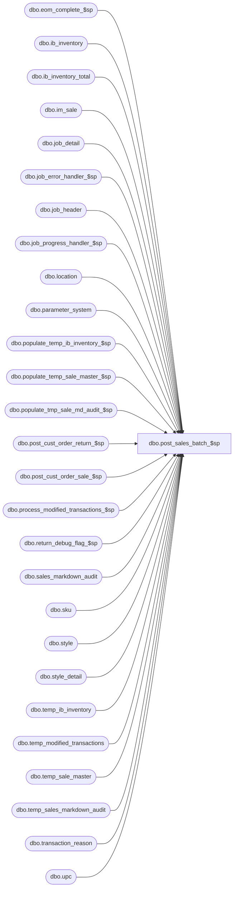

# dbo.post_sales_batch_$sp

**Database:** me_01  
**Server:** bedrockdb02  

## Architecture Diagram



## Table Dependencies

| Referenced Table |
|---|
| dbo.eom_complete_$sp |
| dbo.ib_inventory |
| dbo.ib_inventory_total |
| dbo.im_sale |
| dbo.job_detail |
| dbo.job_error_handler_$sp |
| dbo.job_header |
| dbo.job_progress_handler_$sp |
| dbo.location |
| dbo.parameter_system |
| dbo.populate_temp_ib_inventory_$sp |
| dbo.populate_temp_sale_master_$sp |
| dbo.populate_tmp_sale_md_audit_$sp |
| dbo.post_cust_order_return_$sp |
| dbo.post_cust_order_sale_$sp |
| dbo.process_modified_transactions_$sp |
| dbo.return_debug_flag_$sp |
| dbo.sales_markdown_audit |
| dbo.sku |
| dbo.style |
| dbo.style_detail |
| dbo.temp_ib_inventory |
| dbo.temp_modified_transactions |
| dbo.temp_sale_master |
| dbo.temp_sales_markdown_audit |
| dbo.transaction_reason |
| dbo.upc |

## Stored Procedure Code

```sql
CREATE PROCEDURE [dbo].[post_sales_batch_$sp]
	(@job_id INT)

AS

/*
	Version		: 1.00
	Created		: 2007/04/24
	Created by	: Pierrette Lemay
	Description	: This procedure is part of the Sales Posting process and is called after populate_job_header_$sp.
			  It executes the posting for each job that are incomplete in the job_header table.
			  It's launched by a .NET application that manages the execution of many instances in parallel.

	History: 1.01 Updated for Enterprise Selling (July 2009)
			 1.02 Modified: April 2010 Code was added in order to process the transactions the were modified through the SA GUI.
			 1.03 Modified Sept 2010 Make the discount is part of temp_modified_transactions when credit_originating_store is set to 1.
			 1.04 Modified Sept 2010 defect 121108 Add another DELETE for im_sale when credit_originating_store = 1 (line 37).
			 1.05 Modified June 2011 defect #127741 & 127742: Remove step #5 from this procedure, it's going to be done once all threads completed.
			 1.06 Modified December 2012 Defect #1-49UYYH: add support for POS Customer Order Sale transaction.
			 1.07 Modified March 10 2014 Defect ib/pcm: back dated sales will cause incorrect on hand price status

9/30/2015	Ivan Dimitrov		143201 - Sale-customer order transaction 605 does not pick the cost from the virtual transfer when calculating average cost

*/

BEGIN
	DECLARE @line_id SMALLINT, @count INT, @job_type TINYINT, @proc_name NVARCHAR(30), @sql_err_num DECIMAL(38,0),
			@table_name NVARCHAR(30), @operation_name NVARCHAR(30), @error_msg NVARCHAR(2000), @activity_date_step SMALLINT,
			@range_start DECIMAL(24,0), @range_end DECIMAL(24,0), @batch_start SMALLINT, @batch_end SMALLINT,
			@inventory_step TINYINT, @sales_md_audit_step TINYINT, @upc_step TINYINT, @style_detail_step TINYINT,
			@debug_flag BIT, @c_true BIT, @c_false BIT, @n_retry tinyint, @delay NCHAR(8), @return_flag BIT, @is_ES_installed BIT,
			@transaction_count INT, @is_EOM_installed BIT

	SELECT   @job_type	= 1
		, @proc_name	= N'post_sales_batch_$sp'
		, @c_false		= 0
		, @c_true		= 1
		, @inventory_step	= 1
		, @sales_md_audit_step	= 2
		, @upc_step		= 3
		, @style_detail_step	= 4
		, @activity_date_step	= 5
		, @n_retry		= 0
		, @delay	= N'00:00:05'
		, @is_ES_installed = installed_es_flag
		, @is_EOM_installed = installed_eom_flag
	FROM parameter_system


	BEGIN TRY

		-- GetJobs parameters
		SET @line_id	= 10

		SELECT @range_start	= range_start
			, @range_end	= range_end
			, @batch_start	= batch_start
			, @batch_end	= batch_end
			, @debug_flag	= debug_flag
		FROM job_header
		WHERE job_id = @job_id
		AND job_type = @job_type

		IF @@ROWCOUNT = 0
			RAISERROR (N'Error: job #%i is missing in the job_header table.', -- Message text.
               16, -- Severity.
               1, -- State.
               @job_id)

		-- Log progress if job_params.debug_flag is true OR job_header.debug_flag is true
		EXEC return_debug_flag_$sp @job_type, @return_flag OUT
		IF (@return_flag = @c_true OR @debug_flag = @c_true)
			EXEC job_progress_handler_$sp @job_type, @job_id, @proc_name, @line_id

		SET @line_id	= 20
		-- Set start_time for the current job
		BEGIN TRANSACTION

		UPDATE job_header
		SET start_time = GETDATE()
		WHERE job_id = @job_id
		AND job_type = @job_type

		IF @@ROWCOUNT = 0
			RAISERROR (N'Error: unable to set the start_time for job #%i.', -- Message text.
					16, -- Severity.
					1, -- State.
					@job_id)

		COMMIT TRANSACTION

		-- Log progress if job_params.debug_flag is true OR job_header.debug_flag is true
		EXEC return_debug_flag_$sp @job_type, @return_flag OUT
		IF (@return_flag = @c_true OR @debug_flag = @c_true)
			EXEC job_progress_handler_$sp @job_type, @job_id, @proc_name, @line_id

		SET @line_id	= 30
		-- Validate data: sku, style, location, transaction reason
		-- sku
		SELECT @count = COUNT(*)
		FROM im_sale i
		WHERE i.im_sale_number BETWEEN @range_start AND @range_end
		AND   i.location_id BETWEEN @batch_start AND @batch_end
		AND   NOT EXISTS (SELECT 1 FROM sku s WHERE s.sku_id = i.sku_id)

		IF @count > 0
			RAISERROR (N'Error: Job #%i contains invalid sku(s).', -- Message text.
               16, -- Severity.
               1, -- State.
           @job_id)

		-- style
		SELECT @count = COUNT(*)
		FROM im_sale i, style s
		WHERE i.im_sale_number BETWEEN @range_start AND @range_end
		AND   i.location_id BETWEEN @batch_start AND @batch_end
		AND   i.style_id = s.style_id
		AND   s.style_status < 3

		IF @count > 0
			RAISERROR (N'Error: Job #%i contains invalid style(s).', -- Message text.
               16, -- Severity.
               1, -- State.
               @job_id)

		-- location
		SELECT @count = COUNT(*)
		FROM im_sale i
		WHERE i.im_sale_number BETWEEN @range_start AND @range_end
		AND   i.location_id BETWEEN @batch_start AND @batch_end
		AND   NOT EXISTS (SELECT 1 FROM location l WHERE i.location_id = l.location_id)

		IF @count > 0
			RAISERROR (N'Error: Job #%i contains invalid location(s).', -- Message text.
               16, -- Severity.
               1, -- State.
               @job_id)

		-- transaction reason
		SELECT TOP (1)
			@count = 1
		FROM
			dbo.im_sale i
		WHERE
			i.im_sale_number BETWEEN @range_start AND @range_end
			AND i.location_id BETWEEN @batch_start AND @batch_end
			AND
			(
				(
					i.pos_discount_type_code IS NOT NULL
					AND NOT EXISTS (SELECT * FROM dbo.transaction_reason r WHERE r.transaction_reason_code = CONVERT (NVARCHAR (5), i.pos_discount_type_code))
				)
				OR
				(
					i.aw_reason_code IS NOT NULL
					AND i.aw_transaction_type = 610
					AND NOT EXISTS (SELECT * FROM dbo.transaction_reason r WHERE r.transaction_reason_code = CONVERT (NVARCHAR (5), i.aw_reason_code))
				)
			)

		IF @count > 0
			RAISERROR (N'Error: Job #%i contains invalid transaction reason(s).', -- Message text.
               16, -- Severity.
               1, -- State.
               @job_id)

		-- Log progress if job_params.debug_flag is true OR job_header.debug_flag is true
		EXEC return_debug_flag_$sp @job_type, @return_flag OUT
		IF (@return_flag = @c_true OR @debug_flag = @c_true)
			EXEC job_progress_handler_$sp @job_type, @job_id, @proc_name, @line_id

		SET @line_id	= 35

		-- Clean up the batch by removing transactions that have SUM(sold_at_price) = 0 and SUM(units) = 0 and SUM(pos_discount_amount)
		-- Step #1: INSERT modified transactions into a work table
		IF (@is_ES_installed = 1 OR @is_EOM_installed = 1)
		BEGIN
			INSERT INTO temp_modified_transactions (job_id, sku_id, location_id, transaction_date, transaction_no, total_sold_at_price, batch_no, register_no)
			SELECT @job_id, sku_id, location_id, transaction_date, transaction_no, SUM(units * sold_at_price), @job_id AS batch_no, register AS register_no
			FROM im_sale
			WHERE im_sale_number BETWEEN @range_start AND @range_end
			AND location_id BETWEEN @batch_start AND @batch_end
			AND aw_transaction_type IN (600, 605, 610, 615, 622)
			AND credit_originating_store = 0
			GROUP BY sku_id, location_id, transaction_date, transaction_no, register
			HAVING SUM(units) = 0

			INSERT INTO temp_modified_transactions (job_id, sku_id, location_id, transaction_date, transaction_no, total_sold_at_price, batch_no, register_no)
			SELECT @job_id, sku_id, originating_location_id, transaction_date, transaction_no, SUM(units * sold_at_price), @job_id AS batch_no, register AS register_no
			FROM im_sale
			WHERE im_sale_number BETWEEN @range_start AND @range_end
			AND location_id BETWEEN @batch_start AND @batch_end
			AND aw_transaction_type IN (600, 605, 610, 615, 622)
			AND credit_originating_store = 1
			GROUP BY sku_id, originating_location_id, transaction_date, transaction_no, register
			HAVING SUM(units) = 0
		END
		ELSE
			INSERT INTO temp_modified_transactions (job_id, sku_id, location_id, transaction_date, transaction_no, total_sold_at_price, batch_no, register_no)
			SELECT @job_id, sku_id, location_id, transaction_date, transaction_no, SUM(units * sold_at_price), @job_id AS batch_no, register AS register_no
			FROM im_sale
			WHERE im_sale_number BETWEEN @range_start AND @range_end
			AND location_id BETWEEN @batch_start AND @batch_end
			AND aw_transaction_type IN (600, 605, 610, 615, 622)
			AND credit_originating_store = 0
			GROUP BY sku_id, location_id, transaction_date, transaction_no, register
			HAVING SUM(units) = 0

		-- Log progress if job_params.debug_flag is true OR job_header.debug_flag is true
		EXEC return_debug_flag_$sp @job_type, @return_flag OUT
		IF (@return_flag = @c_true OR @debug_flag = @c_true)
			EXEC job_progress_handler_$sp @job_type, @job_id, @proc_name, @line_id

		SET @line_id = 36
		-- Step #2 Modify temp_modified_transactions, add information related discounts if there is any for the transaction
		UPDATE t
		SET t.pos_discount_type_code = ISNULL(U.pos_discount_type_code, 0),
			t.total_discount = ISNULL(U.total_discount, 0)
		FROM temp_modified_transactions t,
			(SELECT i.sku_id, i.location_id, i.transaction_date, i.transaction_no, i.pos_discount_type_code, SUM(i.pos_discount_amount) total_discount
			FROM im_sale i, temp_modified_transactions t WITH (NOLOCK)
			WHERE i.im_sale_number BETWEEN @range_start AND @range_end
			AND i.location_id BETWEEN @batch_start AND @batch_end
			AND t.job_id = @job_id
			AND i.sku_id = t.sku_id
			AND i.credit_originating_store = 0
			AND i.location_id = t.location_id
			AND i.transaction_date = t.transaction_date
			AND i.transaction_no = t.transaction_no
			AND i.aw_transaction_type IN (601, 603)
			GROUP BY i.sku_id, i.location_id, i.transaction_date, i.transaction_no, i.pos_discount_type_code
			UNION
			SELECT i.sku_id, i.originating_location_id, i.transaction_date, i.transaction_no, i.pos_discount_type_code, SUM(i.pos_discount_amount) total_discount
			FROM im_sale i, temp_modified_transactions t WITH (NOLOCK)
			WHERE i.im_sale_number BETWEEN @range_start AND @range_end
			AND i.location_id BETWEEN @batch_start AND @batch_end
			AND t.job_id = @job_id
			AND i.sku_id = t.sku_id
			AND i.credit_originating_store = 1
			AND i.originating_location_id = t.location_id
			AND i.transaction_date = t.transaction_date
			AND i.transaction_no = t.transaction_no
			AND i.aw_transaction_type IN (603)
			GROUP BY i.sku_id, i.originating_location_id, i.transaction_date, i.transaction_no, i.pos_discount_type_code
			) U
		WHERE t.job_id = @job_id
		AND t.sku_id = U.sku_id
		AND t.location_id = U.location_id
		AND t.transaction_date = U.transaction_date
		AND t.transaction_no = U.transaction_no

		-- Log progress if job_params.debug_flag is true OR job_header.debug_flag is true
		EXEC return_debug_flag_$sp @job_type, @return_flag OUT
		IF (@return_flag = @c_true OR @debug_flag = @c_true)
			EXEC job_progress_handler_$sp @job_type, @job_id, @proc_name, @line_id

		-- Log progress if job_params.debug_flag is true OR job_header.debug_flag is true
		EXEC return_debug_flag_$sp @job_type, @return_flag OUT
		IF (@return_flag = @c_true OR @debug_flag = @c_true)
			EXEC job_progress_handler_$sp @job_type, @job_id, @proc_name, @line_id

		SET @line_id = 38
		-- Step #3 delete transactions in temp_modified_transactions that 0 impact on inventory
		DELETE temp_modified_transactions WHERE job_id = @job_id AND total_sold_at_price = 0 AND (total_discount = 0 OR total_discount IS NULL)

		-- Log progress if job_params.debug_flag is true OR job_header.debug_flag is true
		EXEC return_debug_flag_$sp @job_type, @return_flag OUT
		IF (@return_flag = @c_true OR @debug_flag = @c_true)
			EXEC job_progress_handler_$sp @job_type, @job_id, @proc_name, @line_id

		-- Process the transactions that were modified through the SA GUI : price modifications, or other changes that
		-- result in SUM(units) = 0 but SUM(sold_at_price) <> 0 for transaction's types: 600, 610, 622, 605, 615
		-- OR SUM(pos_discount_amount) <> 0  for transaction's types: 601 and 603.
		-- These transaction don't required pricing information and just need to go to temp_ib_inventory directly.
		-- Call the procedure that will process those modified transactions if there is any.
		SELECT @transaction_count = COUNT(*) FROM temp_modified_transactions start WHERE job_id = @job_id
		IF (@transaction_count > 0)
		BEGIN
			SET @line_id = 39
			EXEC process_modified_transactions_$sp @job_id

			-- Log progress if job_params.debug_flag is true OR job_header.debug_flag is true
			EXEC return_debug_flag_$sp @job_type, @return_flag OUT
			IF (@return_flag = @c_true OR @debug_flag = @c_true)
				EXEC job_progress_handler_$sp @job_type, @job_id, @proc_name, @line_id
		END

		-- Building pricing information for the regular transactions if there is any
		-- Make sure there are still some transactions to process
		SELECT @transaction_count = COUNT(*) FROM im_sale WHERE im_sale_number BETWEEN @range_start AND @range_end AND location_id BETWEEN @batch_start AND @batch_end

		IF (@transaction_count = 0) -- There was only transactions modified through the SA GUI in this batch
		BEGIN
			-- Therefore just f;ag the batch as completed and exit
			UPDATE job_header
			SET completed_flag = 1, end_time  = GETDATE()
			WHERE job_type = @job_type
			AND   job_id = @job_id

			RETURN
		END


		SET @line_id	= 40
		-- Building pricing information

		-- moved table creation here so it outlives populate_temp_sale_master_$sp
		IF OBJECT_ID (N'tempdb..#temp_average_cost', N'U') IS NOT NULL
		BEGIN

			DROP TABLE #temp_average_cost

		END

		CREATE TABLE #temp_average_cost
		(
			 style_id DECIMAL (12, 0) NOT NULL
			,location_id SMALLINT NOT NULL
			,transaction_date SMALLDATETIME NOT NULL
			,average_cost DECIMAL (18, 6) NULL
			,average_cost_local DECIMAL (18, 6) NULL
			,sku_id DECIMAL (13, 0) NULL
			,sum_units int NULL
			,sum_cost DECIMAL (18, 6) NULL
			,sum_cost_local DECIMAL (18, 6) NULL
		)


		EXEC populate_temp_sale_master_$sp @job_id, @range_start, @range_end, @batch_start, @batch_end, @debug_flag

		-- Log progress if job_params.debug_flag is true OR job_header.debug_flag is true
		EXEC return_debug_flag_$sp @job_type, @return_flag OUT
		IF (@return_flag = @c_true OR @debug_flag = @c_true)
			EXEC job_progress_handler_$sp @job_type, @job_id, @proc_name, @line_id

		SET @line_id	= 50

		UPDATE STATISTICS temp_sale_master

		-- Log progress if job_params.debug_flag is true OR job_header.debug_flag is true
		EXEC return_debug_flag_$sp @job_type, @return_flag OUT
		IF (@return_flag = @c_true OR @debug_flag = @c_true)
			EXEC job_progress_handler_$sp @job_type, @job_id, @proc_name, @line_id

		SET @line_id	= 60
		-- Populating temp_ib_inventory
		EXEC populate_temp_ib_inventory_$sp @job_id, @range_start, @range_end, @batch_start, @batch_end, @debug_flag

		-- Log progress if job_params.debug_flag is true OR job_header.debug_flag is true
		EXEC return_debug_flag_$sp @job_type, @return_flag OUT
		IF (@return_flag = @c_true OR @debug_flag = @c_true)
			EXEC job_progress_handler_$sp @job_type, @job_id, @proc_name, @line_id

		-- Defect: 1-49UYYH starts
		--IF (@is_ES_installed = 1) BEGIN ... END removed
		IF EXISTS( SELECT 1 FROM im_sale
				   WHERE im_sale_number BETWEEN @range_start AND @range_end
				   AND location_id BETWEEN @batch_start AND @batch_end
				   AND aw_transaction_type = 605 )
		BEGIN -- Post Cust Order Sale transaction
			SET @line_id = 65
			EXEC post_cust_order_sale_$sp @job_id, @range_start, @range_end, @batch_start, @batch_end, @debug_flag

			-- Log progress if job_params.debug_flag is true OR job_header.debug_flag is true
			EXEC return_debug_flag_$sp @job_type, @return_flag OUT
			IF (@return_flag = @c_true OR @debug_flag = @c_true)
				EXEC job_progress_handler_$sp @job_type, @job_id, @proc_name, @line_id
		END

		IF EXISTS( SELECT 1 FROM im_sale
				   WHERE im_sale_number BETWEEN @range_start AND @range_end
				   AND location_id BETWEEN @batch_start AND @batch_end
				   AND aw_transaction_type = 615 )
		BEGIN -- Post Cust Order Return transaction
			SET @line_id = 66
			EXEC post_cust_order_return_$sp @job_id, @range_start, @range_end, @batch_start, @batch_end, @debug_flag

			-- Log progress if job_params.debug_flag is true OR job_header.debug_flag is true
			EXEC return_debug_flag_$sp @job_type, @return_flag OUT
			IF (@return_flag = @c_true OR @debug_flag = @c_true)
				EXEC job_progress_handler_$sp @job_type, @job_id, @proc_name, @line_id
		END

		SET @line_id = 70
		UPDATE STATISTICS temp_ib_inventory

		-- Log progress if job_params.debug_flag is true OR job_header.debug_flag is true
		EXEC return_debug_flag_$sp @job_type, @return_flag OUT
		IF (@return_flag = @c_true OR @debug_flag = @c_true)
			EXEC job_progress_handler_$sp @job_type, @job_id, @proc_name, @line_id

		SET @line_id = 80
		-- Populating temp_sale_markdown_audit
		EXEC populate_tmp_sale_md_audit_$sp @job_id, @range_start, @range_end, @batch_start, @batch_end, @debug_flag

		-- Log progress if job_params.debug_flag is true OR job_header.debug_flag is true
		EXEC return_debug_flag_$sp @job_type, @return_flag OUT
		IF (@return_flag = @c_true OR @debug_flag = @c_true)
			EXEC job_progress_handler_$sp @job_type, @job_id, @proc_name, @line_id

		SET @line_id = 90

		UPDATE STATISTICS temp_sales_markdown_audit

		-- Log progress if job_params.debug_flag is true OR job_header.debug_flag is true
		EXEC return_debug_flag_$sp @job_type, @return_flag OUT
		IF (@return_flag = @c_true OR @debug_flag = @c_true)
			EXEC job_progress_handler_$sp @job_type, @job_id, @proc_name, @line_id

		-- Do the following SELECT for job re-startability
		SELECT @count = COUNT(*) FROM job_detail WHERE job_id = @job_id

		SELECT @line_id		= 100
			 , @n_retry	= 0

		IF @count = 0 -- INSERT ib_inventory, UPDATE ib_inventory_total and Add a record to job_detail
		BEGIN
			step_1:
			BEGIN TRY
				BEGIN TRAN

				IF OBJECT_ID (N'tempdb.dbo.#eom_reserve_transaction', N'U') IS NOT NULL
				BEGIN

					DROP TABLE dbo.#eom_reserve_transaction

				END

				CREATE TABLE dbo.#eom_reserve_transaction
					(
						transaction_date SMALLDATETIME
						,sku_id DECIMAL(13,0)
						,outlet_code NVARCHAR(20)
						,outlet_id SMALLINT
						,cust_order_no NVARCHAR(20)
						,requested_reserve_quantity INT
						,transaction_type SMALLINT
						,transaction_cancelled BIT
					)

				INSERT INTO dbo.#eom_reserve_transaction
					(
						transaction_date
						,sku_id
						,outlet_code
						,outlet_id
						,cust_order_no
						,requested_reserve_quantity
						,transaction_type
						,transaction_cancelled
					)
				SELECT
					transaction_date
					,sku_id
					,CASE
							WHEN TIB.credit_originating_store = 1
								THEN OL.location_code
							ELSE
								L.location_code
					 END AS outlet_code
					,CASE
							WHEN TIB.credit_originating_store = 1
								THEN TIB.other_location_id
							ELSE
								TIB.location_id
					 END AS outlet_id
					,TIB.document_number AS cust_order_no
					,ABS(TIB.transaction_units) AS requested_reserve_quantity
					,CASE
							WHEN TIB.transaction_units < 0
								THEN 2
							WHEN TIB.transaction_units > 0
								THEN 1
					 END AS transaction_type
					,CASE
							WHEN TIB.transaction_units < 0
								THEN 1
							WHEN TIB.transaction_units > 0
								THEN 0
					 END AS transaction_cancelled
				FROM
					temp_ib_inventory TIB
					INNER JOIN location L ON L.location_id = TIB.location_id
					LEFT OUTER JOIN location OL ON OL.location_id = TIB.other_location_id
				WHERE
					job_id = @job_id
					AND transaction_type_code IN (605, 615)
					AND TIB.transaction_units <> 0

				EXEC dbo.eom_complete_$sp
					@Batch_No = @job_id

				INSERT INTO ib_inventory
						( sku_id
						, location_id
						, price_status_id
						, transaction_date
						, transaction_type_code
						, inventory_status_id
						, other_location_id
						, transaction_reason_id
						, document_number
						, transaction_units
						, transaction_cost
						, transaction_valuation_retail
						, transaction_selling_retail
						, price_change_type
						, units_affected
						, transaction_cost_local
						, transaction_no
						, batch_no
						, register_no
						)
				SELECT    sku_id
						, location_id
						, price_status_id
						, transaction_date
						, transaction_type_code
						, inventory_status_id
						, other_location_id
						, transaction_reason_id
						, document_number
						, transaction_units
						, transaction_cost
						, transaction_valuation_retail
						, transaction_selling_retail
						, price_change_type
						, units_affected
						, transaction_cost_local
						, transaction_no
						, @job_id AS batch_no
						, register_no
				FROM temp_ib_inventory
				WHERE job_id = @job_id

				-- Log progress if job_params.debug_flag is true OR job_header.debug_flag is true
				EXEC return_debug_flag_$sp @job_type, @return_flag OUT
				IF (@return_flag = @c_true OR @debug_flag = @c_true)
					EXEC job_progress_handler_$sp @job_type, @job_id, @proc_name, @line_id

				SET @line_id = 110
				-- Update ib_inventory_total
				UPDATE a
				SET   a.total_on_hand_units = a.total_on_hand_units + B.total_on_hand_units
					, a.total_on_hand_cost	= a.total_on_hand_cost + B.total_on_hand_cost
					, a.total_on_hand_valuation_retail = a.total_on_hand_valuation_retail + B.total_on_hand_valuation_retail
					, a.total_on_hand_selling_retail = a.total_on_hand_selling_retail + B.total_on_hand_selling_retail
					, a.total_on_hand_cost_local = a.total_on_hand_cost_local + B.total_on_hand_cost_local
				FROM ib_inventory_total a
					JOIN (SELECT
							T.sku_id sku_id
							, T.location_id	location_id
							, T.inventory_status_id	inventory_status_id
							, M2.price_status_id price_status_id
							, T.total_on_hand_units	total_on_hand_units
							, T.total_on_hand_cost total_on_hand_cost
							, T.total_on_hand_valuation_retail total_on_hand_valuation_retail
							, T.total_on_hand_selling_retail total_on_hand_selling_retail
							, T.total_on_hand_cost_local total_on_hand_cost_local
						FROM
							( SELECT
								sku_id, location_id
								, inventory_status_id
								, SUM(transaction_units) total_on_hand_units
								, SUM(transaction_cost) total_on_hand_cost
								, SUM(transaction_valuation_retail) total_on_hand_valuation_retail
								, SUM(transaction_selling_retail) total_on_hand_selling_retail
								, SUM(transaction_cost_local) total_on_hand_cost_local
							  FROM temp_ib_inventory
							  WHERE job_id = @job_id
							  GROUP BY sku_id, location_id, inventory_status_id ) T
						JOIN (
							SELECT M.sku_id, M.location_id, tsm.price_status_id
							FROM temp_sale_master tsm
							JOIN (
								SELECT sku_id, location_id, MAX(transaction_date) transaction_date
		  						FROM temp_sale_master
		  						WHERE job_id = @job_id
		  						GROUP BY sku_id, location_id
								  ) M
								  ON M.sku_id = tsm.sku_id
		   						   AND M.location_id = tsm.location_id
		   						   AND M.transaction_date = tsm.transaction_date
							WHERE tsm.job_id = @job_id
							 ) M2
							 ON M2.sku_id = T.sku_id
								AND M2.location_id = T.location_id) B
						ON  a.sku_id		= B.sku_id
						AND a.location_id	= B.location_id
						AND a.inventory_status_id = B.inventory_status_id

				-- Log progress if job_params.debug_flag is true OR job_header.debug_flag is true
				EXEC return_debug_flag_$sp @job_type, @return_flag OUT
				IF (@return_flag = @c_true OR @debug_flag = @c_true)
					EXEC job_progress_handler_$sp @job_type, @job_id, @proc_name, @line_id

				SET @line_id = 120
				-- Insert new rows in ib_inventory_total
				INSERT INTO ib_inventory_total
						(sku_id
						, location_id
						, inventory_status_id
						, price_status_id
						, total_on_hand_units
						, total_on_hand_cost
						, total_on_hand_valuation_retail
						, total_on_hand_selling_retail
						, total_on_hand_cost_local)
				SELECT
						T.sku_id
						, T.location_id
						, T.inventory_status_id
						, M2.price_status_id
						, T.total_on_hand_units
						, T.total_on_hand_cost
						, T.total_on_hand_valuation_retail
						, T.total_on_hand_selling_retail
						, T.total_on_hand_cost_local
				FROM
						( SELECT
							sku_id, location_id
							, inventory_status_id
							, SUM(transaction_units) total_on_hand_units
							, SUM(transaction_cost) total_on_hand_cost
							, SUM(transaction_valuation_retail) total_on_hand_valuation_retail
							, SUM(transaction_selling_retail) total_on_hand_selling_retail
							, SUM(transaction_cost_local) total_on_hand_cost_local
						  FROM temp_ib_inventory
						  WHERE job_id = @job_id
						  GROUP BY sku_id, location_id, inventory_status_id ) T
						  JOIN ( SELECT M.sku_id, M.location_id, tsm.price_status_id
								 FROM temp_sale_master tsm
								 JOIN ( SELECT sku_id, location_id, MAX(transaction_date) transaction_date
  										FROM temp_sale_master
  										WHERE job_id = @job_id
  										GROUP BY sku_id, location_id
										) M
									  ON M.sku_id = tsm.sku_id
   									  AND M.location_id = tsm.location_id
   									  AND M.transaction_date = tsm.transaction_date
								  WHERE tsm.job_id = @job_id
								) M2
							ON M2.sku_id = T.sku_id
							AND M2.location_id = T.location_id
				WHERE NOT EXISTS (SELECT 1 FROM ib_inventory_total i
								  WHERE i.sku_id = T.sku_id
								  AND   i.location_id = T.location_id
								  AND   i.inventory_status_id = T.inventory_status_id)

				-- Keep track of this job_step completed in job_detail
				INSERT INTO job_detail
					 (job_id, job_step_id, time_stamp)
				VALUES (@job_id, @inventory_step, GETDATE())

				COMMIT TRAN

				-- Log progress if job_params.debug_flag is true OR job_header.debug_flag is true
				EXEC return_debug_flag_$sp @job_type, @return_flag OUT
				IF (@return_flag = @c_true OR @debug_flag = @c_true)
					EXEC job_progress_handler_$sp @job_type, @job_id, @proc_name, @line_id

			END TRY-- INSERT ib_inventory, UPDATE ib_inventory_total, INSERT job_step_id 1 in job_detail COMPLETED
			BEGIN CATCH
				-- Test if the transaction is uncommittable
				IF (XACT_STATE()) = -1
					ROLLBACK TRANSACTION
				-- Test if the transaction is active and valid.
				IF (XACT_STATE()) = 1
					COMMIT TRANSACTION

				SET @n_retry = @n_retry + 1

				IF @n_retry <= 3
				BEGIN
					WAITFOR DELAY @delay
					GOTO step_1
				END
				ELSE
				RAISERROR (N'in the first step of job #%i after 3 retry because of ', -- Message text.
							16, -- Severity.
							1, -- State.
							@job_id)

			END CATCH
		END -- step_1

		SELECT @line_id	= 130
				, @n_retry	= 0

		IF @count <= 1
		BEGIN
			-- INSERT INTO sales_markdown_audit and Add a record to job_detail
			step_2:
			BEGIN TRY
				BEGIN TRAN

				INSERT INTO sales_markdown_audit
						   (transaction_no
						   ,register
						   ,location_id
						   ,upc_number
						   ,sku_id
						   ,style_id
						   ,color_id
						   ,transaction_date
						   ,transaction_line
						   ,transaction_type
						   ,units_affected
						   ,sold_price_valuation
						   ,sold_price_selling
						   ,pos_md_variance_valuation
						   ,pos_md_variance_selling
						   ,pos_md_override_valuation
						   ,pos_md_override_selling
						   ,pos_discount_amount_valuation
						   ,pos_discount_amount_selling
						   ,promo_md_valuation
						   ,promo_md_selling
						   ,tax_amount_valuation
						   ,tax_amount_selling
						   ,exchange_rate_difference)
					SELECT transaction_no
							, register
							, location_id
							, upc_number
							, sku_id
							, style_id
							, color_id
							, transaction_date
							, transaction_line
							, transaction_type
							, units_affected
							, sold_price_valuation
							, sold_price_selling
							, pos_md_variance_valuation
							, pos_md_variance_selling
							, pos_md_override_valuation
							, pos_md_override_selling
							, pos_discount_amount_valuation
							, pos_discount_amount_selling
							, promo_md_valuation
							, promo_md_selling
							, tax_amount_valuation
							, tax_amount_selling
							, exchange_rate_difference
					FROM temp_sales_markdown_audit
					WHERE job_id = @job_id

					-- Keep track of this job_step completed in job_detail
					INSERT INTO job_detail
						 (job_id, job_step_id, time_stamp)
					VALUES (@job_id, @sales_md_audit_step, GETDATE())

				COMMIT TRAN

				-- Log progress if job_params.debug_flag is true OR job_header.debug_flag is true
				EXEC return_debug_flag_$sp @job_type, @return_flag OUT
				IF (@return_flag = @c_true OR @debug_flag = @c_true)
					EXEC job_progress_handler_$sp @job_type, @job_id, @proc_name, @line_id

			END TRY
			BEGIN CATCH
				-- Test if the transaction is uncommittable
				IF (XACT_STATE()) = -1
					ROLLBACK TRANSACTION
				-- Test if the transaction is active and valid.
				IF (XACT_STATE()) = 1
					COMMIT TRANSACTION

				SET @n_retry = @n_retry + 1

				IF @n_retry <= 3
				BEGIN
					WAITFOR DELAY @delay
					GOTO step_2
				END
				ELSE
					RAISERROR (N'in the second step of job #%i after 3 retry because of ', -- Message text.
							16, -- Severity.
							1, -- State.
							@job_id)
			END CATCH
		END -- step_2

		SELECT @line_id	= 140
			 , @n_retry	= 0

		IF @count <= 2
		BEGIN
			step_3:
			-- Update upc.last_activity_date and Add a record to job_detail
			BEGIN TRY
				BEGIN TRAN

				UPDATE upc
				SET upc.last_activity_date = T.tran_date
				FROM upc, (SELECT upc_number, MAX(transaction_date) tran_date
							FROM im_sale
							WHERE im_sale_number BETWEEN @range_start AND @range_end
							AND location_id  BETWEEN @batch_start AND @batch_end
							GROUP BY upc_number ) T
				WHERE upc.upc_number = T.upc_number
				AND  upc.last_activity_date < T.tran_date

				-- Keep track of this job_step completed in job_detail
				INSERT INTO job_detail
					 (job_id, job_step_id, time_stamp)
				VALUES (@job_id, @upc_step, GETDATE())

				COMMIT TRAN

				-- Log progress if job_params.debug_flag is true OR job_header.debug_flag is true
				EXEC return_debug_flag_$sp @job_type, @return_flag OUT
				IF (@return_flag = @c_true OR @debug_flag = @c_true)
					EXEC job_progress_handler_$sp @job_type, @job_id, @proc_name, @line_id

			END TRY
			BEGIN CATCH
				-- Test if the transaction is uncommittable
				IF (XACT_STATE()) = -1
					ROLLBACK TRANSACTION
				-- Test if the transaction is active and valid.
				IF (XACT_STATE()) = 1
					COMMIT TRANSACTION

				SET @n_retry = @n_retry + 1

				IF @n_retry <= 3
				BEGIN
					WAITFOR DELAY @delay
					GOTO step_3
				END
				ELSE
					RAISERROR (N'in the third step of job #%i after 3 retry because of ', -- Message text.
							16, -- Severity.
							1, -- State.
							@job_id)
			END CATCH
		END -- step_3

		SELECT @n_retry = 0
				, @line_id = 150

		IF @count <= 3
		BEGIN
			-- UPDATE style_detail.total_inventory_units,  a record to job_detail and set the job as completed
			step_4:
			BEGIN TRY
				BEGIN TRAN

				UPDATE s
				SET s.total_inventory_units = s.total_inventory_units + T.total_inventory_units
				FROM style_detail s, (SELECT sku.style_id
											, ISNULL(SUM(t.transaction_units), 0) total_inventory_units
									  FROM temp_ib_inventory t, sku
									  WHERE t.job_id = @job_id
									  AND   t.location_id BETWEEN @batch_start AND @batch_end
									  AND   t.sku_id = sku.sku_id
									  GROUP BY sku.style_id) T
				WHERE s.style_id = T.style_id

				-- Keep track of this job_step completed in job_detail
				INSERT INTO job_detail
					 (job_id, job_step_id, time_stamp)
				VALUES (@job_id, @style_detail_step, GETDATE())

				COMMIT TRAN

				-- Log progress if job_params.debug_flag is true OR job_header.debug_flag is true
				EXEC return_debug_flag_$sp @job_type, @return_flag OUT
				IF (@return_flag = @c_true OR @debug_flag = @c_true)
					EXEC job_progress_handler_$sp @job_type, @job_id, @proc_name, @line_id

			END TRY
			BEGIN CATCH
				-- Test if the transaction is uncommittable
				IF (XACT_STATE()) = -1
					ROLLBACK TRANSACTION
				-- Test if the transaction is active and valid.
				IF (XACT_STATE()) = 1
					COMMIT TRANSACTION

				SET @n_retry = @n_retry + 1

				IF @n_retry <= 3
				BEGIN
					WAITFOR DELAY @delay
					GOTO step_4
				END
				ELSE
					RAISERROR (N'in the forth step of job #%i after 3 retry because of ', -- Message text.
							16, -- Severity.
							1, -- State.
							@job_id)
			END CATCH
		END -- step_4

		-- The following step is removed from the work that is done by threads in order to avoid deadlocks when
		-- ib_activity_date is updated. Once all the threads complete the execution of procedure:
		-- post_sales_batch_$sp then the .NET component will call procedure complete_sales_posting_$sp which
		-- will consolidate the data of all jobs in a new temporary table and used it to INSERT/UPDATE ib_activity_date
		-- and cleanup im_sale.

		/* SELECT @n_retry = 0
		, @line_id = 160

		IF @count <= 4
		BEGIN
			-- UPDATE ib_activity_date.first/last_sale_date, a record to job_detail and set the job as completed
			step_5:
			BEGIN TRY
				BEGIN TRAN
				-- first UPDATE ib_activity_date.first/last_sale_date WHEN first_sale_date IS NULL
				UPDATE i
				SET i.first_sale_date = T.min_transaction_date,
				    i.last_sale_date  = T.max_transaction_date
				FROM ib_activity_date i,
						( SELECT sku.style_id style_id, style_color.color_id color_id , t.location_id location_id,
							MIN(t.transaction_date) min_transaction_date,
							MAX(t.transaction_date) max_transaction_date
						FROM temp_ib_inventory t, sku, style_color
						WHERE t.job_id = @job_id
						AND   t.location_id BETWEEN @batch_start AND @batch_end
						AND   t.transaction_type_code IN (600, 605, 622)
						AND   t.sku_id = sku.sku_id
						AND sku.style_color_id = style_color.style_color_id
						GROUP BY sku.style_id, style_color.color_id, t.location_id ) T
				WHERE i.style_id = T.style_id
				AND i.color_id   = T.color_id
				AND i.location_id = T.location_id
				AND i.first_sale_date IS NULL

				SET @line_id = 170
				-- second UPDATE ib_activity_date.last_sate_date WHEN first_sale_date IS NOT NULL and last_sale_date < MAX(transaction_date) from temp_ib_inventory
				UPDATE i
				SET i.last_sale_date  = T.transaction_date
				FROM ib_activity_date i, (  SELECT sku.style_id, style_color.color_id, t.location_id,
												   MAX(t.transaction_date) transaction_date
											FROM temp_ib_inventory t, sku, style_color
											WHERE t.job_id = @job_id
											AND   t.transaction_type_code IN (600, 605, 622)
											AND   t.location_id BETWEEN @batch_start AND @batch_end
											AND   t.sku_id = sku.sku_id
											AND sku.style_color_id = style_color.style_color_id
											GROUP BY sku.style_id, style_color.color_id, t.location_id ) T
				WHERE i.style_id = T.style_id
				AND i.color_id   = T.color_id
				AND i.location_id = T.location_id
				AND i.first_sale_date IS NOT NULL
				and i.last_sale_date < T.transaction_date

				SET @line_id = 175
				-- third UPDATE ib_activity_date.first_sale_date WHEN first_sale_date IS NOT NULL and first_sale_date > MIN(transaction_date) from temp_ib_inventory
				UPDATE i
    				SET i.first_sale_date  = T.transaction_date
    				FROM ib_activity_date i,
               				 ( SELECT sku.style_id, style_color.color_id, t.location_id,
                        			MIN(t.transaction_date) transaction_date
                   			FROM temp_ib_inventory t, sku, style_color
                  			WHERE t.job_id = @job_id
                   			AND   t.location_id BETWEEN @batch_start AND @batch_end
                   			AND   t.transaction_type_code IN (600, 605, 622)
                   			AND   t.sku_id = sku.sku_id
                   			AND sku.style_color_id = style_color.style_color_id
                   			GROUP BY sku.style_id, style_color.color_id, t.location_id ) T
    				WHERE i.style_id = T.style_id
    				AND i.color_id   = T.color_id
    				AND i.location_id = T.location_id
    				AND i.first_sale_date IS NOT NULL
    				AND i.first_sale_date > T.transaction_date

				SET @line_id = 180
				-- INSERT the row if it doesn't exists
				INSERT INTO ib_activity_date
					( style_id
					 , color_id
					 , location_id
					 , first_sale_date
					 , last_sale_date )
				SELECT sku.style_id
					  , style_color.color_id
					  , t.location_id
					  , MIN(t.transaction_date)
					  , MAX(t.transaction_date)
				FROM temp_ib_inventory t, sku, style_color
				WHERE t.job_id = @job_id
				AND   t.transaction_type_code IN (600, 605, 622)
				AND   t.location_id BETWEEN @batch_start AND @batch_end
				AND   t.sku_id = sku.sku_id
				AND sku.style_color_id = style_color.style_color_id
				AND NOT EXISTS (SELECT 1 FROM ib_activity_date i
								WHERE i.style_id = sku.style_id
								AND i.color_id = style_color.color_id
								AND i.location_id = t.location_id)
				GROUP BY sku.style_id, style_color.color_id, t.location_id

				-- Keep track of this job_step completed in job_detail
				INSERT INTO job_detail
					 (job_id, job_step_id, time_stamp)
				VALUES (@job_id, @activity_date_step, GETDATE())

				-- Signal that the job completed
				UPDATE job_header
				SET completed_flag = 1, end_time  = GETDATE()
				WHERE job_type = @job_type
				AND     job_id = @job_id

				COMMIT TRAN

				-- Log progress if job_params.debug_flag is true OR job_header.debug_flag is true
				EXEC return_debug_flag_$sp @job_type, @return_flag OUT
				IF (@return_flag = @c_true OR @debug_flag = @c_true)
					EXEC job_progress_handler_$sp @job_type, @job_id, @proc_name, @line_id

			END TRY
			BEGIN CATCH
				-- Test if the transaction is uncommittable
				IF (XACT_STATE()) = -1
					ROLLBACK TRANSACTION
				-- Test if the transaction is active and valid.
				IF (XACT_STATE()) = 1
					COMMIT TRANSACTION

				SET @n_retry = @n_retry + 1

				IF @n_retry <= 3
				BEGIN
					WAITFOR DELAY @delay
					GOTO step_5
				END
				ELSE
					RAISERROR (N'in the fifth step of job #%i after 3 retry because of ', -- Message text.
							16, -- Severity.
							1, -- State.
							@job_id)
			END CATCH
		END -- step_5  */
	END TRY

	BEGIN CATCH
		-- Test if the transaction is uncommittable.
		IF (XACT_STATE()) = -1
			ROLLBACK TRANSACTION

		-- Test if the transaction is active and valid.
		IF (XACT_STATE()) = 1
			COMMIT TRANSACTION

		IF @line_id = 10
			SELECT  @table_name			= N'job_header'
					, @operation_name	= N'SELECT'
					, @error_msg		= ERROR_MESSAGE()
					, @sql_err_num		= ERROR_NUMBER()
		ELSE IF @line_id = 20
			SELECT  @table_name			= N'job_header'
					, @operation_name	= N'UPDATE'
					, @error_msg		= ERROR_MESSAGE()
					, @sql_err_num		= ERROR_NUMBER()
		ELSE IF @line_id = 30
			SELECT  @table_name			= N'im_sale'
					, @operation_name	= N'SELECT'
					, @sql_err_num		= ERROR_NUMBER()
					, @error_msg		= N'Error: failed doing validation : ' + ERROR_MESSAGE()
		ELSE IF @line_id = 35
			SELECT  @table_name			= N'temp_modified_transactions'
					, @operation_name	= N'INSERT'
					, @sql_err_num		= ERROR_NUMBER()
					, @error_msg		= ERROR_MESSAGE()
		ELSE IF @line_id = 36
			SELECT  @table_name			= N'temp_modified_transactions'
					, @operation_name	= N'UPDATE'
					, @sql_err_num		= ERROR_NUMBER()
					, @error_msg		= ERROR_MESSAGE()
		ELSE IF @line_id = 37
			SELECT  @table_name			= N'im_sale'
					, @operation_name	= N'DELETE'
					, @sql_err_num		= ERROR_NUMBER()
					, @error_msg		= ERROR_MESSAGE()
		ELSE IF @line_id = 38
			SELECT  @table_name			= N'temp_modified_transactions'
					, @operation_name	= N'DELETE'
					, @sql_err_num		= ERROR_NUMBER()
					, @error_msg		= ERROR_MESSAGE()
		ELSE IF @line_id = 39
			SELECT  @table_name			= N'process_modified_transactions_$sp'
					, @operation_name	= N'EXEC'
					, @sql_err_num		= ERROR_NUMBER()
					, @error_msg		= ERROR_MESSAGE()
		ELSE IF @line_id = 40
			SELECT  @table_name			= N'populate_temp_sale_master'
					, @operation_name	= N'EXECUTE'
					, @sql_err_num		= ERROR_NUMBER()
					, @error_msg		= N'Error: failed to execute procedure populate_temp_sale_master: ' + ERROR_MESSAGE()
		ELSE IF @line_id = 50
			SELECT  @table_name			= N'temp_sale_master'
					, @operation_name	= N'UPDATE STATISTICS'
					, @sql_err_num		= ERROR_NUMBER()
					, @error_msg		= N'Error: failed to update statistics on table temp_sale_master: ' + ERROR_MESSAGE()
		ELSE IF @line_id BETWEEN 60 AND 69
			SELECT  @table_name			= N'populate_temp_ib_inventory'
					, @operation_name	= N'EXECUTE PROCEDURE'
					, @sql_err_num		= ERROR_NUMBER()
					, @error_msg		= N'Error: failed to execute procedure populate_temp_ib_inventory: ' + ERROR_MESSAGE()
		ELSE IF @line_id = 70
			SELECT  @table_name			= N'temp_ib_inventory'
					, @operation_name	= N'UPDATE STATISTICS'
					, @sql_err_num		= ERROR_NUMBER()
					, @error_msg		= N'Error: failed to update statistics on table temp_ib_inventory: ' + ERROR_MESSAGE()
		ELSE IF @line_id = 80
			SELECT  @table_name			= N'populate_temp_sale_md_audit'
					, @operation_name	= N'EXECUTE PROCEDURE'
					, @sql_err_num		= ERROR_NUMBER()
					, @error_msg		= N'Error: failed to execute procedure populate_temp_sale_md_audit: ' + ERROR_MESSAGE()
		ELSE IF @line_id = 90
			SELECT  @table_name			= N'temp_sales_markdown_audit'
					, @operation_name	= N'UPDATE STATISTICS'
					, @sql_err_num		= ERROR_NUMBER()
					, @error_msg		= N'Error: failed to update statistics on table temp_sales_markdown_audit: ' + ERROR_MESSAGE()
		ELSE IF @line_id = 100
			SELECT  @table_name			= N'ib_inventory'
					, @operation_name	= N'INSERT'
					, @sql_err_num		= ERROR_NUMBER()
					, @error_msg		= N'Error: failed to insert into ib_inventory: ' + @error_msg + ERROR_MESSAGE()
		ELSE IF @line_id = 110
			SELECT  @table_name			= N'ib_inventory_total'
					, @operation_name	= N'UPDATE'
					, @sql_err_num		= ERROR_NUMBER()
					, @error_msg		= N'Error: failed to update ib_inventory_total: ' + @error_msg + ERROR_MESSAGE()
		ELSE IF @line_id = 120
			SELECT  @table_name			= N'ib_inventory_total'
					, @operation_name	= N'INSERT'
					, @sql_err_num		= ERROR_NUMBER()
					, @error_msg		= N'Error: failed to insert into ib_inventory_total: ' + @error_msg + ERROR_MESSAGE()
		ELSE IF @line_id = 130
			SELECT  @table_name			= N'sales_markdown_audit'
					, @operation_name	= N'INSERT'
					, @sql_err_num		= ERROR_NUMBER()
					, @error_msg		= N'Error: failed to insert into sales_markdown_audit: ' + @error_msg + ERROR_MESSAGE()
		ELSE IF @line_id = 140
			SELECT  @table_name			= N'upc'
					, @operation_name	= N'UPDATE'
					, @sql_err_num		= ERROR_NUMBER()
					, @error_msg		= N'Error: failed to update upc: ' + @error_msg + ERROR_MESSAGE()
		ELSE IF @line_id = 150
			SELECT  @table_name			= N'style_detail'
					, @operation_name	= N'UPDATE'
					, @sql_err_num		= ERROR_NUMBER()
					, @error_msg		= N'Error: failed to update style_detail: ' + @error_msg + ERROR_MESSAGE()
		/* ELSE IF @line_id >= 160
			SELECT  @table_name			= N'ib_activity_date'
					, @operation_name	= N'UPDATE'
					, @sql_err_num		= ERROR_NUMBER()
					, @error_msg		= N'Error: failed to update ib_activity_date: ' + @error_msg + ERROR_MESSAGE() */

		EXEC job_error_handler_$sp
					@job_type
					, @job_id
					, @proc_name
					, @line_id
					, @sql_err_num
					, @table_name
					, @operation_name
					, @error_msg
					, @c_false

	END CATCH
END
```

