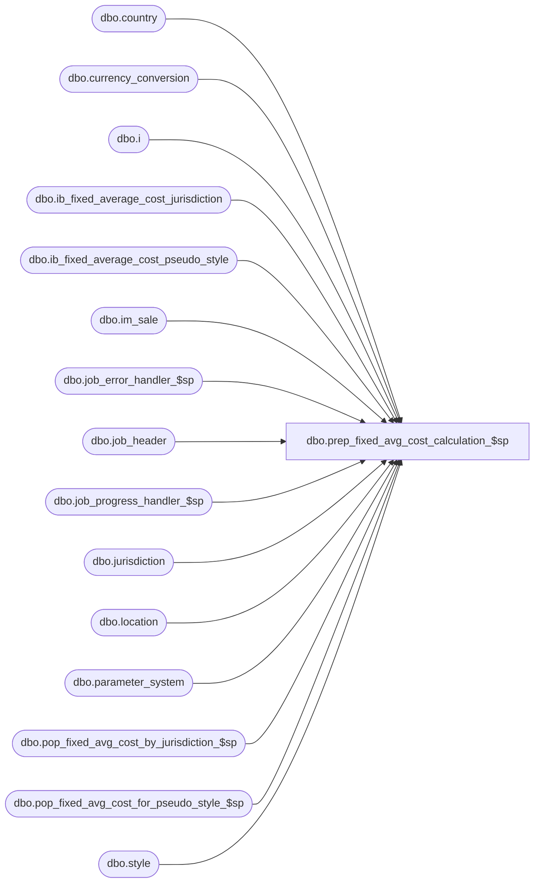

# dbo.prep_fixed_avg_cost_calculation_$sp

**Database:** me_01  
**Server:** bedrockdb02  

## Architecture Diagram



## Table Dependencies

| Referenced Table |
|---|
| dbo.country |
| dbo.currency_conversion |
| dbo.i |
| dbo.ib_fixed_average_cost_jurisdiction |
| dbo.ib_fixed_average_cost_pseudo_style |
| dbo.im_sale |
| dbo.job_error_handler_$sp |
| dbo.job_header |
| dbo.job_progress_handler_$sp |
| dbo.jurisdiction |
| dbo.location |
| dbo.parameter_system |
| dbo.pop_fixed_avg_cost_by_jurisdiction_$sp |
| dbo.pop_fixed_avg_cost_for_pseudo_style_$sp |
| dbo.style |

## Stored Procedure Code

```sql
CREATE PROCEDURE [dbo].[prep_fixed_avg_cost_calculation_$sp]
  (@debug_flag bit)
AS

/*
  Version		: 1.05
  Created		: 2007/04/24
  Created by	: Pierrette Lemay
  Description	: This procedure is part of the Sale Posting and is called either from populate_im_sale_from_SA_$sp or from populate_im_sale_from_file_$sp.
        It is only called when parameter_system.ib_average_cost_type is set to 'F'.
        It prepares the work for doing the calculation of average cost when parameter_system.ib_average_cost_location_level is set to chain (2)
        or to jurisdiction (3). This work id done before the work by threads (or job_id) in order to minimize the time the table
        ib_fixed_average_cost_jurisdiction is locked.
  History		:

*/
BEGIN
  DECLARE @line_id SMALLINT, @job_type INT, @job_id SMALLINT, @c_true BIT, @c_false BIT, @table_name	NVARCHAR(30), @operation_name NVARCHAR(30),
    @sql_err_num DECIMAL(38,0), @error_msg NVARCHAR(4000), @range_start DECIMAL(24,0), @range_end DECIMAL(24,0), @crs_job_flag BIT,
    @batch_start SMALLINT, @batch_end SMALLINT, @is_locked BIT, @delay NCHAR(8), @done BIT, @status INT, @n_retry TINYINT,
    @avg_cost_level TINYINT, @c_avg_cost_by_chain TINYINT, @proc_name NVARCHAR(30), @avg_cost_param TINYINT, @c_avg_cost_by_jurisdiction TINYINT,
    @style_count SMALLINT;

  IF NOT object_id(N'tempdb..#temp_item_retail_price') IS NULL
    DROP TABLE #temp_item_retail_price;

  CREATE TABLE #temp_item_retail_price
    ( style_id decimal(12,0) NOT NULL,
    style_type tinyint NOT NULL,
    location_id smallint NOT NULL,
    jurisdiction_id smallint NOT NULL,
    transaction_date smalldatetime NOT NULL,
    cost_rate float NULL,
    total_sold_at_price decimal(16,4) NOT NULL,
    total_units int NOT NULL);

  IF NOT object_id(N'tempdb..#temp_fixed_average_cost') IS NULL
    DROP TABLE #temp_fixed_average_cost;

  CREATE TABLE #temp_fixed_average_cost
    ( style_id DECIMAL(12,0) NOT NULL
    , jurisdiction_id SMALLINT NOT NULL
    , transaction_date SMALLDATETIME NOT NULL
    , cost_rate float NULL
    , avg_tot_val_retail_sold DECIMAL(16,4) NULL
    , avg_tot_selling_retail_sold DECIMAL(16,4) NULL);

  IF NOT object_id(N'tempdb..#temp_avg_cost_pseudo_style') IS NULL
    DROP TABLE #temp_avg_cost_pseudo_style;

  CREATE TABLE #temp_avg_cost_pseudo_style
    ( style_id DECIMAL(12,0) NOT NULL
    , location_id SMALLINT NOT NULL
    , transaction_date SMALLDATETIME NOT NULL
    , avg_tot_val_retail_sold DECIMAL(16,4) NULL
    , avg_tot_selling_retail_sold DECIMAL(16,4) NULL);

  SELECT @line_id = 10,
    @job_type = 1,
    @job_id = -1,
    @proc_name = N'prep_fixed_avg_cost_calculation_$sp',
    @crs_job_flag = 0,
    @range_start = 0,
    @range_end = 0,
    @batch_start = 0,
    @batch_end = 0,
    @done = 0,
    @status = 0,
    @c_avg_cost_by_chain = 2,
    @avg_cost_level = ib_average_cost_location_level
  FROM parameter_system;

  BEGIN TRY
    DECLARE crs_job CURSOR FOR
    SELECT range_start, range_end, batch_start, batch_end
    FROM job_header
    WHERE job_type = @job_type
    AND completed_flag = 0
    ORDER BY range_start, batch_start;

    -- Log progress if job_params.debug_flag is true OR job_header.debug_flag is true
    EXEC job_progress_handler_$sp @job_type, @job_id, @proc_name, @line_id, @debug_flag;

    OPEN crs_job;
    SET @crs_job_flag = 1;

    FETCH NEXT FROM crs_job INTO @range_start, @range_end, @batch_start, @batch_end

    WHILE @@FETCH_STATUS = 0
    BEGIN
      SET @line_id = 20;

      -- populated #temp_item_retail_price for transactions to apply to im_sale.location_id
      INSERT INTO #temp_item_retail_price
        (style_id, style_type, location_id, jurisdiction_id, transaction_date, total_sold_at_price, total_units)
      SELECT s.style_id, s.style_type, i.location_id, l.jurisdiction_id, i.transaction_date,
        SUM(i.sold_at_price * i.units) total_sold_at_price, SUM(units) total_units
      FROM im_sale i, style s, location l
      WHERE i.im_sale_number BETWEEN @range_start AND @range_end
      AND i.location_id BETWEEN @batch_start AND @batch_end
      AND i.aw_transaction_type IN(600, 605, 610, 615, 620, 621, 622) -- Don't sum the discounts
      AND i.style_id = s.style_id
      AND i.location_id = l.location_id
      GROUP BY s.style_id, s.style_type, i.location_id, l.jurisdiction_id, i.transaction_date
      HAVING SUM(units) <> 0;

      -- populate #temp_item_retail_price for Customer Order transactions where credit_originating_store is ON
      -- For ES pseudo styles is not supported so it is safe to allow SUM(units) = 0
      INSERT INTO #temp_item_retail_price
        (style_id, style_type, location_id, jurisdiction_id, transaction_date, total_sold_at_price, total_units)
      SELECT s.style_id, s.style_type, i.originating_location_id, l.jurisdiction_id, i.transaction_date,
        SUM(i.sold_at_price * i.units) total_sold_at_price, SUM(units) total_units
      FROM im_sale i, style s, location l
      WHERE i.im_sale_number BETWEEN @range_start AND @range_end
      AND i.location_id BETWEEN @batch_start AND @batch_end
      AND i.aw_transaction_type IN (605, 615)
      AND i.credit_originating_store = 1
      AND i.style_id = s.style_id
      AND i.originating_location_id = l.location_id
      GROUP BY s.style_id, s.style_type, i.originating_location_id, l.jurisdiction_id, i.transaction_date
      HAVING SUM(units) <> 0;

      -- If sku_id was modified in SA GUI then I might have SUM(units) = 0 but for 2 skus that belong to the same style_id/location_id/transaction_date
      -- this is the case then I need to get retail information only for one of them because the retail information is the same for these transactions
      INSERT INTO #temp_item_retail_price
        (style_id, style_type, location_id, jurisdiction_id, transaction_date, total_sold_at_price, total_units)
      SELECT i.style_id, s.style_type, i.location_id, l.jurisdiction_id, i.transaction_date,
        SUM(i.sold_at_price * i.units) total_sold_at_price, SUM(units)
      FROM im_sale i, style s, location l, ( SELECT s.style_id, s.location_id, s.transaction_date, SUM(units) total_units
                          FROM im_sale s WITH (NOLOCK)
                          WHERE s.im_sale_number BETWEEN @range_start AND @range_end
                          AND s.location_id BETWEEN @batch_start AND @batch_end
                          AND s.aw_transaction_type NOT IN(601, 603) -- Don't sum the discounts
                          AND s.style_id = s.style_id
                          GROUP BY s.style_id, s.location_id, s.transaction_date
                          HAVING SUM(units) = 0) T
      WHERE i.im_sale_number BETWEEN @range_start AND @range_end
      AND i.location_id BETWEEN @batch_start AND @batch_end
      AND i.style_id = T.style_id
      AND T.style_id = s.style_id
      AND i.location_id = T.location_id
      AND T.location_id = l.location_id
      AND i.transaction_date = T.transaction_date
      AND i.units > 0
      GROUP BY i.style_id, s.style_type, i.location_id, l.jurisdiction_id, i.transaction_date;

      -- Log progress if job_params.debug_flag is true OR job_header.debug_flag is true
      EXEC job_progress_handler_$sp @job_type, @job_id, @proc_name, @line_id, @debug_flag;

      SET @line_id = 30
      -- Load #temp_fixed_average_cost for regular styles
      IF (@avg_cost_level = @c_avg_cost_by_chain)
        INSERT INTO #temp_fixed_average_cost
          (style_id, jurisdiction_id, transaction_date)
        SELECT DISTINCT t.style_id, j.jurisdiction_id, t.transaction_date
        FROM #temp_item_retail_price t, jurisdiction j
        WHERE t.style_type = 1
        AND NOT EXISTS (SELECT 1 FROM ib_fixed_average_cost_jurisdiction i
                  WHERE i.style_id = t.style_id
                  AND i.jurisdiction_id = j.jurisdiction_id
                  AND i.transaction_date = t.transaction_date);
      ELSE
        -- Load #temp_fixed_average_cost AND @avg_cost_param = @c_avg_cost_by_jurisdicton
        INSERT INTO #temp_fixed_average_cost
          (style_id, jurisdiction_id, transaction_date)
        SELECT DISTINCT style_id, jurisdiction_id, transaction_date
        FROM #temp_item_retail_price t
        WHERE t.style_type = 1
        AND NOT EXISTS (SELECT 1 FROM ib_fixed_average_cost_jurisdiction i
                  WHERE i.style_id = t.style_id
                  AND i.jurisdiction_id = t.jurisdiction_id
                  AND i.transaction_date = t.transaction_date);

      -- Update cost rate for the jurisdiction we are interested in
      UPDATE i
      SET cost_rate = cc.exchange_rate
      FROM #temp_fixed_average_cost i, jurisdiction j, country co, currency_conversion cc
      WHERE i.jurisdiction_id = j.jurisdiction_id
      AND j.country_id = co.country_id
      AND co.currency_id = cc.to_currency_id
      AND cc.currency_conversion_type = 1
      AND cc.effective_from_date <= i.transaction_date
      AND (cc.effective_to_date >= i.transaction_date
        OR cc.effective_to_date IS NULL);

      -- Log progress if job_params.debug_flag is true OR job_header.debug_flag is true
      EXEC job_progress_handler_$sp @job_type, @job_id, @proc_name, @line_id, @debug_flag;

      -- For pseudo style
      IF EXISTS(SELECT 1 FROM #temp_item_retail_price WHERE style_type = 2)
      BEGIN
        SET @line_id = 40;

        INSERT INTO #temp_avg_cost_pseudo_style
          ( style_id, location_id, transaction_date, avg_tot_val_retail_sold, avg_tot_selling_retail_sold)
        SELECT t.style_id, t.location_id, t.transaction_date,
          (t.total_sold_at_price/t.total_units) * cc.exchange_rate avg_tot_val_retail_sold,
          (t.total_sold_at_price/t.total_units) avg_tot_selling_retail_sold
        FROM #temp_item_retail_price t, jurisdiction j, country co, currency_conversion cc
        WHERE t.style_type = 2
        AND t.jurisdiction_id = j.jurisdiction_id
        AND j.country_id = co.country_id
        AND co.currency_id = cc.to_currency_id
        AND cc.currency_conversion_type = 2
        AND cc.effective_from_date <= t.transaction_date
        AND (cc.effective_to_date >= t.transaction_date
          OR cc.effective_to_date IS NULL)
        AND NOT EXISTS (SELECT 1 FROM ib_fixed_average_cost_pseudo_style i
                  WHERE i.style_id = t.style_id
                  AND i.location_id = t.location_id
                  AND i.transaction_date = t.transaction_date);

        -- Log progress if job_params.debug_flag is true OR job_header.debug_flag is true
        EXEC job_progress_handler_$sp @job_type, @job_id, @proc_name, @line_id, @debug_flag;
      END

      SELECT @style_count = COUNT(*), @line_id = 50 FROM #temp_fixed_average_cost;

      IF (@style_count > 0)
      BEGIN
        EXEC pop_fixed_avg_cost_by_jurisdiction_$sp N'MERCH', @status OUTPUT;

        IF (@status = 110) -- error occurred
        BEGIN
          SELECT @error_msg = ERROR_MESSAGE();
          RAISERROR (N'Error occurred in procedure pop_fixed_avg_cost_by_jurisdiction_$sp, error message: %s.', -- Message text.
                16, -- Severity.
                1, -- State.
                @error_msg); -- First argument.
        END
        ELSE IF (@status = 0 OR @status = 100)
        BEGIN
          WHILE (@done = 0)
          BEGIN
              -- Wait 5 sec and retry
              WAITFOR DELAY @delay;
              SET @n_retry = @n_retry + 1

              IF @n_retry > 5
              BEGIN
                RAISERROR (N'cannot call procedure pop_fixed_avg_cost_by_jurisdiction_$sp for job #%i after 5 retry. ', -- Message text.
                    16, -- Severity.
                    1, -- State.
                    @job_id);
                BREAK;
              END

              EXEC pop_fixed_avg_cost_by_jurisdiction_$sp N'MERCH', @status OUTPUT;
              IF (@status = 120)
                SET @done = 1;
          END
          -- IF @status returned is 120: average cost  generated successfully
        END
        -- Log progress if job_params.debug_flag is true OR job_header.debug_flag is true
        EXEC job_progress_handler_$sp @job_type, @job_id, @proc_name, @line_id, @debug_flag;
      END

      SELECT @style_count = COUNT(*), @line_id = 60, @done = 0, @status = 0 FROM #temp_avg_cost_pseudo_style;

      IF (@style_count > 0)
      BEGIN
        -- Execute the procedure that will populate ib_fixed_avg_cost_pseudo_style
        EXEC pop_fixed_avg_cost_for_pseudo_style_$sp N'MERCH', @status OUTPUT;

        IF (@status = 110) -- error occurred
        BEGIN
          SELECT @error_msg = ERROR_MESSAGE();
          RAISERROR (N'Error occurred in procedure pop_fixed_avg_cost_for_pseudo_style_$sp, error message: %s.', -- Message text.
                16, -- Severity.
                1, -- State.
                @error_msg); -- First argument.
        END
        ELSE IF (@status = 0 OR @status = 100)
        BEGIN
          WHILE (@done = 0)
          BEGIN
              -- Wait 5 sec and retry
              WAITFOR DELAY @delay;
              SET @n_retry = @n_retry + 1

              IF @n_retry > 5
              BEGIN
                RAISERROR (N'cannot call procedure pop_fixed_avg_cost_for_pseudo_style_$sp for job #%i after 5 retry. ', -- Message text.
                    16, -- Severity.
                    1, -- State.
                    @job_id);
                BREAK;
              END
              EXEC pop_fixed_avg_cost_for_pseudo_style_$sp N'MERCH', @status OUTPUT;

              IF (@status = 120)
                SET @done = 1;
          END
          -- IF @status returned is 120: average cost  generated successfully
        END
        -- Log progress if job_params.debug_flag is true OR job_header.debug_flag is true
        EXEC job_progress_handler_$sp @job_type, @job_id, @proc_name, @line_id, @debug_flag;
      END

      SET @line_id = 70;
      -- At this point there should be a value for each style/location/date associated to this batch
      TRUNCATE TABLE #temp_item_retail_price;
      TRUNCATE TABLE #temp_fixed_average_cost;
      TRUNCATE TABLE #temp_avg_cost_pseudo_style;

      -- Log progress if job_params.debug_flag is true OR job_header.debug_flag is true
      EXEC job_progress_handler_$sp @job_type, @job_id, @proc_name, @line_id, @debug_flag;

      FETCH NEXT FROM crs_job INTO @range_start, @range_end, @batch_start, @batch_end
    END

    CLOSE crs_job;
    DEALLOCATE crs_job;
    SET @crs_job_flag = 0;

  END TRY

  BEGIN CATCH
  -- Test if the transaction is uncommittable.
    IF (@@TRANCOUNT > 0)
      ROLLBACK TRANSACTION

    -- Test if the transaction is active and valid.
    IF (@crs_job_flag = 1)
    BEGIN
      CLOSE crs_job;
      DEALLOCATE crs_job;
    END

    IF @line_id = 10
      SELECT  @table_name			= N'job_header'
          , @operation_name	= N'SELECT'
          , @error_msg		= ERROR_MESSAGE()
          , @sql_err_num		= ERROR_NUMBER();
    ELSE IF @line_id = 20
      SELECT  @table_name			= N'#temp_item_retail_price'
          , @operation_name	= N'INSERT'
          , @error_msg		= ERROR_MESSAGE()
          , @sql_err_num		= ERROR_NUMBER();
    ELSE IF @line_id = 30
      SELECT  @table_name			= N'#temp_fixed_average_cost'
          , @operation_name	= N'INSERT'
          , @error_msg		= ERROR_MESSAGE()
          , @sql_err_num		= ERROR_NUMBER();
    ELSE IF @line_id = 40
      SELECT  @table_name			= N'#temp_avg_cost_pseudo_style'
          , @operation_name	= N'INSERT'
          , @error_msg		= ERROR_MESSAGE()
          , @sql_err_num		= ERROR_NUMBER();
    ELSE IF @line_id = 50
      SELECT  @table_name			= N'pop_fixed_avg_cost_by_jurisdiction_$sp'
          , @operation_name	= N'EXECUTE'
          , @error_msg		= ERROR_MESSAGE()
          , @sql_err_num		= ERROR_NUMBER();
    ELSE IF @line_id = 60
      SELECT  @table_name			= N'pop_fixed_avg_cost_for_pseudo_style_$sp'
          , @operation_name	= N'EXECUTE'
          , @error_msg		= ERROR_MESSAGE()
          , @sql_err_num		= ERROR_NUMBER();
    ELSE IF @line_id = 70
      SELECT  @table_name			= N'#temp_fixed_average_cost'
          , @operation_name	= N'TRUNCATE TABLE'
          , @error_msg		= ERROR_MESSAGE()
          , @sql_err_num		= ERROR_NUMBER();

    EXEC job_error_handler_$sp
          @job_type
          , @job_id
          , @proc_name
          , @line_id
          , @sql_err_num
          , @table_name
          , @operation_name
          , @error_msg
          , @c_true

  END CATCH
END
```

