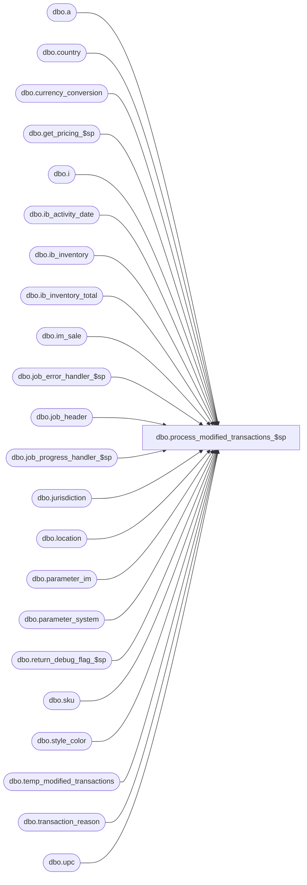

# dbo.process_modified_transactions_$sp

**Database:** me_01  
**Server:** bedrockdb02  

## Architecture Diagram



## Table Dependencies

| Referenced Table |
|---|
| dbo.a |
| dbo.country |
| dbo.currency_conversion |
| dbo.get_pricing_$sp |
| dbo.i |
| dbo.ib_activity_date |
| dbo.ib_inventory |
| dbo.ib_inventory_total |
| dbo.im_sale |
| dbo.job_error_handler_$sp |
| dbo.job_header |
| dbo.job_progress_handler_$sp |
| dbo.jurisdiction |
| dbo.location |
| dbo.parameter_im |
| dbo.parameter_system |
| dbo.return_debug_flag_$sp |
| dbo.sku |
| dbo.style_color |
| dbo.temp_modified_transactions |
| dbo.transaction_reason |
| dbo.upc |

## Stored Procedure Code

```sql
CREATE PROCEDURE [dbo].[process_modified_transactions_$sp]
  (
    @job_id AS INT
  )

AS


SET NOCOUNT ON

/*
Description: This procedure processes transactions that were modified through the SA GUI: price modifications, or other changes that result in SUM (units) = 0
but SUM (sold_at_price) <> 0 for transaction's types: 600, 610, 622, 605, 615.
These transaction don't required pricing information and are posted directly to IB and deleted from im_sale in the same transaction.
Notice that this portion of the code becomes a separate path and the intention is to complete the posting of these transaction beside the normal flow.
To be validated:
  inventory_status_id --> available
  transaction_reason_id --> NULL
  transaction_units = 0
  transaction_cost and transaction_cost_local = 0
  sale_md_audit_flag = 0 --> not part of sales_markdown_audit
*/


-----------------------------------------------------------------------------------------------------------------------------
--	Declarations / Sets: Declare And Set Variables
-----------------------------------------------------------------------------------------------------------------------------

DECLARE
   @activity_date_step AS SMALLINT
  ,@batch_end AS SMALLINT
  ,@batch_start AS SMALLINT
  ,@c_cust_order_disc_type AS SMALLINT
  ,@c_cust_order_return_type AS SMALLINT
  ,@c_cust_order_sale_type AS SMALLINT
  ,@c_discount_type AS SMALLINT
  ,@c_false AS BIT
  ,@c_layaway_pickup_type AS SMALLINT
  ,@c_pos_variance AS SMALLINT
  ,@c_price_change_type_MD AS TINYINT
  ,@c_price_change_type_MDC AS TINYINT
  ,@c_price_change_type_MU AS TINYINT
  ,@c_price_change_type_MUC AS TINYINT
  ,@c_price_status_change_type AS SMALLINT
  ,@c_return_type AS SMALLINT
  ,@c_sale_type AS SMALLINT
  ,@c_true AS BIT
  ,@count AS INT
  ,@credit_originating_store AS BIT
  ,@crs_mod_trans_flag AS BIT
  ,@current_aw_transaction_type AS SMALLINT
  ,@current_batch_no AS INT
  ,@current_location_id AS SMALLINT
  ,@current_register_no AS SMALLINT
  ,@current_sku_id AS DECIMAL (13, 0)
  ,@current_transaction_date AS SMALLDATETIME
  ,@current_transaction_no AS INT
  ,@debug_flag AS BIT
  ,@default_transaction_reason_id AS SMALLINT
  ,@delay AS NCHAR (8)
  ,@error_msg AS NVARCHAR (2000)
  ,@installed_es_flag AS BIT
  ,@job_type AS TINYINT
  ,@line_id AS SMALLINT
  ,@n_retry AS TINYINT
  ,@operation_name AS NVARCHAR (30)
  ,@pos_discount_type_code AS SMALLINT
  ,@price_status_id AS SMALLINT
  ,@prm_price_status_id AS SMALLINT
  ,@proc_name AS NVARCHAR (35)
  ,@promo_flag AS TINYINT
  ,@pseudo_price_status_id AS SMALLINT
  ,@range_end AS DECIMAL (24, 0)
  ,@range_start AS DECIMAL (24, 0)
  ,@reference_no AS NVARCHAR (20)
  ,@return_flag AS BIT
  ,@sql_err_num AS DECIMAL (38, 0)
  ,@table_name AS NVARCHAR (30)
  ,@total_discount AS DECIMAL (16, 4)
  ,@total_retail AS DECIMAL (16, 4)
  ,@Transaction_Date AS SMALLDATETIME
  ,@ReturnedInventoryStatusId AS SMALLINT


SELECT
   @c_cust_order_disc_type = 603
  ,@c_cust_order_return_type = 615
  ,@c_cust_order_sale_type = 605
  ,@c_discount_type = 601
  ,@c_false = 0
  ,@c_layaway_pickup_type = 622
  ,@c_pos_variance = r.transaction_reason_id
  ,@c_price_change_type_MD = 0 -- Markdown
  ,@c_price_change_type_MDC = 1 -- Markdown Cancellation
  ,@c_price_change_type_MU = 2 -- Markup
  ,@c_price_change_type_MUC = 3 -- Markup Cancellation
  ,@c_price_status_change_type = 710
  ,@c_return_type = 610
  ,@c_sale_type = 600
  ,@c_true = 1
  ,@crs_mod_trans_flag = 0
  ,@default_transaction_reason_id = NULL
  ,@delay = N'00:00:05'
  ,@installed_es_flag = p.installed_es_flag
  ,@job_type = 1
  ,@n_retry = 0
  ,@proc_name = OBJECT_NAME (@@PROCID)
  ,@promo_flag = p.ib_promotions
  ,@pseudo_price_status_id = p.pseudo_price_status_id
FROM
   dbo.parameter_system p
  ,dbo.transaction_reason r
WHERE
  p.parameter_system_id = 1
  AND UPPER (r.transaction_reason_code) = N'VAR'

SELECT
  @ReturnedInventoryStatusId = p.returned_inv_status_id
FROM
   dbo.parameter_im p
WHERE
  p.parameter_im_id = 1


-----------------------------------------------------------------------------------------------------------------------------
--	Error Trapping: Check If Temp Table(s) Already Exist(s) And Drop If Applicable
-----------------------------------------------------------------------------------------------------------------------------

IF OBJECT_ID (N'tempdb..#current_retail', N'U') IS NOT NULL
BEGIN

  DROP TABLE #current_retail

END


IF OBJECT_ID (N'tempdb..#effective_retail', N'U') IS NOT NULL
BEGIN

  DROP TABLE #effective_retail

END


IF OBJECT_ID (N'tempdb..#ib_inventory_temp', N'U') IS NOT NULL
BEGIN

  DROP TABLE #ib_inventory_temp

END


IF OBJECT_ID (N'tempdb..#promo_retail', N'U') IS NOT NULL
BEGIN

  DROP TABLE #promo_retail

END


IF OBJECT_ID (N'tempdb.dbo.#temp_transaction_dates', N'U') IS NOT NULL
BEGIN

  DROP TABLE dbo.#temp_transaction_dates

END


IF OBJECT_ID (N'tempdb.dbo.#temp_wrk_price_lookup', N'U') IS NOT NULL
BEGIN

  DROP TABLE dbo.#temp_wrk_price_lookup

END


-----------------------------------------------------------------------------------------------------------------------------
--	Table Create: Create Table Shells
-----------------------------------------------------------------------------------------------------------------------------

CREATE TABLE #current_retail

  (
     jurisdiction_id SMALLINT NOT NULL
    ,location_id SMALLINT NOT NULL
    ,style_id DECIMAL (12, 0) NOT NULL
    ,style_color_id DECIMAL (13, 0) NOT NULL
    ,color_id SMALLINT NOT NULL
    ,price_status_id SMALLINT NOT NULL
    ,valuation_unit_retail DECIMAL (14, 2) NOT NULL
    ,selling_unit_retail DECIMAL (14, 2) NOT NULL
    ,document_number NVARCHAR (20)
    ,effective_date SMALLDATETIME
    ,price_change_type SMALLINT
    ,sku_id DECIMAL (13, 0) NULL -- check joins, can likely take out sku table reference
  )


CREATE TABLE #effective_retail

  (
     transaction_date SMALLDATETIME NOT NULL
    ,location_id SMALLINT NOT NULL
    ,style_id DECIMAL (12, 0) NOT NULL
    ,style_color_id DECIMAL (13, 0) NOT NULL
    ,price_status_id SMALLINT NOT NULL
    ,sku_id DECIMAL (13, 0) NULL -- check joins, can likely take out sku table reference
  )


CREATE TABLE #ib_inventory_temp

  (
     job_id INT NOT NULL
    ,sku_id DECIMAL (13, 0) NOT NULL
    ,location_id SMALLINT NOT NULL
    ,transaction_date SMALLDATETIME NOT NULL
    ,transaction_type_code SMALLINT NOT NULL
    ,transaction_reason_id SMALLINT NULL
    ,price_status_id SMALLINT NOT NULL
    ,transaction_valuation_retail DECIMAL (14, 2) NOT NULL
    ,transaction_selling_retail DECIMAL (14, 2) NOT NULL
    ,transaction_no INT NULL
    ,document_number NVARCHAR (20) NULL
    ,price_change_type SMALLINT NULL
    ,batch_no INT NULL
    ,register_no SMALLINT NULL
    ,inventory_status_id SMALLINT NOT NULL DEFAULT(1) -- available
  )


CREATE TABLE #promo_retail

  (
     transaction_date SMALLDATETIME NOT NULL
    ,location_id SMALLINT NOT NULL
    ,style_id DECIMAL (12, 0) NOT NULL
    ,style_color_id DECIMAL (13, 0) NOT NULL
    ,price_status_id SMALLINT NOT NULL
    ,sku_id DECIMAL (13, 0) NULL -- check joins, can likely take out sku table reference
  )


CREATE TABLE dbo.#temp_wrk_price_lookup

  (
     jurisdiction_id SMALLINT NULL
    ,location_id SMALLINT NULL
    ,style_id DECIMAL (12, 0) NULL
    ,color_id SMALLINT NULL
    ,style_color_id DECIMAL (13, 0) NULL
    ,sku_id DECIMAL (13, 0) NULL
  )


-----------------------------------------------------------------------------------------------------------------------------
--	Start The Process
-----------------------------------------------------------------------------------------------------------------------------

BEGIN TRY

  SET @line_id = 10


  SELECT
     @batch_end = JH.batch_end
    ,@batch_start = JH.batch_start
    ,@debug_flag = JH.debug_flag
    ,@range_end = JH.range_end
    ,@range_start = JH.range_start
  FROM
    dbo.job_header JH
  WHERE
    JH.job_id = @job_id
    AND JH.job_type = @job_type


  IF @@ROWCOUNT = 0
  BEGIN

    RAISERROR (N'Error: job #%i is missing in the job_header table.', -- Message text.
      16, -- Severity.
      1, -- State.
      @job_id)

  END


  -- Log progress if job_params.debug_flag is true OR job_header.debug_flag is true
  EXECUTE dbo.return_debug_flag_$sp @job_type, @return_flag OUT
  IF (@return_flag = @c_true OR @debug_flag = @c_true)
    EXECUTE dbo.job_progress_handler_$sp @job_type, @job_id, @proc_name, @line_id


-----------------------------------------------------------------------------------------------------------------------------
--	Work Table For get_pricing
-----------------------------------------------------------------------------------------------------------------------------

  INSERT INTO dbo.#temp_wrk_price_lookup

    (
       jurisdiction_id
      ,location_id
      ,style_id
      ,color_id
      ,style_color_id
      ,sku_id
    )

  SELECT DISTINCT
     L.jurisdiction_id
    ,TMT.location_id
    ,SC.style_id
    ,SC.color_id
    ,SC.style_color_id
    ,SK.sku_id
  FROM
    dbo.temp_modified_transactions TMT
    INNER JOIN dbo.location L ON L.location_id = TMT.location_id
    INNER JOIN dbo.sku SK ON SK.sku_id = TMT.sku_id
    INNER JOIN dbo.style_color SC ON SC.style_color_id = SK.style_color_id
  WHERE
    TMT.job_id = @job_id


-----------------------------------------------------------------------------------------------------------------------------
--	Work Table For Distinct Transaction Dates
-----------------------------------------------------------------------------------------------------------------------------

  SELECT DISTINCT
    TMT.transaction_date
  INTO
    dbo.#temp_transaction_dates
  FROM
    dbo.temp_modified_transactions TMT
  WHERE
    TMT.job_id = @job_id


-----------------------------------------------------------------------------------------------------------------------------
--	Populate #promo_retail
-----------------------------------------------------------------------------------------------------------------------------

  SET @Transaction_Date = (SELECT TOP (1) ttTD.transaction_date FROM dbo.#temp_transaction_dates ttTD ORDER BY ttTD.transaction_date)

  WHILE @Transaction_Date IS NOT NULL
  BEGIN

    SET @line_id = 20


    EXECUTE dbo.get_pricing_$sp

       @Date = @Transaction_Date
      ,@Exclude_NULL_Results = 1
      ,@Group_ID = NULL
      ,@Include_Exception_Color = 1
      ,@Include_Exception_Color_Location = 1
      ,@Include_Exception_Color_SKU = 1
      ,@Include_Exception_Color_SKU_Location = 1
      ,@Include_Exception_Location = 1
      ,@Include_Exception_None = 1
      ,@Output_All_Exception_Values = 0 -- Not Longer Used, Needs To Be Removed From Procedure And Application Code
      ,@Price_Change_ID = NULL
      ,@Results_To_Table = 0
      ,@Temp_Price_Flag = 1
      ,@Use_PC_Instruction_Mode = 0
      ,@Use_Start_Date = 0
      ,@Sales_Posting_Mode = 7 -- Promo


    -- Log progress if job_params.debug_flag is true OR job_header.debug_flag is true
    EXECUTE dbo.return_debug_flag_$sp @job_type, @return_flag OUT
    IF (@return_flag = @c_true OR @debug_flag = @c_true)
      EXECUTE dbo.job_progress_handler_$sp @job_type, @job_id, @proc_name, @line_id

    SET @line_id = 30


-----------------------------------------------------------------------------------------------------------------------------
--	Populate #effective_retail
-----------------------------------------------------------------------------------------------------------------------------

    EXECUTE dbo.get_pricing_$sp

       @Date = @Transaction_Date
      ,@Exclude_NULL_Results = 1
      ,@Group_ID = NULL
      ,@Include_Exception_Color = 1
      ,@Include_Exception_Color_Location = 1
      ,@Include_Exception_Color_SKU = 1
      ,@Include_Exception_Color_SKU_Location = 1
      ,@Include_Exception_Location = 1
      ,@Include_Exception_None = 1
      ,@Output_All_Exception_Values = 0 -- Not Longer Used, Needs To Be Removed From Procedure And Application Code
      ,@Price_Change_ID = NULL
      ,@Results_To_Table = 0
      ,@Temp_Price_Flag = 0
      ,@Use_PC_Instruction_Mode = 0
      ,@Use_Start_Date = 0
      ,@Sales_Posting_Mode = 6 -- Effective


    SET @Transaction_Date = (SELECT TOP (1) ttTD.transaction_date FROM dbo.#temp_transaction_dates ttTD WHERE ttTD.transaction_date > @Transaction_Date ORDER BY ttTD.transaction_date)

  END


-----------------------------------------------------------------------------------------------------------------------------
--	Job Progress: Logs Progress If "job_params.debug_flag" Is Set To TRUE Or "job_header.debug_flag" Is Set To TRUE
-----------------------------------------------------------------------------------------------------------------------------

  -- Log progress if job_params.debug_flag is true OR job_header.debug_flag is true
  EXECUTE dbo.return_debug_flag_$sp @job_type, @return_flag OUT
  IF (@return_flag = @c_true OR @debug_flag = @c_true)
    EXECUTE dbo.job_progress_handler_$sp @job_type, @job_id, @proc_name, @line_id

  SET @line_id = 40


-----------------------------------------------------------------------------------------------------------------------------
--	Populate #current_retail
-----------------------------------------------------------------------------------------------------------------------------

-- Need to retrieve the current retail in order to determine if there have been Price Changes made effective sice the date of the transaction
-- Need to account for those to ensure the remaining balance of inventory is sitting in the correct current status

  SET @Transaction_Date = GETDATE ()


  EXECUTE dbo.get_pricing_$sp

     @Date = @Transaction_Date
    ,@Exclude_NULL_Results = 0
    ,@Group_ID = NULL
    ,@Include_Exception_Color = 1
    ,@Include_Exception_Color_Location = 1
    ,@Include_Exception_Color_SKU = 1
    ,@Include_Exception_Color_SKU_Location = 1
    ,@Include_Exception_Location = 1
    ,@Include_Exception_None = 1
    ,@Output_All_Exception_Values = 0 -- Not Longer Used, Needs To Be Removed From Procedure And Application Code
    ,@Price_Change_ID = NULL
    ,@Results_To_Table = 0
    ,@Temp_Price_Flag = 0
    ,@Use_PC_Instruction_Mode = 0
    ,@Use_Start_Date = 0
    ,@Sales_Posting_Mode = 5 -- Current


  -- Log progress if job_params.debug_flag is true OR job_header.debug_flag is true
  EXECUTE dbo.return_debug_flag_$sp @job_type, @return_flag OUT
  IF (@return_flag = @c_true OR @debug_flag = @c_true)
    EXECUTE dbo.job_progress_handler_$sp @job_type, @job_id, @proc_name, @line_id


  SET @line_id = 50

  DECLARE crs_modified_transactions CURSOR FOR

  SELECT DISTINCT
     t.sku_id
    ,t.location_id
    ,t.transaction_date
    ,t.transaction_no
    ,i.aw_transaction_type
    ,t.pos_discount_type_code
    ,t.total_discount
    ,t.total_sold_at_price
    ,i.reference_no
    ,t.batch_no
    ,t.register_no
  FROM
     temp_modified_transactions t
    ,im_sale i
  WHERE
    t.job_id = @job_id
    AND t.sku_id = i.sku_id
    AND t.transaction_date = i.transaction_date
    AND t.transaction_no = i.transaction_no
    AND t.register_no = i.register
    AND i.aw_transaction_type NOT IN (601, 603)
    AND
    (
      (
        t.location_id = i.location_id
        AND i.credit_originating_store = 0
      )
      OR
      (
        t.location_id = i.originating_location_id
        AND i.credit_originating_store = 1
      )
    )

  -- Log progress if job_params.debug_flag is true OR job_header.debug_flag is true
  EXECUTE dbo.return_debug_flag_$sp @job_type, @return_flag OUT
  IF (@return_flag = @c_true OR @debug_flag = @c_true)
    EXECUTE dbo.job_progress_handler_$sp @job_type, @job_id, @proc_name, @line_id

  OPEN crs_modified_transactions
  SET @crs_mod_trans_flag = 1

  FETCH NEXT FROM crs_modified_transactions
  INTO
     @current_sku_id
    ,@current_location_id
    ,@current_transaction_date
    ,@current_transaction_no
    ,@current_aw_transaction_type
    ,@pos_discount_type_code
    ,@total_discount
    ,@total_retail
    ,@reference_no
    ,@current_batch_no
    ,@current_register_no


  WHILE @@FETCH_STATUS = 0
  BEGIN

    SELECT
       @line_id = 60
      ,@prm_price_status_id = NULL
      ,@price_status_id = NULL

    -- Get the promo price status if it exists for the current transaction
    SELECT
      @prm_price_status_id = price_status_id
    FROM
      #promo_retail p
    WHERE
      p.sku_id = @current_sku_id
      AND p.location_id = @current_location_id
      AND p.transaction_date = @current_transaction_date


    -- Get the effective price status if it exists for the current transaction
    SELECT
      @price_status_id = price_status_id
    FROM
      #effective_retail p
    WHERE
      p.sku_id = @current_sku_id
      AND p.location_id = @current_location_id
      AND p.transaction_date = @current_transaction_date


    -- If @price_status_id is still NULL then get the value from #current_retail table
    IF @price_status_id IS NULL
    BEGIN

      SELECT
        @price_status_id = price_status_id
      FROM
        #current_retail p
      WHERE
        p.sku_id = @current_sku_id
        AND p.location_id = @current_location_id

    END


    EXECUTE dbo.return_debug_flag_$sp @job_type, @return_flag OUT
    IF (@return_flag = @c_true OR @debug_flag = @c_true)
      EXECUTE dbo.job_progress_handler_$sp @job_type, @job_id, @proc_name, @line_id

    IF (@current_aw_transaction_type = @c_sale_type OR @current_aw_transaction_type = @c_layaway_pickup_type)
    BEGIN

      SET @line_id = 70

      -- We have either a Sale transaction AND/OR a Discount transaction to post
      IF @total_retail <> 0 AND @total_retail IS NOT NULL -- We need to post a modification to a Sale transaction
      BEGIN
        -- INSERT the sale transaction of -@total_retail
        INSERT INTO #ib_inventory_temp

          (
             job_id
            ,sku_id
            ,location_id
            ,transaction_date
            ,transaction_type_code
            ,transaction_reason_id
            ,price_status_id
            ,transaction_valuation_retail
            ,transaction_selling_retail
            ,transaction_no
            ,batch_no
            ,register_no
          )

        SELECT
           @job_id AS job_id
          ,@current_sku_id AS sku_id
          ,@current_location_id AS location_id
          ,@current_transaction_date AS transaction_date
          ,@c_sale_type AS transaction_type_code
          ,@default_transaction_reason_id AS transaction_reason_id
          ,COALESCE (@prm_price_status_id, @price_status_id, @pseudo_price_status_id) AS price_status_id
          ,- @total_retail * cc.exchange_rate AS transaction_valuation_retail
          ,- @total_retail AS transaction_selling_retail
          ,@current_transaction_no AS transaction_no
          ,@current_batch_no AS batch_no
          ,@current_register_no AS register_no
        FROM
           dbo.location l
          ,dbo.jurisdiction j
          ,dbo.country co
          ,dbo.currency_conversion cc
        WHERE
          l.location_id = @current_location_id
          AND l.jurisdiction_id = j.jurisdiction_id
          AND j.country_id = co.country_id
          AND co.currency_id = cc.to_currency_id
          AND cc.currency_conversion_type = 2
          AND cc.effective_from_date <= @current_transaction_date
          AND
          (
            cc.effective_to_date >= @current_transaction_date
            OR cc.effective_to_date IS NULL
          )


        -- INSERT a variance of @total_retail
        INSERT INTO #ib_inventory_temp

          (
             job_id
            ,sku_id
            ,location_id
            ,transaction_date
            ,transaction_type_code
            ,transaction_reason_id
            ,price_status_id
            ,transaction_valuation_retail
            ,transaction_selling_retail
            ,transaction_no
            ,batch_no
            ,register_no
          )

        SELECT
           @job_id
          ,@current_sku_id
          ,@current_location_id
          ,@current_transaction_date
          ,@c_discount_type
          ,@c_pos_variance
          ,COALESCE (@prm_price_status_id, @price_status_id, @pseudo_price_status_id) AS price_status_id
          ,@total_retail * cc.exchange_rate AS transaction_valuation_retail
          ,@total_retail AS transaction_selling_retail
          ,@current_transaction_no
          ,@current_batch_no
          ,@current_register_no
        FROM
           dbo.location l
          ,dbo.jurisdiction j
          ,dbo.country co
          ,dbo.currency_conversion cc
        WHERE
          l.location_id = @current_location_id
          AND l.jurisdiction_id = j.jurisdiction_id
          AND j.country_id = co.country_id
          AND co.currency_id = cc.to_currency_id
          AND cc.currency_conversion_type = 2
          AND cc.effective_from_date <= @current_transaction_date
          AND
          (
            cc.effective_to_date >= @current_transaction_date
            OR cc.effective_to_date IS NULL
          )

      END


      -- If there was a modification of the discount then we need to post it: post a @601 discount and a @601 variance
      IF @total_discount <> 0 AND @total_discount IS NOT NULL
      BEGIN

        -- INSERT the discount transaction of -@total_discount
        INSERT INTO #ib_inventory_temp

          (
             job_id
            ,sku_id
            ,location_id
            ,transaction_date
            ,transaction_type_code
            ,transaction_reason_id
            ,price_status_id
            ,transaction_valuation_retail
            ,transaction_selling_retail
            ,transaction_no
            ,batch_no
            ,register_no
          )

        SELECT
           @job_id
          ,@current_sku_id
          ,@current_location_id
          ,@current_transaction_date
          ,@c_discount_type
          ,r.transaction_reason_id
          ,COALESCE (@prm_price_status_id, @price_status_id, @pseudo_price_status_id) AS price_status_id
          ,- @total_discount * cc.exchange_rate AS transaction_valuation_retail
          ,- @total_discount AS transaction_selling_retail
          ,@current_transaction_no
          ,@current_batch_no
          ,@current_register_no
        FROM
           dbo.location l
          ,dbo.jurisdiction j
          ,dbo.country co
          ,dbo.currency_conversion cc
          ,dbo.transaction_reason r
        WHERE
          l.location_id = @current_location_id
          AND l.jurisdiction_id = j.jurisdiction_id
          AND j.country_id = co.country_id
          AND co.currency_id = cc.to_currency_id
          AND cc.currency_conversion_type = 2
          AND cc.effective_from_date <= @current_transaction_date
          AND
          (
            cc.effective_to_date >= @current_transaction_date
            OR cc.effective_to_date IS NULL
          )
          -- join with transaction_reason
          AND CAST (@pos_discount_type_code AS NVARCHAR (5)) = r.transaction_reason_code


        -- INSERT a variance of @total_discount
        INSERT INTO #ib_inventory_temp

          (
             job_id
            ,sku_id
            ,location_id
            ,transaction_date
            ,transaction_type_code
            ,transaction_reason_id
            ,price_status_id
            ,transaction_valuation_retail
            ,transaction_selling_retail
            ,transaction_no
            ,batch_no
            ,register_no
          )

        SELECT
           @job_id
          ,@current_sku_id
          ,@current_location_id
          ,@current_transaction_date
          ,@c_discount_type
          ,@c_pos_variance
          ,COALESCE (@prm_price_status_id, @price_status_id, @pseudo_price_status_id) AS price_status_id
          ,@total_discount * cc.exchange_rate AS transaction_valuation_retail
          ,@total_discount AS transaction_selling_retail
          ,@current_transaction_no
          ,@current_batch_no
          ,@current_register_no
        FROM
           dbo.location l
          ,dbo.jurisdiction j
          ,dbo.country co
          ,dbo.currency_conversion cc
        WHERE
          l.location_id = @current_location_id
          AND l.jurisdiction_id = j.jurisdiction_id
          AND j.country_id = co.country_id
          AND co.currency_id = cc.to_currency_id
          AND cc.currency_conversion_type = 2
          AND cc.effective_from_date <= @current_transaction_date
          AND
          (
            cc.effective_to_date >= @current_transaction_date
            OR cc.effective_to_date IS NULL
          )

      END

      EXECUTE dbo.return_debug_flag_$sp @job_type, @return_flag OUT
      IF (@return_flag = @c_true OR @debug_flag = @c_true)
        EXECUTE dbo.job_progress_handler_$sp @job_type, @job_id, @proc_name, @line_id

    END
    ELSE IF @current_aw_transaction_type = @c_return_type
    BEGIN

      SET @line_id = 80

      -- We have either a Return transaction AND/OR a Discount transaction to post
      IF @total_retail <> 0 AND @total_retail IS NOT NULL -- We need to post a modification to a Return transaction
      BEGIN

        -- INSERT return of @total_retail
        INSERT INTO #ib_inventory_temp

          (
             job_id
            ,sku_id
            ,location_id
            ,transaction_date
            ,transaction_type_code
            ,transaction_reason_id
            ,price_status_id
            ,transaction_valuation_retail
            ,transaction_selling_retail
            ,transaction_no
            ,batch_no
            ,register_no
            ,inventory_status_id
          )

        SELECT
           @job_id
          ,@current_sku_id
          ,@current_location_id
          ,@current_transaction_date
          ,@c_return_type
          ,@default_transaction_reason_id
          ,COALESCE (@prm_price_status_id, @price_status_id, @pseudo_price_status_id) AS price_status_id
          ,@total_retail * cc.exchange_rate AS transaction_valuation_retail
          ,@total_retail AS transaction_selling_retail
          ,@current_transaction_no
          ,@current_batch_no
          ,@current_register_no
          ,@ReturnedInventoryStatusId
        FROM
           dbo.location l
          ,dbo.jurisdiction j
          ,dbo.country co
          ,dbo.currency_conversion cc
        WHERE
          l.location_id = @current_location_id
          AND l.jurisdiction_id = j.jurisdiction_id
          AND j.country_id = co.country_id
          AND co.currency_id = cc.to_currency_id
          AND cc.currency_conversion_type = 2
          AND cc.effective_from_date <= @current_transaction_date
          AND
          (
            cc.effective_to_date >= @current_transaction_date
            OR cc.effective_to_date IS NULL
          )


        -- INSERT a variance of -@total_retail
        INSERT INTO #ib_inventory_temp

          (
             job_id
            ,sku_id
            ,location_id
            ,transaction_date
            ,transaction_type_code
            ,transaction_reason_id
            ,price_status_id
            ,transaction_valuation_retail
            ,transaction_selling_retail
            ,transaction_no
            ,batch_no
            ,register_no
            ,inventory_status_id
          )

        SELECT
           @job_id
          ,@current_sku_id
          ,@current_location_id
          ,@current_transaction_date
          ,@c_discount_type
          ,@c_pos_variance
          ,COALESCE (@prm_price_status_id, @price_status_id, @pseudo_price_status_id) AS price_status_id
          ,- @total_retail * cc.exchange_rate AS transaction_valuation_retail
          ,- @total_retail AS transaction_selling_retail
          ,@current_transaction_no
          ,@current_batch_no
          ,@current_register_no
          ,@ReturnedInventoryStatusId
        FROM
           dbo.location l
          ,dbo.jurisdiction j
          ,dbo.country co
          ,dbo.currency_conversion cc
        WHERE
          l.location_id = @current_location_id
          AND l.jurisdiction_id = j.jurisdiction_id
          AND j.country_id = co.country_id
          AND co.currency_id = cc.to_currency_id
          AND cc.currency_conversion_type = 2
          AND cc.effective_from_date <= @current_transaction_date
          AND
          (
            cc.effective_to_date >= @current_transaction_date
            OR cc.effective_to_date IS NULL
          )

      END


      -- If there was a modification of the discount then we need to post it: post a 601 discount and a 601 variance
      IF @total_discount <> 0 AND @total_discount IS NOT NULL
      BEGIN

        -- INSERT the discount transaction of -@total_discount
        INSERT INTO #ib_inventory_temp

          (
             job_id
            ,sku_id
            ,location_id
            ,transaction_date
            ,transaction_type_code
            ,transaction_reason_id
            ,price_status_id
            ,transaction_valuation_retail
            ,transaction_selling_retail
            ,transaction_no
            ,batch_no
            ,register_no
            ,inventory_status_id
          )

        SELECT
           @job_id
          ,@current_sku_id
          ,@current_location_id
          ,@current_transaction_date
          ,@c_discount_type
          ,r.transaction_reason_id
          ,COALESCE (@prm_price_status_id, @price_status_id, @pseudo_price_status_id) AS price_status_id
          ,@total_discount * cc.exchange_rate AS transaction_valuation_retail
          ,@total_discount AS transaction_selling_retail
          ,@current_transaction_no
          ,@current_batch_no
          ,@current_register_no
          ,@ReturnedInventoryStatusId
        FROM
           dbo.location l
          ,dbo.jurisdiction j
          ,dbo.country co
          ,dbo.currency_conversion cc
          ,dbo.transaction_reason r
        WHERE
          l.location_id = @current_location_id
          AND l.jurisdiction_id = j.jurisdiction_id
          AND j.country_id = co.country_id
          AND co.currency_id = cc.to_currency_id
          AND cc.currency_conversion_type = 2
          AND cc.effective_from_date <= @current_transaction_date
          AND
          (
            cc.effective_to_date >= @current_transaction_date
            OR cc.effective_to_date IS NULL
          )
          -- join with transaction_reason
          AND CAST (@pos_discount_type_code AS NVARCHAR (5)) = r.transaction_reason_code


        -- INSERT a variance of @total_discount
        INSERT INTO #ib_inventory_temp

          (
             job_id
            ,sku_id
            ,location_id
            ,transaction_date
            ,transaction_type_code
            ,transaction_reason_id
            ,price_status_id
            ,transaction_valuation_retail
            ,transaction_selling_retail
            ,transaction_no
            ,batch_no
            ,register_no
            ,inventory_status_id
          )

        SELECT
           @job_id
          ,@current_sku_id
          ,@current_location_id
          ,@current_transaction_date
          ,@c_discount_type
          ,@c_pos_variance
          ,COALESCE (@prm_price_status_id, @price_status_id, @pseudo_price_status_id) AS price_status_id
          ,- @total_discount * cc.exchange_rate AS transaction_valuation_retail
          ,- @total_discount AS transaction_selling_retail
          ,@current_transaction_no
          ,@current_batch_no
          ,@current_register_no
          ,@ReturnedInventoryStatusId
        FROM
           dbo.location l
          ,dbo.jurisdiction j
          ,dbo.country co
          ,dbo.currency_conversion cc
        WHERE
          l.location_id = @current_location_id
          AND l.jurisdiction_id = j.jurisdiction_id
          AND j.country_id = co.country_id
          AND co.currency_id = cc.to_currency_id
          AND cc.currency_conversion_type = 2
          AND cc.effective_from_date <= @current_transaction_date
          AND
          (
            cc.effective_to_date >= @current_transaction_date
            OR cc.effective_to_date IS NULL
          )

      END


      EXECUTE dbo.return_debug_flag_$sp @job_type, @return_flag OUT
      IF (@return_flag = @c_true OR @debug_flag = @c_true)
        EXECUTE dbo.job_progress_handler_$sp @job_type, @job_id, @proc_name, @line_id

    END

    IF @current_aw_transaction_type = @c_cust_order_sale_type
    BEGIN

      SET @line_id = 90

      -- We have either a Sale transaction AND/OR a Discount transaction to post
      IF @total_retail <> 0 AND @total_retail IS NOT NULL -- We need to post a modification to a Sale transaction
      BEGIN

        -- INSERT sale of -@total_retail
        INSERT INTO #ib_inventory_temp

          (
             job_id
            ,sku_id
            ,location_id
            ,transaction_date
            ,transaction_type_code
            ,transaction_reason_id
            ,price_status_id
            ,transaction_valuation_retail
            ,transaction_selling_retail
            ,transaction_no
            ,document_number
            ,batch_no
            ,register_no
          )

        SELECT
           @job_id
          ,@current_sku_id
          ,@current_location_id
          ,@current_transaction_date
          ,@c_cust_order_sale_type
          ,@default_transaction_reason_id
          ,COALESCE (@prm_price_status_id, @price_status_id, @pseudo_price_status_id) AS price_status_id
          ,- @total_retail * cc.exchange_rate AS transaction_valuation_retail
          ,- @total_retail AS transaction_selling_retail
          ,@current_transaction_no
          ,@reference_no
          ,@current_batch_no
          ,@current_register_no
        FROM
           dbo.location l
          ,dbo.jurisdiction j
          ,dbo.country co
          ,dbo.currency_conversion cc
        WHERE
          l.location_id = @current_location_id
          AND l.jurisdiction_id = j.jurisdiction_id
          AND j.country_id = co.country_id
          AND co.currency_id = cc.to_currency_id
          AND cc.currency_conversion_type = 2
          AND cc.effective_from_date <= @current_transaction_date
          AND
          (
            cc.effective_to_date >= @current_transaction_date
            OR cc.effective_to_date IS NULL
          )


        -- INSERT a variance of @total_retail
        INSERT INTO #ib_inventory_temp

          (
             job_id
            ,sku_id
            ,location_id
            ,transaction_date
            ,transaction_type_code
            ,transaction_reason_id
            ,price_status_id
            ,transaction_valuation_retail
            ,transaction_selling_retail
            ,transaction_no
            ,document_number
            ,batch_no
            ,register_no
          )

        SELECT
           @job_id
          ,@current_sku_id
          ,@current_location_id
          ,@current_transaction_date
          ,@c_cust_order_disc_type
          ,@c_pos_variance
          ,COALESCE (@prm_price_status_id, @price_status_id, @pseudo_price_status_id) AS price_status_id
          ,@total_retail * cc.exchange_rate AS transaction_valuation_retail
          ,@total_retail AS transaction_selling_retail
          ,@current_transaction_no
          ,@reference_no
          ,@current_batch_no
          ,@current_register_no
        FROM
           dbo.location l
          ,dbo.jurisdiction j
          ,dbo.country co
          ,dbo.currency_conversion cc
        WHERE
          l.location_id = @current_location_id
          AND l.jurisdiction_id = j.jurisdiction_id
          AND j.country_id = co.country_id
          AND co.currency_id = cc.to_currency_id
          AND cc.currency_conversion_type = 2
          AND cc.effective_from_date <= @current_transaction_date
          AND
          (
            cc.effective_to_date >= @current_transaction_date
            OR cc.effective_to_date IS NULL
          )

      END


      -- If there was a modification of the discount then we need to post it: post a 601 discount and a 601 variance
      IF @total_discount <> 0 AND @total_discount IS NOT NULL
      BEGIN

        -- INSERT the discount transaction of -@total_discount
        INSERT INTO #ib_inventory_temp

          (
             job_id
            ,sku_id
            ,location_id
            ,transaction_date
            ,transaction_type_code
            ,transaction_reason_id
            ,price_status_id
            ,transaction_valuation_retail
            ,transaction_selling_retail
            ,transaction_no
            ,document_number
            ,batch_no
            ,register_no
          )

        SELECT
           @job_id
          ,@current_sku_id
          ,@current_location_id
          ,@current_transaction_date
          ,@c_cust_order_disc_type
          ,r.transaction_reason_id
          ,COALESCE (@prm_price_status_id, @price_status_id, @pseudo_price_status_id) AS price_status_id
          ,- @total_discount * cc.exchange_rate AS transaction_valuation_retail
          ,- @total_discount AS transaction_selling_retail
          ,@current_transaction_no
          ,@reference_no
          ,@current_batch_no
          ,@current_register_no
        FROM
           dbo.location l
          ,dbo.jurisdiction j
          ,dbo.country co
          ,dbo.currency_conversion cc
          ,dbo.transaction_reason r
        WHERE
          l.location_id = @current_location_id
          AND l.jurisdiction_id = j.jurisdiction_id
          AND j.country_id = co.country_id
          AND co.currency_id = cc.to_currency_id
          AND cc.currency_conversion_type = 2
          AND cc.effective_from_date <= @current_transaction_date
          AND
          (
            cc.effective_to_date >= @current_transaction_date
            OR cc.effective_to_date IS NULL
          )
          -- join with transaction_reason
          AND CAST(@pos_discount_type_code AS NVARCHAR(5)) = r.transaction_reason_code


        -- INSERT a variance of @total_discount
        INSERT INTO #ib_inventory_temp

          (
             job_id
            ,sku_id
            ,location_id
            ,transaction_date
            ,transaction_type_code
            ,transaction_reason_id
            ,price_status_id
            ,transaction_valuation_retail
            ,transaction_selling_retail
            ,transaction_no
            ,document_number
            ,batch_no
            ,register_no
          )

        SELECT
           @job_id
          ,@current_sku_id
          ,@current_location_id
          ,@current_transaction_date
          ,@c_cust_order_disc_type
          ,@c_pos_variance
          ,COALESCE (@prm_price_status_id, @price_status_id, @pseudo_price_status_id) AS price_status_id
          ,@total_discount * cc.exchange_rate AS transaction_valuation_retail
          ,@total_discount AS transaction_selling_retail
          ,@current_transaction_no
          ,@reference_no
          ,@current_batch_no
          ,@current_register_no
        FROM
           dbo.location l
          ,dbo.jurisdiction j
          ,dbo.country co
          ,dbo.currency_conversion cc
        WHERE
          l.location_id = @current_location_id
          AND l.jurisdiction_id = j.jurisdiction_id
          AND j.country_id = co.country_id
          AND co.currency_id = cc.to_currency_id
          AND cc.currency_conversion_type = 2
          AND cc.effective_from_date <= @current_transaction_date
          AND
          (
            cc.effective_to_date >= @current_transaction_date
            OR cc.effective_to_date IS NULL
          )

      END

      EXECUTE dbo.return_debug_flag_$sp @job_type, @return_flag OUT
      IF (@return_flag = @c_true OR @debug_flag = @c_true)
        EXECUTE dbo.job_progress_handler_$sp @job_type, @job_id, @proc_name, @line_id

    END


    IF @current_aw_transaction_type = @c_cust_order_return_type
    BEGIN

      SET @line_id = 100

      -- We have either a Return transaction AND/OR a Discount transaction to post
      IF @total_retail <> 0 AND @total_retail IS NOT NULL -- We need to post a modification to a Return transaction
      BEGIN

        -- INSERT a customer order return of @total_retail
        INSERT INTO #ib_inventory_temp

          (
             job_id
            ,sku_id
            ,location_id
            ,transaction_date
            ,transaction_type_code
            ,transaction_reason_id
            ,price_status_id
            ,transaction_valuation_retail
            ,transaction_selling_retail
            ,transaction_no
            ,document_number
            ,batch_no
            ,register_no
          )

        SELECT
           @job_id
          ,@current_sku_id
          ,@current_location_id
          ,@current_transaction_date
          ,@c_cust_order_return_type
          ,@default_transaction_reason_id
          ,COALESCE (@prm_price_status_id, @price_status_id, @pseudo_price_status_id) AS price_status_id
          ,@total_retail * cc.exchange_rate AS transaction_valuation_retail
          ,@total_retail AS transaction_selling_retail
          ,@current_transaction_no
          ,@reference_no
          ,@current_batch_no
          ,@current_register_no
        FROM
           dbo.location l
          ,dbo.jurisdiction j
          ,dbo.country co
          ,dbo.currency_conversion cc
        WHERE
          l.location_id = @current_location_id
          AND l.jurisdiction_id = j.jurisdiction_id
          AND j.country_id = co.country_id
          AND co.currency_id = cc.to_currency_id
          AND cc.currency_conversion_type = 2
          AND cc.effective_from_date <= @current_transaction_date
          AND
          (
            cc.effective_to_date >= @current_transaction_date
            OR cc.effective_to_date IS NULL
          )


        -- INSERT a variance of @total_retail
        INSERT INTO #ib_inventory_temp

          (
             job_id
            ,sku_id
            ,location_id
            ,transaction_date
            ,transaction_type_code
            ,transaction_reason_id
            ,price_status_id
            ,transaction_valuation_retail
            ,transaction_selling_retail
            ,transaction_no
            ,document_number
            ,batch_no
            ,register_no
          )

        SELECT
           @job_id
          ,@current_sku_id
          ,@current_location_id
          ,@current_transaction_date
          ,@c_cust_order_disc_type
          ,@c_pos_variance
          ,COALESCE (@prm_price_status_id, @price_status_id, @pseudo_price_status_id) AS price_status_id
          ,- @total_retail * cc.exchange_rate AS transaction_valuation_retail
          ,- @total_retail AS transaction_selling_retail
          ,@current_transaction_no
          ,@reference_no
          ,@current_batch_no
          ,@current_register_no
        FROM
           dbo.location l
          ,dbo.jurisdiction j
          ,dbo.country co
          ,dbo.currency_conversion cc
        WHERE
          l.location_id = @current_location_id
          AND l.jurisdiction_id = j.jurisdiction_id
          AND j.country_id = co.country_id
          AND co.currency_id = cc.to_currency_id
          AND cc.currency_conversion_type = 2
          AND cc.effective_from_date <= @current_transaction_date
          AND
          (
            cc.effective_to_date >= @current_transaction_date
            OR cc.effective_to_date IS NULL
          )

      END


      -- If there was a modification of the discount then we need to post it: post a 601 discount and a 601 variance
      IF @total_discount <> 0 AND @total_discount IS NOT NULL
      BEGIN

        -- INSERT the discount transaction of -@total_discount
        INSERT INTO #ib_inventory_temp

          (
             job_id
            ,sku_id
            ,location_id
            ,transaction_date
            ,transaction_type_code
            ,transaction_reason_id
            ,price_status_id
            ,transaction_valuation_retail
            ,transaction_selling_retail
            ,transaction_no
            ,document_number
            ,batch_no
            ,register_no
          )

        SELECT
           @job_id
          ,@current_sku_id
          ,@current_location_id
          ,@current_transaction_date
          ,@c_cust_order_disc_type
          ,r.transaction_reason_id
          ,COALESCE (@prm_price_status_id, @price_status_id, @pseudo_price_status_id) AS price_status_id
          ,@total_discount * cc.exchange_rate AS transaction_valuation_retail
          ,@total_discount AS transaction_selling_retail
          ,@current_transaction_no
          ,@reference_no
          ,@current_batch_no
          ,@current_register_no
        FROM
           dbo.location l
          ,dbo.jurisdiction j
          ,dbo.country co
          ,dbo.currency_conversion cc
          ,dbo.transaction_reason r
        WHERE
          l.location_id = @current_location_id
          AND l.jurisdiction_id = j.jurisdiction_id
          AND j.country_id = co.country_id
          AND co.currency_id = cc.to_currency_id
          AND cc.currency_conversion_type = 2
          AND cc.effective_from_date <= @current_transaction_date
          AND
          (
            cc.effective_to_date >= @current_transaction_date
            OR cc.effective_to_date IS NULL
          )
          -- join with transaction_reason
          AND CAST (@pos_discount_type_code AS NVARCHAR (5)) = r.transaction_reason_code


        -- INSERT a variance of @total_discount
        INSERT INTO #ib_inventory_temp

          (
             job_id
            ,sku_id
            ,location_id
            ,transaction_date
            ,transaction_type_code
            ,transaction_reason_id
            ,price_status_id
            ,transaction_valuation_retail
            ,transaction_selling_retail
            ,transaction_no
            ,document_number
            ,batch_no
            ,register_no
          )

        SELECT
           @job_id
          ,@current_sku_id
          ,@current_location_id
          ,@current_transaction_date
          ,@c_cust_order_disc_type
          ,@c_pos_variance
          ,COALESCE (@prm_price_status_id, @price_status_id, @pseudo_price_status_id) AS price_status_id
          ,- @total_discount * cc.exchange_rate AS transaction_valuation_retail
          ,- @total_discount AS transaction_selling_retail
          ,@current_transaction_no
          ,@reference_no
          ,@current_batch_no
          ,@current_register_no
        FROM
           dbo.location l
          ,dbo.jurisdiction j
          ,dbo.country co
          ,dbo.currency_conversion cc
        WHERE
          l.location_id = @current_location_id
          AND l.jurisdiction_id = j.jurisdiction_id
          AND j.country_id = co.country_id
          AND co.currency_id = cc.to_currency_id
          AND cc.currency_conversion_type = 2
          AND cc.effective_from_date <= @current_transaction_date
          AND
          (
            cc.effective_to_date >= @current_transaction_date
            OR cc.effective_to_date IS NULL
          )

      END

    END


    EXECUTE dbo.return_debug_flag_$sp @job_type, @return_flag OUT
    IF (@return_flag = @c_true OR @debug_flag = @c_true)
      EXECUTE dbo.job_progress_handler_$sp @job_type, @job_id, @proc_name, @line_id

    FETCH NEXT FROM crs_modified_transactions INTO @current_sku_id, @current_location_id, @current_transaction_date, @current_transaction_no,
      @current_aw_transaction_type, @pos_discount_type_code, @total_discount, @total_retail, @reference_no, @current_batch_no, @current_register_no

  END

  CLOSE crs_modified_transactions

  DEALLOCATE crs_modified_transactions

  SET @crs_mod_trans_flag = 0

  -- Verify if a Price Change is in effect since the date of the previous transactions
  -- If this is the case then we need to apply the price status logic:
  -- So anything that was posted to the previous price status (the price status that was current before the price change)
  -- will need to be moved after the date of the price change (because this document moved all inventory to the new price status)
  -- by using a pair of 710 transactions to remove from the price status we posted the sale/return transaction to the new price status that
  -- is in effect by the price change document.

  SET @line_id = 110

  -- Generate a 710 to move the transaction_retail out of effective price status
  INSERT INTO #ib_inventory_temp

    (
       job_id
      ,sku_id
      ,location_id
      ,transaction_date
      ,transaction_type_code
      ,transaction_reason_id
      ,price_status_id
      ,transaction_valuation_retail
      ,transaction_selling_retail
      ,document_number
      ,batch_no
      ,price_change_type
      ,inventory_status_id
    )

  SELECT
     @job_id
    ,m.sku_id
    ,m.location_id
    ,m.curr_effective_date
    ,@c_price_status_change_type AS transaction_type_code
    ,NULL AS transaction_reason_id
    ,i.price_status_id
    ,-1 * (i.transaction_selling_retail * cc.exchange_rate) AS transaction_valuation_retail
    ,-1 * i.transaction_selling_retail
    ,m.curr_eff_document_number
    ,@current_batch_no AS batch_no
    ,m.price_change_type
    ,i.inventory_status_id
  FROM

    (
      SELECT DISTINCT
         t.sku_id
        ,t.location_id
        ,r.price_status_id AS curr_price_status_id
        ,r.document_number AS curr_eff_document_number
        ,r.price_change_type
        ,r.effective_date AS curr_effective_date
        ,t.transaction_no
        ,r.selling_unit_retail AS curr_prm_sel_unit_retail
      FROM
         #current_retail r
        ,temp_modified_transactions t
      WHERE
        t.job_id = @job_id
        AND r.sku_id = t.sku_id
        AND r.location_id = t.location_id
        AND r.document_number IS NOT NULL
        AND r.price_change_type IN (@c_price_change_type_MD, @c_price_change_type_MDC, @c_price_change_type_MU, @c_price_change_type_MUC)
    ) m
    ,(
      SELECT
         sku_id
        ,location_id
        ,price_status_id
        ,transaction_selling_retail
        ,inventory_status_id
      FROM
        #ib_inventory_temp
      WHERE
        job_id = @job_id
        AND transaction_type_code IN (@c_sale_type, @c_cust_order_sale_type, @c_return_type, @c_cust_order_return_type, @c_layaway_pickup_type)
    ) i
    ,location l
    ,jurisdiction j
    ,country co
    ,currency_conversion cc
  WHERE
    m.location_id = l.location_id
    AND l.jurisdiction_id = j.jurisdiction_id
    AND j.country_id = co.country_id
    AND co.currency_id = cc.to_currency_id
    AND cc.currency_conversion_type = 2
    AND cc.effective_from_date <= m.curr_effective_date
    AND
    (
      cc.effective_to_date >= m.curr_effective_date
      OR cc.effective_to_date IS NULL
    )
    AND m.sku_id = i.sku_id
    AND m.location_id = i.location_id
    AND
    (
      m.curr_price_status_id <> i.price_status_id
    )


  EXECUTE dbo.return_debug_flag_$sp @job_type, @return_flag OUT
  IF (@return_flag = @c_true OR @debug_flag = @c_true)
    EXECUTE dbo.job_progress_handler_$sp @job_type, @job_id, @proc_name, @line_id

  SET @line_id = 120

  -- Generate a 710 to move the transaction_retail in the current price status
  -- add to current price status
  INSERT INTO #ib_inventory_temp

    (
       job_id
      ,sku_id
      ,location_id
      ,transaction_date
      ,transaction_type_code
      ,transaction_reason_id
      ,price_status_id
      ,transaction_valuation_retail
      ,transaction_selling_retail
      ,document_number
      ,batch_no
      ,price_change_type
      ,inventory_status_id
    )

  SELECT
     @job_id AS job_id
    ,m.sku_id
    ,m.location_id
    ,m.curr_effective_date AS transaction_date
    ,@c_price_status_change_type AS transaction_type_code
    ,NULL AS transaction_reason_id
    ,m.curr_price_status_id AS price_status_id
    ,(i.transaction_selling_retail * cc.exchange_rate) AS transaction_valuation_retail
    ,i.transaction_selling_retail
    ,m.curr_eff_document_number AS document_number
    ,@current_batch_no AS batch_no
    ,m.price_change_type
    ,i.inventory_status_id
  FROM

    (
      SELECT DISTINCT
         t.sku_id
        ,t.location_id
        ,r.price_status_id AS curr_price_status_id
        ,r.document_number AS curr_eff_document_number
        ,r.price_change_type
        ,r.effective_date AS curr_effective_date
        ,t.transaction_no
        ,r.selling_unit_retail AS curr_prm_sel_unit_retail
        ,t.total_sold_at_price AS transaction_selling_retail
      FROM
         #current_retail r
        ,temp_modified_transactions t
      WHERE
        t.job_id = @job_id
        AND r.sku_id = t.sku_id
        AND r.location_id = t.location_id
        AND r.document_number IS NOT NULL
        AND r.price_change_type IN (@c_price_change_type_MD, @c_price_change_type_MDC, @c_price_change_type_MU, @c_price_change_type_MUC)
    ) m
    ,(
      SELECT
         sku_id
        ,location_id
        ,price_status_id
        ,transaction_selling_retail
        ,inventory_status_id
      FROM
        #ib_inventory_temp
      WHERE
        job_id = @job_id
        AND transaction_type_code IN (@c_sale_type, @c_cust_order_sale_type, @c_return_type, @c_cust_order_return_type, @c_layaway_pickup_type)
    ) i
    ,dbo.location l
    ,dbo.jurisdiction j
    ,dbo.country co
    ,dbo.currency_conversion cc
  WHERE
    m.location_id = l.location_id
    AND l.jurisdiction_id = j.jurisdiction_id
    AND j.country_id = co.country_id
    AND co.currency_id = cc.to_currency_id
    AND cc.currency_conversion_type = 2
    AND cc.effective_from_date <= m.curr_effective_date
    AND
    (
      cc.effective_to_date >= m.curr_effective_date
      OR cc.effective_to_date IS NULL
    )
    AND m.sku_id = i.sku_id
    AND m.location_id = i.location_id
    AND
    (
      m.curr_price_status_id <> i.price_status_id
    )


  EXECUTE dbo.return_debug_flag_$sp @job_type, @return_flag OUT
  IF (@return_flag = @c_true OR @debug_flag = @c_true)
    EXECUTE dbo.job_progress_handler_$sp @job_type, @job_id, @proc_name, @line_id


  SET @line_id = 130

  try_again:
  BEGIN TRY

    BEGIN TRANSACTION

      INSERT INTO dbo.ib_inventory

        (
           sku_id
          ,location_id
          ,price_status_id
          ,transaction_date
          ,transaction_type_code
          ,inventory_status_id
          ,other_location_id
          ,transaction_reason_id
          ,document_number
          ,transaction_units
          ,transaction_cost
          ,transaction_valuation_retail
          ,transaction_selling_retail
          ,price_change_type
          ,units_affected
          ,transaction_cost_local
          ,transaction_no
          ,batch_no
          ,register_no
        )

      SELECT
         sku_id
        ,location_id
        ,price_status_id
        ,transaction_date
        ,transaction_type_code
        ,inventory_status_id
        ,NULL AS other_location_id
        ,transaction_reason_id
        ,document_number
        ,0 AS transaction_units
        ,0 AS transaction_cost
        ,transaction_valuation_retail
        ,transaction_selling_retail
        ,NULL AS price_change_type
        ,0 AS units_affected
        ,0 AS transaction_cost_local
        ,transaction_no
        ,batch_no
        ,register_no
      FROM
        #ib_inventory_temp
      WHERE
        job_id = @job_id

      -- Update/Insert ib_inventory_total
      UPDATE
        a
      SET
         a.total_on_hand_valuation_retail = a.total_on_hand_valuation_retail + T.total_on_hand_valuation_retail
        ,a.total_on_hand_selling_retail = a.total_on_hand_selling_retail + T.total_on_hand_selling_retail
      FROM
        dbo.ib_inventory_total a
        INNER JOIN

          (
            SELECT
               sku_id
              ,location_id
              ,inventory_status_id
              ,SUM (transaction_valuation_retail) AS total_on_hand_valuation_retail
              ,SUM (transaction_selling_retail) AS total_on_hand_selling_retail
          FROM
            #ib_inventory_temp
          WHERE
            job_id = @job_id
          GROUP BY
             sku_id
            ,location_id
            ,inventory_status_id
          ) T ON T.sku_id = a.sku_id AND T.location_id = a.location_id AND T.inventory_status_id = a.inventory_status_id


      INSERT INTO dbo.ib_inventory_total

        (
           sku_id
          ,location_id
          ,inventory_status_id
          ,price_status_id
          ,total_on_hand_units
          ,total_on_hand_cost
          ,total_on_hand_valuation_retail
          ,total_on_hand_selling_retail
          ,total_on_hand_cost_local
        )

      SELECT
         t.sku_id
        ,t.location_id
        ,t.inventory_status_id
        ,1 AS price_status_id
        ,0 AS total_on_hand_units
        ,0 AS total_on_hand_cost
        ,SUM (t.transaction_valuation_retail) AS total_on_hand_valuation_retail
        ,SUM (t.transaction_selling_retail) AS total_on_hand_selling_retail
        ,0 AS total_on_hand_cost_local
      FROM
        #ib_inventory_temp t
      WHERE
        t.job_id = @job_id
        AND NOT EXISTS

          (
            SELECT
              *
            FROM
              dbo.ib_inventory_total i
            WHERE
              i.sku_id = t.sku_id
              AND i.location_id = t.location_id
              AND i.inventory_status_id = t.inventory_status_id
          )

      GROUP BY
         t.sku_id
        ,t.location_id
        ,t.inventory_status_id


      --UPDATE upc.last_activity_date
      UPDATE
        upc
      SET
        upc.last_activity_date = T.tran_date
      FROM
         dbo.upc
        ,(
          SELECT
             i.upc_number
            ,MAX (t.transaction_date) AS tran_date
          FROM
             dbo.im_sale i
            ,#ib_inventory_temp t
          WHERE
            i.im_sale_number BETWEEN @range_start AND @range_end
            AND i.location_id BETWEEN @batch_start AND @batch_end
            AND i.sku_id = t.sku_id
            AND i.transaction_date = t.transaction_date
          GROUP BY
            i.upc_number
        ) T

      WHERE
        upc.upc_number = T.upc_number
        AND upc.last_activity_date < T.tran_date


      -- first UPDATE ib_activity_date.first/last_sale_date WHEN first_sale_date IS NULL
      UPDATE
        i
      SET
         i.first_sale_date = T.min_transaction_date
        ,i.last_sale_date = T.max_transaction_date
      FROM
         dbo.ib_activity_date i
        ,(
          SELECT
             sku.style_id
            ,style_color.color_id
            ,t.location_id
            ,MIN (t.transaction_date) AS min_transaction_date
            ,MAX (t.transaction_date) AS max_transaction_date
          FROM
             #ib_inventory_temp t
            ,dbo.sku
            ,dbo.style_color
          WHERE
            t.job_id = @job_id
            AND t.location_id BETWEEN @batch_start AND @batch_end
            AND t.transaction_type_code IN (@c_sale_type, @c_cust_order_sale_type, @c_layaway_pickup_type)
            AND t.sku_id = sku.sku_id
            AND sku.style_color_id = style_color.style_color_id
          GROUP BY
             sku.style_id
            ,style_color.color_id
            ,t.location_id
        ) T

      WHERE
        i.style_id = T.style_id
        AND i.color_id = T.color_id
        AND i.location_id = T.location_id
        AND i.first_sale_date IS NULL


      -- second UPDATE ib_activity_date.last_sale_date WHEN first_sale_date IS NOT NULL and last_sale_date < MAX(transaction_date) from temp_ib_inventory
      UPDATE
        i
      SET
        i.last_sale_date = T.transaction_date
      FROM
         dbo.ib_activity_date i
        ,(
          SELECT
             sku.style_id
            ,style_color.color_id
            ,t.location_id
            ,MAX (t.transaction_date) AS transaction_date
          FROM
             #ib_inventory_temp t
            ,dbo.sku
            ,dbo.style_color
          WHERE
            t.job_id = @job_id
            AND t.transaction_type_code IN (@c_sale_type, @c_cust_order_sale_type, @c_layaway_pickup_type)
            AND t.location_id BETWEEN @batch_start AND @batch_end
            AND t.sku_id = sku.sku_id
            AND sku.style_color_id = style_color.style_color_id
          GROUP BY
             sku.style_id
            ,style_color.color_id
            ,t.location_id
        ) T

      WHERE
        i.style_id = T.style_id
        AND i.color_id = T.color_id
        AND i.location_id = T.location_id
        AND i.first_sale_date IS NOT NULL
        and i.last_sale_date < T.transaction_date


      -- third UPDATE ib_activity_date.first_sale_date WHEN first_sale_date IS NOT NULL and first_sale_date > MIN(transaction_date) from temp_ib_inventory
      UPDATE
        i
      SET
        i.first_sale_date = T.transaction_date
      FROM
         dbo.ib_activity_date i
        ,(
          SELECT
             sku.style_id
            ,style_color.color_id
            ,t.location_id
            ,MIN (t.transaction_date) AS transaction_date
          FROM
             #ib_inventory_temp t
            ,dbo.sku
            ,dbo.style_color
          WHERE
            t.job_id = @job_id
            AND t.location_id BETWEEN @batch_start AND @batch_end
            AND t.transaction_type_code IN (@c_sale_type, @c_cust_order_sale_type, @c_layaway_pickup_type)
            AND t.sku_id = sku.sku_id
            AND sku.style_color_id = style_color.style_color_id
          GROUP BY
             sku.style_id
            ,style_color.color_id
            ,t.location_id
        ) T

      WHERE
        i.style_id = T.style_id
        AND i.color_id = T.color_id
        AND i.location_id = T.location_id
        AND i.first_sale_date IS NOT NULL
        AND i.first_sale_date > T.transaction_date


      -- INSERT the row if it doesn't exists
      INSERT INTO dbo.ib_activity_date

        (
           style_id
          ,color_id
          ,location_id
          ,first_sale_date
          ,last_sale_date
        )

      SELECT
         sku.style_id
        ,style_color.color_id
        ,t.location_id
        ,MIN (t.transaction_date) AS first_sale_date
        ,MAX (t.transaction_date) AS last_sale_date
      FROM
         #ib_inventory_temp t
        ,dbo.sku
        ,dbo.style_color
      WHERE
        t.job_id = @job_id
        AND t.transaction_type_code IN (@c_sale_type, @c_cust_order_sale_type, @c_layaway_pickup_type)
        AND t.location_id BETWEEN @batch_start AND @batch_end
        AND t.sku_id = sku.sku_id
        AND sku.style_color_id = style_color.style_color_id
        AND NOT EXISTS

          (
            SELECT
              *
            FROM
              dbo.ib_activity_date i
            WHERE
              i.style_id = sku.style_id
              AND i.color_id = style_color.color_id
              AND i.location_id = t.location_id
          )

      GROUP BY
         sku.style_id
        ,style_color.color_id
        ,t.location_id


      DELETE
        i
      FROM
         dbo.im_sale i
        ,#ib_inventory_temp t
      WHERE
        i.credit_originating_store = 0
        AND i.sku_id = t.sku_id
        AND i.location_id = t.location_id
        AND i.transaction_date = t.transaction_date
        AND t.register_no = i.register

      DELETE
        i
      FROM
         dbo.im_sale i
        ,#ib_inventory_temp t
      WHERE
        i.credit_originating_store = 1
        AND i.sku_id = t.sku_id
        AND i.originating_location_id = t.location_id
        AND i.transaction_date = t.transaction_date
        AND t.register_no = i.register

    COMMIT TRANSACTION

  END TRY
  BEGIN CATCH
    -- Test if the transaction is uncommittable
    IF XACT_STATE () = -1
      ROLLBACK TRANSACTION
    -- Test if the transaction is active and valid.
    IF XACT_STATE () = 1
      COMMIT TRANSACTION

    SET @n_retry = @n_retry + 1

    IF @n_retry <= 3
    BEGIN

      WAITFOR DELAY @delay
      GOTO try_again

    END
    ELSE

      RAISERROR (N'in the forth step of job #%i after 3 retry because of ', -- Message text.
          16, -- Severity.
          1, -- State.
          @job_id)

  END CATCH


  EXECUTE dbo.return_debug_flag_$sp @job_type, @return_flag OUT
    IF (@return_flag = @c_true OR @debug_flag = @c_true)
      EXECUTE dbo.job_progress_handler_$sp @job_type, @job_id, @proc_name, @line_id

  SET @line_id = 140

  DROP TABLE #ib_inventory_temp

  EXECUTE dbo.return_debug_flag_$sp @job_type, @return_flag OUT
  IF (@return_flag = @c_true OR @debug_flag = @c_true)
    EXECUTE dbo.job_progress_handler_$sp @job_type, @job_id, @proc_name, @line_id

END TRY

BEGIN CATCH
  -- Test if the transaction is uncommittable.
  IF XACT_STATE () = -1
    ROLLBACK TRANSACTION

  -- Test if the transaction is active and valid.
  IF XACT_STATE () = 1
    COMMIT TRANSACTION

  IF @crs_mod_trans_flag = 1
  BEGIN

    CLOSE crs_modified_transactions
    DEALLOCATE crs_modified_transactions

  END


  IF @line_id = 10
    SELECT  @table_name			= N'job_header'
        , @operation_name	= N'SELECT'
        , @error_msg		= ERROR_MESSAGE()
        , @sql_err_num		= ERROR_NUMBER()
  ELSE IF @line_id = 20
    SELECT  @table_name			= N'#promo_retail'
        , @operation_name	= N'INSERT'
        , @error_msg		= ERROR_MESSAGE()
        , @sql_err_num		= ERROR_NUMBER()
  ELSE IF @line_id = 30
    SELECT  @table_name			= N'#effective_retail'
        , @operation_name	= N'INSERT'
        , @error_msg		= ERROR_MESSAGE()
        , @sql_err_num		= ERROR_NUMBER()
  ELSE IF @line_id = 40
    SELECT  @table_name			= N'#current_retail'
        , @operation_name	= N'INSERT'
        , @error_msg		= ERROR_MESSAGE()
        , @sql_err_num		= ERROR_NUMBER()
  ELSE IF @line_id = 50
    SELECT  @table_name			= N'crs_modified_transactions'
        , @operation_name	= N'OPEN CURSOR'
        , @error_msg		= ERROR_MESSAGE()
        , @sql_err_num		= ERROR_NUMBER()
  ELSE IF @line_id = 60
    SELECT  @table_name			= N'#promo_retail'
        , @operation_name	= N'SELECT'
        , @error_msg		= ERROR_MESSAGE()
        , @sql_err_num		= ERROR_NUMBER()
  ELSE IF @line_id BETWEEN 70 AND 120
    SELECT  @table_name			= N'##ib_inventory_temp'
        , @operation_name	= N'INSERT'
        , @error_msg		= ERROR_MESSAGE()
        , @sql_err_num		= ERROR_NUMBER()
  ELSE IF @line_id = 130
    SELECT  @table_name			= N'ib_inventory'
        , @operation_name	= N'UPDATE'
        , @error_msg		= ERROR_MESSAGE()
        , @sql_err_num		= ERROR_NUMBER()
  ELSE IF @line_id = 140
    SELECT  @table_name			= N'#ib_inventory_temp'
        , @operation_name	= N'DROP TABLE'
        , @error_msg		= ERROR_MESSAGE()
        , @sql_err_num		= ERROR_NUMBER()

  EXECUTE dbo.job_error_handler_$sp

     @job_type
    ,@job_id
    ,@proc_name
    ,@line_id
    ,@sql_err_num
    ,@table_name
    ,@operation_name
    ,@error_msg
    ,@c_true

END CATCH
```

