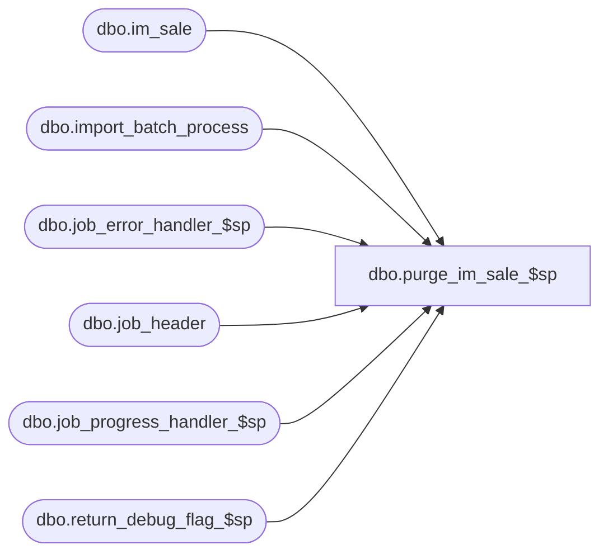

# dbo.purge_im_sale_$sp

**Database:** me_01  
**Server:** bedrockdb02  

## Architecture Diagram



## Table Dependencies

| Referenced Table |
|---|
| dbo.im_sale |
| dbo.import_batch_process |
| dbo.job_error_handler_$sp |
| dbo.job_header |
| dbo.job_progress_handler_$sp |
| dbo.return_debug_flag_$sp |

## Stored Procedure Code

```sql
CREATE PROCEDURE [dbo].[purge_im_sale_$sp]

AS

/*
	Version		: 1.00
	Created		: 2007/04/24
	Created by	: Pierrette Lemay
	Description	: This procedure is part of the Sales Posting process. 
				  It's called when no job part of the sales posting is currently running.  
				  It truncates the im_sale table if there is no incomplete job or 
				  delete the rows in im_sale that have been posted successfully.
	History : Modified May 10 2011. Adding job_type when query job_header 
				and use import_batch_process to delete the rows posted in im_sale.
*/

BEGIN
	DECLARE @line_id SMALLINT, @job_type TINYINT, @job_id SMALLINT, @c_true BIT, @c_false BIT,  @job_count SMALLINT,
			@proc_name NVARCHAR(30), @table_name NVARCHAR(30), @crs_job_flag BIT, @range_start DECIMAL(24,0), @batch_start DECIMAL(24,0),
			@operation_name NVARCHAR(30), @sql_err_num	DECIMAL(38,0), @error_msg NVARCHAR(4000),
			@job_batch_size DECIMAL(10,0), @return_flag BIT, @current_job_id INT, @range_end DECIMAL(24,0), @batch_end DECIMAL(24,0)

	SELECT   @line_id		= 10
			, @job_type		= 1
			, @job_id		= -1
			, @proc_name	= N'purge_im_sale_$sp'
			, @c_false		= 0
			, @c_true		= 1
			, @job_count	= 0
			, @crs_job_flag = 0
 
	BEGIN TRY		
		SELECT @job_count = count(*) 
		FROM job_header
		WHERE job_type = @job_type
		AND completed_flag = 0;
		
		-- Log progress if job_params.debug_flag is true
		EXEC return_debug_flag_$sp @job_type, @return_flag OUT
		IF (@return_flag = @c_true)
			EXEC job_progress_handler_$sp @job_type, @job_id, @proc_name, @line_id 

		IF (@job_count = 0) -- im_sale could be truncated
		BEGIN
			SET @line_id = 20

			TRUNCATE TABLE im_sale
		
			-- Log progress if job_params.debug_flag is true
			EXEC return_debug_flag_$sp @job_type, @return_flag OUT
			IF (@return_flag = @c_true)
				EXEC job_progress_handler_$sp @job_type, @job_id, @proc_name, @line_id 
		END
		ELSE
		BEGIN
			SET @line_id = 30

			DECLARE crs_jobs CURSOR FOR
			SELECT h.job_id, h.range_start, h.range_end, h.batch_start, h.batch_end
			FROM import_batch_process p, job_header h
			WHERE p.job_type = @job_type
			AND p.job_id = h.job_id
			AND p.job_type = h.job_type
			AND h.completed_flag = 1;
			
			OPEN crs_jobs
			SET @crs_job_flag = 1

			FETCH NEXT FROM crs_jobs INTO @current_job_id, @range_start, @range_end, @batch_start, @batch_end

			WHILE @@FETCH_STATUS = 0
			BEGIN
				SET @line_id = 40;
				
				BEGIN TRAN
				
				DELETE im_sale 
				WHERE im_sale_number BETWEEN @range_start AND @range_end
				AND location_id BETWEEN @batch_start AND @batch_end;		
				
				COMMIT TRAN
				
				-- Log progress if job_params.debug_flag is true
				EXEC return_debug_flag_$sp @job_type, @return_flag OUT
				IF (@return_flag = @c_true)
					EXEC job_progress_handler_$sp @job_type, @job_id, @proc_name, @line_id;
				
				FETCH NEXT FROM crs_jobs INTO @current_job_id, @range_start, @range_end, @batch_start, @batch_end;
			END
	      
      		CLOSE crs_jobs;
			DEALLOCATE crs_jobs;
			SET @crs_job_flag = 0;
			
		END
	END TRY

	BEGIN CATCH
		-- Test if the transaction is uncommittable.
		IF (XACT_STATE()) = -1
			ROLLBACK TRANSACTION

		-- Test if the transaction is active and valid.
		IF (XACT_STATE()) = 1
			COMMIT TRANSACTION
			
		IF (@crs_job_flag = 1)
		BEGIN
			CLOSE crs_jobs;
			DEALLOCATE crs_jobs;
		END

		IF @line_id = 10	
			SELECT  @table_name			= N'job_header'
					, @operation_name	= N'SELECT'
					, @error_msg		= ERROR_MESSAGE()
					, @sql_err_num		= ERROR_NUMBER()
		ELSE IF @line_id = 20
			SELECT  @table_name			= N'im_sale'
					, @operation_name	= N'TRUNCATE TABLE'
					, @error_msg		= ERROR_MESSAGE()
					, @sql_err_num		= ERROR_NUMBER()
		ELSE IF @line_id = 30
			SELECT  @table_name			= N'im_sale'
					, @operation_name	= N'DELETE'
					, @sql_err_num		= ERROR_NUMBER()
					, @error_msg		= ERROR_MESSAGE()

		EXEC job_error_handler_$sp 
			@job_type 
			, @job_id 
			, @proc_name 
			, @line_id 
			, @sql_err_num 
			, @table_name 
			, @operation_name 
			, @error_msg 
			, @c_true
	END CATCH
END
```

