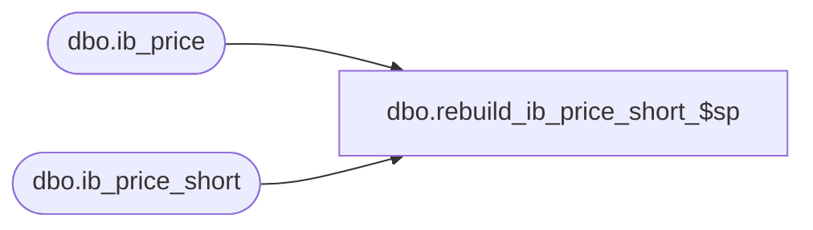

# dbo.rebuild_ib_price_short_$sp

**Database:** me_01  
**Server:** bedrockdb02  

## Architecture Diagram



## Table Dependencies

| Referenced Table |
|---|
| dbo.ib_price |
| dbo.ib_price_short |

## Stored Procedure Code

```sql
CREATE PROCEDURE [dbo].[rebuild_ib_price_short_$sp]
AS

/*
	Version		: 1.00
	Created		: July 2012
	Created by	: Sameer Patel
	Description	: Procedure called by Merch database DBI
					  Truncates ib_price_short and rebuilds it with ids matching ib_price
*/

BEGIN
	
	DECLARE @error_msg NVARCHAR(2000), @batch_size INT
		
	SET @batch_size = 20000
		
	BEGIN TRY
	
		TRUNCATE TABLE ib_price_short
	
		SET IDENTITY_INSERT ib_price_short ON
		
		-- Make sure the indexes are removed before starting the 3 following inserts 
		IF EXISTS (SELECT 1 from sys.indexes WHERE name = N'ib_price_short_$ndx1')
				DROP INDEX ib_price_short_$ndx1 ON ib_price_short;
				
		IF EXISTS (SELECT 1 from sys.indexes WHERE name = N'ib_price_short_$ndx2')
				DROP INDEX ib_price_short_$ndx2 ON ib_price_short;
				
		IF EXISTS (SELECT 1 from sys.indexes WHERE name = N'ib_price_short_$ndx3')
				DROP INDEX ib_price_short_$ndx3 ON ib_price_short;
				
		IF EXISTS (SELECT 1 from sys.indexes WHERE name = N'ib_price_short_$ndx4')
				DROP INDEX ib_price_short_$ndx4 ON ib_price_short;	
				
		IF NOT object_id(N'tempdb..#ib_price_short_inserts') IS NULL
			DROP TABLE #ib_price_short_inserts;
			
		CREATE TABLE #ib_price_short_inserts
			( id INT IDENTITY(1,1)
			, ib_price_id DECIMAL(13)
			, style_id DECIMAL(12), color_id SMALLINT, location_id SMALLINT, jurisdiction_id SMALLINT, pricing_group_id SMALLINT
			, temp_price_flag BIT
			, start_date SMALLDATETIME, end_date SMALLDATETIME
			, valuation_retail_price DECIMAL(14,2), selling_retail_price DECIMAL(14,2), price_status_id SMALLINT
			, document_number NVARCHAR(20), cancel_promo_flag BIT, effective_date SMALLDATETIME, price_change_type SMALLINT
			, PRIMARY KEY (id) )
				
		INSERT INTO #ib_price_short_inserts
			( ib_price_id
			, style_id, color_id, location_id, jurisdiction_id, pricing_group_id
			, temp_price_flag
			, start_date, end_date
			, valuation_retail_price, selling_retail_price, price_status_id
			, document_number, cancel_promo_flag, effective_date, price_change_type )
		SELECT
			ib_price_id
			, style_id, color_id, location_id, jurisdiction_id, pricing_group_id
			, temp_price_flag
			, start_date, end_date
			, valuation_retail_price, selling_retail_price, price_status_id
			, document_number, cancel_promo_flag, effective_date, price_change_type
		FROM 
			ib_price
		WHERE 
			NOT (location_id IS NOT NULL AND pricing_group_id IS NOT NULL)
			
		DECLARE @min_batch_id INT, @max_batch_id INT, @max_id INT
		SET @min_batch_id = 0
		SET @max_batch_id = 0
		SELECT @max_id = COALESCE(MAX(id), 0) FROM #ib_price_short_inserts
		
		-- INSERT BATCHES OF 20000
		WHILE (@max_batch_id <> @max_id)
		BEGIN
		
			IF (@min_batch_id + @batch_size >= @max_id)
				SET @max_batch_id = @max_id
			ELSE
				SET @max_batch_id = @min_batch_id + @batch_size
				
			INSERT INTO ib_price_short
				( ib_price_id
				, style_id, color_id, location_id, jurisdiction_id, pricing_group_id
				, temp_price_flag
				, start_date, end_date
				, valuation_retail_price, selling_retail_price, price_status_id
				, document_number, cancel_promo_flag, effective_date, price_change_type )
			SELECT
				ib_price_id
				, style_id, color_id, location_id, jurisdiction_id, pricing_group_id
				, temp_price_flag
				, start_date, end_date
				, valuation_retail_price, selling_retail_price, price_status_id
				, document_number, cancel_promo_flag, effective_date, price_change_type
			FROM 
				#ib_price_short_inserts
			WHERE 
				id > @min_batch_id AND id <= @max_batch_id
		
			SET @min_batch_id = @max_batch_id
		
		END
		
		SET IDENTITY_INSERT ib_price_short OFF
		
		CREATE NONCLUSTERED INDEX ib_price_short_$ndx1 ON ib_price_short (document_number);
		
		CREATE NONCLUSTERED INDEX ib_price_short_$ndx2 ON ib_price_short (location_id, pricing_group_id); 

		CREATE NONCLUSTERED INDEX ib_price_short_$ndx3 ON ib_price_short (location_id, style_id, color_id, pricing_group_id, effective_date, ib_price_id);
		
		CREATE NONCLUSTERED INDEX ib_price_short_$ndx4 ON ib_price_short (style_id, effective_date)
	
	END TRY
	
	BEGIN CATCH
	
		SET @error_msg = N'Error in procedure rebuild_ib_price_short_$sp: ' 
									+ CAST(ERROR_NUMBER() AS NVARCHAR) + N' ' + ERROR_MESSAGE()
									
		RAISERROR (@error_msg, 16, 1)
	
	END CATCH

END
```

