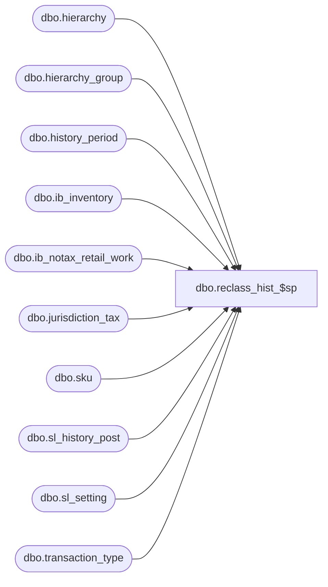

# dbo.reclass_hist_$sp

**Database:** me_01  
**Server:** bedrockdb02  

## Architecture Diagram



## Table Dependencies

| Referenced Table |
|---|
| dbo.hierarchy |
| dbo.hierarchy_group |
| dbo.history_period |
| dbo.ib_inventory |
| dbo.ib_notax_retail_work |
| dbo.jurisdiction_tax |
| dbo.sku |
| dbo.sl_history_post |
| dbo.sl_setting |
| dbo.transaction_type |

## Stored Procedure Code

```sql
CREATE proc [dbo].[reclass_hist_$sp] 

@entity_id DECIMAL(12,0), 
@old_hierarchy_group_id int, 
@new_hierarchy_group_id int, 
@as_of_date smalldatetime
AS 

/* 
Proc name :	reclass_hist_$sp 
Desc:	reclass for Hist OH
	Copy to sl_history_post from ib_inventory
       (for old hgid (-) and new hgid (+))
		
HISTORY: 
Date       Name         Def#      Desc
Mar24,03   Udani   	1-ITI7J   New
Oct07,03   Udani	16073     Added the style_group to the select statement for - (old_hgid) 
								and added the link between the history_period and ib_inventory tables
								and joined transcation_type table to the query to get the stock ledger affect
Jul04,05   Yan Ding	56880     Fixed the variable types of the parameters to match the corresponding columns in SL.
Jul22,05   Yan Ding	57468     Added missing BEGIN / END statements
February 2010 Pierrette L.	  Modified for the Multi-Currency project, the following columns are now populated:
								transaction_retail_te, transaction_cost_local, transaction_retail_local abd
								transaction_retail_te_local.
April 2013	  Pierrette L.	 Defect 1-4ANI3Z Modify to take into consideration clients that are not tax exclusive and table ib_notax_retail_work empty.
*/


DECLARE @alternate_flag bit, @te_count SMALLINT;

BEGIN		
	set @alternate_flag =  (select alternate_flag from hierarchy
				where hierarchy_id in 
				(select hierarchy_id from hierarchy_group  
				where hierarchy_group_id = @old_hierarchy_group_id));
				
	SELECT @te_count = COUNT(*) FROM jurisdiction_tax WHERE tax_inclusive_flag = 1;
		
	--Style Reclass for stock ledger is only affected for Main merch Hierarchy
	If @alternate_flag = 0
	BEGIN
		IF (@te_count > 0)
		BEGIN
			--Copy rows from ib_inventory to sl_history_post with 
			--values negated for old hierarchy group id.		
			INSERT INTO sl_history_post 
				(merch_hierarchy_group_id, location_id, history_period_id,
				transaction_type_code, price_status_id, inventory_status_id, transaction_reason_id,
				transaction_cost, transaction_retail, transaction_units, price_change_type,
				transaction_retail_te, transaction_cost_local, transaction_retail_local, transaction_retail_te_local)
			SELECT @old_hierarchy_group_id, ib.location_id, hp.history_period_id, 
				ib.transaction_type_code, ib.price_status_id, ib.inventory_status_id, ib.transaction_reason_id,
				-(sum(ib.transaction_cost)* tt.stock_ledger_affect ) transaction_cost, 
				-(sum(ib.transaction_valuation_retail) * tt.stock_ledger_affect ) transaction_retail, 
				-(sum(ib.transaction_units)* tt.stock_ledger_affect ) transaction_units, 
				ib.price_change_type,
				-(sum(te.valuation_retail_no_tax) * tt.stock_ledger_affect) transaction_retail_te, 
				-(sum(ib.transaction_cost_local)* tt.stock_ledger_affect ) transaction_cost_local,
				-(sum(ib.transaction_selling_retail) * tt.stock_ledger_affect ) transaction_retail_local, 
				-(sum(te.selling_retail_no_tax) * tt.stock_ledger_affect) transaction_retail_te_local
			FROM ib_inventory ib, sku sk, history_period hp, transaction_type tt, ib_notax_retail_work te
			WHERE transaction_date >= @as_of_date
				and sk.style_id = @entity_id
				and ib.sku_id = sk.sku_id
				and tt.transaction_type_code = ib.transaction_type_code
				and ib.ib_inventory_id <= (select last_id from sl_setting where sl_setting_type = 2)
				and ib.ib_inventory_id = te.ib_inventory_id
 				and ib.transaction_date between hp.start_date and hp.end_date
			GROUP BY ib.location_id, hp.history_period_id, 
				ib.transaction_type_code, ib.price_status_id, ib.inventory_status_id, 
				ib.transaction_reason_id, ib.price_change_type, tt.stock_ledger_affect
			HAVING abs(sum(ib.transaction_cost)) + abs(sum(ib.transaction_valuation_retail)) + abs(sum(ib.transaction_units))
				+  abs(sum(ib.transaction_cost_local)) + abs(sum(ib.transaction_selling_retail)) + abs(sum(te.valuation_retail_no_tax))
				+  abs(sum(te.selling_retail_no_tax)) <> 0;			

			--Copy rows from ib_inventory to sl_history_post with 
			--values positive for new hierarchy group id.		
		 	INSERT INTO sl_history_post 
				(merch_hierarchy_group_id, location_id, history_period_id,
				transaction_type_code, price_status_id, inventory_status_id, transaction_reason_id,
				transaction_cost, transaction_retail, transaction_units, price_change_type,
				transaction_retail_te, transaction_cost_local, transaction_retail_local, transaction_retail_te_local)
			SELECT @new_hierarchy_group_id, ib.location_id, hp.history_period_id, 
				ib.transaction_type_code, ib.price_status_id, ib.inventory_status_id, ib.transaction_reason_id,
				(sum(ib.transaction_cost)* tt.stock_ledger_affect ) transaction_cost, 
				(sum(ib.transaction_valuation_retail) * tt.stock_ledger_affect ) transaction_retail, 
				(sum(ib.transaction_units)* tt.stock_ledger_affect ) transaction_units, 
				ib.price_change_type,
				(sum(te.valuation_retail_no_tax) * tt.stock_ledger_affect) transaction_retail_te, 
				(sum(ib.transaction_cost_local)* tt.stock_ledger_affect ) transaction_cost_local,
				(sum(ib.transaction_selling_retail) * tt.stock_ledger_affect ) transaction_retail_local, 
				(sum(te.selling_retail_no_tax) * tt.stock_ledger_affect) transaction_retail_te_local
			FROM ib_inventory ib, sku sk, history_period hp, transaction_type tt, ib_notax_retail_work te
			WHERE transaction_date >= @as_of_date
				and sk.style_id = @entity_id
				and ib.sku_id = sk.sku_id
				and tt.transaction_type_code = ib.transaction_type_code
				and ib.ib_inventory_id <= (select last_id from sl_setting where sl_setting_type = 2)
				and ib.ib_inventory_id = te.ib_inventory_id
 				and ib.transaction_date between hp.start_date and hp.end_date
			GROUP BY ib.location_id, hp.history_period_id, 
				ib.transaction_type_code, ib.price_status_id, ib.inventory_status_id, 
				ib.transaction_reason_id, ib.price_change_type, tt.stock_ledger_affect
			HAVING abs(sum(ib.transaction_cost)) + abs(sum(ib.transaction_valuation_retail)) + abs(sum(ib.transaction_units))
				+  abs(sum(ib.transaction_cost_local)) + abs(sum(ib.transaction_selling_retail)) + abs(sum(te.valuation_retail_no_tax))
				+  abs(sum(te.selling_retail_no_tax)) <> 0;
		END
		ELSE
		BEGIN
			INSERT INTO sl_history_post 
				(merch_hierarchy_group_id, location_id, history_period_id,
				transaction_type_code, price_status_id, inventory_status_id, transaction_reason_id,
				transaction_cost, transaction_retail, transaction_units, price_change_type,
				transaction_retail_te, transaction_cost_local, transaction_retail_local, transaction_retail_te_local)
			SELECT @old_hierarchy_group_id, ib.location_id, hp.history_period_id, 
				ib.transaction_type_code, ib.price_status_id, ib.inventory_status_id, ib.transaction_reason_id,
				-(sum(ib.transaction_cost)* tt.stock_ledger_affect ) transaction_cost, 
				-(sum(ib.transaction_valuation_retail) * tt.stock_ledger_affect ) transaction_retail, 
				-(sum(ib.transaction_units)* tt.stock_ledger_affect ) transaction_units, 
				ib.price_change_type,
				-(sum(ib.transaction_valuation_retail) * tt.stock_ledger_affect ) transaction_retail_te, 
				-(sum(ib.transaction_cost_local)* tt.stock_ledger_affect ) transaction_cost_local,
				-(sum(ib.transaction_selling_retail) * tt.stock_ledger_affect ) transaction_retail_local, 
				-(sum(ib.transaction_selling_retail) * tt.stock_ledger_affect )  transaction_retail_te_local
			FROM ib_inventory ib, sku sk, history_period hp, transaction_type tt
			WHERE transaction_date >= @as_of_date
				and sk.style_id = @entity_id
				and ib.sku_id = sk.sku_id
				and tt.transaction_type_code = ib.transaction_type_code
				and ib.ib_inventory_id <= (select last_id from sl_setting where sl_setting_type = 2)
 				and ib.transaction_date between hp.start_date and hp.end_date
			GROUP BY ib.location_id, hp.history_period_id, 
				ib.transaction_type_code, ib.price_status_id, ib.inventory_status_id, 
				ib.transaction_reason_id, ib.price_change_type, tt.stock_ledger_affect
			HAVING abs(sum(ib.transaction_cost)) + abs(sum(ib.transaction_valuation_retail)) + abs(sum(ib.transaction_units))
				+  abs(sum(ib.transaction_cost_local)) + abs(sum(ib.transaction_selling_retail))  <> 0;			

			--Copy rows from ib_inventory to sl_history_post with 
			--values positive for new hierarchy group id.		
		 	INSERT INTO sl_history_post 
				(merch_hierarchy_group_id, location_id, history_period_id,
				transaction_type_code, price_status_id, inventory_status_id, transaction_reason_id,
				transaction_cost, transaction_retail, transaction_units, price_change_type,
				transaction_retail_te, transaction_cost_local, transaction_retail_local, transaction_retail_te_local)
			SELECT @new_hierarchy_group_id, ib.location_id, hp.history_period_id, 
				ib.transaction_type_code, ib.price_status_id, ib.inventory_status_id, ib.transaction_reason_id,
				(sum(ib.transaction_cost)* tt.stock_ledger_affect ) transaction_cost, 
				(sum(ib.transaction_valuation_retail) * tt.stock_ledger_affect ) transaction_retail, 
				(sum(ib.transaction_units)* tt.stock_ledger_affect ) transaction_units, 
				ib.price_change_type,
				(sum(ib.transaction_valuation_retail) * tt.stock_ledger_affect )  transaction_retail_te, 
				(sum(ib.transaction_cost_local)* tt.stock_ledger_affect ) transaction_cost_local,
				(sum(ib.transaction_selling_retail) * tt.stock_ledger_affect ) transaction_retail_local, 
				(sum(ib.transaction_selling_retail) * tt.stock_ledger_affect ) transaction_retail_te_local
			FROM ib_inventory ib, sku sk, history_period hp, transaction_type tt
			WHERE transaction_date >= @as_of_date
				and sk.style_id = @entity_id
				and ib.sku_id = sk.sku_id
				and tt.transaction_type_code = ib.transaction_type_code
				and ib.ib_inventory_id <= (select last_id from sl_setting where sl_setting_type = 2)
 				and ib.transaction_date between hp.start_date and hp.end_date
			GROUP BY ib.location_id, hp.history_period_id, 
				ib.transaction_type_code, ib.price_status_id, ib.inventory_status_id, 
				ib.transaction_reason_id, ib.price_change_type, tt.stock_ledger_affect
			HAVING abs(sum(ib.transaction_cost)) + abs(sum(ib.transaction_valuation_retail)) + abs(sum(ib.transaction_units))
				+  abs(sum(ib.transaction_cost_local)) + abs(sum(ib.transaction_selling_retail)) <> 0;
		END
	END
END
```

