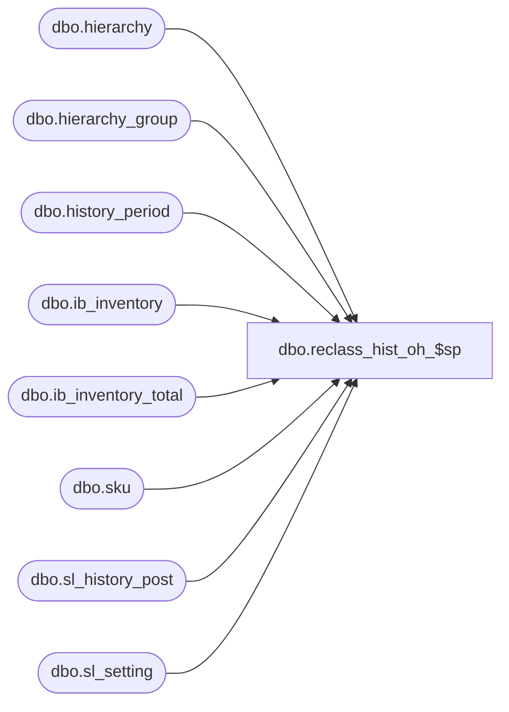

# dbo.reclass_hist_oh_$sp

**Database:** me_01  
**Server:** bedrockdb02  

## Architecture Diagram



## Table Dependencies

| Referenced Table |
|---|
| dbo.hierarchy |
| dbo.hierarchy_group |
| dbo.history_period |
| dbo.ib_inventory |
| dbo.ib_inventory_total |
| dbo.sku |
| dbo.sl_history_post |
| dbo.sl_setting |

## Stored Procedure Code

```sql
CREATE PROCEDURE dbo.reclass_hist_oh_$sp

	 @entity_id AS DECIMAL (12,0)
	,@old_hierarchy_group_id AS INT
	,@new_hierarchy_group_id AS INT
	,@as_of_date AS SMALLDATETIME
	,@transaction_reason_id AS SMALLINT

AS

/*
Proc name : reclass_hist_oh_$sp
Desc:	reclass for Hist OH
	Copy to sl_history_post from ib_inventory
       (for old hgid (-) and new hgid (+))

HISTORY:
Date       Name         Def#      Desc
Apr01,03   Udani   		1-ITI7J   New
Oct15,03   Udani		16073	  OH and adjustments are first posted into temp tables before posting them to sl_history_post table.
Jul04,05   Yan Ding		56880     Fixed the variable types of the parameters to match the corresponding columns in SL.
Sep19,05   Yan Ding		60436     Update sl_history_post.transaction_units with units value instead of cost value

February 2010 Pierrette L.	  Modified for the Multi-Currency project, the following columns are now populated:
							  transaction_retail_local with on_hand_selling_retail AND transaction_cost_local with on_hand_cost_local 
							  Notice that the tax exclusive fields are not being tracked when moving Hist OH.
Oct17,14   Mgt McL		1-4DCISP  seg 1030 reclass_hist_oh_$sp is not applying -1 to local fields - Copy to Merch 5.0
*/

SET NOCOUNT ON

DECLARE @alternate_flag AS BIT
DECLARE @history_period_id AS DECIMAL (12,0)
DECLARE @last_id AS DECIMAL (12,0)
DECLARE @multiplier AS TABLE (multiplier INT)


BEGIN

	SET @alternate_flag =

		(
			SELECT
				h.alternate_flag
			FROM
				dbo.hierarchy h
			WHERE
				EXISTS

					(
						SELECT
							*
						FROM
							dbo.hierarchy_group hg
						WHERE
							hg.hierarchy_group_id = @old_hierarchy_group_id
							AND hg.hierarchy_id = h.hierarchy_id
					)
		)


	--Style Reclass for stock ledger is only affected for Main merch Hierarchy
	IF @alternate_flag = 0

		BEGIN

			INSERT INTO @multiplier

				(
					multiplier
				)

			SELECT
				-1 AS multiplier

			UNION ALL

			SELECT
				1 AS multiplier


			SET @last_id = (SELECT ss.last_id FROM dbo.sl_setting ss WHERE ss.sl_setting_type = 2)

			SET @history_period_id = (SELECT hp.history_period_id FROM dbo.history_period hp WHERE @as_of_date BETWEEN hp.[start_date] AND hp.end_date)


			--Copy rows to dbo.sl_history_post with values negated for old and positive for new hierarchy group id
			INSERT INTO dbo.sl_history_post

				(
					 merch_hierarchy_group_id
					,location_id
					,history_period_id
					,transaction_type_code
					,price_status_id
					,inventory_status_id
					,transaction_reason_id
					,transaction_cost
					,transaction_retail
					,transaction_units
					,price_change_type
					,transaction_retail_local
					,transaction_cost_local
				)

			SELECT
				 (CASE
					WHEN tvm.multiplier = -1 THEN @old_hierarchy_group_id
					ELSE @new_hierarchy_group_id
					END) AS merch_hierarchy_group_id
				,ttoht.location_id
				,@history_period_id AS history_period_id
				,910 AS transaction_type_code
				,ttoht.price_status_id
				,ttoht.inventory_status_id
				,@transaction_reason_id AS transaction_reason_id
				,ttoht.on_hand_cost * tvm.multiplier AS transaction_cost
				,ttoht.on_hand_valuation_retail * tvm.multiplier AS transaction_retail
				,ttoht.on_hand_units * tvm.multiplier AS transaction_units
				,NULL AS price_change_type
				,ttoht.on_hand_selling_retail * tvm.multiplier
				,ISNULL (ttoht.on_hand_cost_local, 0) * tvm.multiplier AS on_hand_cost_local
			FROM

				(
					--  Calculate the OH on the as of date
					SELECT
						 sqoht.location_id
						,sqoht.price_status_id
						,sqoht.inventory_status_id
						,sqoht.on_hand_cost - ISNULL (sqoha.adj_on_hand_cost, 0) AS on_hand_cost
						,sqoht.on_hand_valuation_retail - ISNULL (sqoha.adj_on_hand_valuation_retail, 0) AS on_hand_valuation_retail
						,sqoht.on_hand_units - ISNULL (sqoha.adj_on_hand_units, 0) AS on_hand_units
						,sqoht.on_hand_selling_retail - ISNULL (sqoha.adj_on_hand_selling_retail, 0) AS on_hand_selling_retail
						,sqoht.on_hand_cost_local - ISNULL (sqoha.adj_on_hand_cost_local, 0) AS on_hand_cost_local
					FROM

						(
							--  Get current OH for style
							SELECT
								 iit.location_id
								,iit.price_status_id
								,iit.inventory_status_id
								,SUM (iit.total_on_hand_units) AS on_hand_units
								,SUM (iit.total_on_hand_cost) AS on_hand_cost
								,SUM (iit.total_on_hand_valuation_retail) AS on_hand_valuation_retail
								,SUM (iit.total_on_hand_selling_retail) AS on_hand_selling_retail
								,SUM (iit.total_on_hand_cost_local) AS on_hand_cost_local
							FROM
								dbo.ib_inventory_total iit
							WHERE
								EXISTS

									(
										SELECT
											*
										FROM
											dbo.sku s
										WHERE
											s.style_id = @entity_id
											AND s.sku_id = iit.sku_id
									)

							GROUP BY
								 iit.location_id
								,iit.price_status_id
								,iit.inventory_status_id
						) sqoht

						LEFT JOIN

							(
								--  Get changes to OH for style
								SELECT
									 ii.location_id
									,ii.price_status_id
									,ii.inventory_status_id
									,SUM (ii.transaction_units) AS adj_on_hand_units
									,SUM (ii.transaction_cost) AS adj_on_hand_cost
									,SUM (ii.transaction_valuation_retail) AS adj_on_hand_valuation_retail
									,SUM (ii.transaction_selling_retail) AS adj_on_hand_selling_retail
									,SUM (ii.transaction_cost_local) AS adj_on_hand_cost_local
								FROM
									dbo.ib_inventory ii
								WHERE
									ii.transaction_date >= @as_of_date
									AND ii.ib_inventory_id <= @last_id
									AND EXISTS

										(
											SELECT
												*
											FROM
												dbo.sku s
											WHERE
												s.style_id = @entity_id
												AND s.sku_id = ii.sku_id
										)

								GROUP BY
									 ii.location_id
									,ii.price_status_id
									,ii.inventory_status_id
							) sqoha ON sqoha.location_id = sqoht.location_id AND sqoha.price_status_id = sqoht.price_status_id AND sqoha.inventory_status_id = sqoht.inventory_status_id

				) ttoht

				CROSS JOIN @multiplier tvm
			WHERE
				ABS (ttoht.on_hand_units) + ABS (ttoht.on_hand_cost) + ABS (ttoht.on_hand_valuation_retail) + ABS (ttoht.on_hand_selling_retail) + ABS (ISNULL (ttoht.on_hand_cost_local, 0)) <> 0

		END

END
```

