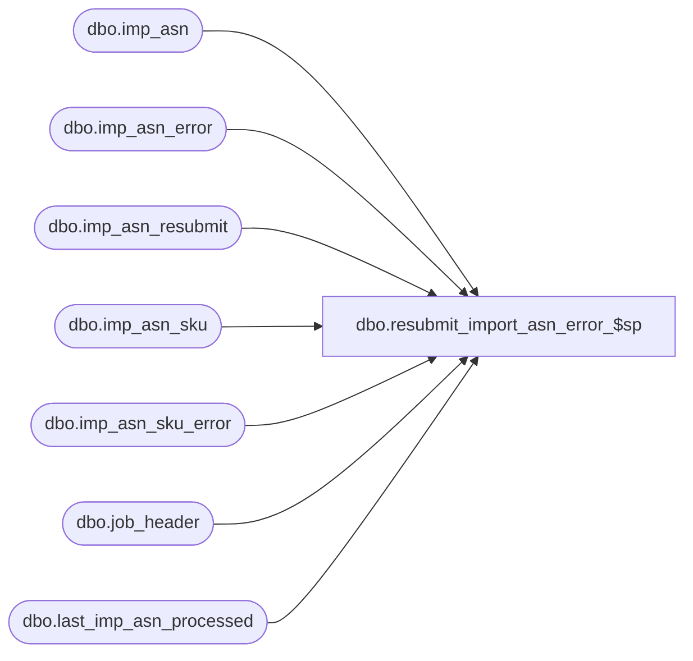

# dbo.resubmit_import_asn_error_$sp

**Database:** me_01  
**Server:** bedrockdb02  

## Architecture Diagram



## Table Dependencies

| Referenced Table |
|---|
| dbo.imp_asn |
| dbo.imp_asn_error |
| dbo.imp_asn_resubmit |
| dbo.imp_asn_sku |
| dbo.imp_asn_sku_error |
| dbo.job_header |
| dbo.last_imp_asn_processed |

## Stored Procedure Code

```sql
CREATE PROCEDURE [dbo].[resubmit_import_asn_error_$sp]

AS

/*
  Version		: 1.00
  Created		: Nov 2010
  Created by	: Pierrette Lemay
  Description	: This procedure re-submit errors that are stored in imp_asn_error and imp_asn_sku_error by inserting them back to
        imp_asn and imp_asn_sku.
*/

BEGIN
  DECLARE @line_id SMALLINT, @job_type TINYINT, @proc_name NVARCHAR(30), @sql_err_num DECIMAL(38), @error_msg NVARCHAR(2000),
    @crs_job_flag BIT, @current_job_id INT, @max_imp_asn_id DECIMAL(12,0), @cnt TINYINT, @crs_dup_flag BIT,
    @vendor_code NVARCHAR(20), @shipment_ref_no NVARCHAR(30);

  SELECT @line_id = 10,
       @job_type = 10,
       @crs_job_flag = 0,
       @crs_dup_flag = 0,
       @max_imp_asn_id = MAX(imp_asn_id)
  FROM imp_asn
  WHERE imp_asn_id >= (SELECT ISNULL(MAX(range_end), 0) FROM job_header WHERE job_type = 10);


  BEGIN TRY
    -- If there is no error logged in the error tables just return as there is nothing to do
    IF ( (SELECT COUNT(*) FROM imp_asn_error) = 0)
      RETURN;

    IF (@max_imp_asn_id IS NULL)
      SELECT @max_imp_asn_id = imp_asn_id FROM last_imp_asn_processed;

    -- Check if there is duplicate vendor/shipment_ref_no that need to be re-submit
    -- In this case force cleanup
    IF EXISTS ( SELECT vendor_code, shipment_ref_no, COUNT(*)
          FROM imp_asn_error
          GROUP BY vendor_code, shipment_ref_no
          HAVING COUNT(*) > 1)
    BEGIN
      PRINT N'Error: system cannot resubmit the errors because the following rows have the same vendor/shipment_ref_no: ';

      DECLARE crs_duplicate CURSOR FOR
      SELECT vendor_code, shipment_ref_no, COUNT(*)
      FROM imp_asn_error
      GROUP BY vendor_code, shipment_ref_no
      HAVING COUNT(*) > 1;

      OPEN crs_duplicate
      SET @crs_dup_flag = 1;

      FETCH NEXT FROM crs_duplicate INTO @vendor_code, @shipment_ref_no, @cnt

      WHILE @@FETCH_STATUS = 0
      BEGIN
        PRINT N'vendor code: ' + @vendor_code + N' shipment ref no: ' + @shipment_ref_no;
        FETCH NEXT FROM crs_duplicate INTO @vendor_code, @shipment_ref_no, @cnt;
      END

      CLOSE crs_duplicate;
      DEALLOCATE crs_duplicate;
      SET @crs_dup_flag = 0;

      PRINT N'Please remove the duplicate vendor/shipment_ref_no and run the procedure again.'

      RETURN;
    END


    TRUNCATE TABLE imp_asn_resubmit;

    -- Process by week, create a cursor on week
    DECLARE crs_jobs CURSOR FOR
    SELECT DISTINCT job_id
    FROM imp_asn_error
    ORDER BY job_id

      OPEN crs_jobs
    SET @crs_job_flag = 1

    FETCH NEXT FROM crs_jobs INTO @current_job_id

    WHILE @@FETCH_STATUS = 0
    BEGIN
      PRINT N'Currently processing job_id: ' + CAST(@current_job_id as NVARCHAR);

      -- populate a table that will hold imp_asn_id for each shipment_ref_no
      INSERT INTO imp_asn_resubmit
          (job_id,
          imp_asn_id,
          shipment_ref_no)
      SELECT @current_job_id,
        @max_imp_asn_id + ROW_NUMBER() OVER(ORDER BY imp_asn_id),
        shipment_ref_no
      FROM imp_asn_error
      WHERE job_id = @current_job_id
      ORDER BY imp_asn_id;

      -- We need to provide the value for imp_asn_id
      SET IDENTITY_INSERT imp_asn ON;

      BEGIN TRAN;

      INSERT INTO imp_asn
        ( imp_asn_id
        , action_type
        , shipment_ref_no
        , vendor_code
        , vendor_inter_id_qualifier
        , vendor_inter_id_code
        , expected_receipt_date
        , weight
        , unit_weight_code
        , no_of_containers
        , container_type_code
        , ship_date
        , ship_via_code
        , carrier_code
        , pro_bill_no
        , bol
        , imp_file_name)
      SELECT r.imp_asn_id,
        i.action_type,
        i.shipment_ref_no,
        i.vendor_code,
        i.vendor_inter_id_qualifier,
        i.vendor_inter_id_code,
        i.expected_receipt_date,
  i.weight,
        i.unit_weight_code,
        i.no_of_containers,
        i.container_type_code,
        i.ship_date,
        i.ship_via_code,
        i.carrier_code,
        i.pro_bill_no,
        i.bol,
        i.imp_file_name
      FROM imp_asn_error i, imp_asn_resubmit r
      WHERE i.job_id = @current_job_id
      AND i.job_id = r.job_id
      AND i.shipment_ref_no = r.shipment_ref_no;

      INSERT INTO imp_asn_sku
        ( imp_asn_id
        , action
        , shipment_ref_no
        , vendor_code
        , vendor_inter_id_qualifier
        , vendor_inter_id_code
        , po_number
        , blanket_po_no
        , release_no
        , ship_to_location
        , selling_location_code
        , carton_no
        , upc_number
        , style_code
        , vendor_style_code
        , color_code
        , size_code
        , primary_size_label
        , secondary_size_label
        , units_shipped
        , pack_code
        , style_id
        , style_color_id
        , sku_id
        , po_id
        , blanket_po_id)
      SELECT i.imp_asn_id,
        e.action,
        e.shipment_ref_no,
        e.vendor_code,
        e.vendor_inter_id_qualifier,
        e.vendor_inter_id_code,
        e.po_number,
        e.blanket_po_no,
        e.release_no,
        e.ship_to_location,
        e.selling_location_code,
        e.carton_no,
        e.upc_number,
        e.style_code,
        e.vendor_style_code,
        e.color_code,
        e.size_code,
        e.primary_size_label,
        e.secondary_size_label,
        e.units_shipped,
        e.pack_code,
        e.style_id,
        e.style_color_id,
        e.sku_id,
        e.po_id,
        e.blanket_po_id
      FROM imp_asn_sku_error e, imp_asn_resubmit i
      WHERE e.job_id = @current_job_id
      AND e.job_id = i.job_id
      AND e.shipment_ref_no = i.shipment_ref_no;

      -- Delete the rows from the error tables
      DELETE imp_asn_error WHERE job_id = @current_job_id;
      DELETE imp_asn_sku_error WHERE job_id = @current_job_id;

      COMMIT TRAN;

      SET IDENTITY_INSERT imp_asn OFF;

      SELECT @max_imp_asn_id = MAX(imp_asn_id) FROM imp_asn;

      FETCH NEXT FROM crs_jobs INTO @current_job_id;
    END

      CLOSE crs_jobs;
    DEALLOCATE crs_jobs;
    SET @crs_job_flag = 0;

  END TRY

  BEGIN CATCH
    SELECT @error_msg		= ERROR_MESSAGE()
       , @sql_err_num		= ERROR_NUMBER();

    -- Test if the transaction is uncommittable.
    IF (XACT_STATE()) = -1
      ROLLBACK TRANSACTION

    -- Test if the transaction is active and valid.
    IF (XACT_STATE()) = 1
      COMMIT TRANSACTION

    IF (@crs_job_flag = 1)
    BEGIN
      CLOSE crs_jobs
      DEALLOCATE crs_jobs
    END;

    IF (@crs_dup_flag = 1)
    BEGIN
      CLOSE crs_duplicate
      DEALLOCATE crs_duplicate
    END;

    SET @error_msg = N'Error in procedure resubmit_import_asn_error_$sp: ' + CAST(ERROR_NUMBER() AS NVARCHAR) + N' ' + ERROR_MESSAGE()
    RAISERROR (@error_msg, -- Message text.
           16, -- Severity.
           1) -- State.

  END CATCH
END
```

