# dbo.retrieve_dist_$sp

**Database:** me_01  
**Server:** bedrockdb02  

## Architecture Diagram

```mermaid
flowchart LR
    SP["dbo.retrieve_dist_$sp"]
    dbo_advance_shipping_notice(["dbo.advance_shipping_notice"]) --> SP
    dbo_attribute(["dbo.attribute"]) --> SP
    dbo_attribute_set(["dbo.attribute_set"]) --> SP
    dbo_calendar_period(["dbo.calendar_period"]) --> SP
    dbo_calendar_week(["dbo.calendar_week"]) --> SP
    dbo_calendar_year(["dbo.calendar_year"]) --> SP
    dbo_color(["dbo.color"]) --> SP
    dbo_comp_set(["dbo.comp_set"]) --> SP
    dbo_custom_property(["dbo.custom_property"]) --> SP
    dbo_dist_algorithm(["dbo.dist_algorithm"]) --> SP
    dbo_dist_attribute_set(["dbo.dist_attribute_set"]) --> SP
    dbo_dist_custom_property(["dbo.dist_custom_property"]) --> SP
    dbo_dist_detail(["dbo.dist_detail"]) --> SP
    dbo_dist_detail_pack(["dbo.dist_detail_pack"]) --> SP
    dbo_dist_grp_instruction(["dbo.dist_grp_instruction"]) --> SP
    dbo_dist_line(["dbo.dist_line"]) --> SP
    dbo_dist_line_location(["dbo.dist_line_location"]) --> SP
    dbo_dist_location(["dbo.dist_location"]) --> SP
    dbo_dist_location_grade(["dbo.dist_location_grade"]) --> SP
    dbo_dist_message(["dbo.dist_message"]) --> SP
    dbo_dist_min_max_profile(["dbo.dist_min_max_profile"]) --> SP
    dbo_dist_parameter_c(["dbo.dist_parameter_c"]) --> SP
    dbo_dist_prior_dist_line(["dbo.dist_prior_dist_line"]) --> SP
    dbo_dist_ranking_grade_loc(["dbo.dist_ranking_grade_loc"]) --> SP
    dbo_dist_sales_merch(["dbo.dist_sales_merch"]) --> SP
    dbo_dist_sales_merch_c(["dbo.dist_sales_merch_c"]) --> SP
    dbo_dist_sales_week(["dbo.dist_sales_week"]) --> SP
    dbo_dist_sell_thru_grade(["dbo.dist_sell_thru_grade"]) --> SP
    dbo_dist_sku_grade_alloc(["dbo.dist_sku_grade_alloc"]) --> SP
    dbo_dist_sku_scale(["dbo.dist_sku_scale"]) --> SP
    dbo_dist_source_sku_qty(["dbo.dist_source_sku_qty"]) --> SP
    dbo_dist_storepack_defn(["dbo.dist_storepack_defn"]) --> SP
    dbo_dist_styl_clr_grd_alloc(["dbo.dist_styl_clr_grd_alloc"]) --> SP
    dbo_dist_style_color_scale(["dbo.dist_style_color_scale"]) --> SP
    dbo_dist_volume_grade(["dbo.dist_volume_grade"]) --> SP
    dbo_distribution(["dbo.distribution"]) --> SP
    dbo_distribution_c(["dbo.distribution_c"]) --> SP
    dbo_employee_role(["dbo.employee_role"]) --> SP
    dbo_hierarchy(["dbo.hierarchy"]) --> SP
    dbo_hierarchy_group(["dbo.hierarchy_group"]) --> SP
    dbo_hierarchy_level(["dbo.hierarchy_level"]) --> SP
    dbo_location(["dbo.location"]) --> SP
    dbo_message_type(["dbo.message_type"]) --> SP
    dbo_pack(["dbo.pack"]) --> SP
    dbo_pack_sku(["dbo.pack_sku"]) --> SP
    dbo_parameter_alloc_replen(["dbo.parameter_alloc_replen"]) --> SP
    dbo_parameter_pom(["dbo.parameter_pom"]) --> SP
    dbo_parameter_system(["dbo.parameter_system"]) --> SP
    dbo_po(["dbo.po"]) --> SP
    dbo_po_line(["dbo.po_line"]) --> SP
    dbo_po_receipt(["dbo.po_receipt"]) --> SP
    dbo_position(["dbo.position"]) --> SP
    dbo_size_category(["dbo.size_category"]) --> SP
    dbo_size_master(["dbo.size_master"]) --> SP
    dbo_sku(["dbo.sku"]) --> SP
    dbo_style(["dbo.style"]) --> SP
    dbo_style_color(["dbo.style_color"]) --> SP
    dbo_style_group(["dbo.style_group"]) --> SP
    dbo_style_size(["dbo.style_size"]) --> SP
    dbo_upc(["dbo.upc"]) --> SP
    dbo_vendor(["dbo.vendor"]) --> SP
```



## Table Dependencies

| Referenced Table |
|---|
| dbo.advance_shipping_notice |
| dbo.attribute |
| dbo.attribute_set |
| dbo.calendar_period |
| dbo.calendar_week |
| dbo.calendar_year |
| dbo.color |
| dbo.comp_set |
| dbo.custom_property |
| dbo.dist_algorithm |
| dbo.dist_attribute_set |
| dbo.dist_custom_property |
| dbo.dist_detail |
| dbo.dist_detail_pack |
| dbo.dist_grp_instruction |
| dbo.dist_line |
| dbo.dist_line_location |
| dbo.dist_location |
| dbo.dist_location_grade |
| dbo.dist_message |
| dbo.dist_min_max_profile |
| dbo.dist_parameter_c |
| dbo.dist_prior_dist_line |
| dbo.dist_ranking_grade_loc |
| dbo.dist_sales_merch |
| dbo.dist_sales_merch_c |
| dbo.dist_sales_week |
| dbo.dist_sell_thru_grade |
| dbo.dist_sku_grade_alloc |
| dbo.dist_sku_scale |
| dbo.dist_source_sku_qty |
| dbo.dist_storepack_defn |
| dbo.dist_styl_clr_grd_alloc |
| dbo.dist_style_color_scale |
| dbo.dist_volume_grade |
| dbo.distribution |
| dbo.distribution_c |
| dbo.employee_role |
| dbo.hierarchy |
| dbo.hierarchy_group |
| dbo.hierarchy_level |
| dbo.location |
| dbo.message_type |
| dbo.pack |
| dbo.pack_sku |
| dbo.parameter_alloc_replen |
| dbo.parameter_pom |
| dbo.parameter_system |
| dbo.po |
| dbo.po_line |
| dbo.po_receipt |
| dbo.position |
| dbo.size_category |
| dbo.size_master |
| dbo.sku |
| dbo.style |
| dbo.style_color |
| dbo.style_group |
| dbo.style_size |
| dbo.upc |
| dbo.vendor |

## Stored Procedure Code

```sql
CREATE PROCEDURE [dbo].[retrieve_dist_$sp]

 (@0 BIGINT)
as
/*
  Proc to retrieve a distribution
*/
SELECT distribution_id,parent_distribution_id,root_distribution_id,distribution_number,distribution_description,create_date,distribution_status,status_date,document_source,distribution_method,release_date,expected_receipt_date,position_id,location_id,reserve_location_id,vendor_id,po_id,po_shipment_id,po_receipt_id,advance_shipping_notice_id,asn_po_location_id,apply_eligibility_flag,retain_for_distribution_flag,po_quantities_required_flag,po_generated_flag,available_quantity_known,average_sales_basis,volume_grade_basis,volume_hierarchy_group_id,prior_distribution_available,sales_data_basis,plan_calendar_period_id,sales_from_calendar_week_id,sales_to_calendar_week_id,sell_thru_hierarchy_group_id,apply_scale,scale_entry_indicator,distribution_multiple,dist_multiple_rounding_pct,target_pct_need,plan_hierarchy_group_id,updatestamp,previous_status, number_active_stores,hist_unit_sales_all_stores,hist_effect_inv_all_stores,hist_on_hand_all_stores,plan_unit_sales_all_stores,plan_remain_sales_all_stores,plan_on_hand_all_stores,print_for_picking_flag, allow_size_substitution_flag, consider_effect_inv_flag,total_distributed_detail_qty,total_suggested_detail_qty, update_po_quantity_flag,weeks_of_supply_loc_need,incl_effect_inv_loc_need_flag, apply_max_constraint_flag, grade_type_for_assortment, remove_qty_start_from, add_qty_start_from, keep_in_reserve, available_qty_is_known, max_pack_type_per_loc, allow_pack_alloc_exceed_loc, allow_pk_alloc_exceed_sku_unit, store_pack_definition_released, store_pack_definition_locked, prior_dist_actual_available, ranking_group_code, ranking_group_hierarchy_grp_id, ranking_group_style_id, ranking_group_type, pack_size_threshold, allow_pk_alloc_exceed_sku_pct, minimum_one_pack_per_loc_flag FROM distribution WHERE distribution_id =  @0
SELECT location_id,expected_receipt_date,suggested_quantity,  instruction,instruction_value, dist_volume_grade_id, dist_sell_thru_grade_id,dist_grp_instruction_id,effective_inventory,hist_effective_inventory,remaining_sales,unit_sales,hist_unit_sales,retail_sales,hist_retail_sales,on_hand,hist_on_hand,number_weeks_sales,prior_dist_flag, prior_dist_quantity, desired_quantity, ots_flag,eligibility, location_need,total_distributed_detail_qty,total_suggested_detail_qty,gmroi,sales_plan_weighting,unit_need_weighting,(sales_plan_weighting + unit_need_weighting) AS suggested_qty_pct_actual, suggested_qty_pct FROM dist_location WHERE distribution_id = @0
SELECT attribute_set_id FROM dist_attribute_set WHERE distribution_id = @0
SELECT dist_custom_property_id,custom_property_id,custom_property_value FROM dist_custom_property WHERE distribution_id = @0
SELECT dist_line_id,style_color_id,pack_id,available_quantity,line_state,po_receipt_id, po_line_id, advance_shipping_notice_id, comp_set_id, primary_style_color_flag,total_distributed_detail_qty,total_suggested_detail_qty, available_quantity_known, apply_comp_set_flag, minimum_one_pack_per_loc_flag FROM dist_line WHERE distribution_id  = @0
SELECT dist_grp_instruction_id,dist_volume_grade_id,dist_sell_thru_grade_id,instruction,instruction_value FROM dist_grp_instruction WHERE distribution_id  = @0
SELECT dist_message_id,message_type_id,message_text FROM dist_message WHERE distribution_id  = @0
SELECT dist_sales_merch_id,hierarchy_group_id,style_id,style_color_id FROM dist_sales_merch WHERE distribution_id  = @0
SELECT calendar_week_id,weight FROM dist_sales_week WHERE distribution_id  = @0
SELECT dist_sell_thru_grade_id,grade_code,sell_thru_lower_limit FROM dist_sell_thru_grade WHERE distribution_id  = @0
SELECT dist_volume_grade_id,grade_code,sales_lower_limit,minimum,maximum,weight FROM dist_volume_grade WHERE distribution_id  = @0
SELECT distribution_id, dist_ranking_grade_loc_id, grade, location_id FROM dist_ranking_grade_loc WHERE distribution_id  = @0
SELECT sku_id, available_quantity, reserve_quantity, secondary_quantity, line_id  FROM dist_source_sku_qty WHERE distribution_id = @0
SELECT sku_id, scale_qty FROM dist_sku_scale WHERE distribution_id = @0
SELECT style_color_id, scale_qty FROM dist_style_color_scale WHERE distribution_id = @0
SELECT dist_detail_id, sku_id, pack_id, location_id, eligibility_flag, suggested_quantity, quantity, skipped_reason FROM dist_detail WHERE distribution_id = @0
SELECT sku_id, pack_id, location_id, eligibility_flag, suggested_quantity, quantity FROM   dist_detail_pack WHERE  distribution_id = @0
SELECT dist_min_max_profile_id,dist_detail_id,minimum,maximum,presentation_stock,capacity_maximum,order_point,incl_pres_stock_with_ord_pt_fl,on_hand_units,in_transit_units,allocated_units,on_order_units,original_suggested_quantity,adjusted_quantity,short_shipped_quantity, future_inventory_reserve_units FROM dist_min_max_profile WHERE distribution_id  = @0

SELECT dist_location_grade_id,location_id,original_definition_id,current_definition_id,final_definition_id FROM dist_location_grade WHERE distribution_id = @0
SELECT dist_storepack_definition_id,grade_code,volume_grade_id,available_quantity FROM dist_storepack_defn WHERE distribution_id = @0
SELECT dist_style_color_grd_alloc_id,style_color_id,storepack_definition_id,instruction,suggested_quantity FROM dist_styl_clr_grd_alloc WHERE distribution_id = @0
SELECT sku_id,dist_style_color_grd_alloc_id,suggested_quantity,distributed_quantity FROM dist_sku_grade_alloc WHERE distribution_id = @0


SELECT algorithm_key, sales_plan_weight_pct, sales_weight_pct FROM dist_parameter_c
SELECT distribution_id, algorithm_key, sales_plan_weight_pct, sales_weight_pct, sales_from_calendar_week_id, sales_to_calendar_week_id, sales_data_basis, plans_from_calendar_week_id, plans_to_calendar_week_id, plan_hierarchy_group_id, weeks_of_supply_loc_need, incl_effect_inv_loc_need_flag FROM  distribution_c WHERE distribution_id = @0
SELECT distribution_id, dist_sales_merch_id, hierarchy_group_id, style_id, style_color_id FROM  dist_sales_merch_c WHERE distribution_id = @0

/* User Defined Algorithms */
SELECT algorithm_type, name, calculation_level_enum, N'' as algorithm_srlzd, N'' as result_srlzd FROM  dist_algorithm WHERE distribution_id = @0

SELECT v.vendor_id,v.vendor_code,v.vendor_name,v.active_flag FROM vendor v, distribution d WHERE d.vendor_id = v.vendor_id AND d.distribution_id  = @0
SELECT location_id,location_code,location_name,active_flag,location_type,uses_oim_flag,warehouse_system_flag FROM location WHERE location_id in ( SELECT location_id FROM distribution WHERE distribution_id = @0 UNION SELECT reserve_location_id FROM distribution WHERE distribution_id = @0 UNION SELECT location_id FROM dist_location WHERE distribution_id = @0)
SELECT p.position_id,p.position_code,p.position_label,p.active_flag, p.approved_by_position_id, er.role_label FROM position p, employee_role er, distribution d WHERE p.employee_role_id = er.employee_role_id AND d.position_id = p.position_id AND d.distribution_id  =  @0
SELECT DISTINCT cp.custom_property_id,cp.cust_prop_code,cp.cust_prop_label,cp.property_type,cp.entity_type,cp.active_flag FROM custom_property cp, dist_custom_property dcp WHERE cp.custom_property_id = dcp.custom_property_id AND dcp.distribution_id  = @0
SELECT DISTINCT mt.message_type_id,mt.message_type_description,mt.transaction_type,mt.active_flag,mt.max_length,mt.exclusive_flag FROM message_type mt, dist_message dm WHERE mt.message_type_id = dm.message_type_id AND dm.distribution_id  = @0
SELECT DISTINCT aset.attribute_set_id,aset.attribute_id,aset.attribute_set_code,aset.attribute_set_label,aset.active_flag FROM attribute_set aset, dist_attribute_set das WHERE aset.attribute_set_id = das.attribute_set_id AND das.distribution_id  = @0
SELECT DISTINCT a.attribute_id,a.attribute_code,a.attribute_label,a.parent_type,a.exclusive_flag FROM attribute_set aset, attribute a, dist_attribute_set das WHERE aset.attribute_set_id = das.attribute_set_id AND aset.attribute_id = a.attribute_id AND das.distribution_id = @0
SELECT DISTINCT cw.calendar_week_id, cw.calendar_year_id,cw.calendar_week_code FROM calendar_week cw WHERE calendar_week_id in ( SELECT calendar_week_id FROM dist_sales_week WHERE distribution_id = @0 UNION SELECT sales_from_calendar_week_id FROM distribution_c WHERE distribution_id = @0 UNION SELECT sales_to_calendar_week_id FROM distribution_c WHERE distribution_id = @0 UNION SELECT plans_from_calendar_week_id FROM distribution_c WHERE distribution_id = @0 UNION SELECT plans_to_calendar_week_id FROM distribution_c WHERE distribution_id = @0 )
SELECT DISTINCT cp.calendar_period_id,cp.calendar_year_id,cp.calendar_period_code FROM calendar_period cp, distribution d WHERE cp.calendar_period_id = d.plan_calendar_period_id AND d.distribution_id  = @0
SELECT calendar_year_id, calendar_year_code FROM calendar_year WHERE calendar_year_id in ( SELECT DISTINCT calendar_year_id FROM calendar_week WHERE calendar_week_id in ( SELECT calendar_week_id FROM dist_sales_week WHERE distribution_id = @0 UNION SELECT sales_from_calendar_week_id FROM distribution_c WHERE distribution_id = @0 UNION SELECT sales_to_calendar_week_id FROM distribution_c WHERE distribution_id = @0 UNION SELECT plans_from_calendar_week_id FROM distribution_c WHERE distribution_id = @0 UNION SELECT plans_to_calendar_week_id FROM distribution_c WHERE distribution_id = @0 ) UNION SELECT cp.calendar_year_id FROM calendar_period cp, distribution d WHERE cp.calendar_period_id = d.plan_calendar_period_id AND d.distribution_id = @0 )

SELECT hg.hierarchy_group_id, hg.hierarchy_group_code, hg.hierarchy_group_label, h.alternate_flag, h.hierarchy_type, hg.active_flag, hg.hierarchy_level_id, hg.hierarchy_group_short_label FROM hierarchy_group hg, hierarchy h WHERE hg.hierarchy_id = h.hierarchy_id AND hg.hierarchy_group_id in ( SELECT DISTINCT sg.hierarchy_group_id FROM style_group sg, style_color sc, dist_line dl WHERE sg.main_group_flag = 1 AND sg.style_id = sc.style_id AND dl.style_color_id = sc.style_color_id AND dl.distribution_id = @0 UNION SELECT DISTINCT sg.hierarchy_group_id FROM style_group sg, pack p, dist_line dl WHERE sg.main_group_flag = 1 AND sg.style_id = p.style_id AND dl.pack_id = p.pack_id AND dl.distribution_id = @0 UNION SELECT plan_hierarchy_group_id FROM distribution WHERE distribution_id = @0 UNION SELECT volume_hierarchy_group_id FROM distribution WHERE distribution_id = @0 UNION SELECT sell_thru_hierarchy_group_id FROM distribution WHERE distribution_id = @0 UNION SELECT hierarchy_group_id FROM dist_sales_merch WHERE distribution_id = @0 UNION SELECT plan_hierarchy_group_id FROM distribution_c WHERE distribution_id = @0 UNION SELECT hierarchy_group_id FROM dist_sales_merch_c WHERE distribution_id = @0)
SELECT style_color_id, style_id, color_id, long_desc, reorder_flag FROM style_color WHERE style_color_id in (SELECT style_color_id FROM dist_line WHERE distribution_id = @0 UNION SELECT sc.style_color_id FROM style_color sc, pack p, dist_line dl WHERE sc.style_id = p.style_id AND p.pack_id = dl.pack_id AND dl.distribution_id = @0 UNION SELECT style_color_id FROM dist_sales_merch WHERE distribution_id = @0 UNION SELECT style_color_id FROM dist_sales_merch_c WHERE distribution_id = @0)
SELECT DISTINCT s.style_id, s.style_code, s.long_desc, sm.size_category_id, s.order_multiple, s.distribution_multiple, s.active_flag, s.style_type, s.reorder_flag FROM style s, style_size ss, size_master sm WHERE s.style_id in (SELECT DISTINCT sc.style_id FROM style_color sc, dist_line dl WHERE sc.style_color_id = dl.style_color_id AND dl.distribution_id = @0 UNION SELECT p.style_id FROM pack p, dist_line dl WHERE p.pack_id = dl.pack_id AND dl.distribution_id = @0 UNION SELECT style_id FROM dist_sales_merch WHERE distribution_id = @0 UNION SELECT DISTINCT sc.style_id FROM style_color sc, dist_sales_merch dsm WHERE sc.style_color_id = dsm.style_color_id AND dsm.distribution_id = @0 UNION SELECT style_id FROM dist_sales_merch_c WHERE distribution_id = @0 UNION SELECT DISTINCT sc.style_id FROM style_color sc, dist_sales_merch_c dsm WHERE sc.style_color_id = dsm.style_color_id AND dsm.distribution_id = @0 ) AND s.style_id = ss.style_id AND ss.size_master_id = sm.size_master_id
SELECT color_id,color_code,color_long_description FROM color WHERE color_id in ( SELECT DISTINCT sc.color_id FROM style_color sc, dist_line dl WHERE sc.style_color_id = dl.style_color_id AND dl.distribution_id = @0 UNION SELECT DISTINCT sc.color_id FROM style_color sc, pack p, dist_line dl WHERE sc.style_id = p.style_id AND p.pack_id = dl.pack_id AND dl.distribution_id = @0 UNION SELECT DISTINCT sc.color_id FROM style_color sc, dist_sales_merch dsm WHERE sc.style_color_id = dsm.style_color_id AND dsm.distribution_id = @0 UNION SELECT DISTINCT sc.color_id FROM style_color sc, dist_sales_merch_c dsmc WHERE sc.style_color_id = dsmc.style_color_id AND dsmc.distribution_id = @0 )
SELECT p.pack_id,p.pack_code,p.pack_description,p.pack_short_description, p.style_id, p.vendor_pack_code, p.active_flag FROM pack p, dist_line dl WHERE p.pack_id = dl.pack_id AND dl.distribution_id  = @0
SELECT DISTINCT sku.sku_id,sku.style_id,sku.style_color_id,sku.style_size_id FROM sku, dist_line dl WHERE sku.style_color_id = dl.style_color_id AND dl.distribution_id = @0 UNION SELECT DISTINCT sku.sku_id,sku.style_id,sku.style_color_id,sku.style_size_id FROM sku, pack p, dist_line dl, pack_sku pk WHERE p.style_id = sku.style_id AND p.pack_id = dl.pack_id AND sku.sku_id = pk.sku_id AND p.pack_id = pk.pack_id AND dl.distribution_id = @0 UNION SELECT DISTINCT sku.sku_id,sku.style_id,sku.style_color_id,sku.style_size_id FROM sku, dist_detail dd WHERE dd.sku_id = sku.sku_id AND dd.distribution_id = @0
SELECT style_size_id,style_id,size_master_id,reorder_flag FROM style_size WHERE style_id in (SELECT DISTINCT sc.style_id FROM style_color sc, dist_line dl WHERE sc.style_color_id = dl.style_color_id AND dl.distribution_id = @0 UNION SELECT DISTINCT p.style_id FROM pack p, dist_line dl WHERE p.pack_id = dl.pack_id AND dl.distribution_id = @0)
SELECT size_master_id,size_code,prim_size_label,sec_size_label,prim_seq_no,sec_seq_no, size_category_id FROM size_master WHERE size_master_id in ( SELECT DISTINCT ss.size_master_id FROM style_size ss, style_color sc, dist_line dl WHERE ss.style_id = sc.style_id AND sc.style_color_id = dl.style_color_id AND dl.distribution_id = @0 UNION SELECT DISTINCT ss.size_master_id FROM style_size ss, pack p, dist_line dl WHERE ss.style_id = p.style_id AND p.pack_id = dl.pack_id AND dl.distribution_id = @0) ORDER BY size_master.size_master_id
SELECT po.po_id,po.po_no,po.po_type,po_status, po.approval_status, po.predistribution_type, po.validate_order_multiple FROM po, distribution WHERE po.po_id = distribution.po_id AND  distribution.distribution_id = @0
SELECT DISTINCT pr.po_receipt_id,pr.document_no,pr.receive_date FROM po_receipt pr, dist_line dl, distribution d WHERE pr.po_receipt_id = dl.po_receipt_id AND dl.distribution_id = d.distribution_id AND d.distribution_id  = @0
SELECT DISTINCT asn.advance_shipping_notice_id,asn.document_no,asn.expected_receipt_date FROM advance_shipping_notice asn, dist_line dl, distribution d WHERE asn.advance_shipping_notice_id = dl.advance_shipping_notice_id AND dl.distribution_id = d.distribution_id AND d.distribution_id  = @0
SELECT hierarchy_level_id, parent_level_id FROM hierarchy_level WHERE hierarchy_id = (SELECT hierarchy_id FROM hierarchy WHERE hierarchy_type = 1 AND alternate_flag = 0)
SELECT par.curr_plan_hier_level_id, par.future_plan_hier_level_id, cp.calendar_period_code future_plan_period_code, cy.calendar_year_code future_plan_period_year_code, par.using_approval_flag, par.release_prior_days , par.plan_by_total_flag, ps.restrict_by_employee_pos_flag, ppom.def_expected_receipt_date_days, ppom.using_po_approval_flag, ps.installed_4wall_flag installed_wms_flag, ps.installed_distro_no_wms_flag, allow_size_substitution_flag, consider_effect_inv_flag, ps.installed_standalone_ar_flag, par.update_min, par.update_max, par.update_capacity, par.update_presentation, par.update_min_default, par.update_max_default, par.update_capacity_default, par.update_presentation_default, par.order_point, par.plan_grading_option, par.enforce_keep_in_reserve, par.keep_in_reserve, par.max_pack_type_per_loc, par.allow_pack_alloc_exceed_loc, par.allow_pk_alloc_exceed_sku_unit, par.vendor_replen_generate_item, ps.size_concatenation_delimiter, ps.installed_sourcing_flag, par.pack_size_threshold, par.allow_pk_alloc_exceed_sku_pct, par.minimum_one_pack_per_loc_flag, par.size_scale_type, par.wholesale_inventory_decrement_type, ps.installed_eom_flag FROM parameter_system ps, parameter_pom ppom, parameter_alloc_replen par LEFT OUTER JOIN calendar_period cp ON par.future_plan_period_id = cp.calendar_period_id  LEFT OUTER JOIN calendar_year cy ON cp.calendar_year_id = cy.calendar_year_id
SELECT prior_distribution_id,prior_dist_line_id FROM dist_prior_dist_line WHERE distribution_id = @0
SELECT style_group_id,style_id,hierarchy_group_id,main_group_flag FROM style_group WHERE main_group_flag = 1 AND style_id in (SELECT sc.style_id FROM style_color sc, dist_line dl WHERE sc.style_color_id = dl.style_color_id AND dl.distribution_id = @0 UNION SELECT p.style_id FROM pack p, dist_line dl WHERE p.pack_id = dl.pack_id AND dl.distribution_id = @0)
SELECT style_color_id, location_id, quantity, eligibility,instruction, instruction_value, hist_effective_inventory, hist_unit_sales, number_weeks_sales, location_need, sales_plan, sales_plan_pct, location_need_pct, location_need_weighting, sales_plan_weighting, suggested_qty_pct FROM dist_line_location WHERE distribution_id = @0
SELECT ps.pack_sku_id, ps.pack_id, ps.sku_id, ps.sku_quantity FROM pack_sku ps, dist_line dl WHERE ps.pack_id = dl.pack_id AND dl.distribution_id = @0
SELECT distinct pl.po_id,pl.po_line_id,pl.line_no,pl.repeat_order_flag,pl.store_pack_flag FROM po_line pl, distribution d, dist_line dl WHERE d.po_id = pl.po_id AND d.distribution_id =@0 AND d.distribution_id = dl.distribution_id AND pl.po_line_id = dl.po_line_id
SELECT DISTINCT cs.comp_set_id, cs.comp_set_name  FROM comp_set cs, dist_line dl WHERE cs.comp_set_id =dl.comp_set_id AND dl.distribution_id = @0
--style color line only
SELECT DISTINCT u.upc_id, u.sku_id, u.pack_id, u.upc_type, u.upc_number
FROM dist_detail dd, upc u
WHERE dd.sku_id = u.sku_id AND dd.distribution_id = @0
AND u.last_activity_date = (SELECT MAX(upc2.last_activity_date) from upc upc2 where u.sku_id = upc2.sku_id)
UNION -- style color line mixed with pack line, style_color line's sku's upc
SELECT DISTINCT u.upc_id, u.sku_id, u.pack_id, u.upc_type, u.upc_number
FROM dist_detail_pack dd, upc u
WHERE dd.sku_id = u.sku_id
AND u.last_activity_date = (SELECT MAX(upc2.last_activity_date) from upc upc2 where u.sku_id = upc2.sku_id)
AND dd.distribution_id = @0
UNION -- style color line mixed with pack line, pack line's pack's upc
SELECT DISTINCT u.upc_id, u.sku_id, u.pack_id, u.upc_type, u.upc_number
FROM dist_detail_pack dd, upc u
WHERE dd.pack_id = u.pack_id
AND u.last_activity_date = (SELECT MAX(upc2.last_activity_date) from upc upc2 where u.pack_id = upc2.pack_id)
AND dd.distribution_id = @0
UNION -- style color line mixed with pack line, pack line's pack's sku's upc
SELECT DISTINCT u.upc_id, u.sku_id, u.pack_id, u.upc_type, u.upc_number
FROM pack_sku ps, dist_line dl, upc u
WHERE ps.pack_id = dl.pack_id
AND ps.sku_id = u.sku_id
AND u.last_activity_date = (SELECT MAX(upc2.last_activity_date) from upc upc2 where u.sku_id = upc2.sku_id)
AND dl.distribution_id = @0

SELECT DISTINCT distribution_id, distribution_number FROM distribution WHERE distribution_id = ( SELECT parent_distribution_id FROM distribution WHERE distribution_id = @0 )
SELECT DISTINCT sca.size_category_id, sca.size_category_code, sca.number_of_dimensions, sca.size_category_label, sca.active_flag FROM style_size ss, size_master sm, size_category sca WHERE ss.style_id in ( SELECT DISTINCT p.style_id FROM dist_line dl, pack p WHERE dl.distribution_id  = @0 AND dl.pack_id = p.pack_id UNION SELECT DISTINCT sc.style_id FROM dist_line dl, style_color sc WHERE dl.distribution_id = @0 AND dl.style_color_id = sc.style_color_id) AND ss.size_master_id = sm.size_master_id AND sm.size_category_id = sca.size_category_id
```

