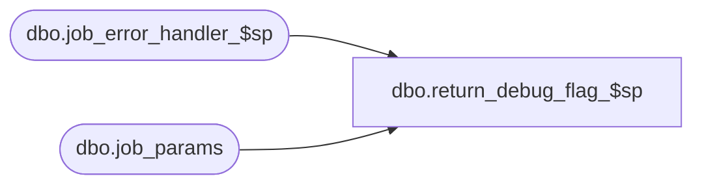

# dbo.return_debug_flag_$sp

**Database:** me_01  
**Server:** bedrockdb02  

## Architecture Diagram



## Table Dependencies

| Referenced Table |
|---|
| dbo.job_error_handler_$sp |
| dbo.job_params |

## Stored Procedure Code

```sql
CREATE PROCEDURE [dbo].[return_debug_flag_$sp] 
	(@job_type TINYINT,
	@debug_flag BIT OUTPUT) 
AS 

/*    	Version		: 1.00 
	Date		: 2007/04/24	
	Created by	: Pierrette Lemay
	Description 	: Determines whether or not debugging has been turned on for a particular job type
			  Retrieves debug_flag in job_params table
	Note		: As part of the installation of the Sales Posting, there must be a row in job_params 
			  for job_type = 1. An error should be raised if the row is missing
*/

BEGIN TRY
	DECLARE @line_id SMALLINT, @job_id INT, @sql_err_num DECIMAL(38,0), @proc_name NVARCHAR(30),
			@object_name NVARCHAR(30), @operation_name NVARCHAR(30), @error_msg NVARCHAR(2000),
			@raise_flag BIT

	SELECT @job_id	= -1,
			@line_id = 10
	
	SELECT @debug_flag = debug_flag 
	FROM job_params 
	WHERE job_type = @job_type

	IF @@ROWCOUNT = 0 
		RAISERROR (N'Error: an entry is missing in job_param for job type %d. ', -- Message text.
               16, -- Severity.
               1, -- State.
               @job_type)

END TRY

BEGIN CATCH
	SELECT  @proc_name			= N'return_debug_flag_$sp'
			, @object_name		= N'job_params'
			, @operation_name	= N'SELECT'
			, @error_msg		= ERROR_MESSAGE()
			, @sql_err_num		= ERROR_NUMBER()
			, @raise_flag		= 1

	EXEC job_error_handler_$sp
				@job_type
				, @job_id
				, @proc_name 
				, @line_id 
				, @sql_err_num 
				, @object_name 
				, @operation_name 
				, @error_msg 
				, @raise_flag

END CATCH
```

