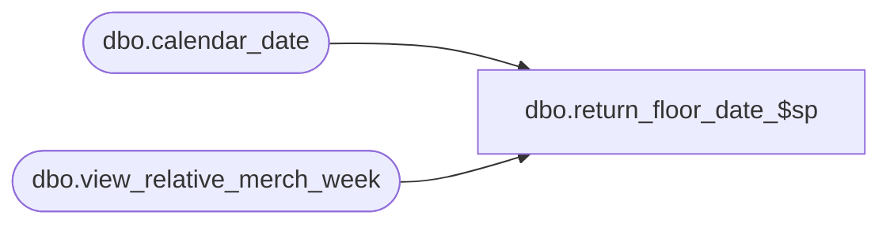

# dbo.return_floor_date_$sp

**Database:** me_01  
**Server:** bedrockdb02  

## Architecture Diagram



## Table Dependencies

| Referenced Table |
|---|
| dbo.calendar_date |
| dbo.view_relative_merch_week |

## Stored Procedure Code

```sql
CREATE PROCEDURE [dbo].[return_floor_date_$sp] 
	(@weeks_count_from_current SMALLINT,
	@floor_date SMALLDATETIME OUTPUT) 
AS 

/*  Version		: 1.00 
	Date		: 20011/03/03	
	Created by	: Pierrette Lemay
	Description : This procedure behaves like a function, it receives the number of weeks to go backward 
				in order to find the first day of that week and return it as an out parameter.
*/

BEGIN TRY
	DECLARE @sql_err_num DECIMAL(38,0), @error_msg NVARCHAR(2000)

	-- Function: receive number of weeks (25) return date (2010-09-06)
	SELECT @floor_date = CONVERT(VARCHAR(10), MIN(calendar_date), 120) 
	FROM calendar_date a, (SELECT year_week / 100 merch_year, year_week % 100 merch_week 
							FROM view_relative_merch_week 
							WHERE relative_position = (SELECT MAX(relative_position) - @weeks_count_from_current
														FROM view_relative_merch_week)) b 
	WHERE a.merch_year = b.merch_year 
	AND a.merch_week = b.merch_week; 
	
	IF @@ROWCOUNT = 0 
		RAISERROR (N'Error in procedure: return_floor_date_$sp, unable to retrieve the floor date. ', -- Message text.
               16, -- Severity.
               1) -- State.
END TRY

BEGIN CATCH
	SELECT @error_msg		= ERROR_MESSAGE()
		 , @sql_err_num		= ERROR_NUMBER()

	SET @error_msg = CAST(ERROR_NUMBER() AS NVARCHAR) + N' ' + ERROR_MESSAGE()
	RAISERROR (@error_msg, -- Message text.
               16, -- Severity.
               1) -- State.
END CATCH
```

