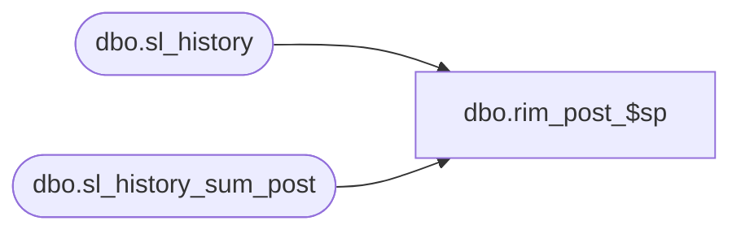

# dbo.rim_post_$sp

**Database:** me_01  
**Server:** bedrockdb02  

## Architecture Diagram



## Table Dependencies

| Referenced Table |
|---|
| dbo.sl_history |
| dbo.sl_history_sum_post |

## Stored Procedure Code

```sql
CREATE proc [dbo].[rim_post_$sp] (@MerchGroupId int)
AS 

BEGIN

update sl_history set history_value = (select b.history_value 
			from sl_history_sum_post b 
			where b.merch_hierarchy_group_id = @MerchGroupId
			and a.merch_hierarchy_group_id = b.merch_hierarchy_group_id 
			and a.location_id = b.location_id 
			and a.history_period_id = b.history_period_id 
			and a.sl_component_id = b.sl_component_id ) 
from sl_history a			
where a.merch_hierarchy_group_id = @MerchGroupId
and exists (select b.merch_hierarchy_group_id from sl_history_sum_post b where b.merch_hierarchy_group_id = @MerchGroupId 
and a.merch_hierarchy_group_id = b.merch_hierarchy_group_id and 
a.location_id = b.location_id and
a.history_period_id = b.history_period_id and
a.sl_component_id = b.sl_component_id );

update sl_history set history_value_local = (select b.history_value_local
			from sl_history_sum_post b 
			where b.merch_hierarchy_group_id = @MerchGroupId
			and a.merch_hierarchy_group_id = b.merch_hierarchy_group_id 
			and a.location_id = b.location_id 
			and a.history_period_id = b.history_period_id 
			and a.sl_component_id = b.sl_component_id ) 
from sl_history a			
where a.merch_hierarchy_group_id = @MerchGroupId
and exists (select b.merch_hierarchy_group_id from sl_history_sum_post b where b.merch_hierarchy_group_id = @MerchGroupId 
and a.merch_hierarchy_group_id = b.merch_hierarchy_group_id and 
a.location_id = b.location_id and
a.history_period_id = b.history_period_id and
a.sl_component_id = b.sl_component_id );

insert into sl_history (merch_hierarchy_group_id, location_id, 
history_period_id, sl_component_id, history_value, history_value_local) 
select a.merch_hierarchy_group_id,  a.location_id, 
a.history_period_id, a.sl_component_id, a.history_value, a.history_value_local
from sl_history_sum_post a where a.merch_hierarchy_group_id = @MerchGroupId
and not exists ( select b.merch_hierarchy_group_id from sl_history b where 
b.merch_hierarchy_group_id = @MerchGroupId
and a.merch_hierarchy_group_id = b.merch_hierarchy_group_id and 
a.location_id = b.location_id and a.history_period_id = b.history_period_id 
and a.sl_component_id = b.sl_component_id);


delete sl_history_sum_post where merch_hierarchy_group_id = @MerchGroupId;
																	
END;
```

