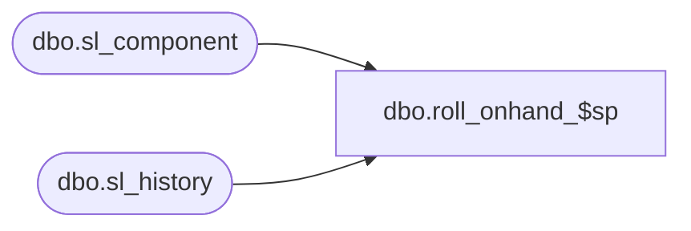

# dbo.roll_onhand_$sp

**Database:** me_01  
**Server:** bedrockdb02  

## Architecture Diagram



## Table Dependencies

| Referenced Table |
|---|
| dbo.sl_component |
| dbo.sl_history |

## Stored Procedure Code

```sql
CREATE proc [dbo].[roll_onhand_$sp] 
(@MerchNodeId decimal(12,0),
@HistPerId decimal(12,0),
@PrevHistPerId decimal(12,0))
AS BEGIN

BEGIN
 
   if (select count(*) from sl_history a, sl_component b 
	where a.merch_hierarchy_group_id = @MerchNodeId
	and a.history_period_id = @HistPerId
	and a.sl_component_id = b.sl_component_id 
	and b.on_hand_flag = 1)= 0
   begin
	INSERT INTO sl_history (merch_hierarchy_group_id, location_id, 
	sl_component_id, history_period_id, history_value, history_value_local) 
	(SELECT @MerchNodeId merch_hierarchy_group_id, sl_history.location_id,
	sl_history.sl_component_id, @HistPerId history_period_id, sl_history.history_value,
    sl_history.history_value_local
	FROM sl_history, sl_component
	WHERE sl_history.history_period_id = @PrevHistPerId
	AND sl_history.merch_hierarchy_group_id = @MerchNodeId
	AND sl_history.sl_component_id = sl_component.sl_component_id
	AND sl_component.on_hand_flag = 1);
   end;
     
 

END;
END;
```

