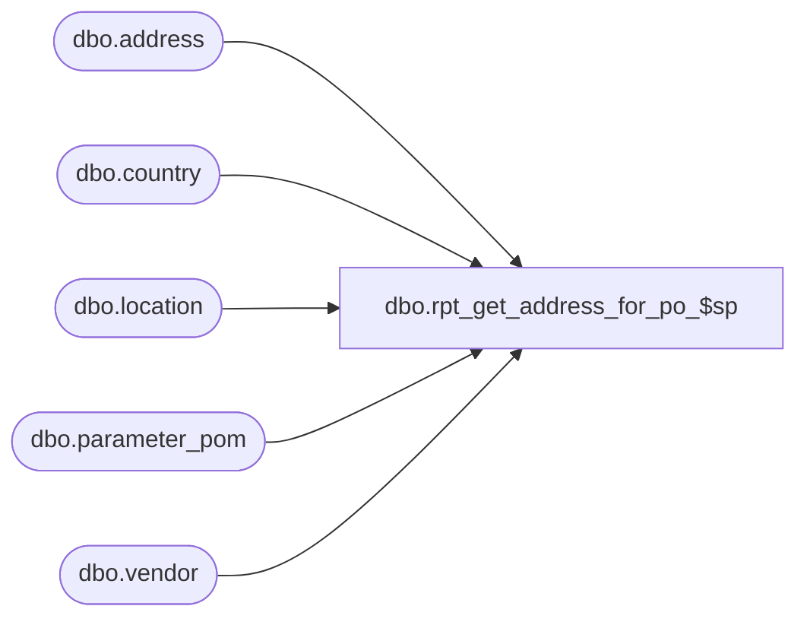

# dbo.rpt_get_address_for_po_$sp

**Database:** me_01  
**Server:** bedrockdb02  

## Architecture Diagram



## Table Dependencies

| Referenced Table |
|---|
| dbo.address |
| dbo.country |
| dbo.location |
| dbo.parameter_pom |
| dbo.vendor |

## Stored Procedure Code

```sql
CREATE PROCEDURE [dbo].[rpt_get_address_for_po_$sp] @parent_type smallint, @parent_id decimal(14, 0)

AS

/*
Proc name:		rpt_get_address_for_po_$sp
Description:	Gets the PO address data for a single entity (location or vendor)
*/

DECLARE @address_type SMALLINT = 1, @parent_code NVARCHAR(20) = ''

IF (@parent_type = 2)
BEGIN
	-- Location type
	SET @address_type = (SELECT rec_loc_address_type_to_print FROM parameter_pom)
	SET @parent_code = (SELECT location_code FROM location WHERE location_id = @parent_id)
END

ELSE IF (@parent_type = 3)
BEGIN
	-- Vendor type
	SET @address_type = (SELECT ven_loc_address_type_to_print FROM parameter_pom)
	SET @parent_code = (SELECT vendor_code FROM vendor WHERE vendor_id = @parent_id)
END


SELECT tt.parent_code, a.address_name, a.address_line1, a.address_line2, a.address_city,
	a.address_state, a.address_zip_code, c.country_description, a.address_email,
	a.address_id, a.address_type_id, a.document_id
FROM
(SELECT @parent_code AS parent_code) tt
LEFT OUTER JOIN address a WITH (NOLOCK) ON a.parent_type = @parent_type AND a.parent_id = @parent_id AND a.address_type_id = @address_type
LEFT JOIN country c WITH (NOLOCK) ON a.country_id = c.country_id
```

