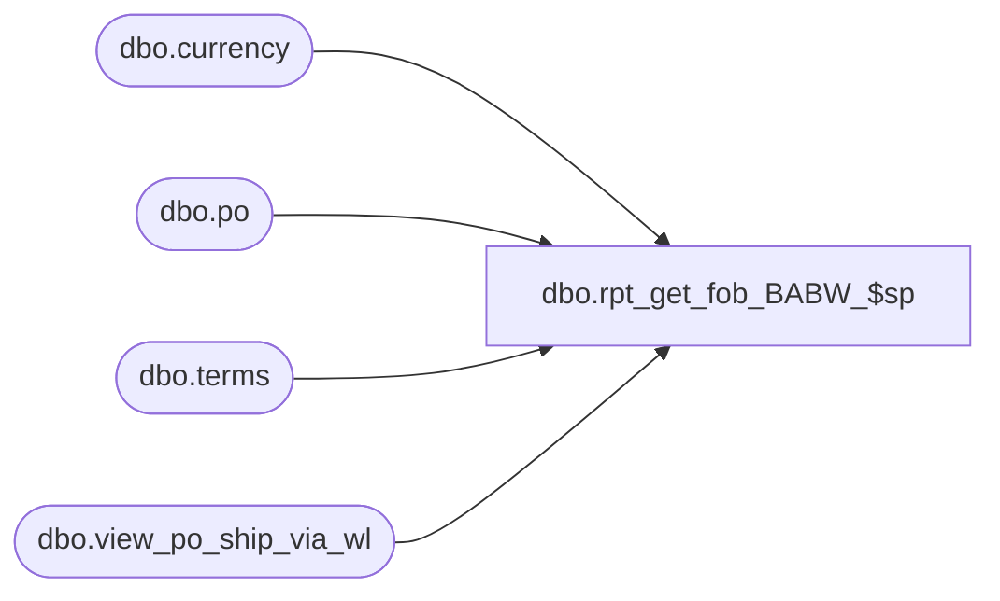

# dbo.rpt_get_fob_BABW_$sp

**Database:** me_01  
**Server:** bedrockdb02  

## Architecture Diagram



## Table Dependencies

| Referenced Table |
|---|
| dbo.currency |
| dbo.po |
| dbo.terms |
| dbo.view_po_ship_via_wl |

## Stored Procedure Code

```sql
CREATE PROCEDURE [dbo].[rpt_get_fob_BABW_$sp] @po_id decimal(12, 0)
AS

/*
Proc name: 	rpt_get_fob_BABW_$sp
Description: Get a dataset with FOB details for BABW custom PO Print 

HISTORY: 
Date				Name					Desc
July 23, 2015		Geoffrey Syme			Creation
*/

select d.po_id,
d.fob_description,
c.terms_description,
b.currency_description,
g.ship_via_description
from po d
join currency b on b.currency_id =d.currency_id
join terms c on c.terms_id =d.terms_id
join view_po_ship_via_wl g on d.po_id = g.po_id
where d.po_id = @po_id

RETURN 0
```

