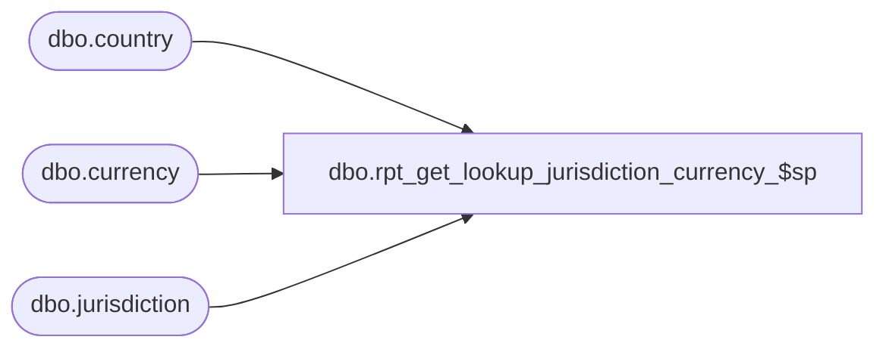

# dbo.rpt_get_lookup_jurisdiction_currency_$sp

**Database:** me_01  
**Server:** bedrockdb02  

## Architecture Diagram



## Table Dependencies

| Referenced Table |
|---|
| dbo.country |
| dbo.currency |
| dbo.jurisdiction |

## Stored Procedure Code

```sql
CREATE PROCEDURE [dbo].[rpt_get_lookup_jurisdiction_currency_$sp]
AS

/*
Proc name: 	rpt_get_lookup_jurisdiction_currency_$sp
Description: Get a dataset with currency symbols for all the jurisdictions 

HISTORY: 
Date				Name					Desc
March 27, 2013		Maria Van Geeteruyen	Creation
*/


SELECT j.jurisdiction_id, j.jurisdiction_code, j.jurisdiction_description,
c.country_code, c.country_description,
cr.currency_code, cr.currency_description, cr.currency_symbol  
FROM jurisdiction j WITH (NOLOCK), country c WITH (NOLOCK), currency cr WITH (NOLOCK)  
WHERE j.country_id = c.country_id 
AND c.currency_id = cr.currency_id
ORDER BY j.jurisdiction_id 

RETURN 0
```

