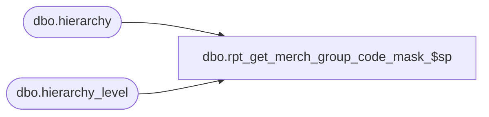

# dbo.rpt_get_merch_group_code_mask_$sp

**Database:** me_01  
**Server:** bedrockdb02  

## Architecture Diagram



## Table Dependencies

| Referenced Table |
|---|
| dbo.hierarchy |
| dbo.hierarchy_level |

## Stored Procedure Code

```sql
CREATE PROCEDURE [dbo].[rpt_get_merch_group_code_mask_$sp]
AS
Declare @hierarchy_level_id int, @hierarchy_level_mask nvarchar(20), 
		@merchandise_group_code_mask nvarchar(210), @process_more_levels bit

SELECT @merchandise_group_code_mask = '', @process_more_levels = 1

-- Get the top level mask
SELECT	@hierarchy_level_id = a.hierarchy_level_id, 
		@hierarchy_level_mask = a.hierarchy_level_mask 
FROM hierarchy_level a, hierarchy b 
WHERE b.hierarchy_type = 1 
AND b.alternate_flag = 0 
AND b.hierarchy_id = a.hierarchy_id 
AND a.parent_level_id = (SELECT a.hierarchy_level_id 
						FROM hierarchy_level a, hierarchy b 
						WHERE b.hierarchy_type = 1 
						AND b.alternate_flag = 0 
						AND b.hierarchy_id = a.hierarchy_id 
						AND a.parent_level_id IS NULL) 
						
IF @@ROWCOUNT > 0 
BEGIN
	SELECT @merchandise_group_code_mask = @merchandise_group_code_mask + @hierarchy_level_mask
	
	WHILE (@process_more_levels = 1)
	BEGIN
		-- Get the next level mask
		SELECT	@hierarchy_level_id = a.hierarchy_level_id, 
				@hierarchy_level_mask = a.hierarchy_level_mask 
		FROM hierarchy_level a, hierarchy b 
		WHERE b.hierarchy_type = 1 AND b.alternate_flag = 0 
		AND b.hierarchy_id = a.hierarchy_id AND a.parent_level_id = @hierarchy_level_id
		
		IF @@ROWCOUNT > 0 
		BEGIN
			SELECT @merchandise_group_code_mask = @merchandise_group_code_mask + N'-' + @hierarchy_level_mask
		END
		ELSE
		BEGIN
			SELECT @process_more_levels = 0
		END
	END
END 

SELECT @merchandise_group_code_mask as merchandise_group_code_mask

RETURN 0
```

