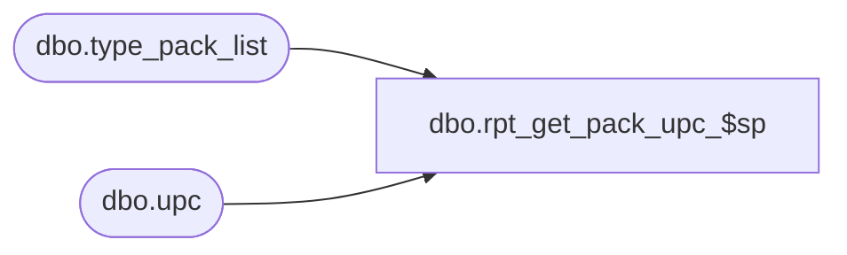

# dbo.rpt_get_pack_upc_$sp

**Database:** me_01  
**Server:** bedrockdb02  

## Architecture Diagram



## Table Dependencies

| Referenced Table |
|---|
| dbo.type_pack_list |
| dbo.upc |

## Stored Procedure Code

```sql
/*
Display pack upc 

If more than 1 Pack UPC is found, then it will display the UPC with latest activity date.
If more than 1 Pack UPC with the same activity date is found, then it will display the UPC with the latest Activation date.
If more than 1 Pack UPC with the same Activation date is found, then it will display the UPC that is the highest value (i.e. MAX(dbo.upc.upc_number))

*/
CREATE PROCEDURE [dbo].[rpt_get_pack_upc_$sp]
	(
		@type_pack_list AS type_pack_list READONLY
	)
AS

DECLARE @pack_upc_list_output AS TABLE
	(
		 pack_id DECIMAL (12, 0) NULL
		,upc_number NVARCHAR (14) NULL
		,upc_type TINYINT NULL
	)

INSERT INTO @pack_upc_list_output
	(
		 pack_id
		,upc_number
		,upc_type
	)
SELECT
	 a.pack_id
	,a.upc_number
	,a.upc_type
FROM
	(
		SELECT
			 upc.pack_id
			,upc.upc_number
			,upc.upc_type
			,RANK () OVER
						(
							PARTITION BY
								upc.pack_id
							ORDER BY
								 upc.last_activity_date DESC
								,upc.activation_date DESC
								,upc.upc_number DESC
						) AS rank_filter
			FROM
				dbo.upc
			WHERE
				upc.upc_type = 3
				AND EXISTS
					(
						SELECT
							*
						FROM
							@type_pack_list tpl
						WHERE
							tpl.pack_id = upc.pack_id
					)
	) a
WHERE
	a.rank_filter = 1

SELECT
	lstOut.*
FROM
	@pack_upc_list_output lstOut
```

