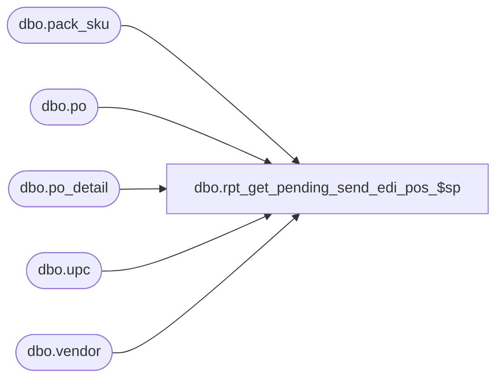

# dbo.rpt_get_pending_send_edi_pos_$sp

**Database:** me_01  
**Server:** bedrockdb02  

## Architecture Diagram



## Table Dependencies

| Referenced Table |
|---|
| dbo.pack_sku |
| dbo.po |
| dbo.po_detail |
| dbo.upc |
| dbo.vendor |

## Stored Procedure Code

```sql
CREATE PROCEDURE [dbo].[rpt_get_pending_send_edi_pos_$sp]

AS

/*
Proc name:		rpt_get_pending_send_edi_pos_$sp
Description:	Gets the PO data for the Pending Send EDI Orders Report
*/

CREATE TABLE #temp_po2(
	po_id decimal(12, 0) NOT NULL,
	po_no nvarchar(20) NULL,
	vendor_id decimal(12, 0) NULL,
	order_date smalldatetime NULL,
	edi_status smallint NULL,

	vendor_code nvarchar(20) NULL,
	vendor_name nvarchar(50) NULL,

PRIMARY KEY CLUSTERED
(
	po_id ASC
)
)

-- #temp_po_detail is created and built in the report .rdl

-- Update the temp PO hdr. table
-- NB: The criteria allowed is the same for ALL PO reports, and this includes fields below the PO header;
-- if any detail satisifies the criteria chosen by the user, the PO will be selected/included
INSERT INTO #temp_po2 (po_id, po_no, vendor_id, order_date, edi_status)
SELECT po_id, po_no, vendor_id, order_date, edi_status
FROM po WITH (NOLOCK) 
WHERE po_id IN (SELECT DISTINCT po_id FROM #temp_po_detail)

-- Delete any PO where at least 1 SKU detail does not have a vendor UPC assigned to it
DELETE FROM #temp_po2 WHERE po_id IN
(SELECT DISTINCT d.po_id
FROM #temp_po2 h
JOIN po_detail d WITH (NOLOCK) ON h.po_id = d.po_id
WHERE d.pack_id IS NULL
AND (SELECT COUNT(*) FROM upc WHERE d.sku_id = upc.sku_id AND upc.upc_type = 1) <= 0)

-- Delete any PO where at least 1 pack detail does not have a vendor UPC assigned to at least 1 of its SKUs
DELETE FROM #temp_po2 WHERE po_id IN
(SELECT DISTINCT d.po_id
FROM #temp_po2 h
JOIN po_detail d WITH (NOLOCK) ON h.po_id = d.po_id
JOIN pack_sku ps WITH (NOLOCK) ON d.pack_id = ps.pack_id
WHERE d.pack_id IS NOT NULL
AND (SELECT COUNT(*) FROM upc WHERE ps.sku_id = upc.sku_id AND upc.upc_type = 1) <= 0)

-- Get/set the vendor info
UPDATE #temp_po2
SET vendor_code = v.vendor_code,
	vendor_name = v.vendor_name
FROM #temp_po2 h
JOIN vendor v WITH (NOLOCK) ON h.vendor_id = v.vendor_id

--SELECT * FROM #temp_po2 ORDER BY po_id
--SELECT * FROM #temp_po_detail ORDER BY rec_type, po_id, po_detail_id

SELECT * FROM #temp_po2 ORDER BY po_no

-- Drop the temp tables
DROP TABLE #temp_po2
DROP TABLE #temp_po_detail


RETURN 0
```

