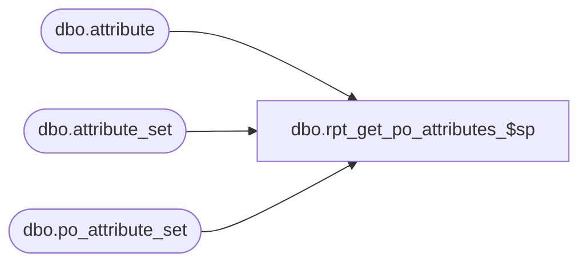

# dbo.rpt_get_po_attributes_$sp

**Database:** me_01  
**Server:** bedrockdb02  

## Architecture Diagram



## Table Dependencies

| Referenced Table |
|---|
| dbo.attribute |
| dbo.attribute_set |
| dbo.po_attribute_set |

## Stored Procedure Code

```sql
CREATE PROCEDURE [dbo].[rpt_get_po_attributes_$sp] @po_id decimal(12, 0)

AS

/*
Proc name:		rpt_get_po_attributes_$sp
Description:	Gets the PO attribute data for a PO
*/

SELECT a.attribute_code, a.attribute_label, s.attribute_set_code, s.attribute_set_label,
	p.po_id, p.attribute_id, p.attribute_set_id, p.po_attribute_set_id
FROM po_attribute_set p WITH (NOLOCK)
JOIN attribute a WITH (NOLOCK) ON p.attribute_id = a.attribute_id
JOIN attribute_set s WITH (NOLOCK) ON p.attribute_set_id = s.attribute_set_id
WHERE p.po_id = @po_id
ORDER BY a.attribute_code, s.attribute_set_code

RETURN 0
```

