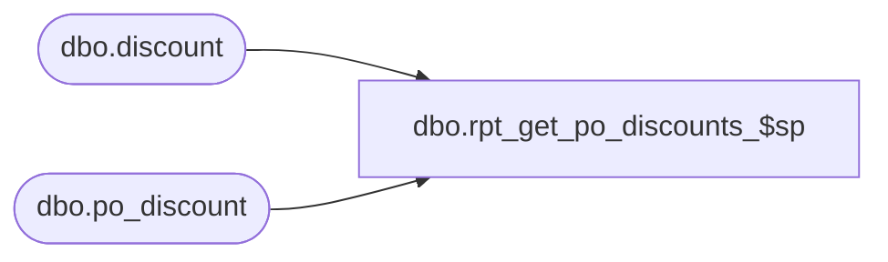

# dbo.rpt_get_po_discounts_$sp

**Database:** me_01  
**Server:** bedrockdb02  

## Architecture Diagram



## Table Dependencies

| Referenced Table |
|---|
| dbo.discount |
| dbo.po_discount |

## Stored Procedure Code

```sql
CREATE PROCEDURE [dbo].[rpt_get_po_discounts_$sp] @po_id decimal(12, 0)

AS

/*
Proc name:		rpt_get_po_discounts_$sp
Description:	Gets the PO discount data for a PO
*/

SELECT  d.discount_description, d.reflect_in_net_cost_flag, p.discount_value,
	p.po_id, p.po_discount_id, p.pct_amt, p.calculate_on
FROM po_discount p WITH (NOLOCK)
JOIN discount d WITH (NOLOCK) ON p.discount_id = d.discount_id
WHERE p.po_id = @po_id
ORDER BY d.discount_description, p.po_discount_id

RETURN 0
```

