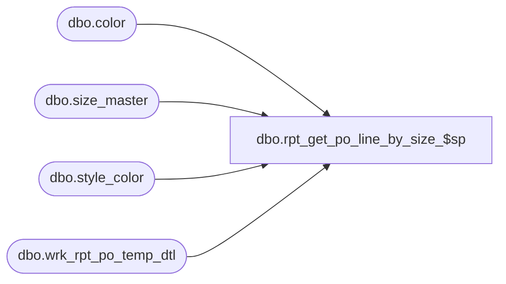

# dbo.rpt_get_po_line_by_size_$sp

**Database:** me_01  
**Server:** bedrockdb02  

## Architecture Diagram



## Table Dependencies

| Referenced Table |
|---|
| dbo.color |
| dbo.size_master |
| dbo.style_color |
| dbo.wrk_rpt_po_temp_dtl |

## Stored Procedure Code

```sql
CREATE PROCEDURE [dbo].[rpt_get_po_line_by_size_$sp] @po_id decimal(12, 0), @po_line_id smallint, @location_id smallint = null, @run_no int = 1

AS


/*
Proc name:		rpt_get_po_line_by_size_$sp
Description:	Gets the PO data for a PO line (and possibly for a specific location)
*/


DECLARE @total_color_sec_sizes INT
SET @total_color_sec_sizes = (SELECT COUNT(*) FROM
(
SELECT DISTINCT d.color_id, sm.sec_size_label, sm.sec_seq_no
FROM wrk_rpt_po_temp_dtl d WITH (NOLOCK)
JOIN size_master sm WITH (NOLOCK) ON d.size_master_id = sm.size_master_id
WHERE d.run_no = @run_no AND d.po_id = @po_id AND d.po_line_id = @po_line_id AND (d.location_id = @location_id OR @location_id iS NULL OR @location_id <= 0)
) tt)

SELECT @total_color_sec_sizes AS total_color_sec_sizes, ttt.*, tt.*, 

(SELECT SUM(d.ordered_units)
FROM wrk_rpt_po_temp_dtl d WITH (NOLOCK)
JOIN size_master sm WITH (NOLOCK) ON d.size_master_id = sm.size_master_id
WHERE d.run_no = @run_no AND d.po_id = @po_id AND d.po_line_id = @po_line_id AND (d.location_id = @location_id OR @location_id iS NULL OR @location_id <= 0)
AND d.color_id = tt.color_id AND sm.prim_size_label = ttt.prim_size_label
AND (sm.sec_size_label = tt.sec_size_label OR sm.sec_size_label IS NULL AND tt.sec_size_label IS NULL)) AS ordered_units,

(SELECT SUM(d.received_units)
FROM wrk_rpt_po_temp_dtl d WITH (NOLOCK)
JOIN size_master sm WITH (NOLOCK) ON d.size_master_id = sm.size_master_id
WHERE d.run_no = @run_no AND d.po_id = @po_id AND d.po_line_id = @po_line_id AND (d.location_id = @location_id OR @location_id iS NULL OR @location_id <= 0)
AND d.color_id = tt.color_id AND sm.prim_size_label = ttt.prim_size_label
AND (sm.sec_size_label = tt.sec_size_label OR sm.sec_size_label IS NULL AND tt.sec_size_label IS NULL)) AS received_units

FROM
(
SELECT DISTINCT c.color_code, c.color_id, sc.long_desc AS style_color_long_desc, sm.sec_size_label, sm.sec_seq_no
FROM wrk_rpt_po_temp_dtl d WITH (NOLOCK)
JOIN color c WITH (NOLOCK) ON d.color_id = c.color_id
JOIN size_master sm WITH (NOLOCK) ON d.size_master_id = sm.size_master_id
JOIN style_color sc WITH (NOLOCK) ON d.style_id = sc.style_id AND d.color_id = sc.color_id
WHERE d.run_no = @run_no AND d.po_id = @po_id AND d.po_line_id = @po_line_id AND (d.location_id = @location_id OR @location_id iS NULL OR @location_id <= 0)
) tt,

(SELECT DISTINCT sm.prim_size_label, sm.prim_seq_no
FROM wrk_rpt_po_temp_dtl d WITH (NOLOCK)
JOIN size_master sm WITH (NOLOCK) ON d.size_master_id = sm.size_master_id
WHERE d.run_no = @run_no AND d.po_id = @po_id AND d.po_line_id = @po_line_id AND (d.location_id = @location_id OR @location_id iS NULL OR @location_id <= 0)
) ttt
ORDER BY ttt.prim_seq_no, tt.color_code, tt.sec_seq_no


DELETE FROM wrk_rpt_po_temp_dtl
WHERE run_no = @run_no AND po_id = @po_id AND po_line_id = @po_line_id AND (location_id = @location_id OR @location_id iS NULL OR @location_id <= 0)


RETURN 0
```

