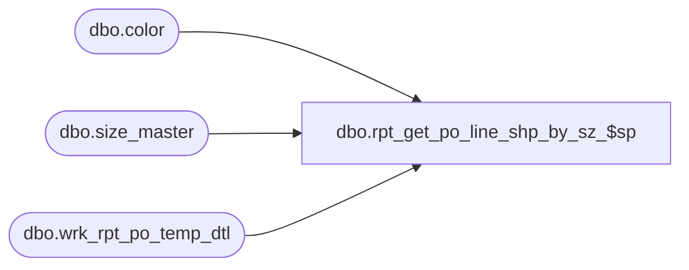

# dbo.rpt_get_po_line_shp_by_sz_$sp

**Database:** me_01  
**Server:** bedrockdb02  

## Architecture Diagram



## Table Dependencies

| Referenced Table |
|---|
| dbo.color |
| dbo.size_master |
| dbo.wrk_rpt_po_temp_dtl |

## Stored Procedure Code

```sql
CREATE PROCEDURE [dbo].[rpt_get_po_line_shp_by_sz_$sp] @po_id decimal(12, 0), @po_line_id smallint, @location_id smallint, @po_shipment_id smallint, @run_no int = 1, @predistribution_type smallint = 2

AS


/*
Proc name:		rpt_get_po_line_shp_by_sz_$sp
Description:	Gets the PO data for a PO line / location / shipment
*/


DECLARE @total_colors INT = 1

IF (@predistribution_type = 2 AND @run_no > 0)
BEGIN

	SET @total_colors = (SELECT COUNT(*) FROM
	(
	SELECT DISTINCT d.color_id
	FROM wrk_rpt_po_temp_dtl d WITH (NOLOCK)
	WHERE d.run_no = @run_no AND d.po_id = @po_id AND d.po_line_id = @po_line_id AND d.location_id = @location_id AND d.po_shipment_id = @po_shipment_id
	) tt)

	SELECT @total_colors AS total_colors, ttt.*, tt.*,

	(SELECT SUM(CASE WHEN d.ordered_units > d.received_units THEN d.ordered_units - d.received_units ELSE 0 END)
	FROM wrk_rpt_po_temp_dtl d WITH (NOLOCK)
	WHERE d.run_no = @run_no AND d.po_id = @po_id AND d.po_line_id = @po_line_id AND d.location_id = @location_id AND d.po_shipment_id = @po_shipment_id
	AND d.sku_id = ttt.sku_id AND tt.color_id = ttt.col_color_id) AS units_on_order

	FROM
	(
	SELECT DISTINCT c.color_code, c.color_id, d.style_color_long_desc
	FROM wrk_rpt_po_temp_dtl d WITH (NOLOCK)
	JOIN color c WITH (NOLOCK) ON d.color_id = c.color_id
	WHERE d.run_no = @run_no AND d.po_id = @po_id AND d.po_line_id = @po_line_id AND d.location_id = @location_id AND d.po_shipment_id = @po_shipment_id
	) tt,

	(SELECT sm.size_code, sm.prim_seq_no, sm.sec_seq_no, d.upc_number, d.color_id AS col_color_id, c.color_code AS col_color_code, d.sku_id, d.unit_retail_val
	FROM wrk_rpt_po_temp_dtl d WITH (NOLOCK)
	JOIN color c WITH (NOLOCK) ON d.color_id = c.color_id
	JOIN size_master sm WITH (NOLOCK) ON d.size_master_id = sm.size_master_id
	WHERE d.run_no = @run_no AND d.po_id = @po_id AND d.po_line_id = @po_line_id AND d.location_id = @location_id AND d.po_shipment_id = @po_shipment_id
	) ttt
	ORDER BY ttt.col_color_code, ttt.prim_seq_no, ttt.sec_seq_no, tt.color_code

	DELETE FROM wrk_rpt_po_temp_dtl
	WHERE run_no = @run_no AND po_id = @po_id AND po_line_id = @po_line_id AND location_id = @location_id AND po_shipment_id = @po_shipment_id
END

ELSE
BEGIN
	SELECT @total_colors AS total_colors, '' AS size_code, 0 AS prim_seq_no, 0 AS sec_seq_no,
	'' AS upc_number, 0 AS col_color_id, '' AS col_color_code, 0 AS sku_id, '' AS color_code,
	0 AS color_id, '' AS style_color_long_desc, NULL AS units_on_order
END

RETURN 0
```

