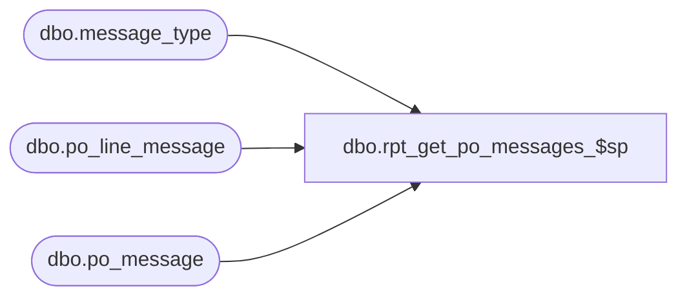

# dbo.rpt_get_po_messages_$sp

**Database:** me_01  
**Server:** bedrockdb02  

## Architecture Diagram



## Table Dependencies

| Referenced Table |
|---|
| dbo.message_type |
| dbo.po_line_message |
| dbo.po_message |

## Stored Procedure Code

```sql
CREATE PROCEDURE [dbo].[rpt_get_po_messages_$sp] @po_id decimal(12, 0), @po_line_id smallint = NULL, @only_printable_messages bit = 0

AS

/*
Proc name:		rpt_get_po_messages_$sp
Description:	Gets the PO message data for a PO line or header
*/

IF (@po_line_id <= 0 OR @po_line_id IS NULL)
BEGIN
	SELECT p.po_id, NULL AS po_line_id, p.message_type_id, p.message, mt.message_type_description
	FROM po_message p WITH (NOLOCK)
	JOIN message_type mt WITH (NOLOCK) ON p.message_type_id = mt.message_type_id
	WHERE p.po_id = @po_id AND (mt.print_message_for_vendor_flag = 1 OR @only_printable_messages = 0)
	ORDER BY mt.message_type_description, p.message
END

ELSE
BEGIN
	SELECT p.po_id, p.po_line_id, p.message_type_id, p.message, mt.message_type_description
	FROM po_line_message p WITH (NOLOCK)
	JOIN message_type mt WITH (NOLOCK) ON p.message_type_id = mt.message_type_id
	WHERE p.po_id = @po_id AND p.po_line_id = @po_line_id AND (mt.print_message_for_vendor_flag = 1 OR @only_printable_messages = 0)
	ORDER BY mt.message_type_description, p.message
END


RETURN 0
```

