# dbo.rpt_get_po_receipt_$sp

**Database:** me_01  
**Server:** bedrockdb02  

## Architecture Diagram

```mermaid
flowchart LR
    SP["dbo.rpt_get_po_receipt_$sp"]
    dbo_advance_shipping_notice(["dbo.advance_shipping_notice"]) --> SP
    dbo_calendar_year(["dbo.calendar_year"]) --> SP
    dbo_carrier(["dbo.carrier"]) --> SP
    dbo_color(["dbo.color"]) --> SP
    dbo_container_type(["dbo.container_type"]) --> SP
    dbo_currency(["dbo.currency"]) --> SP
    dbo_discount(["dbo.discount"]) --> SP
    dbo_get_pricing__sp(["dbo.get_pricing_$sp"]) --> SP
    dbo_hierarchy_group(["dbo.hierarchy_group"]) --> SP
    dbo_ib_on_order_total(["dbo.ib_on_order_total"]) --> SP
    dbo_ib_pack_on_order_total(["dbo.ib_pack_on_order_total"]) --> SP
    dbo_jurisdiction(["dbo.jurisdiction"]) --> SP
    dbo_location(["dbo.location"]) --> SP
    dbo_message_type(["dbo.message_type"]) --> SP
    dbo_pack(["dbo.pack"]) --> SP
    dbo_pack_sku(["dbo.pack_sku"]) --> SP
    dbo_po(["dbo.po"]) --> SP
    dbo_po_detail(["dbo.po_detail"]) --> SP
    dbo_po_discount(["dbo.po_discount"]) --> SP
    dbo_po_line(["dbo.po_line"]) --> SP
    dbo_po_line_message(["dbo.po_line_message"]) --> SP
    dbo_rpt_get_pack_upc__sp(["dbo.rpt_get_pack_upc_$sp"]) --> SP
    dbo_rpt_get_upc__sp(["dbo.rpt_get_upc_$sp"]) --> SP
    dbo_season(["dbo.season"]) --> SP
    dbo_ship_via(["dbo.ship_via"]) --> SP
    dbo_size_master(["dbo.size_master"]) --> SP
    dbo_sku(["dbo.sku"]) --> SP
    dbo_style(["dbo.style"]) --> SP
    dbo_style_color(["dbo.style_color"]) --> SP
    dbo_style_group(["dbo.style_group"]) --> SP
    dbo_style_retail(["dbo.style_retail"]) --> SP
    dbo_style_size(["dbo.style_size"]) --> SP
    dbo_style_vendor(["dbo.style_vendor"]) --> SP
    dbo_ticket_format(["dbo.ticket_format"]) --> SP
    dbo_transaction_reason(["dbo.transaction_reason"]) --> SP
    dbo_type_pack_list(["dbo.type_pack_list"]) --> SP
    dbo_type_sku_list(["dbo.type_sku_list"]) --> SP
    dbo_unit(["dbo.unit"]) --> SP
    dbo_vendor(["dbo.vendor"]) --> SP
```



## Table Dependencies

| Referenced Table |
|---|
| dbo.advance_shipping_notice |
| dbo.calendar_year |
| dbo.carrier |
| dbo.color |
| dbo.container_type |
| dbo.currency |
| dbo.discount |
| dbo.get_pricing_$sp |
| dbo.hierarchy_group |
| dbo.ib_on_order_total |
| dbo.ib_pack_on_order_total |
| dbo.jurisdiction |
| dbo.location |
| dbo.message_type |
| dbo.pack |
| dbo.pack_sku |
| dbo.po |
| dbo.po_detail |
| dbo.po_discount |
| dbo.po_line |
| dbo.po_line_message |
| dbo.rpt_get_pack_upc_$sp |
| dbo.rpt_get_upc_$sp |
| dbo.season |
| dbo.ship_via |
| dbo.size_master |
| dbo.sku |
| dbo.style |
| dbo.style_color |
| dbo.style_group |
| dbo.style_retail |
| dbo.style_size |
| dbo.style_vendor |
| dbo.ticket_format |
| dbo.transaction_reason |
| dbo.type_pack_list |
| dbo.type_sku_list |
| dbo.unit |
| dbo.vendor |

## Stored Procedure Code

```sql
CREATE PROCEDURE [dbo].[rpt_get_po_receipt_$sp]

AS

DECLARE @current_date AS SMALLDATETIME = GETDATE()

BEGIN

----po
UPDATE #tbl_po_receipt
SET po_number = po.po_no,
special_order_flag = po.special_order_flag,
cancel_date = po.system_cancel_date
FROM #tbl_po_receipt por WITH(NOLOCK), po WITH(NOLOCK)
WHERE por.po_id = po.po_id

----asn docuemnt no.
UPDATE #tbl_po_receipt
SET document_no_asn = asn.document_no
FROM #tbl_po_receipt por WITH(NOLOCK), advance_shipping_notice asn WITH(NOLOCK)
WHERE por.advance_shipping_notice_id = asn.advance_shipping_notice_id

----Reason
UPDATE #tbl_po_receipt
SET transaction_reason_desc = tr.transaction_reason_desc,
transaction_reason_code = tr.transaction_reason_code
FROM #tbl_po_receipt por WITH(NOLOCK), transaction_reason tr WITH(NOLOCK)
WHERE por.transaction_reason_id = tr.transaction_reason_id

----Ship via
UPDATE #tbl_po_receipt
SET ship_via_description = shv.ship_via_description
FROM #tbl_po_receipt por WITH(NOLOCK), ship_via shv WITH(NOLOCK)
WHERE por.ship_via_id = shv.ship_via_id

----carrier
UPDATE #tbl_po_receipt
SET carrier_name = ca.carrier_name
FROM #tbl_po_receipt por WITH(NOLOCK), carrier ca WITH(NOLOCK)
WHERE por.carrier_id = ca.carrier_id

--vendor
UPDATE #tbl_po_receipt
SET vendor_code = v.vendor_code,
vendor_name = v.vendor_name
FROM #tbl_po_receipt por WITH(NOLOCK), vendor v WITH(NOLOCK), po WITH(NOLOCK)
WHERE por.po_id = po.po_id
AND po.vendor_id = v.vendor_id

--location
UPDATE #tbl_po_receipt
SET location_code = loc.location_code,
location_name = loc.location_name
FROM #tbl_po_receipt por WITH(NOLOCK), location loc WITH(NOLOCK)
WHERE por.location_id = loc.location_id

--currency code
UPDATE #tbl_po_receipt
SET currency_symbol = cr.currency_symbol,
currency_code = cr.currency_code
FROM #tbl_po_receipt por WITH(NOLOCK), currency cr WITH(NOLOCK), po WITH(NOLOCK)
WHERE por.po_id = po.po_id
AND po.currency_id = cr.currency_id

--jurisdiction id
UPDATE #tbl_po_receipt
SET jurisdiction_id = j.jurisdiction_id
FROM #tbl_po_receipt por WITH(NOLOCK), currency cr WITH(NOLOCK), jurisdiction j WITH(NOLOCK), location loc WITH(NOLOCK)
WHERE por.location_id = loc.location_id
AND loc.jurisdiction_id = j.jurisdiction_id

--unit label
UPDATE #tbl_po_receipt
SET unit_label = uw.unit_label
FROM #tbl_po_receipt por WITH(NOLOCK), unit uw WITH(NOLOCK)
WHERE por.unit_weight_id = uw.unit_id

--PO Discount
UPDATE #tbl_po_receipt
SET pct_amt = pod.pct_amt,
discount_value = pod.discount_value,
calculate_on = pod.calculate_on,
sequence = pod.sequence,
reflect_in_discount_cost_flag = pod.reflect_in_discount_cost_flag,
reflect_in_net_cost_flag = d.reflect_in_net_cost_flag
FROM #tbl_po_receipt por WITH(NOLOCK), po_discount pod WITH(NOLOCK), discount d WITH(NOLOCK)
WHERE por.po_id = pod.po_id
AND pod.discount_id = d.discount_id

--container type
UPDATE #tbl_po_receipt
SET container_type_label = ct.container_type_label,
container_type_code = ct.container_type_code
FROM #tbl_po_receipt por WITH(NOLOCK), container_type ct WITH(NOLOCK)
WHERE por.container_type_id = ct.container_type_id


--style
UPDATE #tbl_po_receipt_details
SET style_code = s.style_code,
style_type = s.style_type,
short_desc = s.short_desc
FROM #tbl_po_receipt_details pord WITH(NOLOCK), style s WITH(NOLOCK)
WHERE pord.style_id = s.style_id


--season code
UPDATE #tbl_po_receipt_details
SET season_code = seas.season_code,
season_description = seas.season_description,
year_required_flag = seas.year_required_flag
FROM #tbl_po_receipt_details pord WITH(NOLOCK), style s WITH(NOLOCK), season seas WITH(NOLOCK)
WHERE pord.style_id = s.style_id
AND s.season_id = seas.season_id

--compare at retail
UPDATE #tbl_po_receipt_details
SET compare_at_retail = sr.compare_at_retail
FROM #tbl_po_receipt_details pord WITH(NOLOCK), style_retail sr WITH(NOLOCK)
WHERE pord.style_id = sr.style_id

--jurisdiction_id, location_id, create_date
UPDATE #tbl_po_receipt_details
SET jurisdiction_id = por.jurisdiction_id,
location_id = por.location_id,
create_date = por.create_date
FROM #tbl_po_receipt por WITH(NOLOCK), #tbl_po_receipt_details pord WITH(NOLOCK)
WHERE por.po_receipt_id = pord.po_receipt_id

--units on order without pack
UPDATE #tbl_po_receipt_details
SET total_on_order_cost = ib.total_on_order_cost ,
total_on_order_units = ib.total_on_order_units ,
total_on_order_val_retail = ib.total_on_order_val_retail,
total_on_order_selling_retail = ib.total_on_order_selling_retail
FROM #tbl_po_receipt por WITH(NOLOCK), #tbl_po_receipt_details pord WITH(NOLOCK), ib_on_order_total ib WITH(NOLOCK), po WITH(NOLOCK)
WHERE ib.sku_id = pord.sku_id
AND ib.pack_id is NULL
AND ib.location_id = por.location_id
AND por.po_id = po.po_id
AND ib.document_number = po.po_no

--Units ordered
UPDATE #tbl_po_receipt_details
SET ordered_units = uo.ordered_units,
ordered_units_pack = uo.ordered_units_pack
FROM #tbl_po_receipt_details pord WITH(NOLOCK), #tbl_units_ordered uo WITH(NOLOCK)
WHERE pord.po_receipt_detail_id = uo.po_receipt_detail_id

--POM Message
UPDATE #tbl_po_receipt_details
SET message = pol.message
FROM #tbl_po_receipt por WITH(NOLOCK), #tbl_po_receipt_details pord WITH(NOLOCK), po_detail pod WITH(NOLOCK),
po_line_message pol WITH(NOLOCK), message_type mt WITH(NOLOCK)
WHERE por.po_id = pod.po_id
AND pord.sku_id = pod.sku_id
AND pol.po_id = pod.po_id
AND pol.po_line_id = pod.po_line_id
AND pol.message_type_id = mt.message_type_id
AND mt.print_on_po_receipt_flag = 1

--Retrieve upc for sku
--type_sku_list is user defined Table type
DECLARE @sku_list AS type_sku_list

DECLARE @sku_upc_list_output AS TABLE
	(
		 sku_id DECIMAL (13, 0) NULL
		,upc_number NVARCHAR (14) NULL
		,upc_type TINYINT NULL
	)

--populate sku list to send to the rpt_get_upc_$sp stored proc
INSERT INTO @sku_list
	(
		sku_id
	)
SELECT
	sku_id
FROM
	#tbl_po_receipt_details
WHERE sku_id IS NOT NULL

--capture the output from the rpt_get_upc_$sp stored proc
INSERT INTO
	@sku_upc_list_output

EXECUTE dbo.rpt_get_upc_$sp

	@type_sku_list = @sku_list

--Update upc_number, upc_type
UPDATE #tbl_po_receipt_details
SET upc_number=list.upc_number
FROM #tbl_po_receipt_details dsku WITH (NOLOCK), @sku_upc_list_output list
WHERE dsku.sku_id = list.sku_id

--Gross and net final cost
UPDATE #tbl_po_receipt_details
SET line_no = pol.line_no,
first_cost = pol.first_cost,
net_final_cost = pol.net_final_cost
FROM #tbl_po_receipt_details pord WITH(NOLOCK), po_line pol WITH(NOLOCK), #tbl_po_receipt por WITH(NOLOCK),
po_detail pod WITH(NOLOCK)
WHERE por.po_id = pol.po_id
AND por.po_receipt_id = pord.po_receipt_id
AND pord.style_color_id = pol.style_color_id
AND por.po_id = pod.po_id
AND pord.sku_id = pod.sku_id
AND pod.po_line_id = pol.po_line_id


--size
UPDATE #tbl_po_receipt_details
SET size_code = sm.size_code,
prim_seq_no = sm.prim_seq_no,
sec_seq_no = sm.sec_seq_no
FROM #tbl_po_receipt_details pord WITH(NOLOCK), sku WITH(NOLOCK), style_size stsz WITH(NOLOCK),
size_master sm WITH(NOLOCK)
WHERE pord.sku_id = sku.sku_id
AND sku.style_size_id = stsz.style_size_id
AND stsz.size_master_id = sm.size_master_id

--hierarchy group
UPDATE #tbl_po_receipt_details
SET hierarchy_group_code = hn.hierarchy_group_code,
hierarchy_group_label = hn.hierarchy_group_short_label
FROM #tbl_po_receipt_details pord WITH(NOLOCK), style_group sg WITH(NOLOCK), hierarchy_group hn WITH(NOLOCK), pack p WITH(NOLOCK)
WHERE pord.style_id = sg.style_id
AND sg.main_group_flag = 1
AND sg.hierarchy_group_id = hn.hierarchy_group_id

--Ticket format
UPDATE #tbl_po_receipt_details
SET ticket_format_code = tf.ticket_format_code,
ticket_format_description = tf.ticket_format_description
FROM #tbl_po_receipt_details pord WITH(NOLOCK), style s WITH(NOLOCK), ticket_format tf WITH(NOLOCK)
WHERE pord.style_id = s.style_id
AND s.ticket_format_id = tf.ticket_format_id

--pack
UPDATE #tbl_po_receipt_details
SET pack_code = p.pack_code,
pack_description = p.pack_description
FROM #tbl_po_receipt_details pord WITH(NOLOCK), pack p WITH(NOLOCK)
WHERE pord.pack_id = p.pack_id

-- color
UPDATE #tbl_po_receipt_details
SET color_code = c.color_code,
long_desc = sc.long_desc,
color_id = c.color_id
FROM #tbl_po_receipt_details pord WITH(NOLOCK), style_color sc WITH(NOLOCK), color c WITH(NOLOCK)
WHERE pord.style_color_id = sc.style_color_id
AND sc.color_id = c.color_id

--calender year code
UPDATE #tbl_po_receipt_details
SET calendar_year_code = cy.calendar_year_code
FROM #tbl_po_receipt_details pord WITH(NOLOCK), style s WITH(NOLOCK), calendar_year cy  WITH(NOLOCK)
WHERE pord.style_id = s.style_id
AND s.calendar_year_id = cy.calendar_year_id

--vendor style
UPDATE #tbl_po_receipt_details
SET vendor_style = sv.vendor_style
FROM #tbl_po_receipt por WITH(NOLOCK), #tbl_po_receipt_details pord WITH(NOLOCK), style_vendor sv WITH(NOLOCK), po WITH(NOLOCK)
WHERE pord.style_id = sv.style_id
AND por.po_id = po.po_id
AND po.vendor_id = sv.vendor_id
AND por.po_receipt_id = pord.po_receipt_id

--Ticket format
UPDATE #tbl_po_receipt_details
SET ticket_format_code_pack = tf.ticket_format_code,
ticket_format_description_pack = tf.ticket_format_description
FROM #tbl_po_receipt_details pord WITH(NOLOCK), style s WITH(NOLOCK), ticket_format tf WITH(NOLOCK), pack p WITH(NOLOCK)
WHERE p.style_id = s.style_id
AND s.ticket_format_id = tf.ticket_format_id
AND pord.pack_id_pack = p.pack_id

--style and season
UPDATE #tbl_po_receipt_details
SET style_code_pack = s.style_code,
style_type_pack = s.style_type,
short_desc_pack = s.short_desc,
season_code_pack = seas.season_code,
season_description_pack = seas.season_description,
compare_at_retail_pack = sr.compare_at_retail,
year_required_flag_pack = seas.year_required_flag
FROM #tbl_po_receipt por WITH(NOLOCK),  #tbl_po_receipt_details pord WITH(NOLOCK), style s WITH(NOLOCK),
season seas WITH(NOLOCK), po WITH(NOLOCK), style_retail sr WITH(NOLOCK), location loc WITH(NOLOCK), pack p WITH(NOLOCK)
WHERE por.location_id = loc.location_id
AND pord.pack_id_pack = p.pack_id
AND p.style_id = s.style_id
AND s.style_id = sr.style_id
AND sr.jurisdiction_id = loc.jurisdiction_id
AND s.season_id = seas.season_id

--pack and vendor style
UPDATE #tbl_po_receipt_details
SET pack_code_pack = p.pack_code,
pack_description_pack = p.pack_short_description,
vendor_style_pack = sv.vendor_style
FROM #tbl_po_receipt_details pord WITH(NOLOCK), pack p WITH(NOLOCK), style_vendor sv WITH(NOLOCK)
WHERE pord.pack_id_pack = p.pack_id
AND p.style_id = sv.style_id
AND p.vendor_id = sv.vendor_id

--hierarchy group
UPDATE #tbl_po_receipt_details
SET hierarchy_group_code_pack = hn.hierarchy_group_code,
hierarchy_group_label_pack = hn.hierarchy_group_short_label
FROM #tbl_po_receipt_details pord WITH(NOLOCK), style_group sg WITH(NOLOCK), hierarchy_group hn WITH(NOLOCK), pack p WITH(NOLOCK)
WHERE p.style_id = sg.style_id
AND pord.pack_id_pack = p.pack_id
AND sg.main_group_flag = 1
AND sg.hierarchy_group_id = hn.hierarchy_group_id

--Retrieve upc for pack
--type_pack_list is user defined Table type
DECLARE @pack_list AS type_pack_list

DECLARE @pack_upc_list_output AS TABLE
	(
		 pack_id DECIMAL (13, 0) NULL
		,upc_number NVARCHAR (14) NULL
		,upc_type TINYINT NULL
	)

--populate pack list to send to the rpt_get_pack_upc_$sp stored proc
INSERT INTO @pack_list
	(
		pack_id
	)
SELECT
	pack_id_pack
FROM
	#tbl_po_receipt_details
WHERE pack_id_pack IS NOT NULL

--capture the output from the rpt_get_pack_upc_$sp stored proc
INSERT INTO
	@pack_upc_list_output

EXECUTE dbo.rpt_get_pack_upc_$sp

	@type_pack_list = @pack_list

--Update upc_number_pack, upc_type
UPDATE #tbl_po_receipt_details
SET upc_number_pack=list.upc_number
FROM #tbl_po_receipt_details dsku WITH (NOLOCK), @pack_upc_list_output list
WHERE dsku.pack_id_pack = list.pack_id


--Gross and net final cost
UPDATE #tbl_po_receipt_details
SET line_no_pack = pol.line_no,
first_cost_pack = pol.first_cost,
net_final_cost_pack = pol.net_final_cost
FROM  #tbl_po_receipt_details pord WITH(NOLOCK), po_line pol WITH(NOLOCK), #tbl_po_receipt por WITH(NOLOCK),
po_detail pod WITH(NOLOCK)
WHERE por.po_id = pol.po_id
AND por.po_receipt_id = pord.po_receipt_id
AND pord.pack_id_pack = pol.pack_id
AND por.po_id = pod.po_id

--POM Message
UPDATE #tbl_po_receipt_details
SET message_pack = pol.message
FROM #tbl_po_receipt por WITH(NOLOCK), #tbl_po_receipt_details pord WITH(NOLOCK), po_detail pod WITH(NOLOCK),
po_line_message pol WITH(NOLOCK), message_type mt WITH(NOLOCK)
WHERE por.po_id = pod.po_id
AND pord.pack_id_pack = pod.pack_id
AND pol.po_id = pod.po_id
AND pol.po_line_id = pod.po_line_id
AND pol.message_type_id = mt.message_type_id
AND mt.print_on_po_receipt_flag = 1

----units on order with pack
UPDATE #tbl_po_receipt_details
SET total_on_order_units_pack = t.total_on_order_units
FROM pack_sku p WITH(NOLOCK), ib_pack_on_order_total t WITH(NOLOCK), #tbl_po_receipt_details pord WITH(NOLOCK)
WHERE t.pack_id = p.pack_id AND p.pack_id in (select pack_id from pack_sku where sku_id = pord.sku_id_pack)
 AND p.sku_id = pord.sku_id_pack
 AND t.total_on_order_units > 0

--pack sku quantity
UPDATE #tbl_po_receipt_details
SET sku_quantity = ps.sku_quantity
FROM #tbl_po_receipt_details pord WITH(NOLOCK)
JOIN ( SELECT pack_id, SUM(sku_quantity) as sku_quantity FROM pack_sku ps GROUP BY pack_id) ps ON pord.pack_id_pack = ps.pack_id


IF OBJECT_ID (N'tempdb.dbo.#temp_wrk_price_lookup',  N'U') IS NOT NULL
BEGIN

	DROP TABLE dbo.#temp_wrk_price_lookup

END

CREATE TABLE dbo.#temp_wrk_price_lookup

	(
			jurisdiction_id SMALLINT NULL
           ,location_id SMALLINT NULL
           ,style_id DECIMAL (12, 0) NULL
           ,style_color_id DECIMAL(13,0) NULL
           ,color_id SMALLINT NULL
           ,sku_id DECIMAL (13, 0) NULL
           ,pack_id  DECIMAL (13, 0) NULL
	)

IF OBJECT_ID (N'tempdb.dbo.#temp_effective_retail',  N'U') IS NOT NULL
BEGIN

	DROP TABLE dbo.#temp_effective_retail

END

CREATE TABLE #temp_effective_retail

	(
		 transaction_date SMALLDATETIME
           ,jurisdiction_id SMALLINT NULL
           ,location_id SMALLINT NULL
           ,style_id DECIMAL (12, 0) NULL
           ,style_color_id DECIMAL(13,0) NULL
           ,color_id SMALLINT NULL
           ,price_status_id SMALLINT NULL
           ,valuation_unit_retail DECIMAL(14,2) NULL
           ,selling_unit_retail DECIMAL(14,2) NULL
           ,sku_id DECIMAL (13, 0) NULL
           ,pack_id  DECIMAL (13, 0) NULL
           ,sku_quantity int NULL
	)


	IF OBJECT_ID (N'tempdb.dbo.#temp_sku_in_pack',  N'U') IS NOT NULL
BEGIN

	DROP TABLE dbo.#temp_sku_in_pack

END

CREATE TABLE dbo.#temp_sku_in_pack

	(

		pack_id  DECIMAL (13, 0) NULL
           ,sku_id DECIMAL (13, 0) NULL
           ,sku_quantity int NULL
           ,jurisdiction_id SMALLINT NULL
           ,location_id SMALLINT NULL
           ,style_id DECIMAL (12, 0) NULL
           ,style_color_id DECIMAL(13,0) NULL
           ,color_id SMALLINT NULL
	)

insert into dbo.#temp_sku_in_pack (pack_id, sku_id, sku_quantity, jurisdiction_id, location_id, style_id)
(select DISTINCT ps.pack_id, ps.sku_id, ps.sku_quantity, prd.jurisdiction_id, prd.location_id, prd.style_id
From #tbl_po_receipt_details prd, pack_sku ps
where ps.pack_id = prd.pack_id_pack)

update dbo.#temp_sku_in_pack
Set style_color_id = sku.style_color_id
,color_id = sc.color_id
From dbo.#temp_sku_in_pack sp
inner join sku on sku.sku_id = sp.sku_id
inner join style_color sc on sc.style_color_id = sku.style_color_id

insert into #temp_wrk_price_lookup (location_id, sku_id, jurisdiction_id, style_id, color_id, style_color_id, pack_id)
SELECT location_id, sku_id, jurisdiction_id, style_id, color_id, style_color_id, pack_id
FROM #tbl_po_receipt_details
WHERE counts = 0
AND sku_id is not null

exec get_pricing_$sp
@Date=@current_date
,@Sales_Posting_Mode = 2

UPDATE #tbl_po_receipt_details
SET valuation_retail_price = valuation_unit_retail,
selling_retail_price = selling_unit_retail,
counts = 1
FROM #tbl_po_receipt_details dsku WITH(NOLOCK)
,#temp_effective_retail tpp WITH(NOLOCK)
WHERE dsku.location_id = tpp.location_id
AND (dsku.sku_id = tpp.sku_id)
AND dsku.sku_id is not null
AND counts = 0

 WHILE EXISTS (SELECT * FROM #tbl_po_receipt_details WHERE pack_id_pack IS NOT NULL AND counts = 0)
BEGIN


		   TRUNCATE TABLE #temp_wrk_price_lookup

		   TRUNCATE TABLE dbo.#temp_effective_retail

		    insert into #temp_wrk_price_lookup (location_id, jurisdiction_id, style_id, color_id, style_color_id, sku_id, pack_id)
           SELECT prd.location_id, prd.jurisdiction_id, prd.style_id, sp.color_id, sp.style_color_id, sp.sku_id, -sp.pack_id
           FROM #tbl_po_receipt_details prd
           Inner join  #temp_sku_in_pack sp on sp.pack_id = pack_id_pack
           WHERE counts = 0
           and pack_id_pack = (SELECT TOP 1 pack_id_pack FROM #tbl_po_receipt_details WHERE pack_id_pack IS NOT NULL AND counts = 0)

		   exec get_pricing_$sp
					@Date=@current_date
					,@Sales_Posting_Mode = 2

				IF((select count(DISTINCT color_id) from #temp_wrk_price_lookup WHERE pack_id = (SELECT TOP 1 -pack_id_pack FROM #tbl_po_receipt_details WHERE pack_id_pack IS NOT NULL AND counts = 0)) > 1
				AND (select count(DISTINCT sku_id) from dbo.#temp_sku_in_pack where pack_id = (SELECT TOP 1 pack_id_pack FROM #tbl_po_receipt_details WHERE pack_id_pack IS NOT NULL AND counts = 0)) > 1
			   AND (select COUNT(DISTINCT selling_unit_retail) FROM dbo.#temp_effective_retail) > 1)
		   BEGIN

			   TRUNCATE TABLE dbo.#temp_effective_retail

		   exec get_pricing_$sp
           @Date=@current_date
           ,@Sales_Posting_Mode = 2
			,@Include_Exception_Color_SKU = 0
			,@Include_Exception_Color_SKU_Location = 0
					,@Include_Exception_Color_Location = 0
					, @Include_Exception_Color = 0

		   END
		   ELSE
			   IF((select count(DISTINCT color_id) from #temp_wrk_price_lookup WHERE pack_id = (SELECT TOP 1 -pack_id_pack FROM #tbl_po_receipt_details WHERE pack_id_pack IS NOT NULL AND counts = 0)) = 1 AND
				(select count(DISTINCT sku_id) from dbo.#temp_sku_in_pack where pack_id = (SELECT TOP 1 pack_id_pack FROM #tbl_po_receipt_details WHERE pack_id_pack IS NOT NULL AND counts = 0)) > 1 AND
				(select COUNT(DISTINCT selling_unit_retail) FROM dbo.#temp_effective_retail) > 1)
		   BEGIN

					TRUNCATE TABLE dbo.#temp_effective_retail

		   exec get_pricing_$sp
           @Date=@current_date
           ,@Sales_Posting_Mode = 2
			,@Include_Exception_Color_SKU = 0
			,@Include_Exception_Color_SKU_Location = 0

		   END


           update dbo.#temp_effective_retail
           set pack_id =  wpl.pack_id
           ,sku_quantity = sp.sku_quantity
           From #temp_wrk_price_lookup wpl, dbo.#temp_effective_retail ter, dbo.#temp_sku_in_pack sp
           where wpl.jurisdiction_id = ter.jurisdiction_id
           AND wpl.location_id = ter.location_id
           AND wpl.style_id = ter.style_id
           AND wpl.style_color_id = ter.style_color_id
           AND wpl.color_id = ter.color_id
           AND wpl.sku_id = ter.sku_id
           AND wpl.pack_id is not null
           AND sp.sku_id = ter.sku_id

          UPDATE #tbl_po_receipt_details
           SET valuation_retail_price = valuation_unit_retail
		   , selling_retail_price = selling_unit_retail
		   , counts = 1
           FROM #tbl_po_receipt_details dsku WITH(NOLOCK)
           ,#temp_effective_retail tpp WITH(NOLOCK)
           WHERE dsku.location_id = tpp.location_id
           AND (tpp.pack_id = -pack_id_pack)
           AND counts = 0


END

END
```

