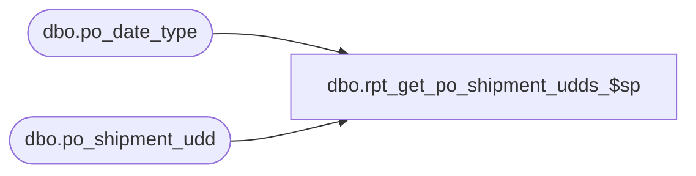

# dbo.rpt_get_po_shipment_udds_$sp

**Database:** me_01  
**Server:** bedrockdb02  

## Architecture Diagram



## Table Dependencies

| Referenced Table |
|---|
| dbo.po_date_type |
| dbo.po_shipment_udd |

## Stored Procedure Code

```sql
CREATE PROCEDURE [dbo].[rpt_get_po_shipment_udds_$sp] @po_id decimal(12, 0)

AS

/*
Proc name:		rpt_get_po_shipment_udds_$sp
Description:	Gets the PO shipment user-defined dates for a PO
*/

SELECT pd.date_type_code, pd.description, ud.user_defined_date, ud.po_id, ud.po_shipment_udd_id
FROM po_shipment_udd ud WITH (NOLOCK)
JOIN po_date_type pd WITH (NOLOCK) ON ud.po_date_type_id = pd.po_date_type_id
WHERE ud.po_id = @po_id
ORDER BY pd.date_type_code, ud.user_defined_date, ud.po_shipment_udd_id

RETURN 0
```

