# dbo.rpt_get_pos_$sp

**Database:** me_01  
**Server:** bedrockdb02  

## Architecture Diagram

```mermaid
flowchart LR
    SP["dbo.rpt_get_pos_$sp"]
    dbo_calendar_date(["dbo.calendar_date"]) --> SP
    dbo_carrier(["dbo.carrier"]) --> SP
    dbo_color(["dbo.color"]) --> SP
    dbo_country(["dbo.country"]) --> SP
    dbo_currency(["dbo.currency"]) --> SP
    dbo_get_pricing__sp(["dbo.get_pricing_$sp"]) --> SP
    dbo_hierarchy(["dbo.hierarchy"]) --> SP
    dbo_hierarchy_group(["dbo.hierarchy_group"]) --> SP
    dbo_ib_on_order(["dbo.ib_on_order"]) --> SP
    dbo_jurisdiction_tax(["dbo.jurisdiction_tax"]) --> SP
    dbo_jurisdiction_tax_ex(["dbo.jurisdiction_tax_ex"]) --> SP
    dbo_jurisdiction_tax_rate(["dbo.jurisdiction_tax_rate"]) --> SP
    dbo_location(["dbo.location"]) --> SP
    dbo_location_group(["dbo.location_group"]) --> SP
    dbo_merch_group_parent(["dbo.merch_group_parent"]) --> SP
    dbo_pack(["dbo.pack"]) --> SP
    dbo_pack_sku(["dbo.pack_sku"]) --> SP
    dbo_parameter_pcm(["dbo.parameter_pcm"]) --> SP
    dbo_parameter_pom(["dbo.parameter_pom"]) --> SP
    dbo_po(["dbo.po"]) --> SP
    dbo_po_detail(["dbo.po_detail"]) --> SP
    dbo_po_line(["dbo.po_line"]) --> SP
    dbo_po_location(["dbo.po_location"]) --> SP
    dbo_po_shipment(["dbo.po_shipment"]) --> SP
    dbo_position(["dbo.position"]) --> SP
    dbo_rpt_get_next_run_no__sp(["dbo.rpt_get_next_run_no_$sp"]) --> SP
    dbo_ship_via(["dbo.ship_via"]) --> SP
    dbo_size_master(["dbo.size_master"]) --> SP
    dbo_sku(["dbo.sku"]) --> SP
    dbo_style(["dbo.style"]) --> SP
    dbo_style_color(["dbo.style_color"]) --> SP
    dbo_style_group(["dbo.style_group"]) --> SP
    dbo_style_size(["dbo.style_size"]) --> SP
    dbo_style_vendor(["dbo.style_vendor"]) --> SP
    dbo_terms(["dbo.terms"]) --> SP
    dbo_TPR(["dbo.TPR"]) --> SP
    dbo_upc(["dbo.upc"]) --> SP
    dbo_vendor(["dbo.vendor"]) --> SP
    dbo_wrk_rpt_po_temp_dtl(["dbo.wrk_rpt_po_temp_dtl"]) --> SP
```



## Table Dependencies

| Referenced Table |
|---|
| dbo.calendar_date |
| dbo.carrier |
| dbo.color |
| dbo.country |
| dbo.currency |
| dbo.get_pricing_$sp |
| dbo.hierarchy |
| dbo.hierarchy_group |
| dbo.ib_on_order |
| dbo.jurisdiction_tax |
| dbo.jurisdiction_tax_ex |
| dbo.jurisdiction_tax_rate |
| dbo.location |
| dbo.location_group |
| dbo.merch_group_parent |
| dbo.pack |
| dbo.pack_sku |
| dbo.parameter_pcm |
| dbo.parameter_pom |
| dbo.po |
| dbo.po_detail |
| dbo.po_line |
| dbo.po_location |
| dbo.po_shipment |
| dbo.position |
| dbo.rpt_get_next_run_no_$sp |
| dbo.ship_via |
| dbo.size_master |
| dbo.sku |
| dbo.style |
| dbo.style_color |
| dbo.style_group |
| dbo.style_size |
| dbo.style_vendor |
| dbo.terms |
| dbo.TPR |
| dbo.upc |
| dbo.vendor |
| dbo.wrk_rpt_po_temp_dtl |

## Stored Procedure Code

```sql
CREATE PROCEDURE [dbo].[rpt_get_pos_$sp] @report_no TINYINT

AS

/*
Proc name:		rpt_get_pos_$sp
Description:	Gets the PO data for the 1 of 12 PO Reports

Report Nos.:
   1 PO Report - Listing by Buyer
   2 PO Report - Listing by Vendor
   3 PO Report - Location Size Totals by Buyer
   4 PO Report - Location Size Totals by Vendor

   5 PO Report - Style Color Totals by Buyer
   6 PO Report - Style Color Totals by Vendor
   7 PO Report - Totals by Size by Buyer
   8 PO Report - Totals by Size by Vendor

   9 PO Totals
  10 PO Edit List
  11 PO Document Print - Draft
  12 PO Document Print - Official
*/

DECLARE @run_date smalldatetime = (SELECT SYSDATETIME())
DECLARE @run_no INT
EXEC @run_no = rpt_get_next_run_no_$sp 1

DECLARE @price_by_instruction_flag BIT = (SELECT price_by_instruction_flag FROM parameter_pcm)

CREATE TABLE #temp_po(
	po_id decimal(12, 0) NOT NULL,
	po_no nvarchar(20) NULL,
	vendor_id decimal(12, 0) NULL,
	position_id decimal(12, 0) NULL,
	po_status smallint NULL,
	predistribution_type smallint NULL,
	cancellation_reason smallint NULL,
	po_cancellation_reason_id decimal(7, 0) NULL,
	order_date smalldatetime NULL,
	system_cancel_date smalldatetime NULL,
	terms_as_of smalldatetime NULL,
	exchange_rate float NULL,
	po_type smallint NULL,
	terms_id smallint NULL,
	special_order_flag bit NULL,
	approval_status smallint NULL,
	printed_status smallint NULL,
	edi_status smallint NULL,
	approval_category smallint NULL,
	source smallint NULL,
	edi_flag bit NULL,
	new_store_flag bit NULL,
	gen_tkts_frm_warehouse bit NULL,
	multiple_shipments_flag bit NULL,
	import_order_flag bit NULL,
	cancellation_exemption_flag bit NULL,
	from_delivery_date smalldatetime NULL,
	to_delivery_date smalldatetime NULL,
	blanket_po_number nvarchar(20) NULL,
	reference_po_no nvarchar(20) NULL,
	fob_description nvarchar(20) NULL,
	external_system_name nvarchar(20) NULL,
	external_document_no nvarchar(20) NULL,
	release_number smallint NULL,
	country_id decimal(12, 0) NULL,
	currency_id decimal(12, 0) NULL,
	ship_via_id smallint NULL,
	carrier_id smallint NULL,

	first_expected_receipt_date smalldatetime NULL,
	last_expected_receipt_date smalldatetime NULL,
	hdr_location_code nvarchar(20) NULL,
	hdr_location_name nvarchar(60) NULL,
	position_code nvarchar(20) NULL,
	position_label nvarchar(30) NULL,
	vendor_code nvarchar(20) NULL,
	vendor_name nvarchar(50) NULL,
	country_code nvarchar(3) NULL,
	country_description nvarchar(50) NULL,
	currency_code nvarchar(3) NULL,
	currency_description nvarchar(50) NULL,
	ship_via_code nvarchar(2) NULL,
	ship_via_description nvarchar(50) NULL,
	carrier_code nvarchar(4) NULL,
	carrier_name nvarchar(50) NULL,
	location_group_code nvarchar(20) NULL,
	location_group_label nvarchar(40) NULL,
	terms_code nvarchar(15) NULL,
	terms_description nvarchar(50) NULL,
	hdr_location_id smallint NULL,

PRIMARY KEY CLUSTERED
(
	po_id ASC
)
)

-- This is for the retail prices
CREATE TABLE #temp_po_retail
(
	sku_id decimal (13,0) NULL,
	style_color_id decimal(13, 0) NULL,
	location_id smallint NULL,
	expected_receipt_date smalldatetime NULL,
	unit_retail decimal(14, 2) NULL,

UNIQUE CLUSTERED
(
	sku_id ASC,
	style_color_id ASC,
	location_id ASC,
	expected_receipt_date ASC
)
)

-- This is for the tax exclusive factors
CREATE TABLE #temp_po_tax
(
	sku_id decimal(13, 0) NULL,
	location_id smallint NULL,
	expected_receipt_date smalldatetime NULL,
	tax_date smalldatetime NULL,
	total_exclude_tax_factor float NULL,

UNIQUE CLUSTERED
(
	sku_id ASC,
	location_id ASC,
	expected_receipt_date ASC
),
UNIQUE NONCLUSTERED
(
	sku_id ASC,
	location_id ASC,
	tax_date ASC,
	expected_receipt_date ASC
)

)

-- #temp_po_detail is created and built in the report .RDL and has the following structure:
/*
	po_id decimal(12, 0) NOT NULL,
	po_detail_id int NOT NULL,					NB: NULLable if @report_no = 11 or 12
	rec_type smallint NOT NULL,
	unit_retail decimal(14, 2) NULL,			NB: No longer referenced/used
	total_exclude_tax_factor float NULL			NB: No longer referenced/used
*/

-- Update the temp PO hdr. table
INSERT INTO #temp_po (po_id, po_no, vendor_id, position_id, po_status, predistribution_type,
cancellation_reason, po_cancellation_reason_id, order_date, system_cancel_date, exchange_rate,
po_type, terms_id, terms_as_of, special_order_flag, approval_status, printed_status, edi_status,
approval_category, source, edi_flag, new_store_flag, gen_tkts_frm_warehouse, multiple_shipments_flag,
import_order_flag, cancellation_exemption_flag, from_delivery_date, to_delivery_date, blanket_po_number,
reference_po_no, fob_description, external_system_name, external_document_no, release_number,
country_id, currency_id, ship_via_id, carrier_id)

SELECT po_id, po_no, vendor_id, position_id, po_status, predistribution_type,
cancellation_reason, po_cancellation_reason_id, order_date, system_cancel_date, exchange_rate,
po_type, terms_id, terms_as_of, special_order_flag, approval_status, printed_status, edi_status,
approval_category, source, edi_flag, new_store_flag, gen_tkts_frm_warehouse, multiple_shipments_flag,
import_order_flag, cancellation_exemption_flag, from_delivery_date, to_delivery_date, blanket_po_number,
reference_po_no, fob_description, external_system_name, external_document_no, release_number,
country_id, currency_id, ship_via_id, carrier_id
FROM po WITH (NOLOCK)
WHERE po_id IN (SELECT DISTINCT po_id FROM #temp_po_detail)


-- Get/set the header location info (bulk and x-dock POs)
UPDATE #temp_po
SET hdr_location_code = l.location_code,
	hdr_location_name = l.location_name,
	hdr_location_id  = pl.location_id,
	location_group_code = hg.hierarchy_group_code,
	location_group_label = hg.hierarchy_group_label
FROM #temp_po h
JOIN po_location pl WITH (NOLOCK) ON h.po_id = pl.po_id
JOIN location l WITH (NOLOCK) ON pl.location_id = l.location_id
JOIN location_group lg WITH (NOLOCK) ON l.location_id = lg.location_id
JOIN hierarchy_group hg WITH (NOLOCK) ON lg.hierarchy_group_id = hg.hierarchy_group_id
JOIN hierarchy hh WITH (NOLOCK) ON hg.hierarchy_id = hh.hierarchy_id
WHERE h.predistribution_type IN (1, 3) AND hh.alternate_flag = 0

-- Get/set the vendor info
UPDATE #temp_po
SET vendor_code = v.vendor_code,
	vendor_name = v.vendor_name
FROM #temp_po h
JOIN vendor v WITH (NOLOCK) ON h.vendor_id = v.vendor_id

-- Get/set the position (buyer) info
UPDATE #temp_po
SET position_code = pos.position_code,
	position_label = pos.position_label
FROM #temp_po h
JOIN position pos WITH (NOLOCK) ON h.position_id = pos.position_id

-- Get/set the country info
UPDATE #temp_po
SET country_code = c.country_code,
	country_description = c.country_description
FROM #temp_po h
JOIN country c WITH (NOLOCK) ON h.country_id = c.country_id

-- Get/set the currency info
UPDATE #temp_po
SET currency_code = c.currency_code,
	currency_description = c.currency_description
FROM #temp_po h
JOIN currency c WITH (NOLOCK) ON h.currency_id = c.currency_id

-- Get/set the ship via info
UPDATE #temp_po
SET ship_via_code = s.ship_via_code,
	ship_via_description = s.ship_via_description
FROM #temp_po h
JOIN ship_via s WITH (NOLOCK) ON h.ship_via_id = s.ship_via_id

-- Get/set the carrier info
UPDATE #temp_po
SET carrier_code = c.carrier_code,
	carrier_name = c.carrier_name
FROM #temp_po h
JOIN carrier c WITH (NOLOCK) ON h.carrier_id = c.carrier_id

-- Get/set the terms info
UPDATE #temp_po
SET terms_code = t.terms_code,
	terms_description = t.terms_description
FROM #temp_po h
JOIN terms t WITH (NOLOCK) ON h.terms_id = t.terms_id

/* Build the detail table */
INSERT INTO wrk_rpt_po_temp_dtl (run_no, po_detail_id, po_id, po_line_id, po_location_id, location_id, po_shipment_id, pack_id, sku_id,
	total_ordered_retail_val, ordered_units, pack_ordered_units, expected_receipt_date, run_date)

/* Select just the regular SKUs*/
SELECT @run_no, d.po_detail_id, d.po_id, d.po_line_id, d.po_location_id, pl.location_id, d.po_shipment_id, d.pack_id, d.sku_id,
	CASE WHEN d.total_ordered_pseudo_retail != 0 AND @report_no != 12 THEN d.total_ordered_pseudo_retail ELSE 0 END, d.ordered_units, NULL, ps.expected_receipt_date, @run_date
FROM po_detail d WITH (NOLOCK)
JOIN #temp_po_detail dd ON d.po_id = dd.po_id AND d.po_detail_id = dd.po_detail_id AND dd.rec_type = 1
JOIN po_location pl WITH (NOLOCK) ON d.po_id = pl.po_id AND d.po_location_id = pl.po_location_id
JOIN po_shipment ps WITH (NOLOCK) ON d.po_id = ps.po_id AND d.po_shipment_id = ps.po_shipment_id
WHERE d.pack_id IS NULL

UNION ALL

/* Now select the 'exploded' packs */
SELECT @run_no, d.po_detail_id, d.po_id, d.po_line_id, d.po_location_id, pl.location_id, d.po_shipment_id, d.pack_id, pack_sku.sku_id,
	0, d.ordered_units * pack_sku.sku_quantity, d.ordered_units, ps.expected_receipt_date, @run_date
FROM po_detail d WITH (NOLOCK)
JOIN #temp_po_detail dd ON d.po_id = dd.po_id AND d.po_detail_id = dd.po_detail_id AND dd.rec_type = 1
JOIN pack_sku WITH (NOLOCK) ON d.pack_id = pack_sku.pack_id
JOIN po_location pl WITH (NOLOCK) ON d.po_id = pl.po_id AND d.po_location_id = pl.po_location_id
JOIN po_shipment ps WITH (NOLOCK) ON d.po_id = ps.po_id AND d.po_shipment_id = ps.po_shipment_id
WHERE d.pack_id IS NOT NULL

IF (@report_no = 11 OR @report_no = 12)
BEGIN
	/* This is for PO Print where there may be no details but the first expected receipt is always needed */
	UPDATE #temp_po
	SET first_expected_receipt_date =
	(SELECT MIN(ps.expected_receipt_date) FROM po_shipment ps WITH (NOLOCK)
	WHERE #temp_po.po_id = ps.po_id)
END
ELSE
BEGIN
	/* First expected receipt date is the minimum date */
	UPDATE #temp_po
	SET first_expected_receipt_date =
	(SELECT MIN(wrk.expected_receipt_date)
	FROM wrk_rpt_po_temp_dtl wrk WITH (NOLOCK)
	WHERE #temp_po.po_id = wrk.po_id AND wrk.run_no = @run_no)
END

/* Last expected receipt date is the maximum date */
UPDATE #temp_po
SET last_expected_receipt_date =
(SELECT MAX(wrk.expected_receipt_date)
FROM wrk_rpt_po_temp_dtl wrk WITH (NOLOCK)
WHERE #temp_po.po_id = wrk.po_id AND wrk.run_no = @run_no)

/* Get the style info */
UPDATE wrk_rpt_po_temp_dtl
SET style_id = sku.style_id,
	color_id = sc.color_id,
	style_color_long_desc = sc.long_desc,
	size_master_id = sz.size_master_id,
	retail_style_color_id = sku.style_color_id,
	style_color_id = CASE WHEN pack_id IS NULL THEN sku.style_color_id ELSE NULL END,
	pseudo_style_flag = CASE WHEN pack_id IS NULL AND s.style_type = 2 THEN 1 ELSE 0 END
FROM wrk_rpt_po_temp_dtl d WITH (NOLOCK)
JOIN sku WITH (NOLOCK) ON d.sku_id = sku.sku_id
JOIN style s WITH (NOLOCK) ON sku.style_id = s.style_id
JOIN style_color sc WITH (NOLOCK) ON sku.style_color_id = sc.style_color_id
JOIN style_size sz WITH (NOLOCK) ON sku.style_size_id = sz.style_size_id
WHERE run_no = @run_no

/* Get the unit costs */
UPDATE wrk_rpt_po_temp_dtl
SET net_final_unit_cost = l.net_final_cost,
	net_unit_cost_domestic = l.net_cost * h.exchange_rate,
	unit_first_cost = l.first_cost,
	line_no = l.line_no
FROM wrk_rpt_po_temp_dtl d WITH (NOLOCK)
JOIN po_line l WITH (NOLOCK) ON d.po_id = l.po_id AND d.po_line_id = l.po_line_id
JOIN #temp_po h ON d.po_id = h.po_id
WHERE run_no = @run_no

-- This is not req'd for report 12
IF (@report_no != 12)
BEGIN
	-- Insert 'keys' for all retail prices that will be req'd
	INSERT INTO #temp_po_retail (sku_id, style_color_id, location_id, expected_receipt_date)

	SELECT sku_id, retail_style_color_id, location_id, expected_receipt_date
	FROM wrk_rpt_po_temp_dtl WITH (NOLOCK)
	WHERE run_no = @run_no

	UNION

	SELECT pd.sku_id, pl.style_color_id, h.hdr_location_id, h.first_expected_receipt_date
	FROM #temp_po_detail d
	JOIN po_line pl WITH (NOLOCK) ON d.po_id = pl.po_id AND -d.po_detail_id = pl.po_line_id
	JOIN po_detail pd WITH (NOLOCK) ON pd.po_id = pl.po_id AND pd.po_line_id = pl.po_line_id
	JOIN #temp_po h ON d.po_id = h.po_id
	WHERE d.po_detail_id < 0 AND d.rec_type = 1 AND pl.pack_id IS NULL AND @report_no = 11 AND h.predistribution_type != 2

	UNION

	SELECT sku.sku_id, sku.style_color_id, h.hdr_location_id, h.first_expected_receipt_date
	FROM #temp_po_detail d
	JOIN po_line pl WITH (NOLOCK) ON d.po_id = pl.po_id AND -d.po_detail_id = pl.po_line_id
	JOIN #temp_po h ON d.po_id = h.po_id
	JOIN pack_sku ps WITH (NOLOCK) ON pl.pack_id = ps.pack_id
	JOIN sku WITH (NOLOCK) ON ps.sku_id = sku.sku_id
	WHERE d.po_detail_id < 0 AND d.rec_type = 1 AND pl.pack_id IS NOT NULL AND @report_no = 11 AND h.predistribution_type != 2

IF OBJECT_ID (N'tempdb.dbo.#temp_wrk_price_lookup', N'U') IS NOT NULL
BEGIN

	DROP TABLE dbo.#temp_wrk_price_lookup

END

IF OBJECT_ID (N'tempdb.dbo.#temp_price_lookup', N'U') IS NOT NULL
BEGIN

	DROP TABLE dbo.#temp_price_lookup

END

IF OBJECT_ID (N'tempdb.dbo.#exepected_receipt_dates', N'U') IS NOT NULL
BEGIN

	DROP TABLE dbo.#exepected_receipt_dates

END

CREATE TABLE dbo.#temp_wrk_price_lookup

	(
		 jurisdiction_id SMALLINT NULL
		,location_id SMALLINT NULL
		,style_id DECIMAL (12, 0) NULL
		,color_id SMALLINT NULL
		,style_color_id DECIMAL (13, 0) NULL -- Place Holder For Now
		,sku_id DECIMAL (13, 0) NULL
		,calculation_method SMALLINT NULL
		,calculation_value DECIMAL (14, 2) NULL
		,base_calculation_on SMALLINT NULL
		,price_change_instruction_id DECIMAL (12, 0) NULL
		,new_exception_level TINYINT NULL
		,price_status_id SMALLINT NULL
	)

CREATE TABLE dbo.#temp_price_lookup

	(
		style_id DECIMAL (12, 0) NULL
		,jurisdiction_id SMALLINT NULL
		,color_id SMALLINT NULL
		,location_id SMALLINT NULL
		,style_color_id DECIMAL (13, 0) NULL
		,sku_id DECIMAL (13, 0) NULL
		,valuation_retail_price DECIMAL (14, 2) NULL
		,selling_retail_price DECIMAL (14, 2) NULL
		,price_status_id SMALLINT NULL
		,[start_date] SMALLDATETIME NULL
		,end_date SMALLDATETIME NULL
		,effective_date SMALLDATETIME NULL
		,exception_level TINYINT NULL
	)

CREATE TABLE dbo.#expected_receipt_dates
	(
		expected_receipt_date SMALLDATETIME
	)

INSERT INTO dbo.#expected_receipt_dates
	(
		expected_receipt_date
	)
SELECT
	DISTINCT
		TPR.expected_receipt_date
FROM
	dbo.#temp_po_retail TPR

DECLARE @expected_receipt_date SMALLDATETIME
SET @expected_receipt_date = (SELECT TOP (1) expected_receipt_date FROM dbo.#expected_receipt_dates ORDER BY expected_receipt_date)

WHILE (@expected_receipt_date IS NOT NULL)
BEGIN

	INSERT INTO dbo.#temp_wrk_price_lookup

		(
			 jurisdiction_id
			,location_id
			,style_id
			,color_id
			,style_color_id
			,sku_id
		)

	SELECT
		DISTINCT
			L.jurisdiction_id
			,TPR.location_id
			,SC.style_id
			,SC.color_id
			,TPR.style_color_id
			,TPR.sku_id
	FROM
		dbo.#temp_po_retail TPR
	INNER JOIN dbo.location L ON L.location_id = TPR.location_id
	INNER JOIN dbo.style_color SC ON SC.style_color_id = TPR.style_color_id
	WHERE
		TPR.expected_receipt_date = @expected_receipt_date

	EXECUTE dbo.get_pricing_$sp

		 @Date = @expected_receipt_date
		,@Exclude_NULL_Results = 0
		,@Group_ID = NULL
		,@Results_To_Table = 1
		,@Temp_Price_Flag = 0
		,@Use_PC_Instruction_Mode = 0
		,@Use_Start_Date = 1

	UPDATE TPR
	SET
		TPR.unit_retail = TPL.valuation_retail_price
	FROM
		dbo.#temp_po_retail TPR
	INNER JOIN dbo.#temp_price_lookup TPL ON TPL.sku_id = TPR.sku_id
																					AND TPL.location_id = TPR.location_id
	WHERE
		TPR.expected_receipt_date = @expected_receipt_date

	TRUNCATE TABLE dbo.#temp_wrk_price_lookup
	TRUNCATE TABLE dbo.#temp_price_lookup

	SET @expected_receipt_date = (SELECT TOP (1) expected_receipt_date FROM dbo.#expected_receipt_dates WHERE expected_receipt_date > @expected_receipt_date ORDER BY expected_receipt_date)

END

	/* Convert the total ordered amount to home currency for pseudo styles */
	UPDATE wrk_rpt_po_temp_dtl
	SET unit_retail_val = d.total_ordered_retail_val * l.pricing_exchange_rate / d.ordered_units,
		total_ordered_retail_val = d.total_ordered_retail_val * l.pricing_exchange_rate
	FROM wrk_rpt_po_temp_dtl d WITH (NOLOCK)
	JOIN po_location l WITH (NOLOCK) ON d.po_id = l.po_id AND d.po_location_id = l.po_location_id
	WHERE run_no = @run_no AND pseudo_style_flag = 1

	-- Get the ordered (valuation) retails
	UPDATE wrk_rpt_po_temp_dtl
	SET unit_retail_val = r.unit_retail,
		total_ordered_retail_val = r.unit_retail * d.ordered_units
	FROM wrk_rpt_po_temp_dtl d WITH (NOLOCK)
	JOIN #temp_po_retail r ON d.sku_id = r.sku_id AND d.location_id = r.location_id AND d.expected_receipt_date = r.expected_receipt_date
	WHERE run_no = @run_no AND pseudo_style_flag = 0

END

-- This is not req'd for reports 11 & 12
IF (@report_no != 11 AND @report_no != 12)
BEGIN
	-- Insert 'keys' for all tax info that will be req'd
	INSERT INTO #temp_po_tax (sku_id, location_id, expected_receipt_date, tax_date)
	SELECT DISTINCT sku_id, location_id, expected_receipt_date, expected_receipt_date
	FROM wrk_rpt_po_temp_dtl WITH (NOLOCK)
	WHERE run_no = @run_no

	UPDATE #temp_po_tax SET tax_date = CONVERT(SMALLDATETIME, FLOOR(CONVERT(FLOAT, GETDATE())))
	WHERE expected_receipt_date <= GETDATE()

	-- This replaces logic from view_po_sc_detail_tax_rep (to get total tax factor to exclude)
	UPDATE #temp_po_tax
	SET total_exclude_tax_factor = tt.total_exclude_tax_factor
	FROM
	(SELECT      jt.sku_id, jt.location_id, jt.expected_receipt_date,
				1 / (1 + (SUM(COALESCE(ze.tax_rate, se.tax_rate, ge.tax_rate, jt.tax_rate, 0)) / 100)) AS total_exclude_tax_factor
	FROM
	(SELECT    t.sku_id, t.location_id, t.expected_receipt_date,
				jt.tax_type_id,
				jtr.tax_rate
	FROM  #temp_po_tax t
				JOIN location l WITH (NOLOCK)
				ON (t.location_id = l.location_id)
				LEFT OUTER JOIN jurisdiction_tax jt WITH (NOLOCK)
				ON (jt.jurisdiction_id = l.jurisdiction_id
					  AND jt.tax_inclusive_flag = 1
					  AND jt.default_flag = 1)
				LEFT OUTER JOIN (jurisdiction_tax_rate jtr
										JOIN (SELECT jurisdiction_tax_id, MIN(effective_from_date) min_date
														  FROM jurisdiction_tax_rate WITH (NOLOCK)
														  GROUP BY jurisdiction_tax_id) jtrm
										ON (jtr.jurisdiction_tax_id = jtrm.jurisdiction_tax_id))
				ON (jtr.jurisdiction_tax_id = jt.jurisdiction_tax_id
					  AND (CASE
							WHEN t.tax_date < jtrm.min_date
							THEN jtrm.min_date
							ELSE t.tax_date
							END) >= jtr.effective_from_date
					  AND (t.tax_date <= jtr.effective_to_date OR jtr.effective_to_date IS NULL))
	)jt
	LEFT OUTER JOIN
	(SELECT t.sku_id, t.location_id, t.expected_receipt_date,
				jt.tax_type_id,
				jtr.tax_rate
	FROM  #temp_po_tax t
				JOIN sku WITH (NOLOCK)
				ON (t.sku_id = sku.sku_id)
				JOIN location l WITH (NOLOCK)
				ON (t.location_id = l.location_id)
				JOIN jurisdiction_tax_ex jte WITH (NOLOCK)
				ON (sku.style_id = jte.style_id
					  AND jte.jurisdiction_id = l.jurisdiction_id)
				JOIN jurisdiction_tax jt WITH (NOLOCK)
				ON (jt.jurisdiction_tax_id = jte.jurisdiction_tax_id
					  AND jt.tax_inclusive_flag = 1)
				JOIN (jurisdiction_tax_rate jtr
								  JOIN (SELECT jurisdiction_tax_id, MIN(effective_from_date) min_date
													FROM jurisdiction_tax_rate WITH (NOLOCK)
													GROUP BY jurisdiction_tax_id) jtrm
								  ON (jtr.jurisdiction_tax_id = jtrm.jurisdiction_tax_id))
				ON (jtr.jurisdiction_tax_id = jt.jurisdiction_tax_id
					  AND (CASE
							WHEN t.tax_date < jtrm.min_date
							THEN jtrm.min_date
							ELSE t.tax_date
							END) >= jtr.effective_from_date
					  AND (t.tax_date <= jtr.effective_to_date OR jtr.effective_to_date IS NULL))
	) se
	ON (jt.sku_id = se.sku_id AND jt.location_id = se.location_id AND jt.expected_receipt_date = se.expected_receipt_date
		  AND jt.tax_type_id = se.tax_type_id)
	LEFT OUTER JOIN
	(SELECT t.sku_id, t.location_id, t.expected_receipt_date,
				jt.tax_type_id,
				jtr.tax_rate
	FROM  #temp_po_tax t
				JOIN sku WITH (NOLOCK)
				ON (t.sku_id = sku.sku_id)
				JOIN location l WITH (NOLOCK)
				ON (t.location_id = l.location_id)
				JOIN jurisdiction_tax_ex jte WITH (NOLOCK)
				ON (sku.style_size_id = jte.style_size_id
					  AND jte.jurisdiction_id = l.jurisdiction_id)
				JOIN jurisdiction_tax jt WITH (NOLOCK)
				ON (jt.jurisdiction_tax_id = jte.jurisdiction_tax_id
					  AND jt.tax_inclusive_flag = 1)
				JOIN (jurisdiction_tax_rate jtr
								  JOIN (SELECT jurisdiction_tax_id, MIN(effective_from_date) min_date
													FROM jurisdiction_tax_rate WITH (NOLOCK)
													GROUP BY jurisdiction_tax_id) jtrm
								  ON (jtr.jurisdiction_tax_id = jtrm.jurisdiction_tax_id))
				ON (jtr.jurisdiction_tax_id = jt.jurisdiction_tax_id
					  AND (CASE
							WHEN t.tax_date < jtrm.min_date
							THEN jtrm.min_date
							ELSE t.tax_date
							END) >= jtr.effective_from_date
					  AND (t.tax_date <= jtr.effective_to_date OR jtr.effective_to_date IS NULL))
	) ze
	ON (jt.sku_id = ze.sku_id AND jt.location_id = ze.location_id AND jt.expected_receipt_date = ze.expected_receipt_date
		  AND jt.tax_type_id = ze.tax_type_id)
	LEFT OUTER JOIN
	(SELECT t.sku_id, t.location_id, t.expected_receipt_date,
				jt.tax_type_id,
				jtr.tax_rate
	FROM  #temp_po_tax t
				JOIN sku WITH (NOLOCK)
				ON (t.sku_id = sku.sku_id)
				JOIN style_group sg WITH (NOLOCK)
				ON (sku.style_id = sg.style_id)
				JOIN merch_group_parent mgp WITH (NOLOCK)
				ON (sg.hierarchy_group_id = mgp.hierarchy_group_id)
				JOIN hierarchy_group hg WITH (NOLOCK)
				ON (mgp.parent_hierarchy_group_id = hg.hierarchy_group_id)
				JOIN location l WITH (NOLOCK)
				ON (t.location_id = l.location_id)
				JOIN jurisdiction_tax_ex jte WITH (NOLOCK)
				ON (jte.hierarchy_group_id = mgp.parent_hierarchy_group_id
					  AND jte.jurisdiction_id = l.jurisdiction_id)
				JOIN jurisdiction_tax jt WITH (NOLOCK)
				ON (jt.jurisdiction_tax_id = jte.jurisdiction_tax_id
					  AND jt.tax_inclusive_flag = 1)
				JOIN (SELECT      t.sku_id, t.location_id, t.expected_receipt_date,
											  jt.tax_type_id,
											  max(hierarchy_level_id) as max_hierarchy_level_id
								  FROM #temp_po_tax t
											  JOIN sku WITH (NOLOCK)
											  ON (t.sku_id = sku.sku_id)
											  JOIN style_group sg WITH (NOLOCK)
											  ON (sku.style_id = sg.style_id)
											  JOIN merch_group_parent mgp WITH (NOLOCK)
											  ON (sg.hierarchy_group_id = mgp.hierarchy_group_id)
											  JOIN location l WITH (NOLOCK)
											  ON (t.location_id = l.location_id)
											  JOIN jurisdiction_tax_ex jte WITH (NOLOCK)
											  ON (jte.hierarchy_group_id = mgp.parent_hierarchy_group_id
													AND jte.jurisdiction_id = l.jurisdiction_id)
											  JOIN jurisdiction_tax jt WITH (NOLOCK)
											  ON (jte.jurisdiction_tax_id = jt.jurisdiction_tax_id
													AND jt.tax_inclusive_flag = 1)
											  JOIN (jurisdiction_tax_rate jtr
																	  JOIN (SELECT jurisdiction_tax_id, MIN(effective_from_date) min_date
																						FROM jurisdiction_tax_rate WITH (NOLOCK)
																						GROUP BY jurisdiction_tax_id) jtrm
																	  ON (jtr.jurisdiction_tax_id = jtrm.jurisdiction_tax_id))
											  ON (jtr.jurisdiction_tax_id = jt.jurisdiction_tax_id
													AND (CASE
														  WHEN t.tax_date < jtrm.min_date
														  THEN jtrm.min_date
														  ELSE t.tax_date
														  END) >= jtr.effective_from_date
													AND (t.tax_date <= jtr.effective_to_date OR jtr.effective_to_date IS NULL))
								  GROUP BY t.sku_id, t.location_id, t.expected_receipt_date, jt.tax_type_id) grmax
				ON (t.sku_id = grmax.sku_id AND t.location_id = grmax.location_id AND t.expected_receipt_date = grmax.expected_receipt_date
					  AND jt.tax_type_id = grmax.tax_type_id
					  AND hg.hierarchy_level_id = grmax.max_hierarchy_level_id)
				JOIN (jurisdiction_tax_rate jtr
										JOIN (SELECT jurisdiction_tax_id, MIN(effective_from_date) min_date
														  FROM jurisdiction_tax_rate WITH (NOLOCK)
														  GROUP BY jurisdiction_tax_id) jtrm
										ON (jtr.jurisdiction_tax_id = jtrm.jurisdiction_tax_id))
				ON (jtr.jurisdiction_tax_id = jt.jurisdiction_tax_id
					  AND (CASE
							WHEN t.tax_date < jtrm.min_date
							THEN jtrm.min_date
							ELSE t.tax_date
							END) >= jtr.effective_from_date
					  AND (t.tax_date <= jtr.effective_to_date OR jtr.effective_to_date IS NULL))
	) ge
	ON (jt.sku_id = ge.sku_id AND jt.location_id = ge.location_id AND jt.expected_receipt_date = ge.expected_receipt_date
	AND jt.tax_type_id = ge.tax_type_id)
	GROUP BY jt.sku_id, jt.location_id, jt.expected_receipt_date) tt

	JOIN #temp_po_tax t ON tt.sku_id = t.sku_id AND tt.location_id = t.location_id AND tt.expected_receipt_date = t.expected_receipt_date

	-- Get the extended ordered (valuation) retail excluding tax
	UPDATE wrk_rpt_po_temp_dtl
	SET total_ordered_retail_val_excl_taxes = CASE WHEN d.pseudo_style_flag = 1 THEN d.total_ordered_retail_val * t.total_exclude_tax_factor ELSE ROUND(d.unit_retail_val * t.total_exclude_tax_factor, 2) * d.ordered_units END
	FROM wrk_rpt_po_temp_dtl d WITH (NOLOCK)
	JOIN #temp_po_tax t ON d.sku_id = t.sku_id AND d.location_id = t.location_id AND d.expected_receipt_date = t.expected_receipt_date
	WHERE run_no = @run_no
END

-- Set the units per pack for pack details
UPDATE wrk_rpt_po_temp_dtl
SET units_per_pack = (SELECT SUM(p.sku_quantity) FROM pack_sku p WITH (NOLOCK) WHERE p.pack_id = wrk_rpt_po_temp_dtl.pack_id)
WHERE run_no = @run_no AND pack_id IS NOT NULL

/* Set up for receipts - The row with the earliest expected receipt date 'represents' the SKU*/
UPDATE wrk_rpt_po_temp_dtl
SET receipt_detail_flag = 1
WHERE expected_receipt_date = (
SELECT MIN(d.expected_receipt_date) FROM wrk_rpt_po_temp_dtl d WITH (NOLOCK)
WHERE wrk_rpt_po_temp_dtl.po_id = d.po_id AND wrk_rpt_po_temp_dtl.po_line_id = d.po_line_id
AND wrk_rpt_po_temp_dtl.po_location_id = d.po_location_id
AND (wrk_rpt_po_temp_dtl.pack_id = d.pack_id OR wrk_rpt_po_temp_dtl.pack_id IS NULL AND d.pack_id IS NULL)
AND wrk_rpt_po_temp_dtl.sku_id = d.sku_id
AND wrk_rpt_po_temp_dtl.run_no = d.run_no)
AND run_no = @run_no

/* Expected receipt dates are not guaranteed to be unique - choose the one with the smallest shipment ID if there is more than 1 per SKU*/
UPDATE wrk_rpt_po_temp_dtl
SET receipt_detail_flag = 0
WHERE po_shipment_id != (
SELECT MIN(d.po_shipment_id) FROM wrk_rpt_po_temp_dtl d WITH (NOLOCK)
WHERE wrk_rpt_po_temp_dtl.po_id = d.po_id AND wrk_rpt_po_temp_dtl.po_line_id = d.po_line_id
AND wrk_rpt_po_temp_dtl.po_location_id = d.po_location_id
AND (wrk_rpt_po_temp_dtl.pack_id = d.pack_id OR wrk_rpt_po_temp_dtl.pack_id IS NULL AND d.pack_id IS NULL)
AND wrk_rpt_po_temp_dtl.sku_id = d.sku_id
AND wrk_rpt_po_temp_dtl.expected_receipt_date = d.expected_receipt_date
AND wrk_rpt_po_temp_dtl.run_no = d.run_no)
AND run_no = @run_no AND receipt_detail_flag = 1

-- Get receipts WHERE receipt_detail_flag = 1
UPDATE wrk_rpt_po_temp_dtl

SET received_units = COALESCE((SELECT -SUM(ib.on_order_units)
FROM #temp_po h
JOIN ib_on_order ib WITH (NOLOCK) ON h.po_no = ib.document_number
AND wrk_rpt_po_temp_dtl.location_id = ib.location_id
AND wrk_rpt_po_temp_dtl.sku_id = ib.sku_id
AND (wrk_rpt_po_temp_dtl.pack_id = ib.pack_id OR wrk_rpt_po_temp_dtl.pack_id IS NULL AND ib.pack_id IS NULL)
WHERE ib.transaction_type_code = 110
AND wrk_rpt_po_temp_dtl.po_id = h.po_id), 0),

total_received_retail_val = COALESCE((SELECT -SUM(ib.on_order_valuation_retail)
FROM #temp_po h
JOIN ib_on_order ib WITH (NOLOCK) ON h.po_no = ib.document_number
AND wrk_rpt_po_temp_dtl.location_id = ib.location_id
AND wrk_rpt_po_temp_dtl.sku_id = ib.sku_id
AND (wrk_rpt_po_temp_dtl.pack_id = ib.pack_id OR wrk_rpt_po_temp_dtl.pack_id IS NULL AND ib.pack_id IS NULL)
WHERE ib.transaction_type_code = 110
AND wrk_rpt_po_temp_dtl.po_id = h.po_id), 0),

total_received_cost = COALESCE((SELECT -SUM(ib.on_order_cost)
FROM #temp_po h
JOIN ib_on_order ib WITH (NOLOCK) ON h.po_no = ib.document_number
AND wrk_rpt_po_temp_dtl.location_id = ib.location_id
AND wrk_rpt_po_temp_dtl.sku_id = ib.sku_id
AND (wrk_rpt_po_temp_dtl.pack_id = ib.pack_id OR wrk_rpt_po_temp_dtl.pack_id IS NULL AND ib.pack_id IS NULL)
WHERE ib.transaction_type_code = 110
AND wrk_rpt_po_temp_dtl.po_id = h.po_id), 0)

WHERE receipt_detail_flag = 1 AND run_no = @run_no

-- Only 1 SKU of a pack should have the following set
UPDATE wrk_rpt_po_temp_dtl
SET pack_ordered_units = 0
WHERE sku_id != (
SELECT MIN(d.sku_id) FROM wrk_rpt_po_temp_dtl d WITH (NOLOCK)
WHERE wrk_rpt_po_temp_dtl.po_id = d.po_id AND wrk_rpt_po_temp_dtl.po_line_id = d.po_line_id
AND wrk_rpt_po_temp_dtl.po_location_id = d.po_location_id
AND wrk_rpt_po_temp_dtl.pack_id = d.pack_id
AND wrk_rpt_po_temp_dtl.po_shipment_id = d.po_shipment_id
AND wrk_rpt_po_temp_dtl.run_no = d.run_no)
AND pack_id IS NOT NULL AND run_no = @run_no


-- NB: These reports require receipts by expected receipt date
IF (@report_no = 9 OR @report_no = 11 OR @report_no = 12)
BEGIN

	-- Determine the detail row count for each PO
	-- This table will be used to create cursor batches of approx. 2500 PO details
	-- NB: This is for performance reasons: The time to process each detail increases as the size of the cursor result set increases.
	CREATE TABLE #temp_po_partition
	(
		po_id decimal(12, 0) NOT NULL,
		detail_count int NOT NULL,

	UNIQUE CLUSTERED
	(
		po_id ASC
	)
	)

	INSERT INTO #temp_po_partition (po_id, detail_count)
	SELECT po_id, count(*)
	FROM wrk_rpt_po_temp_dtl
	WHERE run_no = @run_no
	GROUP BY po_id

	DECLARE @min_po_id DECIMAL(12, 0), @max_po_id DECIMAL(12, 0), @next_po_id DECIMAL(12, 0), @detail_count INT

	DECLARE @prev_po_id DECIMAL(12, 0), @prev_po_location_id SMALLINT, @prev_po_line_id SMALLINT, @prev_sku_id DECIMAL(13, 0), @prev_po_detail_id INT
	DECLARE @curr_po_id DECIMAL(12, 0), @curr_po_location_id SMALLINT, @curr_po_line_id SMALLINT, @curr_sku_id DECIMAL(13, 0), @curr_po_detail_id INT
	DECLARE @residual_received_units INT, @residual_received_retail DECIMAL(14, 2)
	DECLARE @ordered_units INT, @received_units INT, @total_ordered_retail_val DECIMAL(14, 2), @total_received_retail_val DECIMAL(14, 2)

	SELECT @min_po_id = MIN(po_id) FROM #temp_po_partition

	WHILE @min_po_id IS NOT NULL
	BEGIN

		SET @max_po_id = @min_po_id
		SELECT @detail_count = detail_count FROM #temp_po_partition WHERE po_id = @min_po_id
		DELETE FROM #temp_po_partition WHERE po_id = @min_po_id

		-- Process in batches of approx. 2500
		WHILE @detail_count < 2500
		BEGIN
			SELECT @next_po_id = MIN(po_id) FROM #temp_po_partition
			IF @next_po_id IS NOT NULL
			BEGIN
				SET @max_po_id = @next_po_id
				SET @detail_count = @detail_count + (SELECT detail_count FROM #temp_po_partition WHERE po_id = @next_po_id)
				DELETE FROM #temp_po_partition WHERE po_id = @next_po_id
			END
			ELSE
			BEGIN
				SET @detail_count = @detail_count + 10000
			END
		END

		SET @prev_po_id = 0
		SET @prev_po_location_id = 0
		SET @prev_po_line_id = 0
		SET @prev_sku_id = 0
		SET @prev_po_detail_id = 0
		SET @residual_received_units = 0
		SET @residual_received_retail = 0

		-- Create a cursor that will process the data and 'move' the the total receipts to the appropriate shipment
		DECLARE crs_receipt_data CURSOR FOR
		SELECT po_id, po_location_id, po_line_id, sku_id, po_detail_id,
		ordered_units, received_units, total_ordered_retail_val, total_received_retail_val
		FROM wrk_rpt_po_temp_dtl
		WHERE run_no = @run_no AND po_id BETWEEN @min_po_id AND @max_po_id
		ORDER BY po_id, po_location_id, po_line_id, sku_id, receipt_detail_flag DESC, expected_receipt_date, po_shipment_id
		FOR UPDATE OF received_units, total_received_retail_val

		OPEN crs_receipt_data

		FETCH NEXT FROM crs_receipt_data
		INTO @curr_po_id, @curr_po_location_id, @curr_po_line_id, @curr_sku_id, @curr_po_detail_id,
		@ordered_units, @received_units, @total_ordered_retail_val, @total_received_retail_val

		WHILE @@FETCH_STATUS = 0
		BEGIN

			IF (@curr_po_id != @prev_po_id OR @curr_po_location_id != @prev_po_location_id OR @curr_po_line_id != @prev_po_line_id OR @curr_sku_id != @prev_sku_id)
			BEGIN

				-- A key value has changed

				IF (@residual_received_units != 0 OR @residual_received_retail != 0)
				BEGIN
					-- Update previous cursor record with residual receipt values
					UPDATE wrk_rpt_po_temp_dtl
					SET received_units = received_units + @residual_received_units,
					total_received_retail_val = total_received_retail_val + @residual_received_retail
					WHERE run_no = @run_no AND po_id = @prev_po_id AND po_detail_id = @prev_po_detail_id AND sku_id = @prev_sku_id
				END

				-- Save the previous key values
				SET @prev_po_id = @curr_po_id
				SET @prev_po_location_id = @curr_po_location_id
				SET @prev_po_line_id = @curr_po_line_id
				SET @prev_sku_id = @curr_sku_id

				SET @residual_received_units = 0
				SET @residual_received_retail = 0

				-- Re-adjust so that receipts do not exceed ordered (except for the very last shipment)
				IF (@received_units > @ordered_units)
				BEGIN
					SET @residual_received_units = @received_units
					SET @received_units = 0
				END

				IF (@total_received_retail_val > @total_ordered_retail_val)
				BEGIN
					SET @residual_received_retail = @total_received_retail_val
					SET @total_received_retail_val = 0
				END
			END

			SET @prev_po_detail_id = @curr_po_detail_id

			IF (@residual_received_units != 0 OR @residual_received_retail != 0)
			BEGIN

				-- Adjust the units
				SET @received_units = @received_units + @residual_received_units
				SET @residual_received_units = 0

				IF (@received_units > @ordered_units)
				BEGIN
					SET @residual_received_units = @received_units - @ordered_units
					SET @received_units = @ordered_units
				END

				-- Adjust the retails
				SET @total_received_retail_val = @total_received_retail_val + @residual_received_retail
				SET @residual_received_retail = 0

				IF (@total_received_retail_val > @total_ordered_retail_val)
				BEGIN
					SET @residual_received_retail = @total_received_retail_val - @total_ordered_retail_val
					SET @total_received_retail_val = @total_ordered_retail_val
				END

				-- Update the current record
				UPDATE wrk_rpt_po_temp_dtl
				SET received_units = @received_units, total_received_retail_val = @total_received_retail_val
				WHERE CURRENT OF crs_receipt_data

			END

			FETCH NEXT FROM crs_receipt_data
			INTO @curr_po_id, @curr_po_location_id, @curr_po_line_id, @curr_sku_id, @curr_po_detail_id,
			@ordered_units, @received_units, @total_ordered_retail_val, @total_received_retail_val
		END

		CLOSE crs_receipt_data
		DEALLOCATE crs_receipt_data

		IF (@residual_received_units != 0 OR @residual_received_retail != 0)
		BEGIN
			-- Update previous cursor record with residual receipt values
			UPDATE wrk_rpt_po_temp_dtl
			SET received_units = received_units + @residual_received_units,
			total_received_retail_val = total_received_retail_val + @residual_received_retail
			WHERE run_no = @run_no AND po_id = @prev_po_id AND po_detail_id = @prev_po_detail_id AND sku_id = @prev_sku_id
		END

		SELECT @min_po_id = MIN(po_id) FROM #temp_po_partition
	END

	DROP TABLE #temp_po_partition
END

-- Select all the required data for the report
IF (@report_no = 1 OR @report_no = 2)
BEGIN
	-- PO Listing by Buyer OR by Vendor
	SELECT
	CASE @report_no WHEN 1 THEN h.position_code ELSE h.vendor_code END main_group_code,
	CASE @report_no WHEN 1 THEN h.position_label ELSE h.vendor_name END main_group_desc,
	h.*,
	l.location_code, l.location_name, l.jurisdiction_id,
	tt.*
	FROM (SELECT
	po_id AS poID,
	location_id,
	SUM(ordered_units) AS ordered_units,
	SUM(net_final_unit_cost * ordered_units) AS total_ordered_net_final_cost,
	SUM(total_ordered_retail_val) AS total_ordered_retail_val,
	SUM(total_ordered_retail_val_excl_taxes) AS total_ordered_retail_val_excl_taxes,
	SUM(received_units) AS received_units,
	SUM(total_received_retail_val) AS total_received_retail_val
	FROM wrk_rpt_po_temp_dtl WITH (NOLOCK)
	WHERE run_no = @run_no
	GROUP BY po_id, location_id) tt

	JOIN #temp_po h ON tt.poID = h.po_id
	JOIN location l WITH (NOLOCK) ON tt.location_id = l.location_id
	ORDER BY 1, h.po_no, l.location_code
END

ELSE IF (@report_no = 3 OR @report_no = 4)
BEGIN
	-- Location Size Totals by Buyer or Vendor
	SELECT
	CASE @report_no WHEN 3 THEN h.position_code ELSE h.vendor_code END main_group_code,
	CASE @report_no WHEN 3 THEN h.position_label ELSE h.vendor_name END main_group_desc,
	h.*,
	l.location_code, l.location_name,
	s.style_code, s.short_desc AS style_short_desc, sv.vendor_style,
	c.color_code, sc.long_desc AS style_color_long_desc,
	NULL AS pack_code, NULL AS pack_short_description,
	tt.*
	FROM (SELECT
	po_id AS poID,
	line_no,
	po_line_id,
	style_color_id,
	pack_id,
	location_id,
	MAX(net_final_unit_cost) AS net_final_unit_cost,
	SUM(ordered_units) AS ordered_units,
	SUM(net_final_unit_cost * ordered_units) AS total_ordered_net_final_cost,
	SUM(total_ordered_retail_val) AS total_ordered_retail_val,
	SUM(total_ordered_retail_val_excl_taxes) AS total_ordered_retail_val_excl_taxes,
	SUM(received_units) AS received_units,
	SUM(total_received_retail_val) AS total_received_retail_val,
	@run_no AS run_no
	FROM wrk_rpt_po_temp_dtl WITH (NOLOCK)
	WHERE pack_id IS NULL AND run_no = @run_no
	GROUP BY po_id, line_no, po_line_id, style_color_id, pack_id, location_id) tt

	JOIN #temp_po h ON tt.poID = h.po_id
	JOIN location l WITH (NOLOCK) ON tt.location_id = l.location_id
	JOIN style_color sc WITH (NOLOCK) ON tt.style_color_id = sc.style_color_id
	JOIN style s WITH (NOLOCK) ON sc.style_id = s.style_id
	LEFT OUTER JOIN style_vendor sv WITH (NOLOCK) ON sc.style_id = sv.style_id AND h.vendor_id = sv.vendor_id
	JOIN color c WITH (NOLOCK) ON sc.color_id = c.color_id

	UNION ALL

	SELECT
	CASE @report_no WHEN 3 THEN h.position_code ELSE h.vendor_code END main_group_code,
	CASE @report_no WHEN 3 THEN h.position_label ELSE h.vendor_name END main_group_desc,
	h.*,
	l.location_code, l.location_name,
	s.style_code, s.short_desc AS style_short_desc, sv.vendor_style,
	NULL, NULL,
	p.pack_code, p.pack_short_description,
	tt.*
	FROM (SELECT
	po_id AS poID,
	line_no,
	po_line_id,
	style_color_id,
	pack_id,
	location_id,
	MAX(net_final_unit_cost) AS net_final_unit_cost,
	SUM(ordered_units) AS ordered_units,
	SUM(net_final_unit_cost * ordered_units) AS total_ordered_net_final_cost,
	SUM(total_ordered_retail_val) AS total_ordered_retail_val,
	SUM(total_ordered_retail_val_excl_taxes) AS total_ordered_retail_val_excl_taxes,
	SUM(received_units) AS received_units,
	SUM(total_received_retail_val) AS total_received_retail_val,
	@run_no AS run_no
	FROM wrk_rpt_po_temp_dtl WITH (NOLOCK)
	WHERE pack_id IS NOT NULL AND run_no = @run_no
	GROUP BY po_id, line_no, po_line_id, style_color_id, pack_id, location_id) tt

	JOIN #temp_po h ON tt.poID = h.po_id
	JOIN location l WITH (NOLOCK) ON tt.location_id = l.location_id
	JOIN pack p WITH (NOLOCK) ON tt.pack_id = p.pack_id
	JOIN style s WITH (NOLOCK) ON p.style_id = s.style_id
	JOIN style_vendor sv WITH (NOLOCK) ON p.style_id = sv.style_id AND p.vendor_id = sv.vendor_id

	ORDER BY 1, h.po_no, tt.line_no, l.location_code
END

ELSE IF (@report_no = 5 OR @report_no = 6)
BEGIN
	-- PO Style Color Totals by Buyer or Vendor
	SELECT
	CASE @report_no WHEN 5 THEN h.position_code ELSE h.vendor_code END main_group_code,
	CASE @report_no WHEN 5 THEN h.position_label ELSE h.vendor_name END main_group_desc,
	h.*,
	s.style_code, s.short_desc AS style_short_desc, sv.vendor_style,
	c.color_code, sc.long_desc AS style_color_long_desc,
	NULL AS pack_code, NULL AS pack_short_description,
	tt.*
	FROM (SELECT
	po_id AS poID,
	style_color_id,
	pack_id,
	MAX(net_final_unit_cost) AS net_final_unit_cost,
	SUM(ordered_units) AS ordered_units,
	SUM(net_final_unit_cost * ordered_units) AS total_ordered_net_final_cost,
	SUM(total_ordered_retail_val) AS total_ordered_retail_val,
	SUM(total_ordered_retail_val_excl_taxes) AS total_ordered_retail_val_excl_taxes,
	SUM(received_units) AS received_units,
	SUM(total_received_retail_val) AS total_received_retail_val
	FROM wrk_rpt_po_temp_dtl WITH (NOLOCK)
	WHERE pack_id IS NULL AND run_no = @run_no
	GROUP BY po_id, style_color_id, pack_id) tt

	JOIN #temp_po h ON tt.poID = h.po_id
	JOIN style_color sc WITH (NOLOCK) ON tt.style_color_id = sc.style_color_id
	JOIN style s WITH (NOLOCK) ON sc.style_id = s.style_id
	LEFT OUTER JOIN style_vendor sv WITH (NOLOCK) ON sc.style_id = sv.style_id AND h.vendor_id = sv.vendor_id
	JOIN color c WITH (NOLOCK) ON sc.color_id = c.color_id

	UNION ALL

	SELECT
	CASE @report_no WHEN 5 THEN h.position_code ELSE h.vendor_code END main_group_code,
	CASE @report_no WHEN 5 THEN h.position_label ELSE h.vendor_name END main_group_desc,
	h.*,
	s.style_code, s.short_desc AS style_short_desc, sv.vendor_style,
	NULL, NULL,
	p.pack_code, p.pack_short_description,
	tt.*
	FROM (SELECT
	po_id AS poID,
	style_color_id,
	pack_id,
	MAX(net_final_unit_cost) AS net_final_unit_cost,
	SUM(ordered_units) AS ordered_units,
	SUM(net_final_unit_cost * ordered_units) AS total_ordered_net_final_cost,
	SUM(total_ordered_retail_val) AS total_ordered_retail_val,
	SUM(total_ordered_retail_val_excl_taxes) AS total_ordered_retail_val_excl_taxes,
	SUM(received_units) AS received_units,
	SUM(total_received_retail_val) AS total_received_retail_val
	FROM wrk_rpt_po_temp_dtl WITH (NOLOCK)
	WHERE pack_id IS NOT NULL AND run_no = @run_no
	GROUP BY po_id, style_color_id, pack_id) tt

	JOIN #temp_po h ON tt.poID = h.po_id
	JOIN pack p WITH (NOLOCK) ON tt.pack_id = p.pack_id
	JOIN style s WITH (NOLOCK) ON p.style_id = s.style_id
	JOIN style_vendor sv WITH (NOLOCK) ON p.style_id = sv.style_id AND p.vendor_id = sv.vendor_id

	ORDER BY 1, h.po_no, s.style_code, c.color_code, pack_code
END

ELSE IF (@report_no = 7 OR @report_no = 8)
BEGIN
	-- PO Totals by Size by Buyer or Vendor
	SELECT
	CASE @report_no WHEN 7 THEN h.position_code ELSE h.vendor_code END main_group_code,
	CASE @report_no WHEN 7 THEN h.position_label ELSE h.vendor_name END main_group_desc,
	h.*,
	s.style_code, s.short_desc AS style_short_desc, sv.vendor_style,
	c.color_code, sc.long_desc AS style_color_long_desc,
	NULL AS pack_code, NULL AS pack_short_description,
	tt.*
	FROM (SELECT
	po_id AS poID,
	line_no,
	po_line_id,
	style_color_id,
	pack_id,
	MAX(net_final_unit_cost) AS net_final_unit_cost,
	SUM(ordered_units) AS ordered_units,
	SUM(net_final_unit_cost * ordered_units) AS total_ordered_net_final_cost,
	SUM(total_ordered_retail_val) AS total_ordered_retail_val,
	SUM(total_ordered_retail_val_excl_taxes) AS total_ordered_retail_val_excl_taxes,
	SUM(received_units) AS received_units,
	SUM(total_received_retail_val) AS total_received_retail_val,
	@run_no AS run_no
	FROM wrk_rpt_po_temp_dtl WITH (NOLOCK)
	WHERE pack_id IS NULL AND run_no = @run_no
	GROUP BY po_id, line_no, po_line_id, style_color_id, pack_id) tt

	JOIN #temp_po h ON tt.poID = h.po_id
	JOIN style_color sc WITH (NOLOCK) ON tt.style_color_id = sc.style_color_id
	JOIN style s WITH (NOLOCK) ON sc.style_id = s.style_id
	LEFT OUTER JOIN style_vendor sv WITH (NOLOCK) ON sc.style_id = sv.style_id AND h.vendor_id = sv.vendor_id
	JOIN color c WITH (NOLOCK) ON sc.color_id = c.color_id

	UNION ALL

	SELECT
	CASE @report_no WHEN 7 THEN h.position_code ELSE h.vendor_code END main_group_code,
	CASE @report_no WHEN 7 THEN h.position_label ELSE h.vendor_name END main_group_desc,
	h.*,
	s.style_code, s.short_desc AS style_short_desc, sv.vendor_style,
	NULL, NULL,
	p.pack_code, p.pack_short_description,
	tt.*
	FROM (SELECT
	po_id AS poID,
	line_no,
	po_line_id,
	style_color_id,
	pack_id,
	MAX(net_final_unit_cost) AS net_final_unit_cost,
	SUM(ordered_units) AS ordered_units,
	SUM(net_final_unit_cost * ordered_units) AS total_ordered_net_final_cost,
	SUM(total_ordered_retail_val) AS total_ordered_retail_val,
	SUM(total_ordered_retail_val_excl_taxes) AS total_ordered_retail_val_excl_taxes,
	SUM(received_units) AS received_units,
	SUM(total_received_retail_val) AS total_received_retail_val,
	@run_no AS run_no
	FROM wrk_rpt_po_temp_dtl WITH (NOLOCK)
	WHERE pack_id IS NOT NULL AND run_no = @run_no
	GROUP BY po_id, line_no, po_line_id, style_color_id, pack_id) tt

	JOIN #temp_po h ON tt.poID = h.po_id
	JOIN pack p WITH (NOLOCK) ON tt.pack_id = p.pack_id
	JOIN style s WITH (NOLOCK) ON p.style_id = s.style_id
	JOIN style_vendor sv WITH (NOLOCK) ON p.style_id = sv.style_id AND p.vendor_id = sv.vendor_id

	ORDER BY 1, h.po_no, tt.line_no
END

ELSE IF (@report_no = 9)
BEGIN
	-- PO Report - Totals
	DECLARE @total_no_pos INT
	SET @total_no_pos = (SELECT COUNT(DISTINCT po_id) FROM wrk_rpt_po_temp_dtl WITH (NOLOCK) WHERE run_no = @run_no)

	SELECT @total_no_pos AS total_no_pos,
	h.*,
	tt.*
	FROM
	(
	-- Totals by PO
	SELECT ttt.*, tttt.*
	FROM
	(SELECT 1 AS seq_no, #temp_po.po_id, #temp_po.po_no,
	(SELECT SUM(total_ordered_retail_val) FROM wrk_rpt_po_temp_dtl WITH (NOLOCK) WHERE #temp_po.po_id = wrk_rpt_po_temp_dtl.po_id AND wrk_rpt_po_temp_dtl.run_no = @run_no) AS po_total_retail,
	(SELECT SUM(net_unit_cost_domestic * ordered_units) FROM wrk_rpt_po_temp_dtl WITH (NOLOCK) WHERE #temp_po.po_id = wrk_rpt_po_temp_dtl.po_id AND wrk_rpt_po_temp_dtl.run_no = @run_no) AS po_total_cost
	FROM #temp_po
	JOIN (SELECT DISTINCT po_id FROM wrk_rpt_po_temp_dtl WITH (NOLOCK) WHERE run_no = @run_no) t ON #temp_po.po_id = t.po_id

	UNION ALL

	-- Report Total Row
	SELECT 2, -1, N'REPORT TOTAL',
	(SELECT SUM(total_ordered_retail_val) FROM wrk_rpt_po_temp_dtl WITH (NOLOCK) WHERE run_no = @run_no),
	(SELECT SUM(net_unit_cost_domestic * ordered_units) FROM wrk_rpt_po_temp_dtl WITH (NOLOCK) WHERE run_no = @run_no)) ttt,
	(SELECT DISTINCT cd.merch_year, cd.merch_period FROM wrk_rpt_po_temp_dtl d WITH (NOLOCK) JOIN calendar_date cd WITH (NOLOCK) ON d.expected_receipt_date = cd.calendar_date WHERE run_no = @run_no) tttt
	) h

	LEFT OUTER JOIN
	(
	-- Totals by PO / Period
	SELECT d.po_id AS poID,
	cd.merch_year AS merchYear,
	cd.merch_period AS merchPeriod,
	SUM(d.ordered_units - d.received_units) AS net_units,
	SUM(d.total_ordered_retail_val - d.total_received_retail_val) AS net_retail,
	SUM(d.net_unit_cost_domestic * (d.ordered_units - d.received_units)) AS net_cost
	FROM wrk_rpt_po_temp_dtl d WITH (NOLOCK)
	JOIN calendar_date cd WITH (NOLOCK) ON d.expected_receipt_date = cd.calendar_date
	WHERE d.run_no = @run_no
	GROUP BY d.po_id, cd.merch_year, cd.merch_period

	UNION ALL

	-- Report Totals (by Period)
	SELECT
	-1,
	cd.merch_year,
	cd.merch_period,
	SUM(d.ordered_units - d.received_units),
	SUM(d.total_ordered_retail_val - d.total_received_retail_val),
	SUM(d.net_unit_cost_domestic * (d.ordered_units - d.received_units))
	FROM wrk_rpt_po_temp_dtl d WITH (NOLOCK)
	JOIN calendar_date cd WITH (NOLOCK) ON d.expected_receipt_date = cd.calendar_date
	WHERE d.run_no = @run_no
	GROUP BY cd.merch_year, cd.merch_period
	) tt

	ON h.po_id = tt.poID AND h.merch_year = tt.merchYear AND h.merch_period = tt.merchPeriod
	ORDER BY h.merch_year, h.merch_period, h.seq_no, h.po_no
END

ELSE IF (@report_no = 10)
BEGIN
	-- PO Edit List
	SELECT
	h.*,
	s.style_code, s.short_desc AS style_short_desc, sv.vendor_style,
	c.color_code, sc.long_desc AS style_color_long_desc,
	NULL AS pack_code, NULL AS pack_short_description,
	tt.*
	FROM (SELECT
	po_id AS poID,
	line_no,
	po_line_id,
	style_color_id,
	pack_id,
	MAX(net_final_unit_cost) AS net_final_unit_cost,
	SUM(ordered_units) AS ordered_units,
	SUM(net_final_unit_cost * ordered_units) AS total_ordered_net_final_cost,
	SUM(total_ordered_retail_val) AS total_ordered_retail_val,
	SUM(total_ordered_retail_val_excl_taxes) AS total_ordered_retail_val_excl_taxes,
	SUM(received_units) AS received_units,
	SUM(total_received_retail_val) AS total_received_retail_val,
	@run_no AS run_no
	FROM wrk_rpt_po_temp_dtl WITH (NOLOCK)
	WHERE pack_id IS NULL AND run_no = @run_no
	GROUP BY po_id, line_no, po_line_id, style_color_id, pack_id) tt

	JOIN #temp_po h ON tt.poID = h.po_id
	JOIN style_color sc WITH (NOLOCK) ON tt.style_color_id = sc.style_color_id
	JOIN style s WITH (NOLOCK) ON sc.style_id = s.style_id
	LEFT OUTER JOIN style_vendor sv WITH (NOLOCK) ON sc.style_id = sv.style_id AND h.vendor_id = sv.vendor_id
	JOIN color c WITH (NOLOCK) ON sc.color_id = c.color_id

	UNION ALL

	SELECT
	h.*,
	s.style_code, s.short_desc AS style_short_desc, sv.vendor_style,
	NULL, NULL,
	p.pack_code, p.pack_short_description,
	tt.*
	FROM (SELECT
	po_id AS poID,
	line_no,
	po_line_id,
	style_color_id,
	pack_id,
	MAX(net_final_unit_cost) AS net_final_unit_cost,
	SUM(ordered_units) AS ordered_units,
	SUM(net_final_unit_cost * ordered_units) AS total_ordered_net_final_cost,
	SUM(total_ordered_retail_val) AS total_ordered_retail_val,
	SUM(total_ordered_retail_val_excl_taxes) AS total_ordered_retail_val_excl_taxes,
	SUM(received_units) AS received_units,
	SUM(total_received_retail_val) AS total_received_retail_val,
	@run_no AS run_no
	FROM wrk_rpt_po_temp_dtl WITH (NOLOCK)
	WHERE pack_id IS NOT NULL AND run_no = @run_no
	GROUP BY po_id, line_no, po_line_id, style_color_id, pack_id) tt

	JOIN #temp_po h ON tt.poID = h.po_id
	JOIN pack p WITH (NOLOCK) ON tt.pack_id = p.pack_id
	JOIN style s WITH (NOLOCK) ON p.style_id = s.style_id
	JOIN style_vendor sv WITH (NOLOCK) ON p.style_id = sv.style_id AND p.vendor_id = sv.vendor_id

	ORDER BY h.vendor_code, h.po_no, tt.line_no
END

ELSE IF (@report_no = 11 OR @report_no = 12)
BEGIN

	DECLARE @upc_type TINYINT = (SELECT upc_type FROM parameter_pom)

	-- Set up for UPC nos.
	UPDATE wrk_rpt_po_temp_dtl
	SET upc_last_activity_date = (SELECT MAX(last_activity_date) FROM upc WITH (NOLOCK)
	WHERE upc.sku_id = wrk_rpt_po_temp_dtl.sku_id AND upc.upc_type = @upc_type)
	WHERE run_no = @run_no

	IF (@upc_type = 1)
	BEGIN
		-- This applies to Vendor UPCs only.
		UPDATE wrk_rpt_po_temp_dtl
		SET upc_activation_date = (SELECT MAX(activation_date) FROM upc WITH (NOLOCK)
		WHERE upc.sku_id = wrk_rpt_po_temp_dtl.sku_id AND upc.last_activity_date = wrk_rpt_po_temp_dtl.upc_last_activity_date AND upc.upc_type = @upc_type)
		WHERE run_no = @run_no
	END

	UPDATE wrk_rpt_po_temp_dtl
	SET upc_number = (SELECT MAX(upc_number) FROM upc WITH (NOLOCK)
	WHERE upc.sku_id = wrk_rpt_po_temp_dtl.sku_id AND upc.last_activity_date = wrk_rpt_po_temp_dtl.upc_last_activity_date
	AND (upc.activation_date = wrk_rpt_po_temp_dtl.upc_activation_date OR @upc_type != 1) AND upc.upc_type = @upc_type)
	WHERE run_no = @run_no

	-- Style/color detail; bulk and dropship POs
	SELECT
	h.*,
	l.location_code,
	s.style_code, s.long_desc AS style_long_desc, sv.vendor_style, hg.hierarchy_group_code,
	c.color_code, sc.long_desc AS style_color_long_desc,
	NULL AS pack_code, NULL AS pack_description, NULL AS vendor_pack_code,
	tt.*,
	CASE WHEN d.ordered_units > d.received_units THEN d.ordered_units - d.received_units ELSE 0 END AS units_on_order,
	d.upc_number,
	sz.prim_seq_no,
	sz.sec_seq_no,
	sz.size_code,
	CASE WHEN tt.min_sku_id = d.sku_id THEN 1 ELSE 0 END AS totals_multipler,
	d.unit_retail_val,
	@price_by_instruction_flag AS price_by_instruction_flag
	FROM (SELECT
	po_id AS poID,
	location_id,
	line_no,
	po_line_id,
	style_color_id,
	pack_id,
	pseudo_style_flag,
	po_shipment_id,
	expected_receipt_date,
	MAX(unit_first_cost) AS unit_first_cost,
	MAX(unit_retail_val) AS max_unit_retail_val,
	MAX(units_per_pack) AS units_per_pack,
	MIN(sku_id) AS min_sku_id,
	SUM(CASE WHEN ordered_units > received_units THEN ordered_units - received_units ELSE 0 END) AS total_units_on_order,
	0 AS total_pack_units_on_order,
	SUM(unit_first_cost * (CASE WHEN ordered_units > received_units THEN ordered_units - received_units ELSE 0 END)) AS total_extended_first_cost,
	SUM(CASE WHEN pseudo_style_flag = 1 THEN (CASE WHEN total_ordered_retail_val > total_received_retail_val THEN total_ordered_retail_val - total_received_retail_val ELSE 0 END) ELSE unit_retail_val * (CASE WHEN ordered_units > received_units THEN ordered_units - received_units ELSE 0 END) END) AS total_extended_retail_val,
	@run_no AS run_no
	FROM wrk_rpt_po_temp_dtl WITH (NOLOCK)
	WHERE pack_id IS NULL AND run_no = @run_no
	GROUP BY po_id, location_id, line_no, po_line_id, style_color_id, pack_id, pseudo_style_flag, po_shipment_id, expected_receipt_date) tt

	JOIN #temp_po h ON tt.poID = h.po_id AND h.predistribution_type != 2
	JOIN location l WITH (NOLOCK) ON tt.location_id = l.location_id
	JOIN style_color sc WITH (NOLOCK) ON tt.style_color_id = sc.style_color_id
	JOIN style s WITH (NOLOCK) ON sc.style_id = s.style_id
	JOIN style_group sg WITH (NOLOCK) ON s.style_id = sg.style_id AND sg.main_group_flag = 1
	JOIN hierarchy_group hg WITH (NOLOCK) ON sg.hierarchy_group_id = hg.hierarchy_group_id
	LEFT OUTER JOIN style_vendor sv WITH (NOLOCK) ON sc.style_id = sv.style_id AND h.vendor_id = sv.vendor_id
	JOIN color c WITH (NOLOCK) ON sc.color_id = c.color_id
	JOIN wrk_rpt_po_temp_dtl d ON tt.poID = d.po_id AND tt.location_id = d.location_id AND tt.po_line_id = d.po_line_id AND tt.po_shipment_id = d.po_shipment_id AND d.run_no = @run_no
	JOIN size_master sz WITH (NOLOCK) ON d.size_master_id = sz.size_master_id

	UNION ALL

	-- Pack detail; bulk and dropship POs
	SELECT
	h.*,
	l.location_code,
	s.style_code, s.long_desc AS style_long_desc, sv.vendor_style, hg.hierarchy_group_code,
	c.color_code, d.style_color_long_desc,
	p.pack_code, p.pack_description, p.vendor_pack_code,
	tt.*,
	CASE WHEN d.ordered_units > d.received_units THEN d.ordered_units - d.received_units ELSE 0 END AS units_on_order,
	d.upc_number,
	sz.prim_seq_no,
	sz.sec_seq_no,
	sz.size_code,
	CASE WHEN tt.min_sku_id = d.sku_id THEN 1 ELSE 0 END AS totals_multipler,
	d.unit_retail_val,
	@price_by_instruction_flag AS price_by_instruction_flag
	FROM (SELECT
	po_id AS poID,
	location_id,
	line_no,
	po_line_id,
	style_color_id,
	pack_id,
	pseudo_style_flag,
	po_shipment_id,
	expected_receipt_date,
	MAX(unit_first_cost) AS unit_first_cost,
	SUM(unit_retail_val * ordered_units) / SUM(ordered_units) AS max_unit_retail_val,
	MAX(units_per_pack) AS units_per_pack,
	MIN(sku_id) AS min_sku_id,
	SUM(CASE WHEN ordered_units > received_units THEN ordered_units - received_units ELSE 0 END) AS total_units_on_order,
	SUM(CASE WHEN ordered_units > received_units THEN ordered_units - received_units ELSE 0 END) / MAX(units_per_pack) AS total_pack_units_on_order,
	SUM(unit_first_cost * (CASE WHEN ordered_units > received_units THEN ordered_units - received_units ELSE 0 END)) AS total_extended_first_cost,
	SUM(unit_retail_val * (CASE WHEN ordered_units > received_units THEN ordered_units - received_units ELSE 0 END)) AS total_extended_retail_val,
	@run_no AS run_no
	FROM wrk_rpt_po_temp_dtl WITH (NOLOCK)
	WHERE pack_id IS NOT NULL AND run_no = @run_no
	GROUP BY po_id, location_id, line_no, po_line_id, style_color_id, pack_id, pseudo_style_flag, po_shipment_id, expected_receipt_date) tt

	JOIN #temp_po h ON tt.poID = h.po_id AND h.predistribution_type != 2
	JOIN location l WITH (NOLOCK) ON tt.location_id = l.location_id
	JOIN pack p WITH (NOLOCK) ON tt.pack_id = p.pack_id
	JOIN style s WITH (NOLOCK) ON p.style_id = s.style_id
	JOIN style_group sg WITH (NOLOCK) ON s.style_id = sg.style_id AND sg.main_group_flag = 1
	JOIN hierarchy_group hg WITH (NOLOCK) ON sg.hierarchy_group_id = hg.hierarchy_group_id
	JOIN style_vendor sv WITH (NOLOCK) ON p.style_id = sv.style_id AND p.vendor_id = sv.vendor_id
	JOIN wrk_rpt_po_temp_dtl d ON tt.poID = d.po_id AND tt.location_id = d.location_id AND tt.po_line_id = d.po_line_id AND tt.po_shipment_id = d.po_shipment_id AND d.run_no = @run_no
	JOIN size_master sz WITH (NOLOCK) ON d.size_master_id = sz.size_master_id
	JOIN color c WITH (NOLOCK) ON d.color_id = c.color_id

	UNION ALL

	-- Style/color detail; crossdock POs
	SELECT
	h.*,
	l.location_code,
	s.style_code, s.long_desc AS style_long_desc, sv.vendor_style, hg.hierarchy_group_code,
	NULL, NULL,
	NULL AS pack_code, NULL AS pack_description, NULL AS vendor_pack_code,
	tt.*,
	NULL,
	NULL,
	NULL,
	NULL,
	NULL,
	1,
	NULL,
	@price_by_instruction_flag AS price_by_instruction_flag
	FROM (SELECT
	po_id AS poID,
	location_id,
	line_no,
	po_line_id,
	style_color_id,
	pack_id,
	pseudo_style_flag,
	po_shipment_id,
	expected_receipt_date,
	MAX(unit_first_cost) AS unit_first_cost,
	MAX(unit_retail_val) AS max_unit_retail_val,
	MAX(units_per_pack) AS units_per_pack,
	MIN(sku_id) AS min_sku_id,
	SUM(CASE WHEN ordered_units > received_units THEN ordered_units - received_units ELSE 0 END) AS total_units_on_order,
	0 AS total_pack_units_on_order,
	SUM(unit_first_cost * (CASE WHEN ordered_units > received_units THEN ordered_units - received_units ELSE 0 END)) AS total_extended_first_cost,
	SUM(CASE WHEN pseudo_style_flag = 1 THEN (CASE WHEN total_ordered_retail_val > total_received_retail_val THEN total_ordered_retail_val - total_received_retail_val ELSE 0 END) ELSE unit_retail_val * (CASE WHEN ordered_units > received_units THEN ordered_units - received_units ELSE 0 END) END) AS total_extended_retail_val,
	@run_no AS run_no
	FROM wrk_rpt_po_temp_dtl WITH (NOLOCK)
	WHERE pack_id IS NULL AND run_no = @run_no
	GROUP BY po_id, location_id, line_no, po_line_id, style_color_id, pack_id, pseudo_style_flag, po_shipment_id, expected_receipt_date) tt

	JOIN #temp_po h ON tt.poID = h.po_id AND h.predistribution_type = 2
	JOIN location l WITH (NOLOCK) ON tt.location_id = l.location_id
	JOIN style_color sc WITH (NOLOCK) ON tt.style_color_id = sc.style_color_id
	JOIN style s WITH (NOLOCK) ON sc.style_id = s.style_id
	JOIN style_group sg WITH (NOLOCK) ON s.style_id = sg.style_id AND sg.main_group_flag = 1
	JOIN hierarchy_group hg WITH (NOLOCK) ON sg.hierarchy_group_id = hg.hierarchy_group_id
	LEFT OUTER JOIN style_vendor sv WITH (NOLOCK) ON sc.style_id = sv.style_id AND h.vendor_id = sv.vendor_id

	UNION ALL

	-- Pack detail; crossdock POs
	SELECT
	h.*,
	l.location_code,
	s.style_code, s.long_desc AS style_long_desc, sv.vendor_style, hg.hierarchy_group_code,
	NULL, NULL,
	p.pack_code, p.pack_description, p.vendor_pack_code,
	tt.*,
	NULL,
	NULL,
	NULL,
	NULL,
	NULL,
	1,
	NULL,
	@price_by_instruction_flag AS price_by_instruction_flag
	FROM (SELECT
	po_id AS poID,
	location_id,
	line_no,
	po_line_id,
	style_color_id,
	pack_id,
	pseudo_style_flag,
	po_shipment_id,
	expected_receipt_date,
	MAX(unit_first_cost) AS unit_first_cost,
	SUM(unit_retail_val * ordered_units) / SUM(ordered_units) AS max_unit_retail_val,
	MAX(units_per_pack) AS units_per_pack,
	MIN(sku_id) AS min_sku_id,
	SUM(CASE WHEN ordered_units > received_units THEN ordered_units - received_units ELSE 0 END) AS total_units_on_order,
	SUM(CASE WHEN ordered_units > received_units THEN ordered_units - received_units ELSE 0 END) / MAX(units_per_pack) AS total_pack_units_on_order,
	SUM(unit_first_cost * (CASE WHEN ordered_units > received_units THEN ordered_units - received_units ELSE 0 END)) AS total_extended_first_cost,
	SUM(unit_retail_val * (CASE WHEN ordered_units > received_units THEN ordered_units - received_units ELSE 0 END)) AS total_extended_retail_val,
	@run_no AS run_no
	FROM wrk_rpt_po_temp_dtl WITH (NOLOCK)
	WHERE pack_id IS NOT NULL AND run_no = @run_no
	GROUP BY po_id, location_id, line_no, po_line_id, style_color_id, pack_id, pseudo_style_flag, po_shipment_id, expected_receipt_date) tt

	JOIN #temp_po h ON tt.poID = h.po_id AND h.predistribution_type = 2
	JOIN location l WITH (NOLOCK) ON tt.location_id = l.location_id
	JOIN pack p WITH (NOLOCK) ON tt.pack_id = p.pack_id
	JOIN style s WITH (NOLOCK) ON p.style_id = s.style_id
	JOIN style_group sg WITH (NOLOCK) ON s.style_id = sg.style_id AND sg.main_group_flag = 1
	JOIN hierarchy_group hg WITH (NOLOCK) ON sg.hierarchy_group_id = hg.hierarchy_group_id
	JOIN style_vendor sv WITH (NOLOCK) ON p.style_id = sv.style_id AND p.vendor_id = sv.vendor_id

	UNION ALL

	-- 'Header row' inserted if no PO lines exist OR no PO details exist AND (predistribution_type = 2 OR Official Print)
	SELECT
	h.*,
	NULL,
	NULL, NULL, NULL, NULL,
	NULL, NULL,
	NULL, NULL, NULL,
	NULL, NULL, NULL, NULL, NULL, NULL, NULL, NULL, NULL, NULL, NULL, 1, NULL, NULL, NULL, NULL, NULL, NULL,
	NULL,
	NULL,
	NULL,
	NULL,
	NULL,
	1,
	NULL,
	@price_by_instruction_flag AS price_by_instruction_flag
	FROM #temp_po h WHERE (SELECT COUNT(*) FROM #temp_po_detail d WHERE d.po_id = h.po_id AND d.po_detail_id IS NOT NULL) = 0
		 OR (h.predistribution_type = 2 OR @report_no = 12) AND (SELECT COUNT(*) FROM #temp_po_detail d WHERE d.po_id = h.po_id AND d.po_detail_id > 0) = 0

	UNION ALL

	-- If PO is not a dropship AND Draft Print, for every Style/color line that has no details, insert an empty line
	SELECT
	h.*,
	h.hdr_location_code,
	s.style_code, s.long_desc AS style_long_desc, sv.vendor_style, hg.hierarchy_group_code,
	c.color_code, sc.long_desc AS style_color_long_desc,
	NULL AS pack_code, NULL AS pack_description, NULL AS vendor_pack_code,
	d.po_id,
	h.hdr_location_id,
	pl.line_no,
	-d.po_detail_id,
	pl.style_color_id,
	pl.pack_id,
	CASE WHEN s.style_type = 2 THEN 1 ELSE 0 END AS pseudo_style_flag,
	0 AS po_shipment_id,
	NULL AS expected_receipt_date,
	pl.first_cost,
	r.unit_retail AS max_unit_retail_val,
	1 AS units_per_pack,
	NULL AS min_sku_id,
	0 AS total_units_on_order,
	0 AS total_pack_units_on_order,
	0 AS total_extended_first_cost,
	0 AS total_extended_retail_val,
	NULL AS run_no,
	NULL,
	NULL,
	NULL,
	NULL,
	NULL,
	1,
	r.unit_retail AS unit_retail_val,
	@price_by_instruction_flag AS price_by_instruction_flag
	FROM #temp_po_detail d
	JOIN po_line pl WITH (NOLOCK) ON d.po_id = pl.po_id AND -d.po_detail_id = pl.po_line_id
	JOIN #temp_po h ON d.po_id = h.po_id
	JOIN style_color sc WITH (NOLOCK) ON pl.style_color_id = sc.style_color_id
	JOIN style s WITH (NOLOCK) ON sc.style_id = s.style_id
	JOIN style_group sg WITH (NOLOCK) ON s.style_id = sg.style_id AND sg.main_group_flag = 1
	JOIN hierarchy_group hg WITH (NOLOCK) ON sg.hierarchy_group_id = hg.hierarchy_group_id
	LEFT OUTER JOIN style_vendor sv WITH (NOLOCK) ON sc.style_id = sv.style_id AND h.vendor_id = sv.vendor_id
	JOIN color c WITH (NOLOCK) ON sc.color_id = c.color_id
	LEFT OUTER JOIN #temp_po_retail r ON pl.style_color_id = r.style_color_id AND h.hdr_location_id = r.location_id AND h.first_expected_receipt_date = r.expected_receipt_date
	WHERE d.po_detail_id < 0 AND d.rec_type = 1
		AND pl.pack_id IS NULL AND @report_no = 11 AND h.predistribution_type != 2

	UNION ALL

	-- If PO is not a dropship AND Draft Print, for every Pack line that has no details, insert an empty line
	SELECT
	h.*,
	h.hdr_location_code,
	s.style_code, s.long_desc AS style_long_desc, sv.vendor_style, hg.hierarchy_group_code,
	NULL, NULL,
	p.pack_code, p.pack_description, p.vendor_pack_code,
	d.po_id,
	h.hdr_location_id,
	pl.line_no,
	-d.po_detail_id,
	pl.style_color_id,
	pl.pack_id,
	0 AS pseudo_style_flag,
	0 AS po_shipment_id,
	NULL AS expected_receipt_date,
	pl.first_cost,
	(SELECT SUM(ps.sku_quantity * r.unit_retail) / SUM(ps.sku_quantity)
	FROM pack_sku ps WITH (NOLOCK)
	JOIN sku WITH (NOLOCK) ON ps.sku_id = sku.sku_id
	JOIN #temp_po_retail r ON sku.sku_id = r.sku_id AND h.hdr_location_id = r.location_id AND h.first_expected_receipt_date = r.expected_receipt_date
	WHERE ps.pack_id = p.pack_id) AS max_unit_retail_val,
	(SELECT SUM(ps.sku_quantity) FROM pack_sku ps WITH (NOLOCK) WHERE ps.pack_id = p.pack_id) AS units_per_pack,
	NULL AS min_sku_id,
	0 AS total_units_on_order,
	0 AS total_pack_units_on_order,
	0 AS total_extended_first_cost,
	0 AS total_extended_retail_val,
	NULL AS run_no,
	NULL,
	NULL,
	NULL,
	NULL,
	NULL,
	1,
	NULL,
	@price_by_instruction_flag AS price_by_instruction_flag
	FROM #temp_po_detail d
	JOIN po_line pl WITH (NOLOCK) ON d.po_id = pl.po_id AND -d.po_detail_id = pl.po_line_id
	JOIN #temp_po h ON d.po_id = h.po_id
	JOIN pack p WITH (NOLOCK) ON pl.pack_id = p.pack_id
	JOIN style s WITH (NOLOCK) ON p.style_id = s.style_id
	JOIN style_group sg WITH (NOLOCK) ON s.style_id = sg.style_id AND sg.main_group_flag = 1
	JOIN hierarchy_group hg WITH (NOLOCK) ON sg.hierarchy_group_id = hg.hierarchy_group_id
	JOIN style_vendor sv WITH (NOLOCK) ON p.style_id = sv.style_id AND p.vendor_id = sv.vendor_id
	WHERE d.po_detail_id < 0 AND d.rec_type = 1
		AND pl.pack_id IS NOT NULL AND @report_no = 11 AND h.predistribution_type != 2

	ORDER BY h.po_no, l.location_code, tt.line_no, tt.expected_receipt_date, tt.po_shipment_id, c.color_code, sz.prim_seq_no, sz.sec_seq_no
END


-- SELECT * FROM #temp_po ORDER BY po_id
-- SELECT * FROM wrk_rpt_po_temp_dtl WHERE run_no = @run_no ORDER BY po_id, po_line_id, po_location_id, location_id, pack_id, sku_id, po_shipment_id
-- SELECT * FROM #temp_po_detail ORDER BY rec_type, po_id, po_detail_id

IF (@report_no != 3 AND @report_no != 4 AND @report_no != 7 AND @report_no != 8 AND @report_no != 10)
BEGIN
	-- Delete the data in these cases
	-- In all other cases, the data will be deleted by the line sub-reports
	DELETE wrk_rpt_po_temp_dtl
	FROM wrk_rpt_po_temp_dtl d WITH (NOLOCK)
	JOIN #temp_po h WITH (NOLOCK) ON d.po_id = h.po_id
	WHERE run_no = @run_no AND (@report_no != 11 AND @report_no != 12 OR h.predistribution_type != 2)
END

-- Drop the temp tables
DROP TABLE #temp_po
DROP TABLE #temp_po_detail
DROP TABLE #temp_po_retail
DROP TABLE #temp_po_tax

RETURN 0
```

