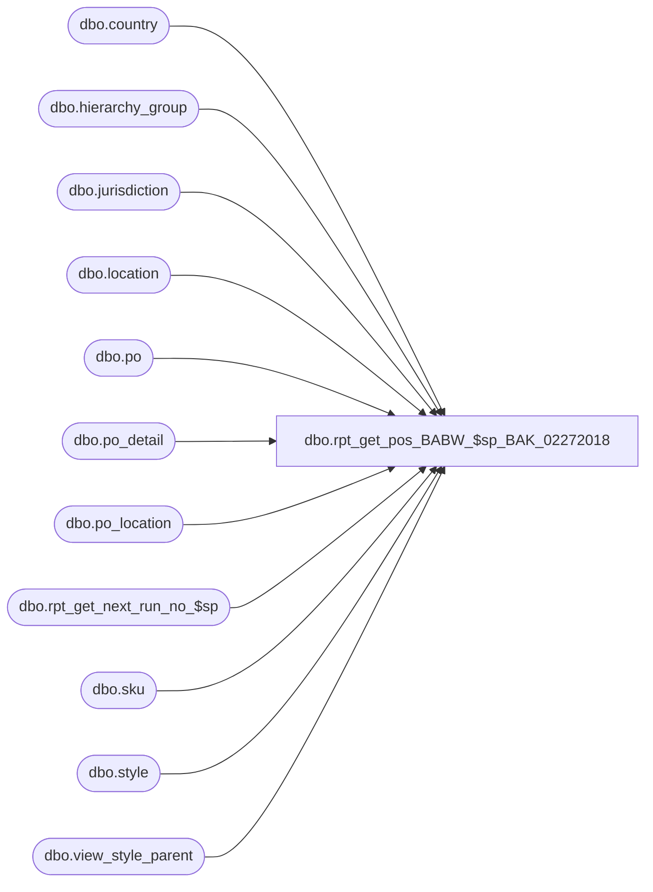

# dbo.rpt_get_pos_BABW_$sp_BAK_02272018

**Database:** me_01  
**Server:** bedrockdb02  

## Architecture Diagram



## Table Dependencies

| Referenced Table |
|---|
| dbo.country |
| dbo.hierarchy_group |
| dbo.jurisdiction |
| dbo.location |
| dbo.po |
| dbo.po_detail |
| dbo.po_location |
| dbo.rpt_get_next_run_no_$sp |
| dbo.sku |
| dbo.style |
| dbo.view_style_parent |

## Stored Procedure Code

```sql
CREATE PROCEDURE [dbo].[rpt_get_pos_BABW_$sp_BAK_02272018] @report_no TINYINT

AS

/*
CUSTOM PROCEDURE TO SUPPORT BABW PO PRINTS - DO NOT DELETE

Proc name:		rpt_get_pos_BABW_$sp
Description:	Gets the PO data for the 1 of 12 PO Reports

Report Nos.:
   1 PO Report - Listing by Buyer
   2 PO Report - Listing by Vendor
   3 PO Report - Location Size Totals by Buyer
   4 PO Report - Location Size Totals by Vendor

   5 PO Report - Style Color Totals by Buyer
   6 PO Report - Style Color Totals by Vendor
   7 PO Report - Totals by Size by Buyer
   8 PO Report - Totals by Size by Vendor

   9 PO Totals
  10 PO Edit List
  11 PO Document Print - Draft
  12 PO Document Print - Official
*/

DECLARE @run_date smalldatetime = (SELECT SYSDATETIME())
DECLARE @run_no INT
EXEC @run_no = rpt_get_next_run_no_$sp 1

CREATE TABLE #temp_po(
	po_id decimal(12, 0) NOT NULL,
	po_no nvarchar(20) NULL,
	predistribution_type smallint NULL,
	create_date smalldatetime NULL,
	printed_status smallint NULL,
	supplies_flag smallint NULL,
	country_code nvarchar(3) NULL,
	vendor_id decimal(12, 0) NULL,
	po_type smallint NULL,
	hdr_location_id smallint NULL,

PRIMARY KEY CLUSTERED
(
	po_id ASC
)
)


-- #temp_po_detail is created and built in the report .RDL and has the following structure:
/*
	po_id decimal(12, 0) NOT NULL,
	po_detail_id int NOT NULL,					NB: NULLable if @report_no = 11 or 12
	rec_type smallint NOT NULL,
	unit_retail decimal(14, 2) NULL,			NB: No longer referenced/used
	total_exclude_tax_factor float NULL			NB: No longer referenced/used
*/

-- Update the temp PO hdr. table
INSERT INTO #temp_po (po_id, po_no, create_date, predistribution_type, printed_status, vendor_id, po_type)
SELECT po_id, po_no, create_date, predistribution_type, printed_status, vendor_id, po_type
FROM po WITH (NOLOCK) 
WHERE po_id IN (SELECT DISTINCT po_id FROM #temp_po_detail)


-- Get/set supplies flag
select pd.po_id, abs(sign(count(distinct hg.hierarchy_group_code))) as supplies_flag
into #temp_po_supplies
from #temp_po h
join po_detail pd on h.po_id=pd.po_id
join sku k on k.sku_id=pd.sku_id
join style s on s.style_id=k.style_id
join view_style_parent vsp on vsp.style_id=s.style_id
join hierarchy_group hg on hg.hierarchy_group_id=vsp.parent_hierarchy_group_id and vsp.hierarchy_level_id=10000005
where right(hg.hierarchy_group_code,2) = '60'
group by pd.po_id

UPDATE #temp_po
SET supplies_flag = ISNULL(t.supplies_flag,0)
from #temp_po h
left outer join #temp_po_supplies t on h.po_id=t.po_id

-- Get/set the country flag
select po.po_id, max(c.country_id) as country_id
into #temp_po_country
from #temp_po po
join po_location pl on po.po_id=pl.po_id
join location l on l.location_id=pl.location_id
join jurisdiction j on j.jurisdiction_id=l.jurisdiction_id
join country c on c.country_id=j.country_id
group by po.po_id

select pd.po_id, abs(sign(count(distinct s.style_code)))  as canada_style
into #temp_canada_style
from #temp_po po
join po_detail pd on po.po_id=pd.po_id
join sku k on k.sku_id=pd.sku_id
join style s on s.style_id=k.style_id
where len(style_code) = 6
and style_code between '100000' and '199999'
group by pd.po_id


select pd.po_id, abs(sign(count(distinct s.style_code)))  as Mexico_style
into #temp_mexico_style
from #temp_po po
join po_detail pd on po.po_id=pd.po_id
join sku k on k.sku_id=pd.sku_id
join style s on s.style_id=k.style_id
where len(style_code) = 6
and style_code between '900000' and '999999'
group by pd.po_id


select distinct po.po_id,
case when location_code in ('3970','8502') then 'CH1'  -- included location 8502 as per Mark D + Rachel S -Keith L
when location_code='3980' then 'CH2'
end  as china

into #temp_china_po
from #temp_po po join po_location pl on po.po_id=pl.po_id
join location l on pl.location_id=l.location_id

where l.location_code in ('3970','8502','3980') -- included location 8502 as per Mark D + Rachel S -Keith L

select po.po_id, (CASE  when ch.china is not null then ch.china
WHEN isnull(canada_style,0) = 1 THEN 'CA' 
            when isnull(ms.mexico_style,0) = 1 Then 'MX' 
             WHEN t.country_id = '14' THEN 'CA'
			 WHEN t.country_id = '15' THEN 'US' ELSE 'UK' END  ) as country_flag
into #temp_po_country_update
from po
join #temp_po_country t on t.po_id=po.po_id
left outer join #temp_canada_style cs on po.po_id=cs.po_id
left outer join #temp_mexico_style ms on po.po_id=ms.po_id
left outer join #temp_china_po ch on po.po_id=ch.po_id
UPDATE #temp_po
SET country_code = t.country_flag
from #temp_po h
join #temp_po_country_update t on h.po_id=t.po_id

-- Get/set the header location info (bulk and x-dock POs)
UPDATE #temp_po
SET hdr_location_id  = pl.location_id
FROM #temp_po h
JOIN po_location pl WITH (NOLOCK) ON h.po_id = pl.po_id
WHERE h.predistribution_type IN (1, 3)

SELECT * FROM #temp_po ORDER BY po_id

-- Drop the temp tables
DROP TABLE #temp_po
DROP TABLE #temp_po_detail
DROP TABLE #temp_po_country
DROP TABLE #temp_canada_style
DROP TABLE #temp_mexico_style
DROP TABLE #temp_po_country_update
DROP TABLE #temp_po_supplies
drop table #temp_china_po
RETURN 0
```

