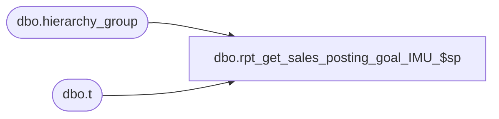

# dbo.rpt_get_sales_posting_goal_IMU_$sp

**Database:** me_01  
**Server:** bedrockdb02  

## Architecture Diagram



## Table Dependencies

| Referenced Table |
|---|
| dbo.hierarchy_group |
| dbo.t |

## Stored Procedure Code

```sql
CREATE PROCEDURE [dbo].[rpt_get_sales_posting_goal_IMU_$sp] 

AS

DECLARE
	@count AS INTEGER,
	@HIERARCHY_GROUP_ID AS INTEGER,
	@HIERARCHY_GROUP_CODE AS NVARCHAR(20)


BEGIN

SET @count = (SELECT  COUNT(DISTINCT(hierarchy_group_id)) FROM #temp_sales_posting where goal  IS NULL)


SET @HIERARCHY_GROUP_ID = (SELECT TOP 1 hierarchy_group_id FROM #temp_sales_posting WHERE goal is null)

WHILE (@count > 0)

BEGIN

	IF(select goal_imu_percent from hierarchy_group hg WHERE hg.hierarchy_group_id = @HIERARCHY_GROUP_ID) IS NOT NULL
	BEGIN

		SET @HIERARCHY_GROUP_CODE = (select hierarchy_group_code from hierarchy_group where hierarchy_group_id = @HIERARCHY_GROUP_ID)

		UPDATE t
		SET
			t.goal = (select goal_imu_percent from hierarchy_group hg  WHERE hg.hierarchy_group_id = @HIERARCHY_GROUP_ID)
		FROM
			#temp_sales_posting t
		WHERE EXISTS
					(
						SELECT
							*
						FROM
							hierarchy_group HG
						WHERE
							(
								HG.hierarchy_group_code like @HIERARCHY_GROUP_CODE +'-%'
								OR HG.hierarchy_group_code = @HIERARCHY_GROUP_CODE
							)
							AND HG.hierarchy_group_id = t.hierarchy_group_id
					)
SET @count = (SELECT  COUNT(DISTINCT(hierarchy_group_id)) FROM #temp_sales_posting where goal  IS NULL)

		SET @HIERARCHY_GROUP_ID = (SELECT TOP 1 hierarchy_group_id FROM #temp_sales_posting WHERE goal is null)

	END
	ELSE
	BEGIN
			SET @HIERARCHY_GROUP_ID = (SELECT h.parent_group_id from hierarchy_group h WHERE h.hierarchy_group_id = @HIERARCHY_GROUP_ID)
			CONTINUE
	END

END

END
```

