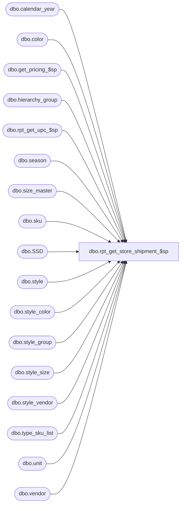

# dbo.rpt_get_store_shipment_$sp

**Database:** me_01  
**Server:** bedrockdb02  

## Architecture Diagram



## Table Dependencies

| Referenced Table |
|---|
| dbo.calendar_year |
| dbo.color |
| dbo.get_pricing_$sp |
| dbo.hierarchy_group |
| dbo.rpt_get_upc_$sp |
| dbo.season |
| dbo.size_master |
| dbo.sku |
| dbo.SSD |
| dbo.style |
| dbo.style_color |
| dbo.style_group |
| dbo.style_size |
| dbo.style_vendor |
| dbo.type_sku_list |
| dbo.unit |
| dbo.vendor |

## Stored Procedure Code

```sql
-- Store shipment report Stored Proc

CREATE PROCEDURE [dbo].[rpt_get_store_shipment_$sp]

AS

DECLARE @current_date AS SMALLDATETIME

IF OBJECT_ID (N'tempdb.dbo.#temp_wrk_price_lookup',  N'U') IS NOT NULL
BEGIN

	DROP TABLE dbo.#temp_wrk_price_lookup

END

CREATE TABLE dbo.#temp_wrk_price_lookup

	(
		group_id INT NULL
		,jurisdiction_id SMALLINT NULL
		,location_id SMALLINT NULL
		,style_id DECIMAL (12, 0) NULL
        ,style_color_id DECIMAL(13,0) NULL
		,color_id SMALLINT NULL
		,sku_id DECIMAL (13, 0) NULL
	)

IF OBJECT_ID (N'tempdb.dbo.#temp_effective_retail',  N'U') IS NOT NULL
BEGIN

	DROP TABLE dbo.#temp_effective_retail

END

CREATE TABLE #temp_effective_retail
	(
		 transaction_date SMALLDATETIME
		,jurisdiction_id SMALLINT NULL
		,location_id SMALLINT NULL
		,style_id DECIMAL (12, 0) NULL
		,style_color_id DECIMAL(13,0) NULL
		,color_id SMALLINT NULL
		,price_status_id SMALLINT NULL
		,valuation_unit_retail DECIMAL(14,2) NULL
		,selling_unit_retail DECIMAL(14,2) NULL
		,sku_id DECIMAL (13, 0) NULL
	)

IF OBJECT_ID (N'tempdb.dbo.#temp_list_of_dates',  N'U') IS NOT NULL
BEGIN

	DROP TABLE dbo.#temp_list_of_dates

END

CREATE TABLE dbo.#temp_list_of_dates (create_date SMALLDATETIME)

INSERT INTO dbo.#temp_list_of_dates
	(
		create_date
	)
SELECT
	ship_date
FROM
	#store_shipment_hdr

BEGIN

--Measurement SELECT
UPDATE #store_shipment_hdr
SET unit_code = m1.unit_code, unit_label = m1.unit_label
FROM #store_shipment_hdr a WITH (NOLOCK), unit m1 WITH (NOLOCK)
WHERE a.unit_weight_id = m1.unit_id

--StoreShipmentSKU Style Color
UPDATE #store_shipment_dtl
SET color_code = co.color_code, color_long_desc = dsc.long_desc,
color_id = co.color_id
FROM #store_shipment_dtl dsku WITH (NOLOCK), style_color dsc WITH (NOLOCK), color co WITH (NOLOCK)
WHERE dsku.style_color_id = dsc.style_color_id
AND dsc.color_id = co.color_id

SET @current_date = (SELECT MIN (create_date) FROM dbo.#temp_list_of_dates)

WHILE @current_date IS NOT NULL
BEGIN

	INSERT INTO #temp_wrk_price_lookup
		(
			location_id
			,sku_id
			,jurisdiction_id
			,style_id
			,color_id
			,style_color_id
		)
	SELECT
		SSD.to_location_id
		,SSD.sku_id
		,SSD.to_jurisdiction_id
		,SSD.style_id
		,SSD.color_id
		,SSD.style_color_id
	FROM #store_shipment_dtl SSD
	WHERE
		SSD.counts = 0
		AND SSD.ship_date = @current_date

	EXEC get_pricing_$sp
		@Date = @current_date
		,@Sales_Posting_Mode = 2

	UPDATE SSD
	SET SSD.valuation_retail_price = TER.valuation_unit_retail, SSD.selling_retail_price = TER.selling_unit_retail, SSD.counts = 1
	FROM
		#store_shipment_dtl SSD
	INNER JOIN #temp_effective_retail TER ON TER.sku_id = SSD.sku_id
																AND TER.location_id = SSD.to_location_id
																AND SSD.ship_date = @current_date
	SET @current_date = (SELECT MIN (create_date) FROM dbo.#temp_list_of_dates WHERE create_date > @current_date)

	TRUNCATE TABLE #temp_wrk_price_lookup
	TRUNCATE TABLE dbo.#temp_effective_retail

END

--StoreShipmentSKU Style SELECT
UPDATE #store_shipment_dtl
SET style_code = dss.style_code, style_short_description = dss.short_desc,
season_code = se.season_code, season_description = se.season_description,
year_required_flag = se.year_required_flag
FROM #store_shipment_dtl dsku WITH (NOLOCK), style dss WITH (NOLOCK), season se WITH (NOLOCK)
WHERE dsku.style_id = dss.style_id
AND dss.season_id = se.season_id

--StoreShipmentSKU Calendar Year
UPDATE #store_shipment_dtl
SET calendar_year_code = cy.calendar_year_code
FROM #store_shipment_dtl dsku WITH (NOLOCK), style dss WITH (NOLOCK), calendar_year cy WITH (NOLOCK)
WHERE dsku.style_id = dss.style_id
AND dss.calendar_year_id = cy.calendar_year_id

--SKU Vendor Style
UPDATE #store_shipment_dtl
SET vendor_style = sv.vendor_style, vendor_code = v.vendor_code, vendor_name = v.vendor_name
FROM #store_shipment_dtl dsku WITH (NOLOCK), style_vendor sv WITH (NOLOCK), vendor v WITH (NOLOCK)
WHERE dsku.style_id = sv.style_id
AND sv.primary_vendor_flag = 1
AND sv.vendor_id = v.vendor_id

--Merchandise Group
UPDATE #store_shipment_dtl
SET hierarchy_group_id = sg.hierarchy_group_id,
hierarchy_group_code = hn.hierarchy_group_code,
hierarchy_group_short_label = hn.hierarchy_group_short_label
FROM #store_shipment_dtl dsku WITH (NOLOCK), style_group sg WITH (NOLOCK), hierarchy_group hn WITH (NOLOCK)
WHERE dsku.style_id = sg.style_id
AND sg.main_group_flag = 1
AND sg.hierarchy_group_id = hn.hierarchy_group_id

--StoreShipmentSKU Sizes
UPDATE #store_shipment_dtl
SET prim_size_label = sm.prim_size_label, sec_size_label = sm.sec_size_label,
size_code = sm.size_code, prim_seq_no = sm.prim_seq_no, sec_seq_no = sm.sec_seq_no
FROM #store_shipment_dtl dsku WITH (NOLOCK), sku WITH (NOLOCK),
style_size stsz WITH (NOLOCK), size_master sm WITH (NOLOCK)
WHERE dsku.sku_id = sku.sku_id
AND sku.style_size_id = stsz.style_size_id
AND stsz.size_master_id = sm.size_master_id

--Retrieve upc
--type_sku_list is user defined Table type
DECLARE @sku_list AS type_sku_list

DECLARE @sku_upc_list_output AS TABLE
	(
		 sku_id DECIMAL (13, 0) NULL
		,upc_number NVARCHAR (14) NULL
		,upc_type TINYINT NULL
	)

--populate sku list to send to the rpt_get_upc_$sp stored proc
INSERT INTO @sku_list
	(
		sku_id
	)
SELECT
	sku_id
FROM
	#store_shipment_dtl

--capture the output from the rpt_get_upc_$sp stored proc
INSERT INTO
	@sku_upc_list_output

EXECUTE dbo.rpt_get_upc_$sp

	@type_sku_list = @sku_list

--Update upc_number, upc_type
UPDATE #store_shipment_dtl
SET upc_number=list.upc_number, upc_type=list.upc_type
FROM #store_shipment_dtl dsku WITH (NOLOCK), @sku_upc_list_output list
WHERE dsku.sku_id = list.sku_id

END
RETURN 0
```

