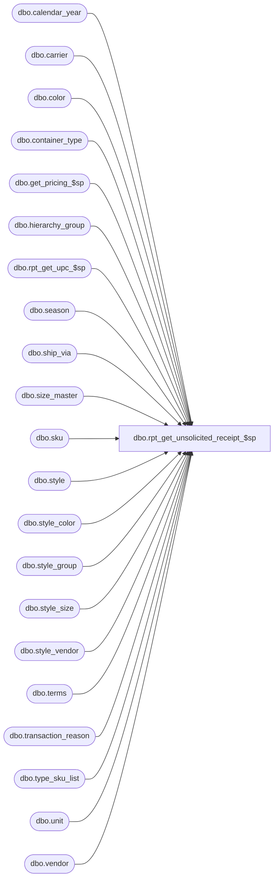

# dbo.rpt_get_unsolicited_receipt_$sp

**Database:** me_01  
**Server:** bedrockdb02  

## Architecture Diagram



## Table Dependencies

| Referenced Table |
|---|
| dbo.calendar_year |
| dbo.carrier |
| dbo.color |
| dbo.container_type |
| dbo.get_pricing_$sp |
| dbo.hierarchy_group |
| dbo.rpt_get_upc_$sp |
| dbo.season |
| dbo.ship_via |
| dbo.size_master |
| dbo.sku |
| dbo.style |
| dbo.style_color |
| dbo.style_group |
| dbo.style_size |
| dbo.style_vendor |
| dbo.terms |
| dbo.transaction_reason |
| dbo.type_sku_list |
| dbo.unit |
| dbo.vendor |

## Stored Procedure Code

```sql
-- Stored Proc for Unsolicited Receipt report
CREATE PROCEDURE [dbo].[rpt_get_unsolicited_receipt_$sp]

AS

DECLARE @current_date AS SMALLDATETIME
DECLARE @Date AS SMALLDATETIME
SET @Date = GETDATE()

BEGIN

-- Vendor
UPDATE #unsolicited_receipt_doc
SET vendor_code=v.vendor_code, vendor_name=v.vendor_name
FROM #unsolicited_receipt_doc a WITH (NOLOCK), vendor v WITH (NOLOCK)
WHERE a.vendor_id = v.vendor_id

-- Measurement
UPDATE #unsolicited_receipt_doc
SET unit_code=m1.unit_code, unit_label=m1.unit_label
FROM #unsolicited_receipt_doc a WITH (NOLOCK), unit m1 WITH (NOLOCK)
WHERE a.unit_weight_id = m1.unit_id

-- Container Type
UPDATE #unsolicited_receipt_doc
SET container_type_code=ct.container_type_code, container_type_label=ct.container_type_label
FROM #unsolicited_receipt_doc a WITH (NOLOCK), container_type ct WITH (NOLOCK)
WHERE a.container_type_id = ct.container_type_id

-- Carrier
UPDATE #unsolicited_receipt_doc
SET carrier_code=ca.carrier_code, carrier_name=ca.carrier_name
FROM #unsolicited_receipt_doc a WITH (NOLOCK), carrier ca WITH (NOLOCK)
WHERE a.carrier_id = ca.carrier_id

-- Ship Via
UPDATE #unsolicited_receipt_doc
SET ship_via_code=sv.ship_via_code, ship_via_description=sv.ship_via_description
FROM #unsolicited_receipt_doc a WITH (NOLOCK), ship_via sv WITH (NOLOCK)
WHERE a.ship_via_id = sv.ship_via_id

-- Terms
UPDATE #unsolicited_receipt_doc
SET terms_code=t.terms_code, terms_description=t.terms_description
FROM #unsolicited_receipt_doc a WITH (NOLOCK), terms t WITH (NOLOCK)
WHERE a.terms_id = t.terms_id

-- Reason
UPDATE #unsolicited_receipt_doc
SET transaction_reason_code=tr.transaction_reason_code, transaction_reason_desc=tr.transaction_reason_desc
FROM #unsolicited_receipt_doc a WITH (NOLOCK), transaction_reason tr WITH (NOLOCK)
WHERE a.transaction_reason_id = tr.transaction_reason_id

-- SKU Style
UPDATE #unsolicited_receipt_detail
SET style_code=dss.style_code, style_short_desc=dss.short_desc,
season_code=se.season_code, season_description=se.season_description,
year_required_flag=se.year_required_flag
FROM #unsolicited_receipt_detail dsku WITH (NOLOCK), style dss WITH (NOLOCK),
season se WITH (NOLOCK)
WHERE dsku.style_id = dss.style_id
AND dss.season_id = se.season_id

-- SKU Style Color
UPDATE #unsolicited_receipt_detail
SET color_code=co.color_code, color_long_desc=dsc.long_desc,
color_id=co.color_id
FROM #unsolicited_receipt_detail dsku WITH (NOLOCK), style_color dsc WITH (NOLOCK),
color co WITH (NOLOCK)
WHERE dsku.style_color_id = dsc.style_color_id
AND dsc.color_id = co.color_id

IF OBJECT_ID (N'tempdb.dbo.#temp_wrk_price_lookup',  N'U') IS NOT NULL
BEGIN

	DROP TABLE dbo.#temp_wrk_price_lookup

END

CREATE TABLE dbo.#temp_wrk_price_lookup

	(
		group_id INT NULL
		,jurisdiction_id SMALLINT NULL
		,location_id SMALLINT NULL
		,style_id DECIMAL (12, 0) NULL
        ,style_color_id DECIMAL(13,0) NULL
		,color_id SMALLINT NULL
		,sku_id DECIMAL (13, 0) NULL
	)

IF OBJECT_ID (N'tempdb.dbo.#temp_effective_retail',  N'U') IS NOT NULL
BEGIN

	DROP TABLE dbo.#temp_effective_retail

END

CREATE TABLE #temp_effective_retail

	(
		 transaction_date SMALLDATETIME
		,jurisdiction_id SMALLINT NULL
		,location_id SMALLINT NULL
		,style_id DECIMAL (12, 0) NULL
		,style_color_id DECIMAL(13,0) NULL
		,color_id SMALLINT NULL
		,price_status_id SMALLINT NULL
		,valuation_unit_retail DECIMAL(14,2) NULL
		,selling_unit_retail DECIMAL(14,2) NULL
		,sku_id DECIMAL (13, 0) NULL
	)


	IF OBJECT_ID (N'tempdb.dbo.#temp_list_of_dates',  N'U') IS NOT NULL
BEGIN

	DROP TABLE dbo.#temp_list_of_dates

END

	CREATE TABLE dbo.#temp_list_of_dates (create_date SMALLDATETIME)

	INSERT INTO dbo.#temp_list_of_dates
		(
			create_date
		)
	SELECT
(CASE WHEN document_status  = 4 THEN receive_date
ELSE @Date END) as create_date

	FROM
		#unsolicited_receipt_doc

SET @current_date = (SELECT MIN (create_date) FROM dbo.#temp_list_of_dates)

WHILE @current_date IS NOT NULL
	BEGIN

			insert into #temp_wrk_price_lookup (location_id, sku_id, jurisdiction_id, style_id, color_id, style_color_id)
			SELECT tr.location_id, td.sku_id, tr.jurisdiction_id, style_id, color_id, style_color_id
			FROM #unsolicited_receipt_detail td, #unsolicited_receipt_doc tr
			WHERE td.counts = 0
			AND sku_id is not null
			AND (CASE WHEN tr.document_status  = 4 THEN tr.receive_date ELSE @current_date END) = @current_date

			exec get_pricing_$sp
				@Date=@current_date
				,@Sales_Posting_Mode = 2

			UPDATE #unsolicited_receipt_detail
			SET valuation_retail_price = valuation_unit_retail, selling_retail_price = selling_unit_retail, counts = 1
			FROM #unsolicited_receipt_detail dsku WITH(NOLOCK)
			,#temp_effective_retail tpp WITH(NOLOCK)
			,#unsolicited_receipt_doc tr
			WHERE tr.location_id = tpp.location_id
			AND dsku.style_color_id = tpp.style_color_id
			AND (dsku.sku_id = tpp.sku_id)
			AND dsku.sku_id is not null
			AND dsku.counts = 0
			AND dsku.unsolicited_receipt_id = tr.unsolicited_receipt_id
			AND (CASE WHEN tr.document_status  = 4 THEN tr.receive_date ELSE @current_date END) = @current_date

			SET @current_date = (SELECT MIN (create_date) FROM dbo.#temp_list_of_dates WHERE create_date > @current_date)

			TRUNCATE TABLE #temp_wrk_price_lookup
			TRUNCATE TABLE dbo.#temp_effective_retail

	END


-- SKU Year
UPDATE #unsolicited_receipt_detail
SET calendar_year_code=cy.calendar_year_code
FROM #unsolicited_receipt_detail dsku WITH (NOLOCK), style dss WITH (NOLOCK),
calendar_year cy WITH (NOLOCK)
WHERE dsku.style_id = dss.style_id
AND dss.calendar_year_id = cy.calendar_year_id

-- SKU Vendor Style
UPDATE #unsolicited_receipt_detail
SET vendor_style=sv.vendor_style
FROM #unsolicited_receipt_detail dsku WITH (NOLOCK), style_vendor sv WITH (NOLOCK)
WHERE dsku.style_id = sv.style_id
AND sv.primary_vendor_flag = 1

-- Merchandise Group SELECT
UPDATE #unsolicited_receipt_detail
SET hierarchy_group_id=sg.hierarchy_group_id, hierarchy_group_code=hn.hierarchy_group_code,
hierarchy_group_short_label=hn.hierarchy_group_short_label
FROM #unsolicited_receipt_detail dsku WITH (NOLOCK), style_group sg WITH (NOLOCK),
hierarchy_group hn WITH (NOLOCK)
WHERE dsku.style_id = sg.style_id
AND sg.main_group_flag = 1
AND sg.hierarchy_group_id = hn.hierarchy_group_id

--SKU Sizes
UPDATE #unsolicited_receipt_detail
SET prim_size_label=sm.prim_size_label, sec_size_label=sm.sec_size_label,
size_code=sm.size_code, prim_seq_no=sm.prim_seq_no, sec_seq_no=sm.sec_seq_no
FROM #unsolicited_receipt_detail dsku WITH (NOLOCK), sku WITH (NOLOCK),
style_size stsz WITH (NOLOCK), size_master sm WITH (NOLOCK)
WHERE dsku.sku_id = sku.sku_id
AND sku.style_size_id = stsz.style_size_id
AND stsz.size_master_id = sm.size_master_id

--Retrieve upc
--type_sku_list is user defined Table type
DECLARE @sku_list AS type_sku_list

DECLARE @sku_upc_list_output AS TABLE
	(
		 sku_id DECIMAL (13, 0) NULL
		,upc_number NVARCHAR (14) NULL
		,upc_type TINYINT NULL
	)

--populate sku list to send to the rpt_get_upc_$sp stored proc
INSERT INTO @sku_list
	(
		sku_id
	)
SELECT
	sku_id
FROM
	#unsolicited_receipt_detail

--capture the output from the rpt_get_upc_$sp stored proc
INSERT INTO
	@sku_upc_list_output

EXECUTE dbo.rpt_get_upc_$sp

	@type_sku_list = @sku_list

--Update upc_number, upc_type
UPDATE #unsolicited_receipt_detail
SET upc_number=list.upc_number, upc_type=list.upc_type
FROM #unsolicited_receipt_detail dsku WITH (NOLOCK), @sku_upc_list_output list
WHERE dsku.sku_id = list.sku_id

END

RETURN 0
```

