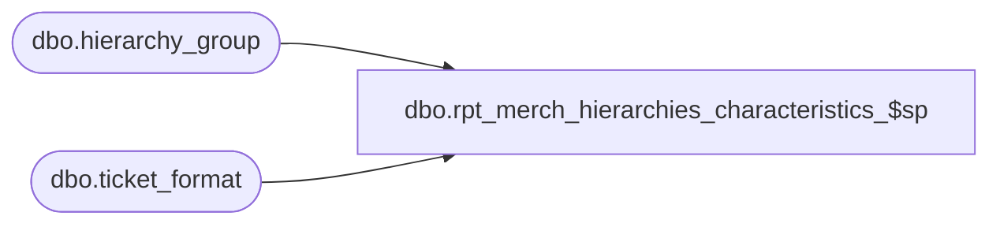

# dbo.rpt_merch_hierarchies_characteristics_$sp

**Database:** me_01  
**Server:** bedrockdb02  

## Architecture Diagram



## Table Dependencies

| Referenced Table |
|---|
| dbo.hierarchy_group |
| dbo.ticket_format |

## Stored Procedure Code

```sql
CREATE PROCEDURE [dbo].[rpt_merch_hierarchies_characteristics_$sp]
@hierarchy_group_id INT, @hierarchy_level_id INT, 
@hierarchy_root_id INT, @hierarchy_root_level_id INT, 
@goal_imu_level_id INT, @imu_tolerance_level_id INT, @shrinkage_provision_level_id INT,
@plu_description_level_id INT, @pos_merch_group_key_level_id INT, @ticket_format_code_level_id INT,
@sl_minimum_cost_level_id INT, @sl_maximum_cost_level_id INT

AS

DECLARE @characteristic_hierarchy_group_id INT, @characteristic_hierarchy_level_id INT
	
DECLARE @goal_imu_percent DECIMAL(5, 2), @imu_tolerance_percent DECIMAL(5, 2),
@shrinkage_provision_percent DECIMAL(5, 2), 
@plu_description nvarchar(40), @pos_merch_group_key INT,
@ticket_format_code nvarchar(2), @sl_minimum_cost_percent DECIMAL(5, 2), @sl_maximum_cost_percent DECIMAL(5, 2)

-- If it has no value for the goal_imu_level_id it will not have it for other characteristics
IF @goal_imu_level_id IS NOT NULL
BEGIN
	-- Goal IMU %
	SELECT @characteristic_hierarchy_group_id = @hierarchy_group_id, @characteristic_hierarchy_level_id = @hierarchy_level_id
	IF @characteristic_hierarchy_level_id >= @goal_imu_level_id
	BEGIN
		IF @hierarchy_root_level_id = @goal_imu_level_id
		BEGIN
			SELECT @characteristic_hierarchy_group_id = @hierarchy_root_id, @characteristic_hierarchy_level_id = @goal_imu_level_id
		END
		WHILE NOT @characteristic_hierarchy_level_id = @goal_imu_level_id
		BEGIN
			SELECT @characteristic_hierarchy_group_id = parent_group_id
			FROM hierarchy_group 
			WHERE hierarchy_group_id = @characteristic_hierarchy_group_id
			
			SELECT @characteristic_hierarchy_level_id = hierarchy_level_id 
			FROM hierarchy_group 
			WHERE hierarchy_group_id = @characteristic_hierarchy_group_id 
		END
		SELECT @goal_imu_percent = goal_imu_percent 
		FROM hierarchy_group 
		WHERE hierarchy_group_id = @characteristic_hierarchy_group_id
	END
	
	-- IMU Tolerance %
	SELECT @characteristic_hierarchy_group_id = @hierarchy_group_id, @characteristic_hierarchy_level_id = @hierarchy_level_id
	IF @characteristic_hierarchy_level_id >= @imu_tolerance_level_id
	BEGIN
		IF @hierarchy_root_level_id = @imu_tolerance_level_id
		BEGIN
			SELECT @characteristic_hierarchy_group_id = @hierarchy_root_id, @characteristic_hierarchy_level_id = @imu_tolerance_level_id
		END
		WHILE NOT @characteristic_hierarchy_level_id = @imu_tolerance_level_id
		BEGIN
			SELECT @characteristic_hierarchy_group_id = parent_group_id
			FROM hierarchy_group 
			WHERE hierarchy_group_id = @characteristic_hierarchy_group_id
			
			SELECT @characteristic_hierarchy_level_id = hierarchy_level_id 
			FROM hierarchy_group 
			WHERE hierarchy_group_id = @characteristic_hierarchy_group_id 
		END
		SELECT @imu_tolerance_percent = imu_tolerance_percent 
		FROM hierarchy_group 
		WHERE hierarchy_group_id = @characteristic_hierarchy_group_id
	END
	
	-- Shrinkage provision
	SELECT @characteristic_hierarchy_group_id = @hierarchy_group_id, @characteristic_hierarchy_level_id = @hierarchy_level_id
	IF @characteristic_hierarchy_level_id >= @shrinkage_provision_level_id
	BEGIN
		IF @hierarchy_root_level_id = @shrinkage_provision_level_id
		BEGIN
			SELECT @characteristic_hierarchy_group_id = @hierarchy_root_id, @characteristic_hierarchy_level_id = @shrinkage_provision_level_id
		END
		WHILE NOT @characteristic_hierarchy_level_id = @shrinkage_provision_level_id
		BEGIN
			SELECT @characteristic_hierarchy_group_id = parent_group_id
			FROM hierarchy_group 
			WHERE hierarchy_group_id = @characteristic_hierarchy_group_id
			
			SELECT @characteristic_hierarchy_level_id = hierarchy_level_id 
			FROM hierarchy_group 
			WHERE hierarchy_group_id = @characteristic_hierarchy_group_id 
		END
		SELECT @shrinkage_provision_percent = shrinkage_provision_percent 
		FROM hierarchy_group 
		WHERE hierarchy_group_id = @characteristic_hierarchy_group_id
	END
	
	-- POS department description
	SELECT @characteristic_hierarchy_group_id = @hierarchy_group_id, @characteristic_hierarchy_level_id = @hierarchy_level_id
	IF @characteristic_hierarchy_level_id >= @plu_description_level_id
	BEGIN
		IF @hierarchy_root_level_id = @plu_description_level_id
		BEGIN
			SELECT @characteristic_hierarchy_group_id = @hierarchy_root_id, @characteristic_hierarchy_level_id = @plu_description_level_id
		END
		WHILE NOT @characteristic_hierarchy_level_id = @plu_description_level_id
		BEGIN
			SELECT @characteristic_hierarchy_group_id = parent_group_id
			FROM hierarchy_group 
			WHERE hierarchy_group_id = @characteristic_hierarchy_group_id
			
			SELECT @characteristic_hierarchy_level_id = hierarchy_level_id 
			FROM hierarchy_group 
			WHERE hierarchy_group_id = @characteristic_hierarchy_group_id 
		END
		SELECT @plu_description = plu_description 
		FROM hierarchy_group 
		WHERE hierarchy_group_id = @characteristic_hierarchy_group_id
	END
	
	-- POS department no.
	SELECT @characteristic_hierarchy_group_id = @hierarchy_group_id, @characteristic_hierarchy_level_id = @hierarchy_level_id
	IF @characteristic_hierarchy_level_id >= @pos_merch_group_key_level_id
	BEGIN
		IF @hierarchy_root_level_id = @pos_merch_group_key_level_id
		BEGIN
			SELECT @characteristic_hierarchy_group_id = @hierarchy_root_id, @characteristic_hierarchy_level_id = @pos_merch_group_key_level_id
		END
		WHILE NOT @characteristic_hierarchy_level_id = @pos_merch_group_key_level_id
		BEGIN
			SELECT @characteristic_hierarchy_group_id = parent_group_id
			FROM hierarchy_group 
			WHERE hierarchy_group_id = @characteristic_hierarchy_group_id
			
			SELECT @characteristic_hierarchy_level_id = hierarchy_level_id 
			FROM hierarchy_group 
			WHERE hierarchy_group_id = @characteristic_hierarchy_group_id 
		END
		SELECT @pos_merch_group_key = pos_merch_group_key 
		FROM hierarchy_group 
		WHERE hierarchy_group_id = @characteristic_hierarchy_group_id
	END
	
	-- Ticket format
	SELECT @characteristic_hierarchy_group_id = @hierarchy_group_id, @characteristic_hierarchy_level_id = @hierarchy_level_id
	IF @characteristic_hierarchy_level_id >= @ticket_format_code_level_id
	BEGIN
		IF @hierarchy_root_level_id = @ticket_format_code_level_id
		BEGIN
			SELECT @characteristic_hierarchy_group_id = @hierarchy_root_id, @characteristic_hierarchy_level_id = @ticket_format_code_level_id
		END
		WHILE NOT @characteristic_hierarchy_level_id = @ticket_format_code_level_id
		BEGIN
			SELECT @characteristic_hierarchy_group_id = parent_group_id
			FROM hierarchy_group 
			WHERE hierarchy_group_id = @characteristic_hierarchy_group_id
			
			SELECT @characteristic_hierarchy_level_id = hierarchy_level_id 
			FROM hierarchy_group 
			WHERE hierarchy_group_id = @characteristic_hierarchy_group_id 
		END
		SELECT @ticket_format_code = b.ticket_format_code 
		FROM hierarchy_group a, ticket_format b 
		WHERE a.hierarchy_group_id = @characteristic_hierarchy_group_id and a.ticket_format_id = b.ticket_format_id
	END
	
	-- Stock Ledger minimum cumulative cost %
	SELECT @characteristic_hierarchy_group_id = @hierarchy_group_id, @characteristic_hierarchy_level_id = @hierarchy_level_id
	IF @characteristic_hierarchy_level_id >= @sl_minimum_cost_level_id
	BEGIN
		IF @hierarchy_root_level_id = @sl_minimum_cost_level_id
		BEGIN
			SELECT @characteristic_hierarchy_group_id = @hierarchy_root_id, @characteristic_hierarchy_level_id = @sl_minimum_cost_level_id
		END
		WHILE NOT @characteristic_hierarchy_level_id = @sl_minimum_cost_level_id
		BEGIN
			SELECT @characteristic_hierarchy_group_id = parent_group_id
			FROM hierarchy_group 
			WHERE hierarchy_group_id = @characteristic_hierarchy_group_id
			
			SELECT @characteristic_hierarchy_level_id = hierarchy_level_id 
			FROM hierarchy_group 
			WHERE hierarchy_group_id = @characteristic_hierarchy_group_id 
		END
		SELECT @sl_minimum_cost_percent = sl_minimum_cost_percent 
		FROM hierarchy_group 
		WHERE hierarchy_group_id = @characteristic_hierarchy_group_id
	END
	
	-- Stock Ledger maximum cumulative cost %
	SELECT @characteristic_hierarchy_group_id = @hierarchy_group_id, @characteristic_hierarchy_level_id = @hierarchy_level_id
	IF @characteristic_hierarchy_level_id >= @sl_maximum_cost_level_id
	BEGIN
		IF @hierarchy_root_level_id = @sl_maximum_cost_level_id
		BEGIN
			SELECT @characteristic_hierarchy_group_id = @hierarchy_root_id, @characteristic_hierarchy_level_id = @sl_maximum_cost_level_id
		END
		WHILE NOT @characteristic_hierarchy_level_id = @sl_maximum_cost_level_id
		BEGIN
			SELECT @characteristic_hierarchy_group_id = parent_group_id
			FROM hierarchy_group 
			WHERE hierarchy_group_id = @characteristic_hierarchy_group_id
			
			SELECT @characteristic_hierarchy_level_id = hierarchy_level_id 
			FROM hierarchy_group 
			WHERE hierarchy_group_id = @characteristic_hierarchy_group_id 
		END
		SELECT @sl_maximum_cost_percent = sl_maximum_cost_percent 
		FROM hierarchy_group 
		WHERE hierarchy_group_id = @characteristic_hierarchy_group_id
	END
END 

SELECT @goal_imu_percent as goal_imu_percent, @imu_tolerance_percent as imu_tolerance_percent,
@shrinkage_provision_percent as shrinkage_provision_percent , 
@plu_description as plu_description, @pos_merch_group_key as pos_merch_group_key,
@ticket_format_code as ticket_format_code, 
@sl_minimum_cost_percent as sl_minimum_cost_percent, @sl_maximum_cost_percent as sl_maximum_cost_percent

RETURN 0
```

