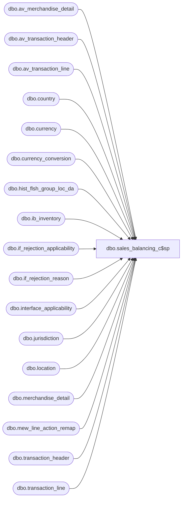

# dbo.sales_balancing_c$sp

**Database:** me_01  
**Server:** bedrockdb02  

## Architecture Diagram



## Table Dependencies

| Referenced Table |
|---|
| dbo.av_merchandise_detail |
| dbo.av_transaction_header |
| dbo.av_transaction_line |
| dbo.country |
| dbo.currency |
| dbo.currency_conversion |
| dbo.hist_flsh_group_loc_da |
| dbo.ib_inventory |
| dbo.if_rejection_applicability |
| dbo.if_rejection_reason |
| dbo.interface_applicability |
| dbo.jurisdiction |
| dbo.location |
| dbo.merchandise_detail |
| dbo.mew_line_action_remap |
| dbo.transaction_header |
| dbo.transaction_line |

## Stored Procedure Code

```sql
CREATE PROC [dbo].[sales_balancing_c$sp] 
--	@LocationCode VarChar(4),
	@BeginDate DATETIME,
	@EndDate DATETIME = @BeginDate
AS

SET NOCOUNT ON

IF NOT object_id('sale_temp') IS NULL
	drop table sale_temp

CREATE TABLE [dbo].[#sale_temp](
	  [id] decimal(12, 0) IDENTITY(1,1) NOT NULL
	, [source] [varchar](24) NULL
	, [date] [datetime] NOT NULL
	, [units] [int] NOT NULL
	, [selling_retail] [decimal](14, 2) 
	, [valuation_retail] [decimal](14, 2) 

)


DECLARE @exchange_rate decimal (14,2)

select @exchange_rate = exchange_rate
from dbo.currency_conversion a, currency cu,  currency b, jurisdiction j, location l, country c
WHERE a.from_currency_id = b.currency_id 
AND a.to_currency_id = cu.currency_id 
AND j.jurisdiction_id = l.jurisdiction_id  
AND j.country_id = c.country_id  
AND c.currency_id = cu.currency_id 
AND currency_conversion_type = 2
--AND l.location_code = @LocationCode 
and effective_from_date <= @BeginDate
and isnull(effective_to_date, getdate() ) >=@BeginDate

BEGIN

--		select 'Totals in the Sales Audit archive transaction tables for non rejected transactions:'
--		INSERT INTO #sale_temp(source, date, units, selling_retail, valuation_retail)
		SELECT	
		  a.transaction_date
		, SUM(c.units * b.db_cr_none*-1 * b.voiding_reversal_flag) AS units
		, SUM(c.units * c.sold_at_price * b.db_cr_none*-1 * b.voiding_reversal_flag) AS sold_at_price
		, SUM(c.units * c.sold_at_price * b.db_cr_none*-1 * b.voiding_reversal_flag * @exchange_rate) AS sold_v_at_price
		INTO #sa_sales
		FROM	[BEDROCKDB01].auditworks.dbo.av_transaction_header a, 
				[BEDROCKDB01].auditworks.dbo.av_transaction_line b, 
				[BEDROCKDB01].auditworks.dbo.av_merchandise_detail c ,
				[BEDROCKDB01].auditworks.dbo.mew_line_action_remap r 

		WHERE	a.av_transaction_id=b.av_transaction_id  
			AND b.av_transaction_id=c.av_transaction_id  
			AND b.line_id=c.line_id 
			AND a.transaction_date >= @BeginDate
			AND a.transaction_date <= @EndDate
			and b.line_action = r.line_action
	--		AND a.store_no = @LocationCode
			AND a.transaction_void_flag = 0 
			AND b.line_void_flag=0 
			and COALESCE(r.merch_transaction_type, r.replacement_line_action, b.line_action) not in (620,621)
			AND EXISTS (SELECT *
						FROM [BEDROCKDB01].auditworks.dbo.interface_applicability e
						WHERE e.interface_id=27
						AND a.transaction_category = e.transaction_category
						AND b.line_object = e.line_object
						AND b.line_action = e.line_action)
						AND a.sa_rejection_flag=0
						AND a.if_rejection_flag=0
			GROUP BY a.transaction_date
UNION
--		SELECT 'Totals in the Sales Audit current transaction tables for non rejected transactions:'
--		INSERT INTO #sale_temp (source, date, units, selling_retail, valuation_retail)
		SELECT	a.transaction_date, SUM(c.units * b.db_cr_none*-1 * b.voiding_reversal_flag) AS units,
				SUM(c.units * c.sold_at_price * b.db_cr_none*-1 * b.voiding_reversal_flag) AS sold_at_price
		, SUM(c.units * c.sold_at_price * b.db_cr_none*-1 * b.voiding_reversal_flag * @exchange_rate) AS sold_v_at_price
		FROM	[BEDROCKDB01].auditworks.dbo.transaction_header a, [BEDROCKDB01].auditworks.dbo.transaction_line b, [BEDROCKDB01].auditworks.dbo.merchandise_detail c ,
				[BEDROCKDB01].auditworks.dbo.mew_line_action_remap r 
		WHERE	a.transaction_id=b.transaction_id  
			AND b.transaction_id=c.transaction_id  
			AND b.line_id=c.line_id 
			AND a.transaction_date >= @BeginDate
			AND a.transaction_date <= @EndDate
	--		AND a.store_no = @LocationCode
			AND a.transaction_void_flag = 0 
			and b.line_action = r.line_action
			AND b.line_void_flag=0 
			and COALESCE(r.merch_transaction_type, r.replacement_line_action, b.line_action)not in (620,621)
			AND EXISTS (SELECT *
						FROM [BEDROCKDB01].auditworks.dbo.interface_applicability e
						WHERE e.interface_id=27
						AND a.transaction_category = e.transaction_category
						AND b.line_object = e.line_object
						AND b.line_action = e.line_action)
						AND a.sa_rejection_flag=0
						AND a.transaction_id NOT IN (	SELECT transaction_id
														FROM [BEDROCKDB01].auditworks.dbo.if_rejection_reason
														WHERE if_reject_reason IN (	SELECT if_reject_reason
																					FROM [BEDROCKDB01].auditworks.dbo.if_rejection_applicability
																					where interface_id=27)
													)
		GROUP BY a.transaction_date


 
INSERT INTO #sale_temp(source, date, units, selling_retail, valuation_retail)
SELECT 'SA'
	, transaction_date
	, SUM(units) AS units
	, SUM(sold_at_price) AS sold_at_price
	, SUM(sold_v_at_price) AS sold_v_at_price
FROM #sa_sales
GROUP BY transaction_date

END


BEGIN

--		SELECT 'Totals in Merchandising ib_inventory :'

		INSERT INTO #sale_temp (source, date, units, selling_retail,valuation_retail)
		SELECT	'MERCH',transaction_date,-SUM(transaction_units) AS transaction_units
				, -SUM(transaction_selling_retail) AS transaction_selling_retail
				, -SUM(transaction_valuation_retail) AS transaction_valuation_retail
		FROM	me_01.dbo.ib_inventory
		WHERE	transaction_date>=@BeginDate
			AND	transaction_date<=@EndDate
			AND transaction_type_code >= 600 
			AND transaction_type_code<= 650
			AND transaction_type_code not in ( 601,603)
--			AND location_id in (	SELECT location_id
--									FROM me_01.dbo.location
--									WHERE location_code = @LocationCode)
		GROUP BY transaction_date
END

BEGIN

--SELECT 'Totals in MA :' 


		INSERT INTO #sale_temp (source, date, units, selling_retail, valuation_retail)
		SELECT	'MA', sales_date,
				SUM(sales_net_units) AS sales_net_units,
				SUM(sales_net_retail/@exchange_rate) AS selling_retail,
				SUM(sales_net_retail) AS valuation_retail
		FROM	ma_01.dbo.hist_flsh_group_loc_da
		WHERE	sales_date>=@BeginDate
			AND sales_date<=@EndDate
--			AND location_id in (	SELECT location_id
--									FROM ma_01.dbo.location
--									WHERE location_code = @LocationCode)
		GROUP BY sales_date

		END


--SELECT @BeginDate
--SELECT
--	  source 'Application' 
--	, units 'Net Sale Units'      
--	, selling_retail 'Net Selling Retail'
--	, valuation_retail 'Net Valuation Retail'
--FROM #sale_temp 
--ORDER BY id


select a.date
, a.units 'SA Units',b.units 'Merch Units', c.units 'MA Units'
, a.selling_retail 'SA Retail',b.selling_retail 'Merch Retail', c.selling_retail 'MA Retail'
from (select * from  #sale_temp where source = 'SA') a
full join (select * from  #sale_temp where source = 'MERCH') b
on a.date = b.date
full join (select * from  #sale_temp where source = 'MA') c
on a.date = c.date

SET NOCOUNT OFF

RETURN 1
```

