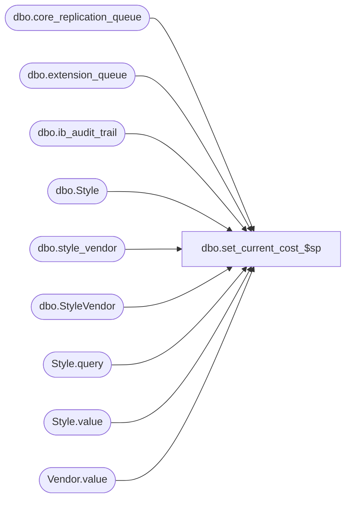

# dbo.set_current_cost_$sp

**Database:** me_01  
**Server:** bedrockdb02  

## Architecture Diagram



## Table Dependencies

| Referenced Table |
|---|
| dbo.core_replication_queue |
| dbo.extension_queue |
| dbo.ib_audit_trail |
| dbo.Style |
| dbo.style_vendor |
| dbo.StyleVendor |
| Style.query |
| Style.value |
| Vendor.value |

## Stored Procedure Code

```sql
CREATE PROCEDURE [dbo].[set_current_cost_$sp]
	( @p_min_id INT, @p_max_id INT
	, @p_app_server_name NVARCHAR(60), @p_company_id SMALLINT
	, @p_emp_first_name NVARCHAR(30), @p_emp_last_name NVARCHAR(30) )
AS

DECLARE @line_id INT
		, @table_name NVARCHAR(30), @operation_name NVARCHAR(50)
		, @sql_err_num DECIMAL(38,0), @error_msg NVARCHAR(2000)
		, @error_severity SMALLINT, @error_state SMALLINT
		, @use_transaction BIT
		
/*
	Version		: 1.00
	Created		: Jan 2011
	Created by	: Sameer Patel
	Description	: Procedure called by Nsb.Purchasing.PoCostModsProcess.exe. 
				  Updates current costs for several style vendors
				  The following tables are updated/inserted:
				  	-- style.updatestamp
				  	-- style_vendor.current_cost
				  	-- core_replication_queue
				  	-- extension_queue
				  This is the work that used to be done by STSMEMerchRemote.MerchAction.SetStyleVendorCurrentCost one style at a time
				  
	Call from C# code:
		-- File: PoCostMods.cs
		-- Class: POCostModsProcess
		-- Function: UpdateStyleVendors
		
	-- NOTE: The temp table #valid_style_vendor still exists

	DECLARE @object_id INTEGER
	SELECT @object_id = object_id(N'#valid_style_vendor')
	IF NOT (@object_id IS NULL)
		DROP TABLE #valid_style_vendor
	CREATE TABLE #valid_style_vendor
		( id INT IDENTITY(1,1)
		, file_line_number INT
		, style_id DECIMAL(12), style_code NVARCHAR(20), style_type TINYINT, style_status SMALLINT, long_desc NVARCHAR(120)
		, style_vendor_id DECIMAL(13), vendor_id DECIMAL(12), vendor_code NVARCHAR(20), vendor_style NVARCHAR(40), primary_vendor_flag BIT
		, currency_id DECIMAL(12), currency_code NVARCHAR(3)
		, current_cost DECIMAL(14,2), new_cost DECIMAL(14,2)
		, update_failed BIT DEFAULT (0)
		, PRIMARY KEY (id)
		, UNIQUE (style_id, vendor_id, style_vendor_id) )
	
HISTORY:
Date       		Name         	Def#		Desc
Jan 17,11		Sameer Patel	N/A			Initial Release
Jan 20,11		Sameer Patel	N/A			Moved batching logic to C# code
											Changed input parameters to include min and max id of batch to process
Jan 27,11		Sameer Patel	N/A			Don't want to INSERT/UPDATE for pseudo-styles (@line_id IN (30,60,70,80,90))
Feb 11,11		Sameer Patel	N/A			Use style_code for entity_name instead of long_desc when inserting into the extension_queue table
Feb 11,11		Sameer Patel	N/A			Changed key of #valid_style_vendor_xml from style_id to style_id, style_vendor_id (@line_id IN (20,30,40))
Feb 17,11		Sameer Patel	N/A			Added ib_audit_trail insert -- new parameters for first name and last name (@line_id = 100)
*/		
		
BEGIN TRY
			
	-- CRQ default values
		-- entity_code = 421
		-- replication_action = N'U'
		-- other_entity_id = 0
		-- primary_entity_key = N'N/A'
		-- secondary_entity_key = N'N/A'
		-- replication_data = N'N/A'
	DECLARE
		@crq_entity_code SMALLINT, @crq_replication_action NVARCHAR(2)
		, @crq_other_entity_id DECIMAL(12)
		, @crq_primary_entity_key NVARCHAR(20), @crq_secondary_entity_key NVARCHAR(20)
		, @crq_replication_data NVARCHAR(105)
		
	SELECT
		@crq_entity_code = 421, @crq_replication_action = N'U'
		, @crq_other_entity_id = 0
		, @crq_primary_entity_key = N'N/A', @crq_secondary_entity_key = N'N/A'
		, @crq_replication_data = N'N/A'
		
	-- Extension queue default values
	DECLARE
		@exqueue_type SMALLINT
		, @exqueue_method_id NVARCHAR(40)
		
	SELECT
		@exqueue_type = 3
		, @exqueue_method_id = N'99C4686D-7612-4354-80A4-C2EEC0B61553' 		
		
	-- Audit Trail default values
	DECLARE
		@application NVARCHAR(10), @application_type NVARCHAR(40)
		, @action NVARCHAR(20)
		, @field_affected NVARCHAR(40)
		
	SELECT
		@application = N'PROD', @application_type = N'Style Vendor'
		, @action = N'Modify'
		, @field_affected = N'current_cost'
		
		
	-- XML messages that used to be dealt with in STSMEMerchRemote.MerchAction.SetStyleVendorCurrentCost
	-- We will create a temp table #valid_style_vendor_xml so we don't have to do this work in batches
	-- The message we have to send to the extension queue is in XML
	
	SET @line_id = 20
	
	DECLARE @object_id INTEGER
	SELECT @object_id = object_id(N'#valid_style_vendor_xml')
	IF NOT (@object_id IS NULL)
		DROP TABLE #valid_style_vendor_xml
		
	CREATE TABLE #valid_style_vendor_xml
		( style_id DECIMAL(12), style_vendor_id DECIMAL(13)
		, style_xml_message NVARCHAR(MAX)
		, PRIMARY KEY (style_id, style_vendor_id) )
		
	-- Declare and set the XML variable that store the XML representation of #valid_style_vendor
	-- based on the XML definition derived from STSMEMerchRemote.MerchAction.SetStyleVendorCurrentCost
	
	/*	Here is a sample XML for one style vendor entry:
	
		<Style xmlns:xsi="http://www.w3.org/2001/XMLSchema-instance" xsi:noNamespaceSchemaLocation="http://SAMEERP5/Merchandising/schemas/Style.xsd" id="1016" Action="update" CompanyId="11">
		  <Code>100000949</Code>
		  <Vendor id="101600086" Action="update">
			<VendorCode>100001</VendorCode>
			<VendorStyle>100000949</VendorStyle>
			<CurrentCost>5.00</CurrentCost>
			<CurrencyCode>USD</CurrencyCode>
			<PrimaryVendorFlag>true</PrimaryVendorFlag>
		  </Vendor>
		</Style>
	*/
	
	SET @line_id = 30
	
	DECLARE @xmlvar xml
	SET @xmlvar = (SELECT
		N'http://' + @p_app_server_name + N'/Merchandising/schemas/Style.xsd' AS "@xsi:noNamespaceSchemaLocation"
		, ValidStyleVendor.style_id AS "@id", N'update' AS "@Action", @p_company_id AS "@CompanyId"
		, ValidStyleVendor.style_code AS "Code"
		, style_vendor_id AS "Vendor/@id", N'update' AS "Vendor/@Action"
		, vendor_code "Vendor/VendorCode"
		, vendor_style "Vendor/VendorStyle"
		, current_cost "Vendor/CurrentCost"
		, currency_code "Vendor/CurrencyCode"
		, CASE 
			WHEN primary_vendor_flag = 1 THEN N'true'
			ELSE N'false'
		  END "Vendor/PrimaryVendorFlag"
	FROM
		#valid_style_vendor ValidStyleVendor
	WHERE
		ValidStyleVendor.id BETWEEN @p_min_id AND @p_max_id
		AND ValidStyleVendor.style_type = 1
	FOR XML PATH(N'Style'), ELEMENTS XSINIL)
	
	-- Insert style_id and corresponding XML into #valid_style_vendor_xml
	-- This will be used later when we insert into the extension queue
	
	SET @line_id = 40
	
	INSERT INTO #valid_style_vendor_xml
		( style_id, style_vendor_id
		, style_xml_message )
	SELECT 
		AllStyles.Style.value(N'@id', N'DECIMAL(12)') style_id
		, AllVendors.Vendor.value(N'@id', N'DECIMAL(12)') style_vendor_id
		, CAST(AllStyles.Style.query(N'.') AS NVARCHAR(MAX)) style_xml_message
	FROM 
		@xmlvar.nodes(N'/Style') AllStyles(Style)
	OUTER APPLY AllStyles.Style.nodes(N'./Vendor') AllVendors(Vendor)
			
	SET @line_id = 50

	-- Begin our transaction
	IF @@TRANCOUNT = 0
	BEGIN

		BEGIN TRANSACTION
		SET @use_transaction = 1

	END
		
-----------------------------------------------------------------------------------------------------------------------------------------------------------------------------		
-----------------------------------------------------------------------------------------------------------------------------------------------------------------------------
		
	-- The following updates and inserts will occur for styles with our batch (BETWEEN @p_min_id AND @p_max_id)
	-- and where the current cost is not equal to the new cost

	-- Update style table (style.updatestamp)

	SET @line_id = 60

	UPDATE Style
	SET
		Style.updatestamp = Style.updatestamp + 1
	FROM
		style Style
	INNER JOIN #valid_style_vendor ValidStyleVendor ON Style.style_id = ValidStyleVendor.style_id
	WHERE
		ValidStyleVendor.id BETWEEN @p_min_id AND @p_max_id
		AND ValidStyleVendor.style_type = 1
		AND ValidStyleVendor.current_cost <> ValidStyleVendor.new_cost
			
	-- Update style_vendor table (style_vendor.current_cost)

	SET @line_id = 70

	UPDATE StyleVendor
	SET
		StyleVendor.current_cost = ValidStyleVendor.new_cost
	FROM
		style_vendor StyleVendor
	INNER JOIN #valid_style_vendor ValidStyleVendor ON StyleVendor.style_vendor_id = ValidStyleVendor.style_vendor_id
	WHERE
		ValidStyleVendor.id BETWEEN @p_min_id AND @p_max_id
		AND ValidStyleVendor.style_type = 1
		AND ValidStyleVendor.current_cost <> ValidStyleVendor.new_cost
			
	SET @line_id = 80

	-- Insert into the core_replication_queue
		-- entity_code = 421
		-- replication_action = N'U'
		-- action_date = getdate()
		-- entity_id = ValidStyleVendor.style_vendor_id

	INSERT INTO core_replication_queue
		( entity_code, replication_action
		, action_date
		, entity_id
		, other_entity_id
		, primary_entity_key, secondary_entity_key, replication_data )
	SELECT
		@crq_entity_code, @crq_replication_action
		, GETDATE() action_date
		, style_vendor_id entity_id
		, @crq_other_entity_id
		, @crq_primary_entity_key, @crq_secondary_entity_key, @crq_replication_data
	FROM
		#valid_style_vendor ValidStyleVendor
	WHERE
		ValidStyleVendor.id BETWEEN @p_min_id AND @p_max_id
		AND ValidStyleVendor.style_type = 1
		AND ValidStyleVendor.current_cost <> ValidStyleVendor.new_cost	
			
	SET @line_id = 90

	-- Insert into extension_queue
		-- type = 3
		-- entity_id = style_id
		-- method_id = 99C4686D-7612-4354-80A4-C2EEC0B61553
		-- entity_name = style_code
		-- message = style_xml_message

	INSERT INTO extension_queue
		( type
		, entity_id, entity_name
		, method_id
		, message )
	SELECT
		@exqueue_type type
		, ValidStyleVendor.style_id, ValidStyleVendor.style_code
		, @exqueue_method_id
		, ValidStyleVendorXML.style_xml_message
	FROM
		#valid_style_vendor ValidStyleVendor
	INNER JOIN #valid_style_vendor_xml ValidStyleVendorXML ON ValidStyleVendor.style_id = ValidStyleVendorXML.style_id
	WHERE
		ValidStyleVendor.id BETWEEN @p_min_id AND @p_max_id
		AND ValidStyleVendor.style_type = 1
		AND ValidStyleVendor.current_cost <> ValidStyleVendor.new_cost
			
	SET @line_id = 100
	
	-- Insert into ib_audit_trail
		-- entry_date = GETDATE()
		-- application = N'PROD'
		-- application_type_id = style_vendor_id
		-- application_type = N'Style Vendor'
		-- application_identifier = style_code
		-- application_level = vendor_code
		-- action = N'Modify'
		-- field_affected = N'current_cost'
		-- old_value = current_cost
		-- new_value = new_cost
		-- employee_first_name = @p_emp_first_name
		-- employee_last_name = @p_emp_last_name
		
	INSERT INTO ib_audit_trail
		( entry_date
		, application
		, application_type_id, application_type
		, application_identifier, application_level
		, action
		, field_affected, old_value, new_value
		, employee_first_name, employee_last_name )
	SELECT
		GETDATE() entry_date
		, @application
		, style_vendor_id application_type_id, @application_type
		, style_code application_identifier, vendor_code application_level
		, @action
		, @field_affected, current_cost old_value, new_cost new_value
		, @p_emp_first_name employee_first_name, @p_emp_last_name employee_last_name
	FROM
		#valid_style_vendor ValidStyleVendor
	WHERE
		ValidStyleVendor.id BETWEEN @p_min_id AND @p_max_id	
		AND ValidStyleVendor.style_type = 1
		AND ValidStyleVendor.current_cost <> ValidStyleVendor.new_cost	
		
-----------------------------------------------------------------------------------------------------------------------------------------------------------------------------		
-----------------------------------------------------------------------------------------------------------------------------------------------------------------------------
		
	-- Commit our transaction 	

	SET @line_id = 110

	IF @use_transaction = 1
	BEGIN

		COMMIT TRANSACTION;

	END;
	
	RETURN

END TRY

BEGIN CATCH

	SELECT 
		@error_severity	= 16
		, @error_state = 1

	IF @line_id = 10
		SELECT  
			@table_name			= N'#valid_style_vendor'
			, @operation_name	= N'SELECT -- min and max ids'
			, @sql_err_num		= ERROR_NUMBER()
			, @error_msg		= N'Line Id = ' + CAST(@line_id AS NVARCHAR(4)) + N' '
									+ N' Table Name = ' + @table_name + N' '
									+ N' Operation Name = ' + @operation_name + N' '
									+ N' SQL Error Number = ' + CAST(@sql_err_num AS NVARCHAR(38)) + N' '
									+ N' Error Message = ' + ERROR_MESSAGE()

	ELSE IF @line_id = 20
		SELECT  
			@table_name			= N'#valid_style_vendor_xml'
			, @operation_name	= N'DROP/CREATE TABLE'
			, @sql_err_num		= ERROR_NUMBER()
			, @error_msg		= N'Line Id = ' + CAST(@line_id AS NVARCHAR(4)) + N' '
									+ N' Table Name = ' + @table_name + N' '
									+ N' Operation Name = ' + @operation_name + N' '
									+ N' SQL Error Number = ' + CAST(@sql_err_num AS NVARCHAR(38)) + N' '
									+ N' Error Message = ' + ERROR_MESSAGE()

	ELSE IF @line_id = 30
		SELECT  
			@table_name			= N'@xmlvar'
			, @operation_name	= N'SET'
			, @sql_err_num		= ERROR_NUMBER()
			, @error_msg		= N'Line Id = ' + CAST(@line_id AS NVARCHAR(4)) + N' '
									+ N' Table Name = ' + @table_name + N' '
									+ N' Operation Name = ' + @operation_name + N' '
									+ N' SQL Error Number = ' + CAST(@sql_err_num AS NVARCHAR(38)) + N' '
									+ N' Error Message = ' + ERROR_MESSAGE()

	ELSE IF @line_id = 40
		SELECT  
			@table_name			= N'#valid_style_vendor_xml'
			, @operation_name	= N'INSERT'
			, @sql_err_num		= ERROR_NUMBER()
			, @error_msg		= N'Line Id = ' + CAST(@line_id AS NVARCHAR(4)) + N' '
									+ N' Table Name = ' + @table_name + N' '
									+ N' Operation Name = ' + @operation_name + N' '
									+ N' SQL Error Number = ' + CAST(@sql_err_num AS NVARCHAR(38)) + N' '
									+ N' Error Message = ' + ERROR_MESSAGE()

	ELSE IF @line_id = 50
		SELECT  
			@table_name			= N'Not applicable'
			, @operation_name	= N'BEGIN TRANSACTION'
			, @sql_err_num		= ERROR_NUMBER()
			, @error_msg		= N'Line Id = ' + CAST(@line_id AS NVARCHAR(4)) + N' '
									+ N' Table Name = ' + @table_name + N' '
									+ N' Operation Name = ' + @operation_name + N' '
									+ N' SQL Error Number = ' + CAST(@sql_err_num AS NVARCHAR(38)) + N' '
									+ N' Error Message = ' + ERROR_MESSAGE()

	ELSE IF @line_id = 60
		SELECT  
			@table_name			= N'style'
			, @operation_name	= N'UPDATE'
			, @sql_err_num		= ERROR_NUMBER()
			, @error_msg		= N'Line Id = ' + CAST(@line_id AS NVARCHAR(4)) + N' '
									+ N' Table Name = ' + @table_name + N' '
									+ N' Operation Name = ' + @operation_name + N' '
									+ N' SQL Error Number = ' + CAST(@sql_err_num AS NVARCHAR(38)) + N' '
									+ N' Error Message = ' + ERROR_MESSAGE()

	ELSE IF @line_id = 70
		SELECT  
			@table_name			= N'style_vendor'
			, @operation_name	= N'UPDATE'
			, @sql_err_num		= ERROR_NUMBER()
			, @error_msg		= N'Line Id = ' + CAST(@line_id AS NVARCHAR(4)) + N' '
									+ N' Table Name = ' + @table_name + N' '
									+ N' Operation Name = ' + @operation_name + N' '
									+ N' SQL Error Number = ' + CAST(@sql_err_num AS NVARCHAR(38)) + N' '
									+ N' Error Message = ' + ERROR_MESSAGE()

	ELSE IF @line_id = 80
		SELECT  
			@table_name			= N'core_replication_queue'
			, @operation_name	= N'INSERT'
			, @sql_err_num		= ERROR_NUMBER()
			, @error_msg		= N'Line Id = ' + CAST(@line_id AS NVARCHAR(4)) + N' '
									+ N' Table Name = ' + @table_name + N' '
									+ N' Operation Name = ' + @operation_name + N' '
									+ N' SQL Error Number = ' + CAST(@sql_err_num AS NVARCHAR(38)) + N' '
									+ N' Error Message = ' + ERROR_MESSAGE()

	ELSE IF @line_id = 90
		SELECT  
			@table_name			= N'extension_queue'
			, @operation_name	= N'INSERT'
			, @sql_err_num		= ERROR_NUMBER()
			, @error_msg		= N'Line Id = ' + CAST(@line_id AS NVARCHAR(4)) + N' '
									+ N' Table Name = ' + @table_name + N' '
									+ N' Operation Name = ' + @operation_name + N' '
									+ N' SQL Error Number = ' + CAST(@sql_err_num AS NVARCHAR(38)) + N' '
									+ N' Error Message = ' + ERROR_MESSAGE()

	ELSE IF @line_id = 100
		SELECT  
			@table_name			= N'ib_audit_trail'
			, @operation_name	= N'INSERT'
			, @sql_err_num		= ERROR_NUMBER()
			, @error_msg		= N'Line Id = ' + CAST(@line_id AS NVARCHAR(4)) + N' '
									+ N' Table Name = ' + @table_name + N' '
									+ N' Operation Name = ' + @operation_name + N' '
									+ N' SQL Error Number = ' + CAST(@sql_err_num AS NVARCHAR(38)) + N' '
									+ N' Error Message = ' + ERROR_MESSAGE()

	ELSE IF @line_id = 110
		SELECT  
			@table_name			= N'Not applicable'
			, @operation_name	= N'COMMIT TRANSACTION'
			, @sql_err_num		= ERROR_NUMBER()
			, @error_msg		= N'Line Id = ' + CAST(@line_id AS NVARCHAR(4)) + N' '
									+ N' Table Name = ' + @table_name + N' '
									+ N' Operation Name = ' + @operation_name + N' '
									+ N' SQL Error Number = ' + CAST(@sql_err_num AS NVARCHAR(38)) + N' '
									+ N' Error Message = ' + ERROR_MESSAGE()
									
	IF @use_transaction = 1
	BEGIN
	
		ROLLBACK TRANSACTION;
		
	END;									
			
	RAISERROR (@error_msg, @error_severity, @error_state)	

END CATCH
```

