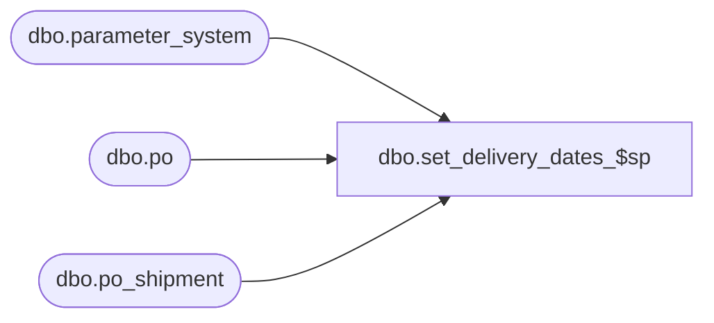

# dbo.set_delivery_dates_$sp

**Database:** me_01  
**Server:** bedrockdb02  

## Architecture Diagram



## Table Dependencies

| Referenced Table |
|---|
| dbo.parameter_system |
| dbo.po |
| dbo.po_shipment |

## Stored Procedure Code

```sql
create proc dbo.set_delivery_dates_$sp as
update po SET 
from_delivery_date = (select min(expected_receipt_date) FROM po_shipment, po AS po1 WHERE po_shipment.po_id = po.po_id AND po.po_id = po1.po_id)
, to_delivery_date = (select max(expected_receipt_date) FROM po_shipment, po AS po1 WHERE po_shipment.po_id = po.po_id AND po.po_id = po1.po_id)
FROM po, parameter_system
WHERE from_delivery_date is null 
AND to_delivery_date is null
AND installed_4wall_flag <> 0
```

