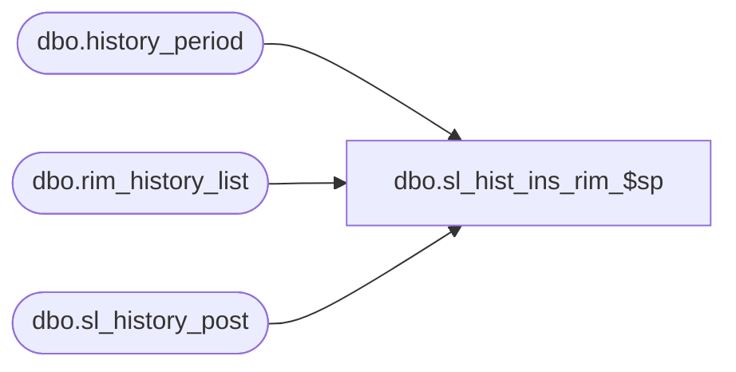

# dbo.sl_hist_ins_rim_$sp

**Database:** me_01  
**Server:** bedrockdb02  

## Architecture Diagram



## Table Dependencies

| Referenced Table |
|---|
| dbo.history_period |
| dbo.rim_history_list |
| dbo.sl_history_post |

## Stored Procedure Code

```sql
create proc dbo.sl_hist_ins_rim_$sp 
(@MerchNodeId decimal(12,0),
@HistPerId decimal(12,0))
AS BEGIN

insert into rim_history_list (merch_hierarchy_group_id, location_id, history_period_id) 
select distinct  @MerchNodeId, location_id, @HistPerId 
from sl_history_post a, history_period b 
where a.merch_hierarchy_group_id = @MerchNodeId
and a.history_period_id = b.history_period_id 
and b.history_period_id = @HistPerId ;

END;
```

