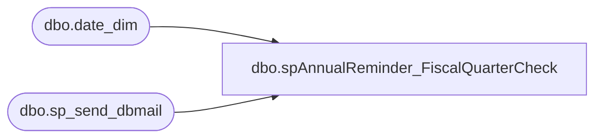

# dbo.spAnnualReminder_FiscalQuarterCheck

**Database:** me_01  
**Server:** bedrockdb02  

## Architecture Diagram



## Table Dependencies

| Referenced Table |
|---|
| dbo.date_dim |
| dbo.sp_send_dbmail |

## Stored Procedure Code

```sql
-- =============================================
-- Author:		Lizzy Timm
-- Create date: 12/02/2020
-- Description:	Check and send an email alert if the following Sunday is the start of the fourth fiscal quarter.
-- =============================================
CREATE PROCEDURE [dbo].[spAnnualReminder_FiscalQuarterCheck]
AS
BEGIN

SET DATEFIRST 1

DECLARE 
	@BeginDay date,
	@NextSunday date,
	@Sunday varchar(20),
	@TYear varchar(5),
	@NYear varchar(5),
	@text nvarchar(max),
	@subj varchar(250)

SELECT DISTINCT @BeginDay = MIN(Actual_Date) FROM [papamart].[dw].[dbo].[date_dim] WHERE Fiscal_Year = DATEPART(yyyy,getdate()) AND Fiscal_Quarter = 4
SELECT @NextSunday = DATEADD(DAY , 7-DATEPART(WEEKDAY,GETDATE()),GETDATE())  -- Fiscal quarters always begin on a Sunday
SELECT DISTINCT @TYear = Fiscal_Year FROM [papamart].[dw].[dbo].[date_dim] WHERE Fiscal_Year = DATEPART(yyyy,getdate()) AND Fiscal_Quarter = 4
SELECT DISTINCT @NYear = Fiscal_Year FROM [papamart].[dw].[dbo].[date_dim] WHERE Fiscal_Year = DATEPART(yyyy,DATEADD(Year,1,getdate())) AND Fiscal_Quarter = 4
SELECT @Sunday = convert(varchar, @NextSunday, 101)

IF (DATEDIFF(Day,@BeginDay, @NextSunday) = 0)
	BEGIN
		SET @text = 
			'<font face =arial size = 2>' + 
			'The fourth fiscal quarter will start this coming Sunday, ' + @Sunday + '.  Complete the tasks listed in this email before the quarter begins.' +
			'<br>'+
			'<br>'+
			'<font size = 4>' +
			'TXT' +
			'</font><br>'+
			'<font size = 3>' +
			'Import Weekly Script' +
			'</font><br>'+
			'<div style="margin-left:8px">The year parameters of the TXT Import Weekly script should be updated as follows: ' +
			'<br>' + 
			'&nbsp; &nbsp; &nbsp;[String] $nTYear = ' + @TYear +
			'<br>' + 
			'&nbsp; &nbsp; &nbsp;[String] $nNYear = ' + @NYear +
			'<br>' + 
			'For more information, view the Import Weekly section of the Confluence Document: ' +
			'<a href="https://build-a-bear.atlassian.net/wiki/spaces/ES/pages/1122566145/Annual+Tasks#Import-Weekly">' +
			'TXT Annual Tasks' +
			'</a>.</div>' +
			'<br>' + 
			'<br>' +
			'<font size = 4>' +
			'D365' +
			'</font><br>'+
			'<font size = 3>' +
			'Personal Access Token' +
			'</font><br>'+
			'<div style="margin-left:8px">Update the expiration date of the PAT.  For directions, view the Confluence Document: ' +
			'<a href="https://build-a-bear.atlassian.net/wiki/spaces/ES/pages/1258520583/Update+Personal+Access+Tokens">' +
			'Update Personal Access Tokens' +
			'</a>.</div>' +
			'<br>' +
			'<br>' +
			'<b>Technical Details:' +
			'<font size = 1><br>SQL Agent Job on BEDROCKDB02:</b> TXT Parameter Update Alert' +
			'<br><b>SQL Stored Procedure on Bedrockdb02:</b> me_01.dbo.spAnnualReminder_FiscalQuarterCheck' +	
			'</font></font>'
		SET @subj = 'ACTION REQUIRED - Annual Tasks'
		exec msdb.dbo.sp_send_dbmail
			 @profile_name = 'merchadmin',
			 @recipients = 'EntSysSupport@buildabear.com',
			--@recipients = 'lizzyt@buildabear.com',
			 @body = @text,
			 @subject= @subj,
			 @body_format = 'HTML'
	END
END
```

