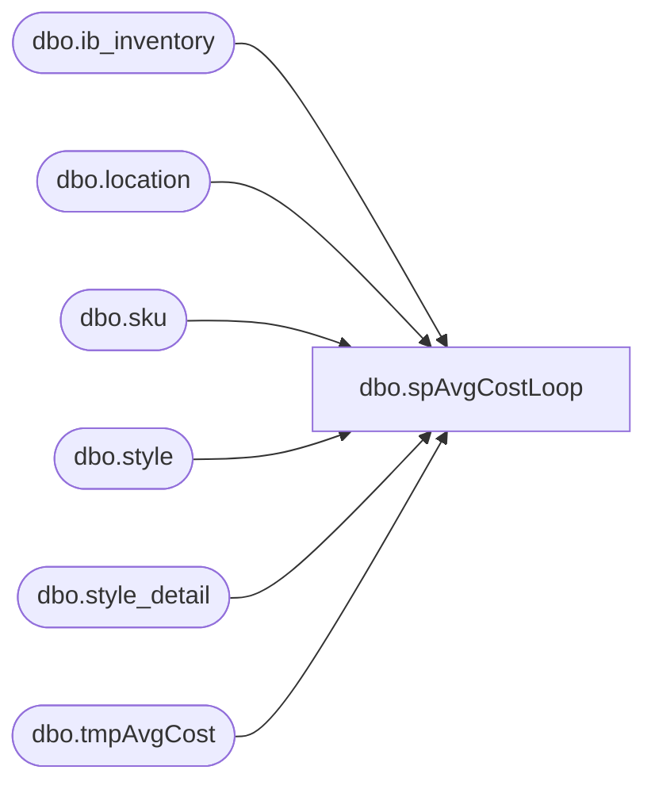

# dbo.spAvgCostLoop

**Database:** me_01  
**Server:** bedrockdb02  

## Architecture Diagram



## Table Dependencies

| Referenced Table |
|---|
| dbo.ib_inventory |
| dbo.location |
| dbo.sku |
| dbo.style |
| dbo.style_detail |
| dbo.tmpAvgCost |

## Stored Procedure Code

```sql
CREATE proc [dbo].[spAvgCostLoop]
@style varchar(6), @days varchar(5)

as

-- =====================================================================================================
-- Name: spAvgCostLoop
--
-- Description: Accepts Style and Days parameters, pulls Average Cost for all stores, for all days withing range of getdate()-@days, for the input style.
--				Records are stored in tmpAvgCost table.
--
-- Revision History
--		Name:			Date:			Comments: 
--		Dan Tweedie 	12/01/2015		Created proc.	
-- =====================================================================================================

set nocount on


IF (Object_ID('me_01..tmpAvgCost') IS NOT NULL) DROP TABLE tmpAvgCost
create table tmpAvgCost
	(Style_Code varchar(6),
	 Location_code varchar(4),
	 Transaction_Date smalldatetime,
	 Total_Units int,
	 Total_Cost numeric(9,2),
	 Avg_Cost numeric(9,2))


declare --@style varchar(6), 
	    @getdate varchar(15),  
	    --@days varchar(5),
	    @exp varchar(30),
	    @datestring varchar(75),
		@date smalldatetime,
		@count int

declare @dateTable Table(DateStamp smalldatetime)

--select @style = '016615'
select @getdate = 'getdate()-'
--select @days = '365'

while @days > 0
begin
	select @exp = @getdate + @days
	select @datestring = 'select cast(cast(' + @exp + ' as date) as smalldatetime)'
	insert @dateTable exec (@datestring) 
	set @days = @days - 1
	if @days < 0
		break
	else
		continue
end

select @count = count(*) from @dateTable

while @count > 0

begin
	select @date = min(DateStamp) from @dateTable;

	WITH AvgCost (Style_Code, 
				  Location_Code,
				  Transaction_Date,
				  Total_Units,
				  Total_Cost,
				  Avg_Cost)

	AS
   (select  s.style_code,
			l.location_code,
			@date as transaction_date,
			sum(ii.transaction_units) as total_units,
			sum(ii.transaction_cost) as total_cost,
			case 
				when sum(ii.transaction_cost) = 0 
							or  sum(ii.transaction_units) = 0
						then 0.00
				when sum(ii.transaction_units) < 0
						then sd.last_net_final_po_cost
				else sum(ii.transaction_cost)/sum(ii.transaction_units) 
			end average_cost
	from ib_inventory ii with (nolock)
	join location l with (nolock) on ii.location_id = l.location_id
	join sku sk with (nolock) on ii.sku_id = sk.sku_id
	join style s with (nolock) on sk.style_id = s.style_id
	join style_detail sd with (nolock) on s.style_id = sd.style_id
	where s.style_code = @style
	and ii.transaction_date <=  @date
	and		ii.transaction_type_code in ('200','510','511','550','900','920','930', '300','302','305','309') -- Keith 1/13/2016
	group by s.style_code, s.short_desc, l.location_code,sd.last_net_final_po_cost)

	insert tmpAvgCost
	select style_code,
		   location_code,
		   transaction_date,
		   total_units,
		   total_cost,
		   avg_cost
	from AvgCost

	delete from @dateTAble
	where DateStamp = @date
	
	select @count = count(*) from @dateTable

	if @count = 0
		break
	else
		continue

end


select *
from tmpAvgCost
```

