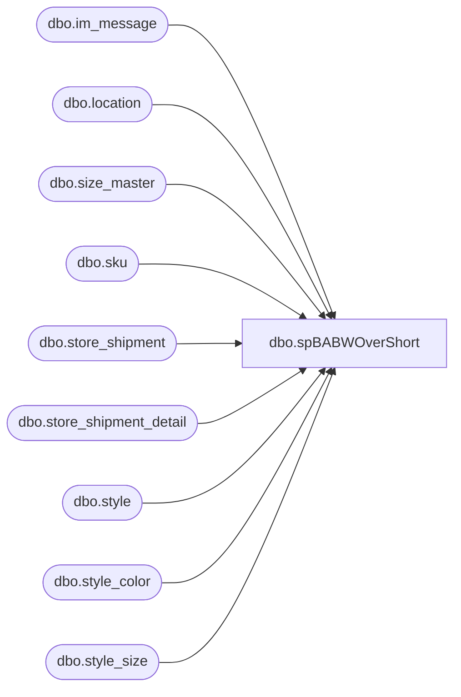

# dbo.spBABWOverShort

**Database:** me_01  
**Server:** bedrockdb02  

## Architecture Diagram



## Table Dependencies

| Referenced Table |
|---|
| dbo.im_message |
| dbo.location |
| dbo.size_master |
| dbo.sku |
| dbo.store_shipment |
| dbo.store_shipment_detail |
| dbo.style |
| dbo.style_color |
| dbo.style_size |

## Stored Procedure Code

```sql
-- 10/26/2004 -> Keith - Made a change to look for NULLs.
-- 6/3/2008 -> Keith - Added External System field.
--01/31/2013 - Dan T - changed the units_sent and units_received references to be isnull(x,0), to ensure that the discrepancy units calculation is correct

CREATE  PROCEDURE [dbo].[spBABWOverShort]
(@mindate datetime, @maxdate datetime)
AS
select ss.document_no, min(lto.location_code) as store,
s.style_code, min(s.plu_desc) as 'Style Description', 
min(sc.short_desc) as 'Color Description',
sum(isnull(ssd.units_sent, 0)) as 'Units Sent',
sum(isnull(ssd.units_received,0)) as 'Units Received',
sum(isnull(ssd.units_sent,0)-isnull(ssd.units_received,0)) as 'Discrepancy Units', 
min(ss.receive_date) as 'Receive Date', 
min(ss.ship_date) as 'Send Date',
min(sm.prim_size_label) as 'Size Code',
min(m.message_text) as 'Message',
ss.external_system_name as 'Rec Type Message'
--0
from store_shipment ss WITH (NOLOCK)

inner join store_shipment_detail ssd WITH (NOLOCK)
on ss.store_shipment_id=ssd.store_shipment_id

inner join location lto WITH (NOLOCK)
on ss.location_id=lto.location_id

inner join sku WITH (NOLOCK)
on ssd.sku_id=sku.sku_id

inner join style s WITH (NOLOCK)
on ssd.style_id=s.style_id

inner join style_color sc WITH (NOLOCK)
on sku.style_color_id=sc.style_color_id

inner join style_size sz WITH (NOLOCK)
on sku.style_size_id=sz.style_size_id

inner join size_master sm WITH (NOLOCK)
on sz.size_master_id=sm.size_master_id

left join im_message m WITH (NOLOCK)
on ss.store_shipment_id = m.parent_id
and m.message_type_id=11

where ss.document_status=4 --received
and isnull(ssd.units_sent,0)- isnull(ssd.units_received,0) <> 0 -- see change made on 10/26/2004
AND ss.receive_date Between   @mindate and   @maxdate 
--receive_date has time as well - be careful here
group by ss.document_no, s.style_code, ss.external_system_name
order by ss.document_no, s.style_code
```

