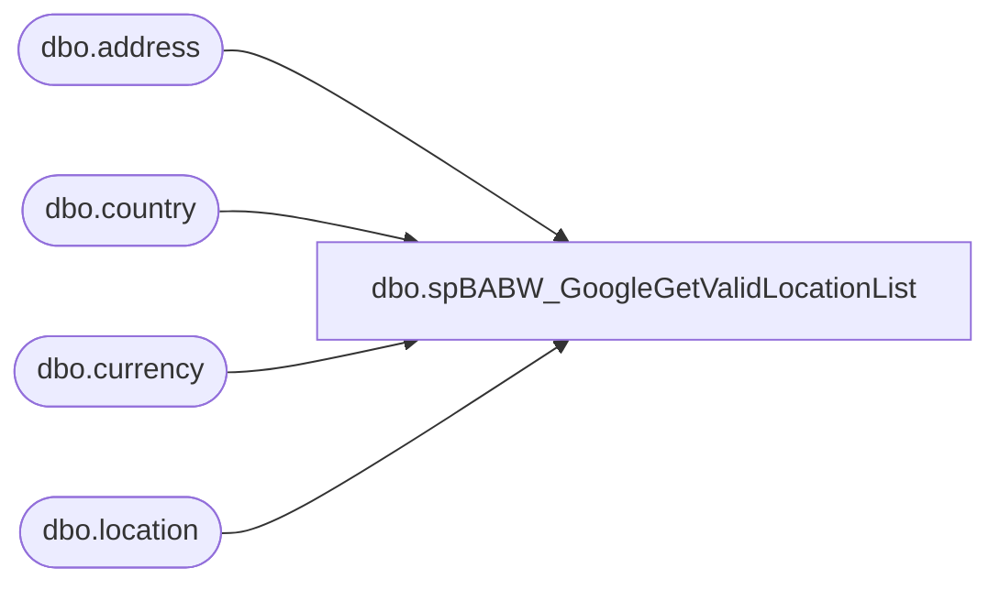

# dbo.spBABW_GoogleGetValidLocationList

**Database:** me_01  
**Server:** bedrockdb02  

## Architecture Diagram



## Table Dependencies

| Referenced Table |
|---|
| dbo.address |
| dbo.country |
| dbo.currency |
| dbo.location |

## Stored Procedure Code

```sql
-- =============================================
-- Author:		JA OSGI
-- Create date: 10/27/2010
-- Description:	Returns a list of valid retail locations to use for
-- other feed data for the Google Local Shopping project
-- =============================================
CREATE procEDURE [dbo].[spBABW_GoogleGetValidLocationList]
AS
BEGIN
	-- SET NOCOUNT ON added to prevent extra result sets from
	-- interfering with SELECT statements.
	SET NOCOUNT ON;

	SELECT DISTINCT
		l.location_id AS locationId
		,l.location_code AS locationCode
		,l.location_name AS locationName
		,a.address_name AS addressName
		,a.address_line1 AS address1
		,a.address_line2 AS address2
		,a.address_city AS city
		,a.address_state AS [state]
		,a.address_zip_code AS postalcode
		,LEFT(c.country_code,2) AS countryCode
		,l.jurisdiction_id AS jursidictionId
		,cu.currency_code AS currencyCode
	FROM
		location AS l WITH(NOLOCK)
	INNER JOIN
		[address] AS a WITH(NOLOCK)
			ON a.parent_id = l.location_id
	INNER JOIN
		country AS c WITH(NOLOCK)
			ON c.country_id = a.country_id
	INNER JOIN
		currency AS cu WITH(NOLOCK)
			ON cu.currency_id = c.currency_id
	WHERE
		(l.location_type = 2 AND CAST(l.location_code AS int) BETWEEN 1 AND 2300 AND l.active_flag = 1) -- AND l.location_status_id IN (1,2,3,6))
	AND
		(a.parent_type = 2 AND a.address_type_id = 1)
	AND
		UPPER(LEFT(a.address_name,12)) = 'BUILD-A-BEAR'
	AND
		LEFT(c.country_code,2) IN ('US','CA')
	AND
		l.location_status_id <> 5
	ORDER BY
		l.location_code
 

END
```

