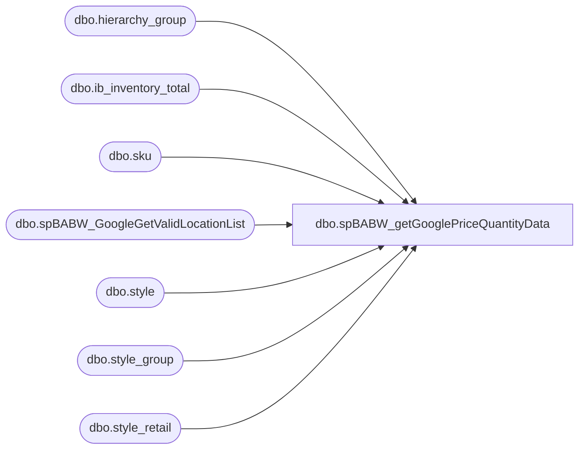

# dbo.spBABW_getGooglePriceQuantityData

**Database:** me_01  
**Server:** bedrockdb02  

## Architecture Diagram



## Table Dependencies

| Referenced Table |
|---|
| dbo.hierarchy_group |
| dbo.ib_inventory_total |
| dbo.sku |
| dbo.spBABW_GoogleGetValidLocationList |
| dbo.style |
| dbo.style_group |
| dbo.style_retail |

## Stored Procedure Code

```sql
-- =============================================
-- Author:		JA OSGI
-- Create date: 9/7/2010
-- Description:	SELECT current price and quantity levels
--			for each product at each store for the Google 
--			Local Shopping feed.
-- Modified: 1/16/2015 - Dan Tweedie - the substring to filter the department is invalid. It should start at 7th character, not the 6th. The 6th character is a '-'
-- =============================================
CREATE procEDURE [dbo].[spBABW_getGooglePriceQuantityData]
AS
BEGIN
	-- SET NOCOUNT ON added to prevent extra result sets from
	-- interfering with SELECT statements.
	SET NOCOUNT ON;


	DECLARE @locations table(locationId smallint, locationCode varchar(20), locationName varchar(60), addressName varchar(60), address1 varchar(50), address2 varchar(50), city varchar(20), state varchar(2), postalcode varchar(15), countryCode char(2), jurisdictionId smallint, currencyCode varchar(10))
	
	
	INSERT INTO 
		@locations(locationId, locationCode, locationName, addressName, address1, address2, city, state, postalCode, countryCode, jurisdictionId, currencyCode)
	EXEC dbo.spBABW_GoogleGetValidLocationList;
		

	SELECT --TOP 1000
		l.locationCode AS retailStoreId
		,st.style_code AS itemId
		,sr.current_selling_retail AS price
		,'' AS salePrice
		,'' AS saleEffectiveDate
		,iit.total_on_hand_units AS quantity
		,CASE
			WHEN iit.total_on_hand_units >= 5 THEN 'in stock'
			WHEN iit.total_on_hand_units BETWEEN 1 AND 4 THEN 'limited availability'
			ELSE 'out of stock'
		END AS availability
		,'' AS weeksOfSupply
		,'' AS onDisplayToOrder
		,'' AS promotionalText
		,'n' AS featuredProduct

	FROM
		ib_inventory_total AS iit WITH(NOLOCK)
	INNER JOIN 
		sku AS sk WITH(NOLOCK) ON sk.sku_id = iit.sku_id
	INNER JOIN 
		style AS st WITH(NOLOCK) ON st.style_id = sk.style_id
	INNER JOIN 
		style_group AS sg WITH(NOLOCK) ON sg.style_id = st.style_id
	INNER JOIN 
		hierarchy_group AS hg WITH(NOLOCK) ON hg.hierarchy_group_id = sg.hierarchy_group_id
	INNER JOIN
		@locations AS l ON iit.location_id = l.locationId
	INNER JOIN
		style_retail AS sr WITH(NOLOCK) ON sr.style_id = st.style_id
	WHERE 
		iit.inventory_status_id = 1
	AND 
		iit.total_on_hand_units > 0
	AND 
		--SUBSTRING(hg.hierarchy_group_code, 6,2) <> '60'
		SUBSTRING(hg.hierarchy_group_code, 7,2) not in ('40','45','46','47','48','52','53','54','55','60','70','75','80','85')
	AND
		l.locationCode not in ('0000','0013')
	AND
		l.jurisdictionId = sr.jurisdiction_id
	AND
		sr.current_selling_retail > 0.00
--	ORDER BY
		--l.locationCode, st.style_code

END
```

