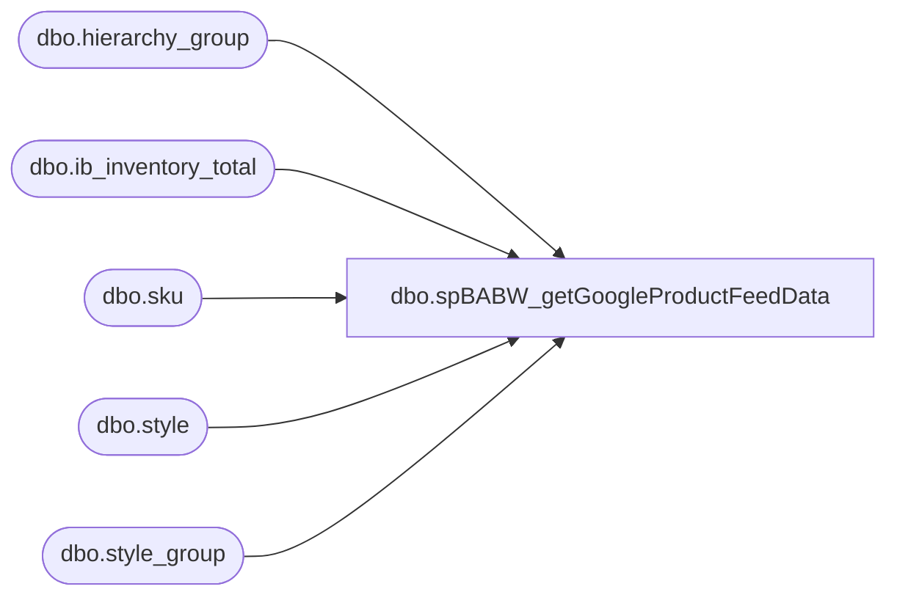

# dbo.spBABW_getGoogleProductFeedData

**Database:** me_01  
**Server:** bedrockdb02  

## Architecture Diagram



## Table Dependencies

| Referenced Table |
|---|
| dbo.hierarchy_group |
| dbo.ib_inventory_total |
| dbo.sku |
| dbo.style |
| dbo.style_group |

## Stored Procedure Code

```sql
-- =============================================
-- Author:		JA - OSGI
-- Create date: 9-7-10
-- Description:	used to pull all products by store location
-- Modified: 1/16/2015 - Dan Tweedie - the substring to filter the department is invalid. It should start at 7th character, not the 6th. The 6th character is a '-'
-- =============================================
CREATE procEDURE [dbo].[spBABW_getGoogleProductFeedData]
AS
BEGIN
	-- SET NOCOUNT ON added to prevent extra result sets from
	-- interfering with SELECT statements.
	SET NOCOUNT ON;

SELECT DISTINCT
	'' AS retailStoreId
	,items.itemId AS itemId
	,CAST(CAST(items.itemId AS int) AS varchar(25)) AS webItemId
	,LEFT(s.long_desc,1) + SUBSTRING(LOWER(s.long_desc),2,LEN(s.long_desc)-1) AS productTitle
	,LOWER(COALESCE(s.long_desc, s.short_desc)) as productDescription
	,'' AS price
	,'' AS salePrice
	,'' AS saleEffectiveDate
	,'' AS promotionalText
	,'' AS condition
	,'' AS UPC
	,'' AS manuPartNumber
	,'' AS brand
	,'' AS webURL
	,'' AS imageWebURL
	,'' AS productType
	,'' AS weight
	,'' AS size
	,'' AS color
	,'' AS itemGroupId
	,'' AS swatchImageURL
	,'n' AS featuredProduct

FROM
	(SELECT DISTINCT st.style_code AS itemId, iit.sku_id AS sku_id, hg.hierarchy_group_code
		FROM ib_inventory_total AS iit
		INNER JOIN sku AS sk WITH(NOLOCK) ON sk.sku_id = iit.sku_id
		INNER JOIN style AS st WITH(NOLOCK) ON st.style_id = sk.style_id
		INNER JOIN style_group AS sg WITH(NOLOCK) ON sg.style_id = st.style_id
		INNER JOIN hierarchy_group AS hg WITH(NOLOCK) ON hg.hierarchy_group_id = sg.hierarchy_group_id
		WHERE iit.inventory_status_id = 1
		AND iit.total_on_hand_units > 0
		--AND SUBSTRING(hg.hierarchy_group_code, 6,2) <> '60'
		AND SUBSTRING(hg.hierarchy_group_code, 7,2) not in ('40','45','46','47','48','52','53','54','55','60','70','75','80','85')) AS items
INNER JOIN
	style AS s WITH(NOLOCK) ON s.style_code = items.itemId
ORDER BY
	items.itemId

END
```

