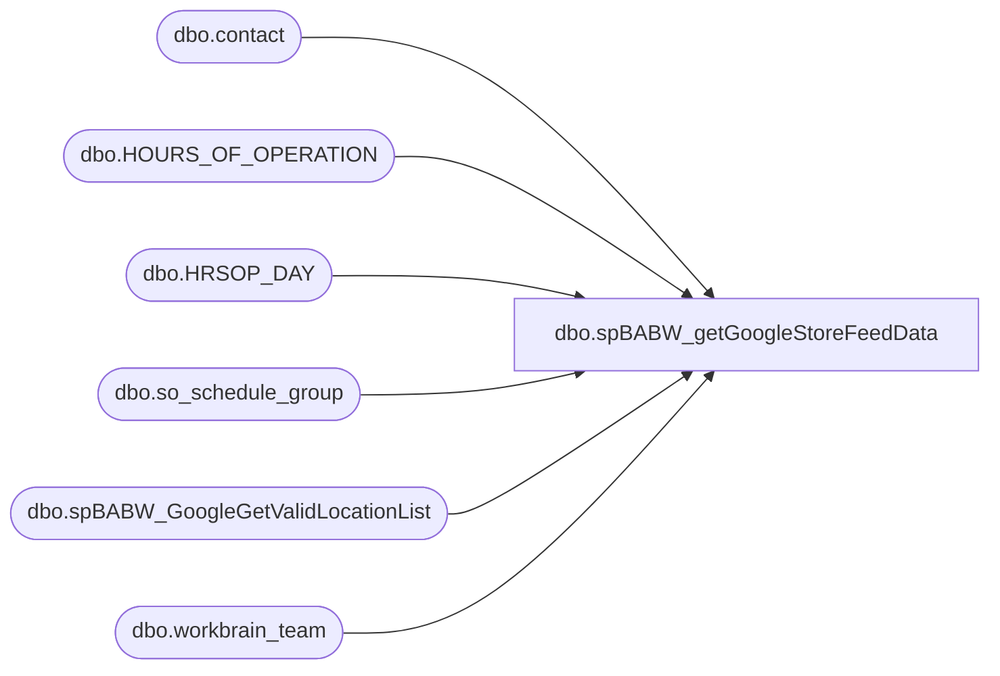

# dbo.spBABW_getGoogleStoreFeedData

**Database:** me_01  
**Server:** bedrockdb02  

## Architecture Diagram



## Table Dependencies

| Referenced Table |
|---|
| dbo.contact |
| dbo.HOURS_OF_OPERATION |
| dbo.HRSOP_DAY |
| dbo.so_schedule_group |
| dbo.spBABW_GoogleGetValidLocationList |
| dbo.workbrain_team |

## Stored Procedure Code

```sql
-- =============================================
-- Author: JA OSGI
-- Create date: 9/2/2010
-- Description:	Retrieves data for store listings
--		to pass to google local shopping
-- Modifications:
--   Mod Date: 10/21/2010
--		Modified SQL to get store hours from workbrain. 
--			eCommerce project removed tables and recommmended this change
-- =============================================
CREATE PROCEDURE [dbo].[spBABW_getGoogleStoreFeedData]
AS
BEGIN
	-- SET NOCOUNT ON added to prevent extra result sets from
	-- interfering with SELECT statements.
	SET NOCOUNT ON;

		DECLARE @storeHours table(StoreNumber varchar(25), wkDay int, OpenTime varchar(5), CloseTime varchar(11))
		DECLARE @storeHourListing table (StoreNumber varchar(10), LocationCode varchar(4), storeHours varchar(255))
		DECLARE @locations table(locationId smallint, locationCode varchar(20), locationName varchar(60), addressName varchar(60), address1 varchar(50), address2 varchar(50), city varchar(20), state varchar(2), postalcode varchar(15), countryCode char(2), jurisdictionId smallint, currencyCode varchar(10))
		
		
		INSERT INTO 
			@locations(locationId, locationCode, locationName, addressName, address1, address2, city, state, postalCode, countryCode, jurisdictionId, currencyCode)
		EXEC dbo.spBABW_GoogleGetValidLocationList;
		
	
		INSERT INTO
				@storeHours(StoreNumber, wkDay, OpenTime, CloseTime)
		SELECT
			LEFT(wt.wbt_name, 5) COLLATE SQL_Latin1_General_CP1_CI_AS 
			,b.HRSOPD_DAY 
			, convert(varchar(5), b.HRSOPD_OPEN_TIME, 14) 
			, convert(varchar(5), b.HRSOPD_CLOSE_TIME, 14)
		FROM 
			LABORDB01_READONLY.workbrainProd.dbo.HOURS_OF_OPERATION AS a WITH(NOLOCK)
		INNER JOIN
			LABORDB01_READONLY.workbrainProd.dbo.HRSOP_DAY  AS b
				ON a.HRSOP_ID = b.HRSOP_ID
		INNER JOIN
			 LABORDB01_READONLY.workbrainProd.dbo.workbrain_team AS wt 
				ON wt.wbt_id = a.wbt_id
		INNER JOIN 
			LABORDB01_READONLY.workbrainProd.dbo.so_schedule_group AS ssg ON ssg.wbt_id = wt.wbt_id

		WHERE
			a.hrsop_id IN 
				(
				SELECT wt.hrsop_id from LABORDB01_READONLY.workbrainProd.dbo.workbrain_team AS wt 
				INNER JOIN LABORDB01_READONLY.workbrainProd.dbo.so_schedule_group AS ssg ON ssg.wbt_id = wt.wbt_id
				WHERE wt.wbtt_id = 10002 and wt.wbt_id not in (14787)
				)

		INSERT INTO @storeHourListing(StoreNumber, LocationCode, storeHours)
		SELECT aa.StoreNumber,RIGHT(aa.StoreNumber,4) AS LocationCode, MAX(aa.storeHours) AS storeHours
		FROM
			(SELECT s1.StoreNumber, ISNULL(s2.DayHours,'') + ISNULL(s3.DayHours,'') + ISNULL(s4.DayHours,'') + ISNULL(s5.DayHours,'') + ISNULL(s6.DayHours,'') + ISNULL(s7.DayHours,'') + ISNULL(s8.DayHours,'') AS storeHours
			FROM
				(SELECT Distinct StoreNumber FROM @storeHours) AS s1
			LEFT JOIN
				(SELECT StoreNumber, '1:' + LEFT(OpenTIme,5) + ':' + LEFT(CloseTime,5) + ',' AS DayHours FROM @storeHours WHERE wkDay = 1) AS s2
						ON s2.StoreNumber = s1.StoreNumber
			LEFT JOIN
				(SELECT StoreNumber, '2:' + LEFT(OpenTIme,5) + ':' + LEFT(CloseTime,5) + ',' AS DayHours FROM @storeHours WHERE wkDay = 2) AS s3
						ON s3.StoreNumber = s1.StoreNumber
			LEFT JOIN
				(SELECT StoreNumber, '3:' + LEFT(OpenTIme,5) + ':' + LEFT(CloseTime,5) + ',' AS DayHours FROM @storeHours WHERE wkDay = 3) AS s4
						ON s4.StoreNumber = s1.StoreNumber
			LEFT JOIN
				(SELECT StoreNumber, '4:' + LEFT(OpenTIme,5) + ':' + LEFT(CloseTime,5) + ',' AS DayHours FROM @storeHours WHERE wkDay = 4) AS s5
						ON s5.StoreNumber = s1.StoreNumber
			LEFT JOIN
				(SELECT StoreNumber, '5:' + LEFT(OpenTIme,5) + ':' + LEFT(CloseTime,5) + ',' AS DayHours FROM @storeHours WHERE wkDay = 5) AS s6
						ON s6.StoreNumber = s1.StoreNumber
			LEFT JOIN
				(SELECT StoreNumber, '6:' + LEFT(OpenTIme,5) + ':' + LEFT(CloseTime,5) + ',' AS DayHours FROM @storeHours WHERE wkDay = 6) AS s7
						ON s7.StoreNumber = s1.StoreNumber
			LEFT JOIN
				(SELECT StoreNumber, '7:' + LEFT(OpenTIme,5) + ':' + LEFT(CloseTime,5) AS DayHours FROM @storeHours WHERE wkDay = 7) AS s8
						ON s8.StoreNumber = s1.StoreNumber) AS aa GROUP BY aa.StoreNumber, RIGHT(aa.StoreNumber,4)
				

			SELECT DISTINCT
					l.locationId AS locationId
					,l.locationCode AS locationCode
					,l.locationName AS locationName
					,'Build-A-Bear Workshop' AS storeName
					,l.address1 AS address1
					,l.address2 AS address2
					,l.city AS city
					,l.[state] AS [state]
					,l.postalcode AS postalcode
					,l.countryCode AS countryCode
					,COALESCE(ct.contact_number, '314-423-8000') AS mainPhoneNumber
					,CASE 
						WHEN l.jurisdictionId = 2 THEN 'http://www.buildabear.co.fr'
						ELSE 'http://www.buildabear.com'
					END AS homeURL
					,l.currencyCode AS currencyCode
					,'331,232' AS categories
					,sh.StoreHours AS storeHours
					,'Build-A-Bear Workshop sells teddy bears and other stuffed animals. Customers go through an interactive process in which their chosen stuffed animal is assembled and customized during their visit.' AS storeDescription
					
				FROM
					@locations AS l 
				LEFT JOIN
					contact AS ct WITH(NOLOCK)
						ON ct.parent_id = l.locationId AND (ct.contact_type = 4 AND ct.parent_type = 2)
				LEFT JOIN
					@storeHourListing AS sh
						ON sh.LocationCode = l.locationCode
				ORDER BY
					l.locationCode


END
```

