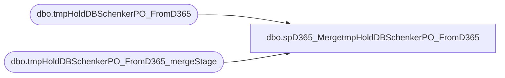

# dbo.spD365_MergetmpHoldDBSchenkerPO_FromD365

**Database:** me_01  
**Server:** bedrockdb02  

## Architecture Diagram



## Table Dependencies

| Referenced Table |
|---|
| dbo.tmpHoldDBSchenkerPO_FromD365 |
| dbo.tmpHoldDBSchenkerPO_FromD365_mergeStage |

## Stored Procedure Code

```sql
create proc spD365_MergetmpHoldDBSchenkerPO_FromD365

as 

---------------------------------------------------------------------------------------------------------
-- Dan Tweedie	-	2017-11-08	-	Created proc to merge staged D365 PO data for export to DB Schenker
---------------------------------------------------------------------------------------------------------

set nocount on


merge into tmpHoldDBSchenkerPO_FromD365 as target
using tmpHoldDBSchenkerPO_FromD365_mergeStage as source
on (
		target.PurchaseOrder=source.PurchaseOrder
		and
		target.ProductDetailID=source.ProductDetailID 
	)
when not matched by target
	then insert
		(
			ProjID,
			PurchaseOrder,
			PurposeCode,
			Division,
			Department,
			Buyer,
			SupplierName,
			SupplierCode, 
			SupplierAddress1,
			SupplierAddress2,
			SupplierAddress3,
			SupplierAddress4,
			UNLOCCodeValue,
			ScheduleKCode1,
			SupplierCity,
			SupplierState,
			SupplierCountry,
			SupplierPostal,
			OrderPaymentTerms,
			FreightPaymentTerms,
			OrderDate,
			PORef1,
			PORef2,
			PORef3,
			ShipToName,
			ShipToCode,
			ShipToEmail,
			ShipToAddress1,
			ShipToAddress2,
			ShipToAddress3,
			ShiptoAddress4,
			UNLOCCode1,
			ScheduleDorKCode,
			ShipToCountry,
			ShipToCity,
			ShipToState,
			ShipToZipCode,
			FactoryName,
			FactoryCode, 
			FactoryAddress1,
			FactoryAddress2,
			FactoryAddress3,
			FactoryAddress4,
			UNLOCCode2,
			ScheduleKCode2,
			FactoryCity,
			FactoryState,
			FactoryCountry,
			FactoryPostal,
			ShipWindowStart,
			ShipWindowEnd,
			ShipWindowCancelDate,
			ProductDetailID,
			ProductDetailProductCode,
			ProductDetailProductDesc,
			ProductDetailHTS,
			ProductDetailOrderQuantity,
			QuantityUOM,
			UnitCost,
			Mode, 
			ProductDetailMasterPackQty,
			ProductDetailNoOfPackages,
			ProductDetailInnerPackQty,
			ProductDetailTotalVolume,
			ProductDetailTotalWeight,
			ProductDetailProductPriority,
			ProductDetailManufacturerID,
			ProductDetailProductRef,
			ProductDetailProductRef2,
			ProductDetailProductRef3,
			ProductDetailProductRef4,
			ProductDetailProductRef5,
			OriginCountry, 
			OriginCity, 
			FinalDestination,
			POETA,
			ProductDate1,
			ProductDate2,
			Consolidator,
			Broker,
			Currency,
			SKUNumber,
			Size,
			Color,
			LineEndIndicator,
			InsertDate,
			SendData
		)
	values
		(
			source.ProjID,
			source.PurchaseOrder,
			source.PurposeCode,
			source.Division,
			source.Department,
			source.Buyer,
			source.SupplierName,
			source.SupplierCode, 
			source.SupplierAddress1,
			source.SupplierAddress2,
			source.SupplierAddress3,
			source.SupplierAddress4,
			source.UNLOCCodeValue,
			source.ScheduleKCode1,
			source.SupplierCity,
			source.SupplierState,
			source.SupplierCountry,
			source.SupplierPostal,
			source.OrderPaymentTerms,
			source.FreightPaymentTerms,
			source.OrderDate,
			source.PORef1,
			source.PORef2,
			source.PORef3,
			source.ShipToName,
			source.ShipToCode,
			source.ShipToEmail,
			source.ShipToAddress1,
			source.ShipToAddress2,
			source.ShipToAddress3,
			source.ShiptoAddress4,
			source.UNLOCCode1,
			source.ScheduleDorKCode,
			source.ShipToCountry,
			source.ShipToCity,
			source.ShipToState,
			source.ShipToZipCode,
			source.FactoryName,
			source.FactoryCode, 
			source.FactoryAddress1,
			source.FactoryAddress2,
			source.FactoryAddress3,
			source.FactoryAddress4,
			source.UNLOCCode2,
			source.ScheduleKCode2,
			source.FactoryCity,
			source.FactoryState,
			source.FactoryCountry,
			source.FactoryPostal,
			source.ShipWindowStart,
			source.ShipWindowEnd,
			source.ShipWindowCancelDate,
			source.ProductDetailID,
			source.ProductDetailProductCode,
			source.ProductDetailProductDesc,
			source.ProductDetailHTS,
			source.ProductDetailOrderQuantity,
			source.QuantityUOM,
			source.UnitCost,
			source.Mode, 
			source.ProductDetailMasterPackQty,
			source.ProductDetailNoOfPackages,
			source.ProductDetailInnerPackQty,
			source.ProductDetailTotalVolume,
			source.ProductDetailTotalWeight,
			source.ProductDetailProductPriority,
			source.ProductDetailManufacturerID,
			source.ProductDetailProductRef,
			source.ProductDetailProductRef2,
			source.ProductDetailProductRef3,
			source.ProductDetailProductRef4,
			source.ProductDetailProductRef5,
			source.OriginCountry, 
			source.OriginCity, 
			source.FinalDestination,
			source.POETA,
			source.ProductDate1,
			source.ProductDate2,
			source.Consolidator,
			source.Broker,
			source.Currency,
			source.SKUNumber,
			source.Size,
			source.Color,
			source.LineEndIndicator,
			getdate(),
			1
		)
when matched and
	(
		target.ProjID<>source.ProjID OR
		target.PurposeCode<>source.PurposeCode OR
		target.Division<>source.Division OR
		target.Department<>source.Department OR
		target.Buyer<>source.Buyer OR
		target.SupplierName<>source.SupplierName OR
		target.SupplierCode <>source.SupplierCode  OR
		target.SupplierAddress1<>source.SupplierAddress1 OR
		target.SupplierAddress2<>source.SupplierAddress2 OR
		target.SupplierAddress3<>source.SupplierAddress3 OR
		target.SupplierAddress4<>source.SupplierAddress4 OR
		target.UNLOCCodeValue<>source.UNLOCCodeValue OR
		target.ScheduleKCode1<>source.ScheduleKCode1 OR
		target.SupplierCity<>source.SupplierCity OR
		target.SupplierState<>source.SupplierState OR
		target.SupplierCountry<>source.SupplierCountry OR
		target.SupplierPostal<>source.SupplierPostal OR
		target.OrderPaymentTerms<>source.OrderPaymentTerms OR
		target.FreightPaymentTerms<>source.FreightPaymentTerms OR
		target.OrderDate<>source.OrderDate OR
		target.PORef1<>source.PORef1 OR
		target.PORef2<>source.PORef2 OR
		target.PORef3<>source.PORef3 OR
		target.ShipToName<>source.ShipToName OR
		target.ShipToCode<>source.ShipToCode OR
		target.ShipToEmail<>source.ShipToEmail OR
		target.ShipToAddress1<>source.ShipToAddress1 OR
		target.ShipToAddress2<>source.ShipToAddress2 OR
		target.ShipToAddress3<>source.ShipToAddress3 OR
		target.ShiptoAddress4<>source.ShiptoAddress4 OR
		target.UNLOCCode1<>source.UNLOCCode1 OR
		target.ScheduleDorKCode<>source.ScheduleDorKCode OR
		target.ShipToCountry<>source.ShipToCountry OR
		target.ShipToCity<>source.ShipToCity OR
		target.ShipToState<>source.ShipToState OR
		target.ShipToZipCode<>source.ShipToZipCode OR
		target.FactoryName<>source.FactoryName OR
		target.FactoryCode <>source.FactoryCode  OR
		target.FactoryAddress1<>source.FactoryAddress1 OR
		target.FactoryAddress2<>source.FactoryAddress2 OR
		target.FactoryAddress3<>source.FactoryAddress3 OR
		target.FactoryAddress4<>source.FactoryAddress4 OR
		target.UNLOCCode2<>source.UNLOCCode2 OR
		target.ScheduleKCode2<>source.ScheduleKCode2 OR
		target.FactoryCity<>source.FactoryCity OR
		target.FactoryState<>source.FactoryState OR
		target.FactoryCountry<>source.FactoryCountry OR
		target.FactoryPostal<>source.FactoryPostal OR
		target.ShipWindowStart<>source.ShipWindowStart OR
		target.ShipWindowEnd<>source.ShipWindowEnd OR
		target.ShipWindowCancelDate<>source.ShipWindowCancelDate OR
		target.ProductDetailProductCode<>source.ProductDetailProductCode OR
		target.ProductDetailProductDesc<>source.ProductDetailProductDesc OR
		target.ProductDetailHTS<>source.ProductDetailHTS OR
		target.ProductDetailOrderQuantity<>source.ProductDetailOrderQuantity OR
		target.QuantityUOM<>source.QuantityUOM OR
		target.UnitCost<>source.UnitCost OR
		target.Mode <>source.Mode  OR
		target.ProductDetailMasterPackQty<>source.ProductDetailMasterPackQty OR
		target.ProductDetailNoOfPackages<>source.ProductDetailNoOfPackages OR
		target.ProductDetailInnerPackQty<>source.ProductDetailInnerPackQty OR
		target.ProductDetailTotalVolume<>source.ProductDetailTotalVolume OR
		target.ProductDetailTotalWeight<>source.ProductDetailTotalWeight OR
		target.ProductDetailProductPriority<>source.ProductDetailProductPriority OR
		target.ProductDetailManufacturerID<>source.ProductDetailManufacturerID OR
		target.ProductDetailProductRef<>source.ProductDetailProductRef OR
		target.ProductDetailProductRef2<>source.ProductDetailProductRef2 OR
		target.ProductDetailProductRef3<>source.ProductDetailProductRef3 OR
		target.ProductDetailProductRef4<>source.ProductDetailProductRef4 OR
		target.ProductDetailProductRef5<>source.ProductDetailProductRef5 OR
		target.OriginCountry <>source.OriginCountry  OR
		target.OriginCity <>source.OriginCity  OR
		target.FinalDestination<>source.FinalDestination OR
		target.POETA<>source.POETA OR
		target.ProductDate1<>source.ProductDate1 OR
		target.ProductDate2<>source.ProductDate2 OR
		target.Consolidator<>source.Consolidator OR
		target.Broker<>source.Broker OR
		target.Currency<>source.Currency OR
		target.SKUNumber<>source.SKUNumber OR
		target.Size<>source.Size OR
		target.Color<>source.Color OR
		target.LineEndIndicator<>source.LineEndIndicator
	)
then Update
	set
		target.ProjID=source.ProjID,
		target.PurposeCode=source.PurposeCode,
		target.Division=source.Division,
		target.Department=source.Department,
		target.Buyer=source.Buyer,
		target.SupplierName=source.SupplierName,
		target.SupplierCode =source.SupplierCode ,
		target.SupplierAddress1=source.SupplierAddress1,
		target.SupplierAddress2=source.SupplierAddress2,
		target.SupplierAddress3=source.SupplierAddress3,
		target.SupplierAddress4=source.SupplierAddress4,
		target.UNLOCCodeValue=source.UNLOCCodeValue,
		target.ScheduleKCode1=source.ScheduleKCode1,
		target.SupplierCity=source.SupplierCity,
		target.SupplierState=source.SupplierState,
		target.SupplierCountry=source.SupplierCountry,
		target.SupplierPostal=source.SupplierPostal,
		target.OrderPaymentTerms=source.OrderPaymentTerms,
		target.FreightPaymentTerms=source.FreightPaymentTerms,
		target.OrderDate=source.OrderDate,
		target.PORef1=source.PORef1,
		target.PORef2=source.PORef2,
		target.PORef3=source.PORef3,
		target.ShipToName=source.ShipToName,
		target.ShipToCode=source.ShipToCode,
		target.ShipToEmail=source.ShipToEmail,
		target.ShipToAddress1=source.ShipToAddress1,
		target.ShipToAddress2=source.ShipToAddress2,
		target.ShipToAddress3=source.ShipToAddress3,
		target.ShiptoAddress4=source.ShiptoAddress4,
		target.UNLOCCode1=source.UNLOCCode1,
		target.ScheduleDorKCode=source.ScheduleDorKCode,
		target.ShipToCountry=source.ShipToCountry,
		target.ShipToCity=source.ShipToCity,
		target.ShipToState=source.ShipToState,
		target.ShipToZipCode=source.ShipToZipCode,
		target.FactoryName=source.FactoryName,
		target.FactoryCode =source.FactoryCode ,
		target.FactoryAddress1=source.FactoryAddress1,
		target.FactoryAddress2=source.FactoryAddress2,
		target.FactoryAddress3=source.FactoryAddress3,
		target.FactoryAddress4=source.FactoryAddress4,
		target.UNLOCCode2=source.UNLOCCode2,
		target.ScheduleKCode2=source.ScheduleKCode2,
		target.FactoryCity=source.FactoryCity,
		target.FactoryState=source.FactoryState,
		target.FactoryCountry=source.FactoryCountry,
		target.FactoryPostal=source.FactoryPostal,
		target.ShipWindowStart=source.ShipWindowStart,
		target.ShipWindowEnd=source.ShipWindowEnd,
		target.ShipWindowCancelDate=source.ShipWindowCancelDate,
		target.ProductDetailProductCode=source.ProductDetailProductCode,
		target.ProductDetailProductDesc=source.ProductDetailProductDesc,
		target.ProductDetailHTS=source.ProductDetailHTS,
		target.ProductDetailOrderQuantity=source.ProductDetailOrderQuantity,
		target.QuantityUOM=source.QuantityUOM,
		target.UnitCost=source.UnitCost,
		target.Mode =source.Mode ,
		target.ProductDetailMasterPackQty=source.ProductDetailMasterPackQty,
		target.ProductDetailNoOfPackages=source.ProductDetailNoOfPackages,
		target.ProductDetailInnerPackQty=source.ProductDetailInnerPackQty,
		target.ProductDetailTotalVolume=source.ProductDetailTotalVolume,
		target.ProductDetailTotalWeight=source.ProductDetailTotalWeight,
		target.ProductDetailProductPriority=source.ProductDetailProductPriority,
		target.ProductDetailManufacturerID=source.ProductDetailManufacturerID,
		target.ProductDetailProductRef=source.ProductDetailProductRef,
		target.ProductDetailProductRef2=source.ProductDetailProductRef2,
		target.ProductDetailProductRef3=source.ProductDetailProductRef3,
		target.ProductDetailProductRef4=source.ProductDetailProductRef4,
		target.ProductDetailProductRef5=source.ProductDetailProductRef5,
		target.OriginCountry =source.OriginCountry ,
		target.OriginCity =source.OriginCity ,
		target.FinalDestination=source.FinalDestination,
		target.POETA=source.POETA,
		target.ProductDate1=source.ProductDate1,
		target.ProductDate2=source.ProductDate2,
		target.Consolidator=source.Consolidator,
		target.Broker=source.Broker,
		target.Currency=source.Currency,
		target.SKUNumber=source.SKUNumber,
		target.Size=source.Size,
		target.Color=source.Color,
		target.LineEndIndicator=source.LineEndIndicator,
		target.UpdateDate = getdate(),
		target.SendData = 1
when not matched by source
then delete
;
```

