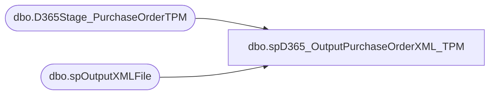

# dbo.spD365_OutputPurchaseOrderXML_TPM

**Database:** me_01  
**Server:** bedrockdb02  

## Architecture Diagram



## Table Dependencies

| Referenced Table |
|---|
| dbo.D365Stage_PurchaseOrderTPM |
| dbo.spOutputXMLFile |

## Stored Procedure Code

```sql
CREATE proc [dbo].[spD365_OutputPurchaseOrderXML_TPM]
@loc varchar(200)

as

-------------------------------------------------------------------------------------------------------
--	Dan Tweedie	-	2017-11-07	-	Created proc - Generates PO XML File for TPM integration (source is D365 ETL)

-------------------------------------------------------------------------------------------------------

set nocount on

----the code below will output and upload the xml files
If (select count(*) from D365Stage_PurchaseOrderTPM) > 0

BEGIN
	declare @concat varchar(100)
	select @concat = concat(
									'PO_D365.',
									datepart(yyyy, getdate()),
									datepart(mm, getdate()),
									datepart(dd, getdate()),
									datepart(hh, getdate()),
									datepart(ss, getdate()),
									datepart(ms, getdate()),
									'.xml'
								)

	exec spOutputXMLFile
		@Query = 'select XMLData from vwD365PurchaseOrderXML_TPM', 
		@FileLocation = @loc,
		@FileName = @concat
			
END
```

