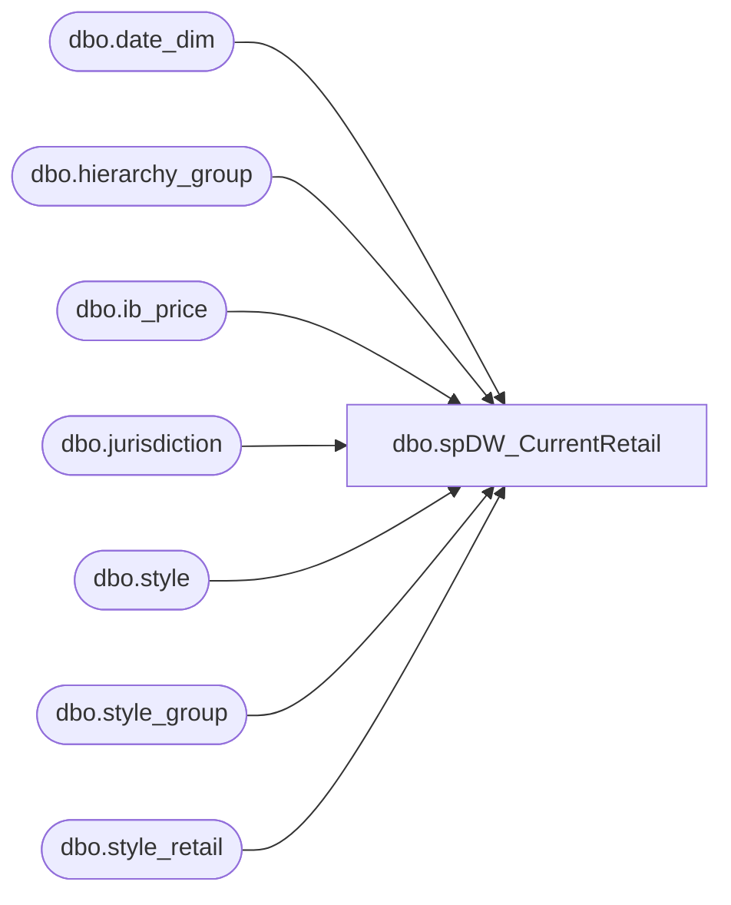

# dbo.spDW_CurrentRetail

**Database:** me_01  
**Server:** bedrockdb02  

## Architecture Diagram



## Table Dependencies

| Referenced Table |
|---|
| dbo.date_dim |
| dbo.hierarchy_group |
| dbo.ib_price |
| dbo.jurisdiction |
| dbo.style |
| dbo.style_group |
| dbo.style_retail |

## Stored Procedure Code

```sql
CREATE proc [dbo].[spDW_CurrentRetail]

as

-- =====================================================================================================
-- Name: spDW_CurrentRetail
--
-- Description:	SQL taken from Curr Retail RPT - (topic is IB)  
--				 
-- Revision History
--		Name:			Date:			Comments:
--		Dan Tweedie		12/05/2016		Created Proc
-- =====================================================================================================

set nocount on

declare 
	@StartDate date,
	@AsOfDate date

select @startDate = cast(getdate() as date)

select @AsOfDate = max(cast(actual_date as date))
from papamart.dw.dbo.date_dim
where cast(actual_date as date) <= @startDate
and datename(weekday, actual_date) = 'Saturday'

IF (Object_ID('tempdb..#MaxPrice') IS NOT NULL) DROP TABLE #MaxPrice
select 
	s.style_code,
	s.short_desc,
	ip.jurisdiction_id,
	max(ip.ib_price_id) as ib_price_id
into #MaxPrice
from 
	style s with (nolock)
join ib_price ip with (nolock) on s.style_id = ip.style_id
where 
	cast(@AsOfDate as datetime) between 
		cast(convert(varchar, ip.start_date ,101)as datetime) and isnull(cast(convert(varchar, ip.end_date ,101)as datetime), cast(convert(varchar, getdate() ,101)as datetime))
and ip.cancel_promo_flag <> 1
and ip.location_id is null
group by s.style_code,s.short_desc,ip.jurisdiction_id


IF (Object_ID('ma_01..rptCurrRetail') IS NOT NULL) DROP TABLE ma_01.dbo.rptCurrRetail
select 
	j.jurisdiction_code,
	left(hg.hierarchy_group_code,8) Department,
	s.style_code,
	s.short_desc,
	case when ip.end_date is null
	 then null
	 else ip.document_number
	end as document_number,
	case when ip.end_date is null
	  then null
	 else ip.start_date
	 end as start_date,
	ip.end_date,
	 case when end_date is null
	  then null
	 else ip.selling_retail_price
	 end as selling_retail_price,
	sr.current_selling_retail,
	sr.original_selling_retail,
	getdate() as InsertDate
into ma_01.dbo.rptCurrRetail
from
	ib_price ip with (nolock)
join style s with (nolock) on s.style_id = ip.style_id
join style_group sg with (nolock) on s.style_id = sg.style_id
join hierarchy_group hg with (nolock) on sg.hierarchy_group_id = hg.hierarchy_group_id
join jurisdiction j with (nolock) on ip.jurisdiction_id = j.jurisdiction_id
join style_retail sr with (nolock) 
		on sr.jurisdiction_id = j.jurisdiction_id
		and s.style_id = sr.style_id
join #MaxPrice mp on ip.ib_price_id = mp.ib_price_id
```

