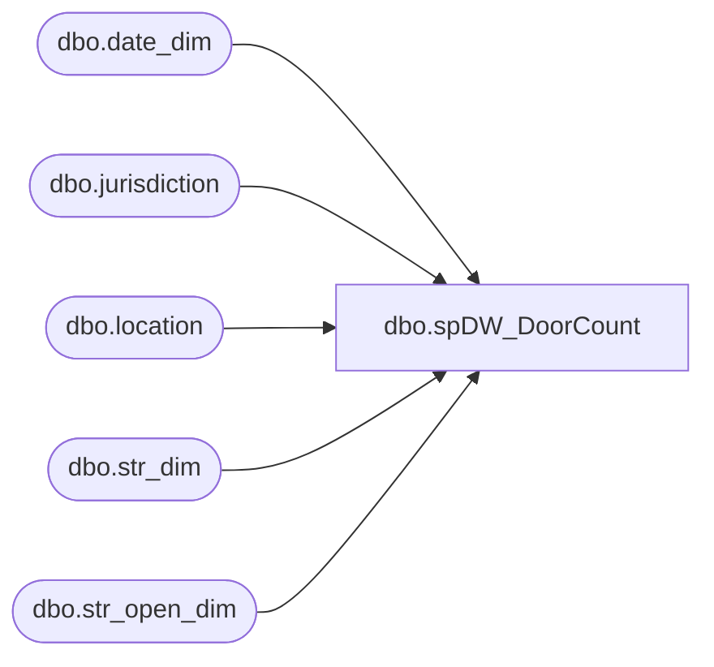

# dbo.spDW_DoorCount

**Database:** me_01  
**Server:** bedrockdb02  

## Architecture Diagram



## Table Dependencies

| Referenced Table |
|---|
| dbo.date_dim |
| dbo.jurisdiction |
| dbo.location |
| dbo.str_dim |
| dbo.str_open_dim |

## Stored Procedure Code

```sql
CREATE proc [dbo].[spDW_DoorCount] 

as

-- =====================================================================================================
-- Name: spDW_DoorCount
--
-- Description:	Shows number of stores open as of last week, grouped by jurisdiction
--				 
-- Revision History
--		Name:			Date:			Comments:
--		Dan Tweedie		12/05/2016		Created Proc
-- =====================================================================================================


declare 
	@StartDate date,
	@AsOfDate date,
	@Count int

select @startDate = cast(getdate() as date)

select @AsOfDate = max(cast(actual_date as date))
from papamart.dw.dbo.date_dim
where cast(actual_date as date) <= @startDate
and datename(weekday, actual_date) = 'Saturday'


IF (Object_ID('ma_01..rptDoorCount') IS NOT NULL) DROP TABLE ma_01.dbo.rptDoorCount
select 
	case 
		when j.jurisdiction_code in ('HOME', 'US', 'CA') then 'NA'
		when j.jurisdiction_code in ('DK', 'IE', 'UK') then 'EU'
		when j.jurisdiction_code in ('CN') then 'AS'
	end as TradingGroup,
	count(sd.str_id) store_count,
	getdate() as InsertDate
into ma_01.dbo.rptDoorCount
from 
	kodiak.babwmstrdata.dbo.str_dim sd with (nolock)
join kodiak.babwmstrdata.dbo.str_open_dim sod with (nolock) on sd.str_id = sod.str_key
join ma_01.dbo.location l with (nolock) on cast(sd.str_num as int) = cast(l.location_code as int)
join ma_01.dbo.jurisdiction j with (nolock) on l.jurisdiction_id = j.jurisdiction_id
where cast(sod.open_dt as date) <= @AsOfDate
and (cast(sod.close_dt as date) > @AsOfDate or sod.close_dt is null)
group by 
	case 
		when j.jurisdiction_code in ('HOME', 'US', 'CA') then 'NA'
		when j.jurisdiction_code in ('DK', 'IE', 'UK') then 'EU'
		when j.jurisdiction_code in ('CN') then 'AS'
	end


IF (Object_ID('ma_01..rptDoorCountLY') IS NOT NULL) DROP TABLE ma_01.dbo.rptDoorCountLY
select 
	case 
		when j.jurisdiction_code in ('HOME', 'US', 'CA') then 'NA'
		when j.jurisdiction_code in ('DK', 'IE', 'UK') then 'EU'
		when j.jurisdiction_code in ('CN') then 'AS'
	end as TradingGroup,
	count(sd.str_id) store_count,
	getdate() as InsertDate
into ma_01.dbo.rptDoorCountLY
from 
	kodiak.babwmstrdata.dbo.str_dim sd with (nolock)
join kodiak.babwmstrdata.dbo.str_open_dim sod with (nolock) on sd.str_id = sod.str_key
join ma_01.dbo.location l with (nolock) on cast(sd.str_num as int) = cast(l.location_code as int)
join ma_01.dbo.jurisdiction j with (nolock) on l.jurisdiction_id = j.jurisdiction_id
where cast(sod.open_dt as date) <= dateadd(dd, -364, @AsOfDate)
and (cast(sod.close_dt as date) > dateadd(dd, -364, @AsOfDate) or sod.close_dt is null)
group by 
	case 
		when j.jurisdiction_code in ('HOME', 'US', 'CA') then 'NA'
		when j.jurisdiction_code in ('DK', 'IE', 'UK') then 'EU'
		when j.jurisdiction_code in ('CN') then 'AS'
	end
```

